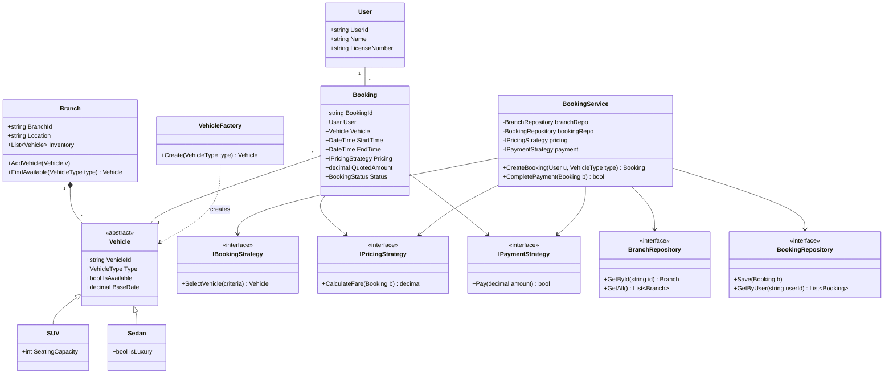
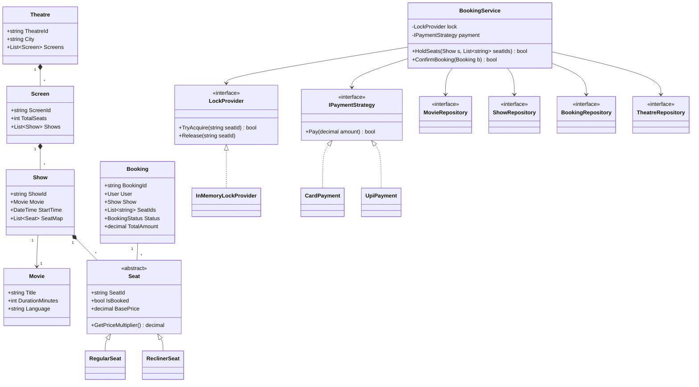
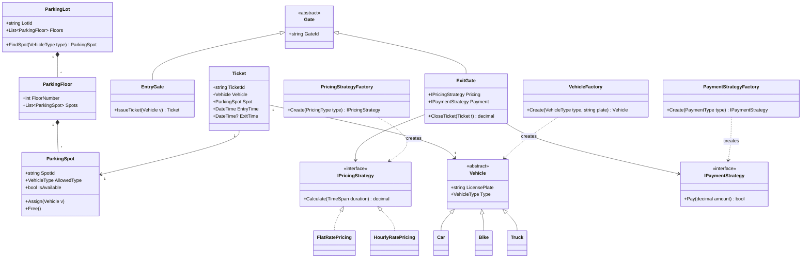
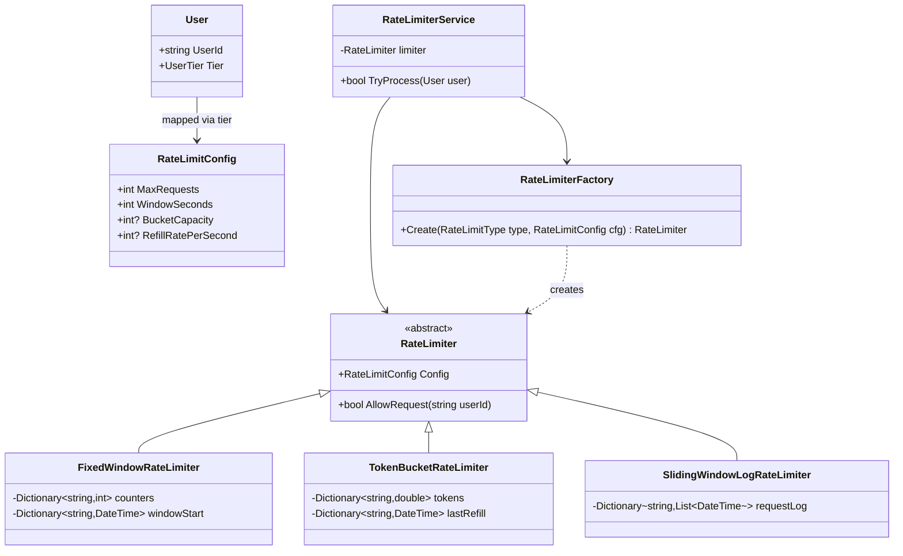
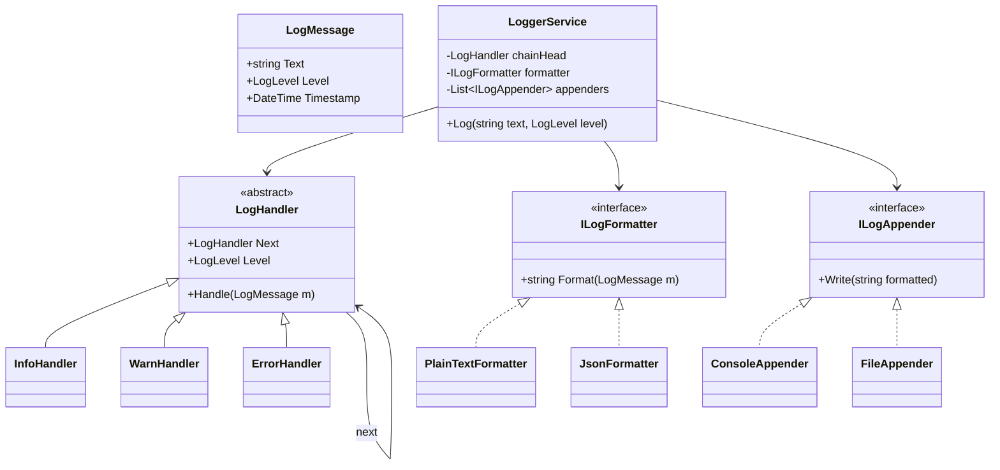
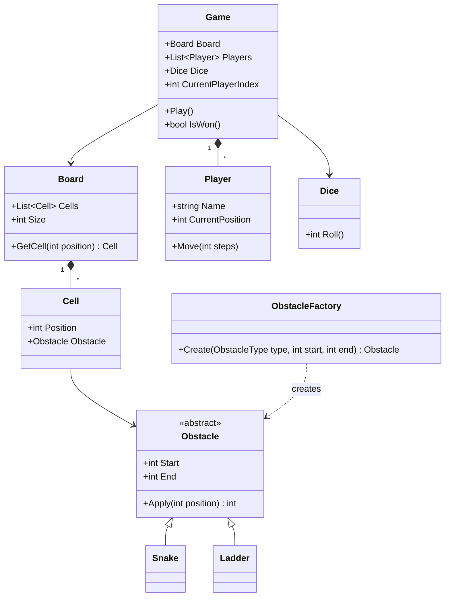
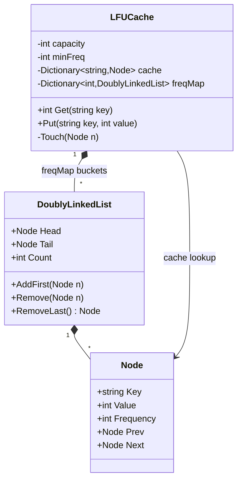
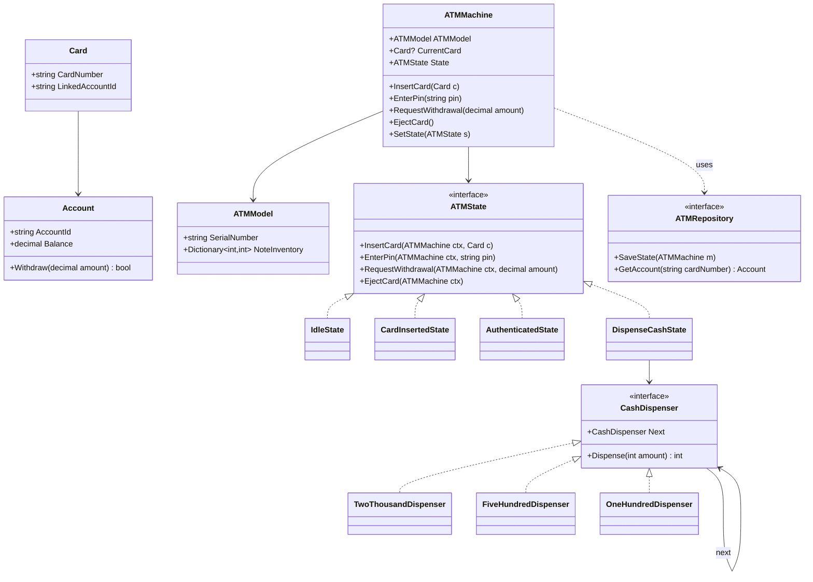
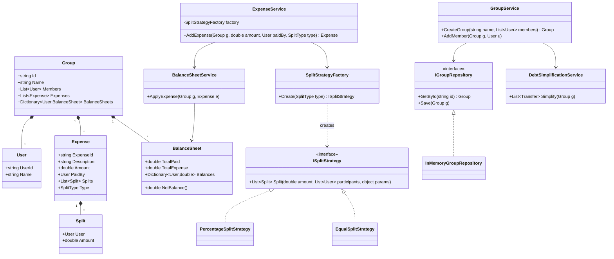

# C# Low-Level Design (LLD) — Extended Revision Notes

> Based on `shanrastogi/Csharp-LLD-Practice`. This version expands every system with
> deeper explanations, richer UML (attributes, methods, cardinalities), step-by-step
> workflows, edge cases, and sample interview Q&A so you can revise without needing
> to re-read the source code.

---

## How to use this document

For each system, read in this order:
1. **Problem framing** — what real-world workflow are we modeling?
2. **Core entities** — the nouns, and *why* they exist as separate classes.
3. **Design patterns** — which GoF pattern, and the specific pain it removes.
4. **UML diagram** — paste into a Mermaid renderer (GitHub renders it natively).
5. **Primary workflow** — the numbered steps an actual request takes through the system.
6. **Edge cases** — the things interviewers probe for.
7. **Likely interview questions** — rehearse the one-liners.

---

## Part 0 — Cross-Cutting Pattern Primer

Every system in this repo repeatedly leans on the same six ideas. Internalize these
once, and every system below becomes "which of these six am I looking at again."

### 1. Strategy Pattern
**Problem it solves:** you have a family of interchangeable algorithms (pricing
formulas, payment methods, split rules) and you don't want `if/else` or `switch`
blocks scattered through your service layer.
**Shape:** an interface (`IPricingStrategy`) with one method, multiple concrete
implementations, and a context class that holds a reference to the interface (not
the concrete type) and calls it.
**Why interviewers like it:** it's the cleanest demonstration of the
Open/Closed Principle — you add a new pricing rule by adding a new class, never by
editing existing code.

### 2. Factory Pattern
**Problem it solves:** object creation logic (which concrete class to instantiate,
based on some enum/type flag) is messy if scattered across the codebase.
**Shape:** a static or instance `Create(...)` method that takes a discriminator
(e.g., `VehicleType`) and returns the right concrete class behind an interface/abstract
base.
**Why interviewers like it:** it isolates the "which class do I new-up" decision to
one place, so callers only ever depend on the abstraction.

### 3. Repository Pattern
**Problem it solves:** your business/service logic shouldn't care whether data lives
in memory, SQL, or a NoSQL store.
**Shape:** an interface (`IBookingRepository`) exposing `Get`, `Add`, `Update`, with
one or more concrete implementations (`InMemoryBookingRepository`,
`SqlBookingRepository`).
**Why interviewers like it:** it demonstrates Dependency Inversion — services depend
on the abstraction, and swapping storage never touches business logic.

### 4. State Pattern
**Problem it solves:** an object's legal operations change depending on its current
state (ATM: you can't dispense cash before authentication). Using flags/enums with
big switch statements gets unmaintainable fast.
**Shape:** an interface (`IATMState`) with one method per possible action; each
concrete state implements only the actions legal in that state (illegal ones throw
or no-op), and holds a reference back to the context to trigger the *next* state
transition.
**Why interviewers like it:** it turns implicit state machines (scattered booleans)
into explicit, testable classes — one class per node of the state diagram.

### 5. Chain of Responsibility (CoR)
**Problem it solves:** a request needs to pass through a sequence of handlers, where
each handler either resolves it or forwards it to the next one (log severity
routing, ATM note denominations, middleware).
**Shape:** each handler holds a reference to the *next* handler; `Handle(request)`
either processes and stops, or delegates by calling `next.Handle(request)`.
**Why interviewers like it:** it decouples senders from receivers and lets you
reorder/add handlers without touching the calling code.

### 6. Service Layer Pattern
**Problem it solves:** without it, controllers/`Program.cs` end up doing
orchestration, validation, and persistence all at once.
**Shape:** a service class (`BookingService`, `ExpenseService`) that coordinates
calls across repositories and strategies, keeping domain entities themselves "dumb"
(mostly data + minimal behavior).
**Why interviewers like it:** it is the natural home for **transactions** and
**business rules** that span multiple entities.

### Supporting SOLID vocabulary (say these out loud when explaining any diagram)
- **S**ingle Responsibility — each class has one reason to change (e.g., `Ticket`
  only tracks parking metadata, it doesn't compute pricing).
- **O**pen/Closed — new behavior via new classes, not edits to old ones (Strategy,
  Factory).
- **L**iskov Substitution — any `Vehicle` subtype must be usable wherever `Vehicle`
  is expected without breaking behavior.
- **I**nterface Segregation — small, focused interfaces (`ICashDispenser` doesn't
  also expose card-authentication methods).
- **D**ependency Inversion — services depend on interfaces (`IPaymentStrategy`), not
  concrete classes (`UpiPayment`).

---

## 1. Car Rental System

### Problem framing
A multi-branch vehicle rental platform: a user searches inventory across branches,
picks a vehicle, gets a price computed by a pluggable formula, and pays through a
pluggable payment method.

### How to approach requirements & discuss it in an interview
Start by narrowing scope out loud — this problem is deceptively large, and
interviewers want to see you fence it in before writing a single class.

**Clarifying questions to ask first:**
- Is this single-branch or multi-branch? Does a user ever need to compare
  availability *across* branches, or just search one?
- Can a vehicle be reserved in advance (future date range) or only rented
  on-the-spot? This decides whether you need a reservation/calendar concept at
  all, or just an `IsAvailable` flag.
- Is pricing purely duration-based, or do we need surcharges (weekend, insurance,
  late return, fuel)? This justifies introducing `IPricingStrategy` up front
  instead of a hardcoded formula.
- Do we need to support cancellations/refunds? If yes, say so explicitly — it
  changes `Booking` from a one-way state machine to one with a rollback path.
- Is payment a mocked interface or does it need retries/idempotency? In a real
  interview, saying "I'll abstract it behind `IPaymentStrategy` and assume a
  successful/failed boolean callback" is a perfectly acceptable scope cut.

**How to structure your answer:**
1. State the scope you're assuming (functional requirements) in 3–4 bullets
   before touching entities — e.g., "I'll assume: multi-branch inventory search,
   date-range booking, pluggable pricing and payment, no partial refunds unless
   asked."
2. Call out 1–2 **non-functional** requirements unprompted: concurrency (two
   users racing for the same last vehicle) and extensibility (new vehicle types,
   new pricing rules) — this is what separates a junior answer from a senior one.
3. Only then walk into entities, and explicitly narrate *why* each strategy
   interface exists ("I'm pulling pricing out because the interviewer might ask
   for surge pricing later — I don't want to redesign then").
4. End by inviting the interviewer to redirect: "Should I go deeper into the
   concurrency handling for the last-vehicle race, or into the pricing formula
   itself?" — this signals you're pacing yourself rather than dumping everything.

### Core entities & responsibilities
| Class | Responsibility |
|---|---|
| `User` | Identity of the person booking. |
| `Branch` | Owns a physical inventory of `Vehicle`s at one location. |
| `Vehicle` (abstract) | Base for rentable assets; concrete types (`SUV`, `Sedan`) carry type-specific attributes (seating, fuel type). |
| `Booking` | Binds a `User`, a `Vehicle`, a time window, and the `IPricingStrategy` used to quote it. |
| `PaymentProcessor` | Thin wrapper that delegates to whichever `IPaymentStrategy` was chosen. |
| `IBookingStrategy` | Encapsulates *how* a vehicle is selected/allocated (e.g., nearest branch first, cheapest first). |
| `IPricingStrategy` | Encapsulates the fee formula (daily rate, weekend surcharge, long-term discount). |
| `IPaymentStrategy` | Encapsulates the payment rail (card, UPI, wallet). |

### Design patterns in depth
- **Strategy (x3)** — the system separates *three independent axes of variability*:
  how a vehicle is chosen, how it's priced, and how payment is collected. Notice
  each is its own interface rather than one giant "BookingOptions" object — this is
  Interface Segregation in action.
- **Factory** — `VehicleFactory.Create(VehicleType type, ...)` returns the correctly
  initialized concrete `Vehicle`, so `Branch` never needs a switch statement when
  seeding inventory.
- **Repository** — `BranchRepository` / `BookingRepository` let the same
  `BookingService` run against in-memory data in unit tests and a real DB in
  production without code changes.
- **Service Layer** — `BookingService` is the only class that talks to *all* of:
  repositories, the pricing strategy, and the payment strategy. This keeps
  `Booking` (the entity) free of orchestration logic.

### Expanded UML

### Primary workflow
1. User submits a search request (vehicle type, dates, preferred location).
2. `BookingService` asks `BranchRepository` for candidate branches, then applies
   `IBookingStrategy` to pick the best available `Vehicle`.
3. `IPricingStrategy.CalculateFare(booking)` computes the quote from duration +
   vehicle base rate + any surcharge rules.
4. A `Booking` is created in `Pending` status and persisted via `BookingRepository`.
5. `IPaymentStrategy.Pay(amount)` is invoked; on success the vehicle is marked
   unavailable and the booking flips to `Confirmed`.
6. On payment failure, the booking is cancelled and the vehicle released back to
   inventory — this rollback path is exactly what interviewers probe for.

### Edge cases to mention
- Double-booking the same vehicle across two concurrent requests (needs a lock or
  optimistic concurrency check at the repository layer).
- Partial refunds on early cancellation — where would that logic live? (Answer: a
  new method on `IPaymentStrategy`, not inside `Booking`.)
- Vehicle becomes unavailable (accident/maintenance) mid-booking-window.

### Sample interview questions
- *"How would you add a new vehicle type like `ElectricScooter` without touching
  `BookingService`?"* → Add a new `Vehicle` subclass + a `VehicleFactory` case; no
  other class changes (Open/Closed).
- *"Why not just pass a pricing `enum` to `CalculateFare` instead of a strategy
  object?"* → Enums force a switch statement somewhere; strategy objects let you
  compose/inject pricing rules (e.g., decorate with a loyalty-discount wrapper)
  without touching the switch.

---

## 2. Movie Ticket Booking System

### Problem framing
Classic high-concurrency LLD problem: many users may try to book the same seat at
the same time; the system must guarantee at most one succeeds, while also
supporting different seat tiers and payment rails.

### How to approach requirements & discuss it in an interview
This problem is a **concurrency interview in disguise** — entities are almost
secondary to how you reason about race conditions. Lead with that framing.

**Clarifying questions to ask first:**
- Single theatre or a multi-theatre/multi-city platform? Determines whether
  `Theatre`/`Screen` hierarchy is needed or you can start at `Show`.
- Do we need a "hold" period (seat reserved for N minutes during checkout) or is
  booking atomic (select + pay in one step)? This decides whether `LockProvider`
  needs a TTL/expiry concept.
- Single server or must this scale horizontally? If horizontal, say explicitly
  that in-memory locks won't work and you'd reach for a distributed lock
  (Redis) — naming this trade-off *before* being asked is a strong signal.
- Do different seat types have different prices, and can a user book seats of
  mixed types in one transaction?
- Is overbooking ever intentionally allowed (airlines do this) or is this a
  strict no-double-booking guarantee? Confirm it's strict for a theatre.

**How to structure your answer:**
1. Open with the non-functional requirement first: "The core hard requirement
   here is correctness under concurrency — I'll design around that, then add
   entities."
2. Explain the **hold-then-confirm** two-phase flow before diagramming classes;
   interviewers are listening for whether you understand why a single-step
   "check availability, then book" is unsafe (TOCTOU — time-of-check to
   time-of-use bug).
3. When presenting the UML, explicitly point at `LockProvider` and say "this is
   an interface on purpose, so I can swap the concurrency mechanism without
   touching booking logic" — ties the diagram back to the requirement.
4. Proactively raise the abandoned-hold edge case (what happens if a user closes
   the tab mid-payment) — don't wait to be asked.

### Core entities & responsibilities
| Class | Responsibility |
|---|---|
| `Theatre` | Owns multiple `Screen`s. |
| `Screen` | Owns multiple `Show`s (a movie playing at a specific time in that screen). |
| `Show` | Links a `Movie` to a time slot and a seat map. |
| `Seat` (abstract) | Physical/virtual seat with booking status; concrete types (`RegularSeat`, `ReclinerSeat`) differ in price multiplier. |
| `Booking` | The set of seats a user has reserved for one `Show`. |
| `LockProvider` | Abstraction over the concurrency-control mechanism guarding seat selection. |

### Design patterns in depth
- **Locking Strategy (a specialised Strategy)** — `LockProvider` is an interface so
  the "how do we prevent double booking" mechanism is swappable: an
  `InMemoryLockProvider` (e.g., `ConcurrentDictionary` + `lock`/`Monitor`) for a
  single process, or a distributed lock (Redis `SETNX`) if the system scales across
  multiple servers. This is the single most-asked question for this problem.
- **Payment Strategy** — identical shape to Car Rental: `CardPayment` / `UpiPayment`
  behind `IPaymentStrategy`.
- **Repository (x4)** — one repository per aggregate root (`Movie`, `Show`,
  `Booking`, `Theatre`) keeps each read/write surface narrow (Interface
  Segregation) instead of one giant "DataAccess" god-class.

### Expanded UML

### Primary workflow
1. User selects a `Show` and a set of seat IDs.
2. `BookingService.HoldSeats` calls `LockProvider.TryAcquire` for **every** seat
   requested; if any single acquire fails, all previously-acquired locks in this
   request are released (all-or-nothing) to avoid partial holds.
3. A temporary `Booking` is created in `PendingPayment` status with a short TTL
   (e.g., 5 minutes) — if payment doesn't complete in time, a background sweep
   releases the locks.
4. `IPaymentStrategy.Pay` runs; success marks seats `IsBooked = true` permanently
   and the booking `Confirmed`; failure releases the locks back to the pool.

### Edge cases to mention
- **Race condition**: two threads reading `IsBooked == false` simultaneously before
  either writes `true` — this is exactly why the lock must be acquired *before* the
  availability check, not after.
- Seat-hold expiry (abandoned carts) — needs a cleanup job or a lock with a TTL.
- Partial seat availability within one request (user wants 4 adjacent seats but
  only 3 are free) — the service should reject atomically, not book 3 and fail on
  the 4th.

### Sample interview questions
- *"Why use a `LockProvider` abstraction instead of just `lock(seat)` in C#?"* →
  In-process locks don't work once you scale to multiple server instances; the
  abstraction lets you swap to a distributed lock without touching
  `BookingService`.
- *"How do you prevent seat-holds from being held forever if a user abandons
  checkout?"* → TTL-based lock expiry + a background reconciliation job.

---

## 3. Parking Lot

### Problem framing
Classic resource-allocation problem: vehicles of different sizes must be matched to
compatible spots across multiple floors, with entry/exit gates and duration-based
pricing.

### How to approach requirements & discuss it in an interview
This is one of the oldest LLD questions, so interviewers expect you to move fast
through obvious parts and spend your time on the parts that reveal judgment.

**Clarifying questions to ask first:**
- How many spot sizes/vehicle types are there, and can a larger vehicle use a
  smaller-labeled spot in a pinch (e.g., a bike in a car spot) or is matching
  strict?
- How many entry/exit gates, and do we need to track *which* gate a ticket was
  issued from (useful for multi-gate lots wanting to display "nearest available
  floor per gate")?
- Is pricing flat, hourly, or does it vary by vehicle type/floor (e.g., ground
  floor premium)? This is your justification for `IPricingStrategy`.
- Do we need to support reservations (pre-booking a spot) or purely walk-in?
  Walk-in-only is the common default — confirm it to avoid overbuilding.
- What happens on a lost ticket? Usually out of scope unless asked, but
  mentioning it shows completeness.

**How to structure your answer:**
1. Set scope fast: "I'll assume walk-in only, N floors, three vehicle types,
   hourly pricing, single active ticket per vehicle" — then move on.
2. Spend your narrative time on **spot allocation strategy** (first-available vs.
   nearest-to-entrance vs. load-balanced across floors) since this is the one
   part of the problem with real design freedom.
3. Explicitly connect each factory to a scaling concern: "vehicle types will
   grow, pricing policies will grow, payment methods will grow — three separate
   enums, so three separate factories rather than one that grows a giant switch."
4. Bring up full-lot behavior and concurrent-entry races yourself; these are the
   two edge cases interviewers most commonly probe if you don't mention them.

### Core entities & responsibilities
| Class | Responsibility |
|---|---|
| `ParkingLot` | Top-level aggregate; owns floors. |
| `ParkingFloor` | Owns a list of `ParkingSpot`s. |
| `ParkingSpot` | Tracks its allowed vehicle type and occupancy. |
| `Vehicle` (abstract) | `Car`, `Bike`, `Truck` — different sizes need different spot types. |
| `Gate` (abstract) | `EntryGate` issues tickets; `ExitGate` computes fees and closes tickets. |
| `Ticket` | Correlates a `Vehicle`, its assigned `ParkingSpot`, and entry time. |

### Design patterns in depth
- **Factory (x3)** — `VehicleFactory` (build the right `Vehicle` subtype),
  `PricingStrategyFactory` (pick flat vs. hourly pricing), `PaymentStrategyFactory`
  (pick UPI/card/cash). Three independent factories rather than one mega-factory —
  each has a single responsibility.
- **Strategy** — `IPricingStrategy` (`FlatRatePricing`, `HourlyRatePricing`) is
  invoked only at `ExitGate`, keeping fee computation out of `Ticket` itself.
- **Payment abstraction** — same `IPaymentStrategy` shape as the other systems;
  notice the *reuse* of this exact interface pattern across nearly every system in
  the repo — a strong signal for interviewers that you internalized the pattern
  rather than memorized one example.

### Expanded UML

### Primary workflow
1. Vehicle arrives at `EntryGate`; the gate calls `ParkingLot.FindSpot(type)` which
   scans floors for the first `ParkingSpot` whose `AllowedType` matches and
   `IsAvailable == true`.
2. `EntryGate.IssueTicket` creates a `Ticket`, stamps `EntryTime`, and marks the
   spot occupied.
3. On departure, `ExitGate.CloseTicket` reads `ExitTime - EntryTime`, delegates to
   `IPricingStrategy.Calculate(duration)` for the fee, then
   `IPaymentStrategy.Pay(fee)`.
4. On successful payment, the spot is freed via `ParkingSpot.Free()` and the
   ticket is closed.

### Edge cases to mention
- **Lot full**: `FindSpot` returns null → entry should be rejected gracefully, not
  throw an unhandled exception.
- Vehicle-to-spot size mismatch (a `Truck` should never be assigned a
  motorcycle-sized spot) — enforced by matching `AllowedType`.
- Lost ticket / re-entry without exit — usually handled with a manual override
  fee policy.
- Multiple entry gates issuing tickets concurrently for the same spot — needs the
  same kind of locking discussion as the Movie Booking system.

### Sample interview questions
- *"How do you support a lot where a large vehicle can occupy multiple adjacent
  small spots?"* → `ParkingSpot` allocation becomes a small bin-packing problem;
  you'd likely introduce a `SpotGroup` concept.
- *"Why three separate factories instead of one `LotObjectFactory`?"* → Single
  Responsibility — each factory's only reason to change is its own enum growing.

---

## 4. Rate Limiter

### Problem framing
Throttle API requests per user according to a configurable policy (free vs.
premium tier), while supporting multiple competing throttling algorithms.

### How to approach requirements & discuss it in an interview
This problem rewards showing you know the **trade-offs between algorithms**
more than it rewards a clever class diagram — steer the conversation there.

**Clarifying questions to ask first:**
- Is the limit per-user, per-IP, per-API-key, or per-endpoint (or a combination)?
  This decides what the "key" into your internal counters actually is.
- Single server instance or a distributed fleet? If distributed, the whole
  design likely needs to move state into a shared store (Redis) instead of
  in-memory dictionaries — say this explicitly.
- Do we need to support bursts gracefully (token bucket) or is a hard cutoff per
  window acceptable (fixed/sliding window)?
- What should happen when a request is rejected — hard reject (429), or queue
  and delay? Confirm hard reject unless told otherwise, since queuing is a much
  bigger design.
- Do limits vary by tier/config, and can they change at runtime without a
  redeploy? This justifies `RateLimitConfig` being data-driven rather than
  hardcoded constants.

**How to structure your answer:**
1. Immediately name the three-way trade-off (fixed window vs. sliding window log
   vs. token bucket) — accuracy vs. memory vs. burst tolerance — before writing
   any class. This is the single most important thing to say in this problem.
2. State your assumption on distribution model up front: "I'll design for a
   single process first with in-memory state, then note what changes for a
   distributed deployment."
3. Use the `RateLimiterFactory` to demonstrate you thought about *config-driven*
   selection (per-tier algorithm choice) rather than a single global algorithm.
4. Proactively raise thread-safety of the counters — this is the most common
   follow-up question and volunteering it early buys you credibility.

### Core entities & responsibilities
| Class | Responsibility |
|---|---|
| `User` | Carries a `UserTier` that determines which policy applies. |
| `RateLimitConfig` | Numeric policy knobs: `MaxRequests`, `WindowSeconds`. |
| `RateLimiter` (abstract) | Base contract: `AllowRequest(userId)`. |
| `RateLimiterService` | Public-facing switchboard that hides which concrete algorithm is active. |
| `RateLimiterFactory` | Chooses the concrete `RateLimiter` from a `RateLimitType` + config. |

### Design patterns in depth
- **Abstract algorithm family** — this is Strategy again, but named `RateLimiter`
  instead of `I...Strategy`; recognize that GoF pattern names are about *shape*,
  not literal naming conventions.
- **Factory** — `RateLimiterFactory` is what lets you A/B test algorithms per user
  tier (e.g., premium users get `TokenBucketRateLimiter` for burst tolerance, free
  users get `FixedWindowRateLimiter` for simplicity) purely through configuration.

### The three algorithms, compared
| Algorithm | How it works | Pros | Cons |
|---|---|---|---|
| **Fixed Window** | Count requests in a fixed clock-aligned window (e.g., 0:00–0:59); reset the counter each window. | Simple, O(1) memory per user. | Bursts at window boundaries (2x the limit possible right at the edge). |
| **Sliding Window Log** | Store a timestamp per request; count timestamps within the trailing window. | Perfectly accurate. | O(n) memory — every request timestamp is retained. |
| **Token Bucket** | Bucket refills at a fixed rate up to a capacity; each request consumes one token. | Allows controlled bursts, smooths traffic. | Slightly harder to reason about/tune (rate + capacity). |

### Expanded UML

### Primary workflow
1. A request arrives tagged with a `User`.
2. `RateLimiterService.TryProcess` resolves the `RateLimitConfig` for that user's
   tier and asks `RateLimiterFactory` for the configured algorithm (cached per
   tier, not recreated per request).
3. `RateLimiter.AllowRequest(userId)` runs the algorithm-specific check
   (increment counter / consume token / prune-and-count log) and returns a
   boolean.
4. On `false`, the caller returns HTTP 429; on `true`, the request proceeds.

### Edge cases to mention
- **Thread safety**: two requests from the same user arriving concurrently must
  not both read `count = 4` and both increment to `5` when the limit is `5` —
  needs atomic increments (`Interlocked`, or a `ConcurrentDictionary` with
  compare-and-swap).
- Clock skew across distributed servers (if the rate limiter isn't backed by a
  shared store like Redis, tiers get inconsistent enforcement per instance).
- Memory growth of `SlidingWindowLogRateLimiter` under sustained high traffic —
  needs periodic pruning of old timestamps.

### Sample interview questions
- *"Which algorithm would you pick for a payments API and why?"* → Sliding window
  log or a Redis-backed sliding window counter, for its accuracy — payments
  APIs care more about correctness than raw memory efficiency.
- *"How would you rate-limit by IP instead of by user?"* → Change the key used in
  the internal dictionaries from `userId` to `ip`; the algorithm classes need
  zero changes, showing why Strategy-style separation pays off.

---

## 5. Logger Framework

### Problem framing
A pluggable logging pipeline: a `LogMessage` should route to the correct severity
handler, then be formatted and shipped to one or more destinations — all
independently swappable.

### How to approach requirements & discuss it in an interview
This problem is really testing whether you can decompose "log a message" into
independent axes rather than one monolithic `Log()` method — say that framing
out loud early.

**Clarifying questions to ask first:**
- Does one severity level cascade to lower-priority appenders too (an `ERROR`
  message also appears in the general log), or does exactly one handler
  "consume" each message? Get this settled before drawing the CoR chain, since
  it changes what `Handle()` returns/does.
- How many output destinations at once — can a single message go to console
  *and* file *and* a remote sink simultaneously?
- Is formatting global (one format for the whole app) or configurable per
  destination (JSON to a log aggregator, plain text to console)?
- Is this synchronous (caller blocks until written) or should slow destinations
  be handled asynchronously/buffered? Worth flagging even if out of scope.
- Do we need log levels to be runtime-configurable (turn off DEBUG in prod
  without redeploying)?

**How to structure your answer:**
1. Explicitly separate the three concerns before naming any class: **routing**
   (which handler cares about this severity), **formatting** (how it looks), and
   **transport** (where it goes). This three-way split *is* the design.
2. Justify Chain of Responsibility by the alternative it avoids: "without CoR
   I'd need a switch on severity inside one giant method that also does
   formatting and writing — that violates single responsibility and is hard to
   extend."
3. Mention async/buffered appenders as a "if this needs to be production-grade"
   extension, without over-engineering the base design.
4. Close by naming one concrete future requirement (e.g., "add Kafka support")
   and showing it only needs a new `ILogAppender`, nothing else.

### Core entities & responsibilities
| Class | Responsibility |
|---|---|
| `LogMessage` | Immutable payload: text, severity, timestamp. |
| `LogHandler` (abstract, CoR) | `InfoHandler` / `WarnHandler` / `ErrorHandler` — each decides if it should handle a message or pass it along. |
| `ILogFormatter` | Converts a `LogMessage` into a string representation (plain text, JSON). |
| `ILogAppender` | Ships the formatted string to a destination (console, file, and by extension DB/Kafka). |
| `LoggerService` | Entry point that pushes a message into the handler chain. |

### Design patterns in depth
- **Chain of Responsibility** — `InfoHandler → WarnHandler → ErrorHandler` (or
  reverse, depending on convention) each wired with a `next` reference. A common
  interview trap: does *every* handler in the chain get to act on a message (e.g.,
  all handlers at or above the message's severity log it), or does *exactly one*
  handler consume it? Both are valid CoR variants — be ready to argue for
  "cascading" logging (an `ERROR` message is also logged by the `WARN` and `INFO`
  appenders if they're subscribed) since that matches how most real logging
  frameworks (Log4j, Serilog) behave.
- **Strategy (x2)** — `ILogFormatter` and `ILogAppender` are orthogonal axes:
  *how* a message looks vs. *where* it goes. You can mix `JsonFormatter` with
  `FileAppender` or `PlainTextFormatter` with `ConsoleAppender` without either
  side knowing about the other — that's the payoff of keeping them as two
  separate interfaces instead of one `ILogSink`.

### Expanded UML

### Primary workflow
1. Caller invokes `LoggerService.Log(text, level)`.
2. `LoggerService` wraps it into a `LogMessage` and hands it to the head of the
   handler chain.
3. Each `LogHandler` checks whether its own severity threshold is met; if so, it
   formats via `ILogFormatter` and writes via every configured `ILogAppender`;
   regardless, it forwards to `Next` so higher-severity handlers downstream still
   get a chance (in the cascading variant).
4. If no handler in the chain claims the message (e.g., a `DEBUG` message below
   the lowest configured threshold), it's silently dropped.

### Edge cases to mention
- Adding a brand-new severity (`CRITICAL`) shouldn't require touching
  `LoggerService` — just insert a new `LogHandler` subclass into the chain.
- Multiple appenders writing to slow destinations (network Kafka) — should this
  block the caller? Points toward an async/buffered appender design.
- Formatter/appender mismatch (JSON formatter feeding a destination that expects
  syslog format) — usually solved by pairing formatter+appender per "sink"
  configuration rather than globally.

### Sample interview questions
- *"How would you add log sampling (only log 1 in 100 INFO messages)?"* → Wrap
  `InfoHandler` in a decorator, or add a sampling check inside
  `InfoHandler.Handle` before calling appenders — doesn't require touching CoR
  wiring.
- *"Why two interfaces (`ILogFormatter`, `ILogAppender`) instead of one?"* →
  Interface Segregation: format and transport are independent concerns, and
  combining them would force an N×M explosion of classes instead of N+M.

---

## 6. Snakes and Ladders

### Problem framing
A simplified board-game simulator emphasizing clean object composition over
patterns — a good "warm-up" LLD problem interviewers use to see how you structure
even a simple domain.

### How to approach requirements & discuss it in an interview
Because this problem is simple, the trap is over-engineering it. The interview
signal here is "can you keep a design proportional to the problem."

**Clarifying questions to ask first:**
- Board size and number of players — fixed at 100 cells/2 players, or
  configurable? Confirm it's configurable so you build `Board.Size` as a field,
  not a constant.
- Single die or multiple dice per turn? Affects whether `Dice` is one object or
  a list.
- Any custom rules — e.g., "must roll the exact number to reach the final cell,"
  "rolling a 6 grants another turn," "landing on an opponent sends them back to
  start"? These are common add-ons interviewers layer in after your base design.
- Is this a CLI simulation, or does it need to support a real-time multiplayer
  session (which would add networking/turn-broadcast concerns)? Usually assume
  a local simulation.

**How to structure your answer:**
1. State plainly that you're deliberately **not** reaching for a GoF pattern for
   every class — only `ObstacleFactory` earns its place because obstacle
   creation is genuinely varied (snake vs. ladder, and possibly more types
   later).
2. Walk the game loop narratively (turn → roll → move → check obstacle → check
   win) before showing the class diagram — this problem is better explained as
   a flow than as a static structure.
3. When the interviewer adds a rule (very common here, e.g., "add a rule where
   rolling three 6-in-a-row skips your turn"), show you can bolt it onto `Game`
   or `Player` without restructuring the board/obstacle model.
4. Use this problem to demonstrate restraint — explicitly say "I could add a
   Strategy for win conditions, but I don't think it's justified unless you want
   multiple game variants" — that judgment call is exactly what's being tested.

### Core entities & responsibilities
| Class | Responsibility |
|---|---|
| `Game` | Owns the `Board`, the list of `Player`s, turn order, and the win condition. |
| `Board` | A linear sequence of `Cell`s (typically 100). |
| `Cell` | May hold an `Obstacle` (a snake head or ladder bottom). |
| `Dice` | Produces a random roll (1–6), abstracted so tests can inject a fixed sequence. |
| `Player` | Tracks current position. |
| `Obstacle` (abstract) | `Snake` (moves you backward) / `Ladder` (moves you forward). |
| `ObstacleFactory` | Builds a `Snake` or `Ladder` from config (`head/tail` or `bottom/top` cell numbers). |

### Design patterns in depth
- **Factory** — `ObstacleFactory.Create(ObstacleType, start, end)` keeps board
  setup declarative: you feed it a list of `(type, start, end)` tuples read from
  config/JSON, and it builds the right `Obstacle` instances without `Board`
  needing to know the concrete classes.
- Notably **not** using Strategy/State here is itself worth mentioning in an
  interview — not every problem needs every pattern; forcing patterns where a
  plain composition suffices is a smell interviewers watch for.

### Expanded UML

### Primary workflow
1. `Game.Play()` loops while `!IsWon()`.
2. On each turn, the current `Player` calls `Dice.Roll()`, then `Player.Move(steps)`.
3. `Board.GetCell(newPosition)` is checked for an `Obstacle`; if present,
   `Obstacle.Apply(position)` returns the adjusted landing position (snake ⇒
   `Start` becomes `End` where `End < Start`; ladder ⇒ `End > Start`).
4. Turn advances to the next player; win condition checked when a player's
   position exactly reaches the final cell.

### Edge cases to mention
- Overshoot past the last cell (roll takes you past 100) — typically the move is
  disallowed for that turn.
- Landing exactly on a cell that's both a snake head and another obstacle's tail
  (invalid board config) — validation belongs in `ObstacleFactory`/board setup,
  not in `Game.Play()`.
- Multiple players landing on the same cell — usually allowed (no "capture" rule
  in the base variant) unless specified otherwise.

### Sample interview questions
- *"How would you support multiple dice or a variable board size?"* → `Dice`
  count becomes a list injected into `Game`; `Board.Size` is already a
  configurable field, so no structural change needed.
- *"Why is `Obstacle.Apply` on the obstacle itself rather than in `Board`?"* →
  Single Responsibility — the board manages geometry (which cell is where);
  the obstacle owns its own movement-transformation rule.

---

## 7. LFU Cache

### Problem framing
A classic data-structure interview problem, not a "systems" LLD problem — the
"design" is about achieving O(1) average time for `get`/`put` while evicting the
**L**east **F**requently **U**sed key (breaking ties by **L**east **R**ecently
**U**sed within the same frequency).

### How to approach requirements & discuss it in an interview
This is a DS&A-flavored LLD question — the "requirements gathering" step is
short, but skipping it entirely still costs you points.

**Clarifying questions to ask first:**
- Confirm the eviction tie-break rule explicitly: "when two keys have the same
  lowest frequency, do we evict the least-recently-used among them?" — don't
  assume; some variants use insertion order instead of access order as the
  tie-break.
- What should `Get` on a missing key do — return a sentinel (e.g., `-1`) or
  throw? Match whatever contract you're given (LeetCode-style problems usually
  want `-1`).
- Is `capacity` fixed at construction, or can it change at runtime (resizing)?
  Fixed is the default assumption; call it out.
- Are keys/values generic types or fixed to `string`/`int`? If asked to
  generalize, mention you'd make `LFUCache<TKey, TValue>` generic with the same
  structure.
- Is thread-safety required? Almost never asked for the base version, but
  mention it as a natural follow-up ("I'd wrap the two dictionaries with a lock
  or use `ConcurrentDictionary` plus a separate lock around the two-step
  touch-and-relocate operation, since that operation isn't atomic across two
  structures").

**How to structure your answer:**
1. Don't jump into code — first say the invariant in one sentence: "every key
   lives in exactly one frequency bucket, buckets are ordered by recency
   internally, and `minFreq` always points at the lowest non-empty bucket."
   Getting this sentence right *is* the design.
2. Derive the two dictionaries from the invariant, not the other way around:
   "since I need O(1) lookup by key, I need a hash map; since I need O(1)
   promote-and-relocate on access, each bucket needs to be a doubly linked list,
   not an array."
3. Trace through one concrete example by hand (3 keys, capacity 2, a few
   gets/puts) out loud — this is the fastest way to prove correctness to an
   interviewer without writing full code.
4. Proactively state the complexity (`O(1)` amortized time, `O(capacity)`
   space) at the end, unprompted.

### Core entities & responsibilities
| Class | Responsibility |
|---|---|
| `Node` | Doubly-linked list node holding `key`, `value`, `frequency`. |
| `DoublyLinkedList` | One list *per frequency bucket*; supports O(1) insert-at-head and O(1) remove-from-anywhere (given a node reference). |
| `LFUCache` | Orchestrates the key→node map, the frequency→list map, and `minFreq` tracking. |

### The core idea, explained
- **`Dictionary<key, Node> cache`** gives O(1) lookup of a node by key.
- **`Dictionary<int freq, DoublyLinkedList> freqMap`** groups all nodes that share
  the same access frequency into their own list.
- **`minFreq`** always points at the lowest frequency bucket that's non-empty —
  this is the bucket you evict from (specifically, its **tail**, since within a
  frequency bucket the list is ordered most-recently-used at the head).
- On every `get`/`put` that touches an existing key: remove the node from its
  current frequency bucket, increment its frequency, and re-insert it at the
  *head* of the new frequency's bucket. If the old bucket becomes empty **and**
  it was `minFreq`, bump `minFreq` by 1.
- On `put` for a *new* key when the cache is full: evict the tail node of the
  `minFreq` bucket, then insert the new key with frequency 1 and set
  `minFreq = 1`.

### Expanded UML

### Primary workflow (`put`)
1. If `key` already exists: update its `Value`, then call the internal
   `Touch(node)` helper (bumps frequency + relocates bucket).
2. If `key` is new and `cache.Count == capacity`: evict `freqMap[minFreq].RemoveLast()`
   and delete it from `cache`.
3. Insert the new `Node` at frequency 1, add it to `freqMap[1]`'s head, set
   `minFreq = 1`.

### Primary workflow (`get`)
1. If `key` not found, return "not found" sentinel (or throw, per contract).
2. Otherwise call `Touch(node)` (same relocate-and-bump logic as `put`'s update
   path) and return `node.Value`.

### Edge cases to mention
- `capacity == 0` — every `put` should be a no-op (never actually caches).
- Repeated `get`s on the same single key — frequency should keep incrementing
  without any bug in bucket cleanup (a common off-by-one source: forgetting to
  bump `minFreq` when the old bucket becomes empty).
- Tie-breaking within the same frequency must be **LRU**, not arbitrary — this is
  why each frequency bucket is itself an ordered doubly-linked list, not a plain
  set/queue.

### Sample interview questions
- *"Walk me through why this is O(1) amortized, not O(1) worst case in some naive
  implementations."* → Because every operation (dictionary lookup, linked-list
  insert/remove given a node reference) is O(1); there's no scanning.
- *"How is this different from an LRU cache?"* → LRU evicts strictly by recency
  (one ordered list total); LFU evicts by frequency first, recency only as a
  tiebreaker (hence the two-level dictionary-of-lists structure).

---

## 8. ATM System

### Problem framing
Model the complete ATM session lifecycle — card insertion, PIN authentication,
withdrawal request, and physical cash dispensing — where **the set of legal
actions changes at every step**.

### How to approach requirements & discuss it in an interview
The interviewer is testing whether you reach for **State** naturally, so make
the state machine the first thing you draw — even before the class diagram.

**Clarifying questions to ask first:**
- Which operations are in scope — withdrawal only, or also balance inquiry,
  deposit, PIN change, mini-statement? Confirm withdrawal-only if that's the
  core ask, and mention the others are "just new states" if asked to extend.
- How many PIN attempts before the card is retained/session locked?
- Does the machine need to reconcile with a bank server (network call) for
  authentication and balance, or can we assume `Account` is locally
  authoritative for the exercise? Real ATMs are network-dependent — worth
  noting as a simplification you're making.
- What denominations does the machine stock, and can it ever be **unable** to
  dispense an exact requested amount (e.g., ₹300 with only ₹2000/₹500 notes)?
  Confirming this justifies the Chain of Responsibility design and its failure
  path.
- Single machine or a fleet (does `ATMRepository` need to support many
  `ATMMachine` instances, e.g., for a bank's monitoring dashboard)?

**How to structure your answer:**
1. Draw the **state diagram** first, in words: Idle → Card Inserted →
   Authenticated → Dispensing → (back to) Idle, and note the exceptional edges
   (wrong PIN → Idle after N attempts; eject-card is legal from almost anywhere).
   This alone demonstrates you understood the problem before touching code.
2. Explicitly justify **why** State beats a boolean-flag approach: "Without it,
   `ATMMachine` would need something like `isCardInserted && isAuthenticated &&
   !isDispensing` guards sprinkled everywhere — State pattern makes each stage's
   legal actions self-contained."
3. Bring up the denomination-shortfall edge case yourself and connect it to CoR:
   "the dispenser chain needs to detect an undispensable remainder and roll back
   the whole withdrawal rather than dispense a partial/wrong amount."
4. If time allows, mention crash-recovery (debit vs. dispense ordering) as a
   "if this were a real system" concern — shows systems maturity beyond just the
   OOP diagram.

### Core entities & responsibilities
| Class | Responsibility |
|---|---|
| `ATMMachine` | The context object: holds the current `ATMState`, the inserted `Card`, and delegates every user action to the current state. |
| `ATMModel` | Static machine info (serial number, supported denominations, physical cash inventory). |
| `Card` | Bank card details, linked to an `Account`. |
| `Account` | Balance and account holder info. |
| `ATMRepository` | Persists/retrieves machine + transaction state. |
| `ATMState` (interface) | `IdleState`, `CardInsertedState`, `AuthenticatedState`, `DispenseCashState`. |
| `CashDispenser` (interface, CoR) | `TwoThousandDispenser → FiveHundredDispenser → OneHundredDispenser`. |

### Design patterns in depth
- **State** — this is the textbook example. `ATMMachine.InsertCard()` behaves
  completely differently depending on whether the current state is `IdleState`
  (accepts it, transitions to `CardInsertedState`) or `AuthenticatedState`
  (rejects — a card is already active). Each state class implements the *same*
  interface but only meaningfully handles the actions valid for that stage;
  invalid actions either throw a domain exception or return a "not allowed"
  result. Critically, **the state itself decides the next transition** — e.g.,
  `CardInsertedState.EnterPin(pin)` validates against `Account` and calls
  `atm.SetState(new AuthenticatedState())` or `new IdleState()` on failure.
- **Chain of Responsibility** — `DispenseCashState` doesn't compute denomination
  breakdown itself; it hands the requested amount to
  `TwoThousandDispenser`, which greedily dispenses as many ₹2000 notes as
  possible, then forwards the *remainder* to `FiveHundredDispenser`, and so on.
  Each handler only knows about its own denomination and the "next" handler —
  it never needs to know the whole denomination list.
- **Repository** — `ATMRepository` is what lets the same state-machine logic run
  against a physically simulated cash inventory in tests vs. a real
  hardware-backed inventory in production.

### Expanded UML

### Primary workflow
1. `IdleState`: `InsertCard(card)` is the only legal action → transitions to
   `CardInsertedState`.
2. `CardInsertedState`: `EnterPin(pin)` validates against `Account` (via
   `ATMRepository`); success → `AuthenticatedState`, failure (after N attempts)
   → eject card, back to `IdleState`.
3. `AuthenticatedState`: `RequestWithdrawal(amount)` checks
   `Account.Balance >= amount` and `ATMModel.NoteInventory` can actually make
   that amount → transitions to `DispenseCashState`.
4. `DispenseCashState`: passes `amount` through the `CashDispenser` chain
   (2000s → 500s → 100s), decrements `NoteInventory`, debits the `Account`, then
   ejects the card and returns to `IdleState`.

### Edge cases to mention
- Insufficient machine cash for the *exact* amount even though the account has
  enough balance (e.g., withdraw ₹300 when only ₹2000 notes remain) — the CoR
  chain must detect an un-dispensable remainder and reject the whole
  transaction rather than dispense a wrong amount.
- PIN retry lockout — state transition needs a counter, typically tracked on
  `CardInsertedState` or the `ATMMachine` context itself.
- Power loss / crash mid-dispense — this is where `ATMRepository` persistence
  matters: the machine needs to recover to a consistent state (did the debit
  happen before or after the cash left the tray?).
- Card ejected without completing a withdrawal — must always be legal, from
  almost any state, as a safety/UX guarantee.

### Sample interview questions
- *"Why State pattern instead of one big `switch(currentStateEnum)` inside
  `ATMMachine`?"* → Each state's legal transitions and validation logic live in
  their own class — adding a new state (e.g., `MiniStatementState`) doesn't
  bloat `ATMMachine`, satisfying Open/Closed.
- *"How would you add a ₹5000 note to the dispenser chain?"* → Insert a new
  `FiveThousandDispenser` at the head of the chain; no other dispenser or the
  `DispenseCashState` needs to change.

---

## 9. Splitwise Expense Sharing System

### Problem framing
The most "business-logic-heavy" system in the repo: track who paid for a shared
expense, how it should be split among participants, and how to net out balances
into the minimum number of settling transactions.

### How to approach requirements & discuss it in an interview
This problem has the most "business rule" surface area in the repo, so most of
your interview time should go to nailing down splitting/settlement rules, not
class names.

**Clarifying questions to ask first:**
- Which split types are in scope: equal, percentage, exact/unequal amounts,
  shares (weighted)? Confirm the initial set (usually equal + percentage) and
  say the rest are "just new `ISplitStrategy` implementations."
- Do we need actual debt simplification (minimal transactions), or is it enough
  to show each pairwise balance without simplifying? Simplification is
  meaningfully harder — confirm before promising it.
- Can a group have sub-groups or is it a flat list of members? Assume flat
  unless told otherwise.
- How are rounding remainders on an equal split handled (e.g., ₹100 / 3)? This
  is a real bug source — call it out and pick a deterministic rule.
- Do we need to persist a full expense history (audit trail) or only the
  current net balances? This affects whether `BalanceSheet` is
  computed-on-the-fly from `Expenses` or maintained incrementally.
- Multi-currency? Usually out of scope — explicitly say you're assuming a
  single currency to avoid scope creep.

**How to structure your answer:**
1. Separate the problem into three phases out loud before diagramming:
   **(a)** record an expense and compute splits, **(b)** maintain running
   balances, **(c)** optionally simplify balances into minimal settlements.
   This maps directly to your three services and shows deliberate decomposition.
2. Justify `ISplitStrategy` with a concrete "what if" — "if product later wants
   an 'itemized bill' split where each person only pays for what they ordered,
   that's just one more strategy implementation."
3. When you get to `DebtSimplificationService`, explain the greedy
   max-creditor/max-debtor algorithm in plain English *before* mentioning any
   data structure (max-heap) — interviewers want to hear the idea first.
4. Proactively flag the rounding and validation edge cases (percentages not
   summing to 100%, negative amounts) — these are the most common places
   candidates lose points by only handling the happy path.

### Core entities & responsibilities
| Class | Responsibility |
|---|---|
| `User` | A person who can owe or be owed money. |
| `Group` | Owns members, expenses, and per-member `BalanceSheet`s. |
| `Expense` | One shared cost: amount, who paid, and the resulting `Split`s. |
| `Split` | One participant's share of one `Expense`. |
| `BalanceSheet` | Per-user running totals (`TotalPaid`, `TotalExpense`, net `Balances` against every other user). |
| `ISplitStrategy` | `EqualSplitStrategy`, `PercentageSplitStrategy` — the rule for turning one `Expense.Amount` into a list of `Split`s. |
| `GroupService` / `ExpenseService` / `BalanceSheetService` / `DebtSimplificationService` | The four-way service layer split — each owns one stage of the pipeline. |

### Design patterns in depth
- **Strategy** — `ISplitStrategy` cleanly separates "how much does each person
  owe" from "how do we record and settle it." Adding `SplitType.Unequal` (exact
  custom amounts per person) or `Shares` (weighted split, e.g., 2:1:1) is purely
  additive.
- **Factory** — `SplitStrategyFactory.Create(SplitType)` keeps `ExpenseService`
  free of a switch statement.
- **Repository** — `IGroupRepository` / `InMemoryGroupRepository` decouples
  persistence from the (fairly complex) balance-computation logic, which is the
  part you actually want to unit test heavily.
- **Service Layer (deliberately split into four)** — this is worth explaining
  carefully because it's the clearest "why more than one service class" example
  in the repo:
  - `GroupService` — membership operations (add/remove user, create group).
  - `ExpenseService` — validates and records a new `Expense`, invoking the
    correct `ISplitStrategy`.
  - `BalanceSheetService` — the *only* class allowed to mutate `BalanceSheet`
    objects; keeps balance-update logic in one place so it can't drift out of
    sync across call sites.
  - `DebtSimplificationService` — a distinct algorithmic concern (graph/greedy
    reduction of net balances into minimal transfers) that has nothing to do
    with expense recording, so it deserves its own class.

### The debt-simplification idea, explained
Given a group's net balances (some members net-owe, some net-are-owed), the goal
is to settle everyone using the fewest possible transactions instead of naively
replaying every individual expense. The standard approach:
1. Compute each member's **net balance** (positive = owed money, negative =
   owes money) by summing `BalanceSheet.Balances` across all counterparties.
2. Repeatedly pick the member with the **maximum positive** net balance and the
   member with the **maximum negative** net balance (min amount), and transfer
   `min(|creditor|, |debtor|)` between them.
3. Zero out whichever side was fully settled and repeat until all balances are
   ~0. This greedy approach is a well-known interview talking point — mention
   its complexity (`O(n log n)` per round with a max-heap, `O(n)` rounds) and
   that it's optimal in transaction *count* under reasonable assumptions.

### Expanded UML

### Primary workflow
1. `GroupService.CreateGroup` sets up a `Group` with an empty `BalanceSheet` per
   member.
2. `ExpenseService.AddExpense` is called with an amount, payer, and
   `SplitType`; it asks `SplitStrategyFactory` for the right `ISplitStrategy`
   and builds the `List<Split>`.
3. `ExpenseService` hands the new `Expense` to `BalanceSheetService.ApplyExpense`,
   which updates: payer's `TotalPaid` (+amount), every participant's
   `TotalExpense` (+their share), and the pairwise `Balances` dictionary between
   payer and each participant.
4. On demand, `DebtSimplificationService.Simplify(group)` reads the current net
   balances and returns a minimal `List<Transfer>` (who pays whom, how much) to
   zero everyone out.

### Edge cases to mention
- Floating-point rounding when splitting an odd amount equally among 3 people
  (₹100/3) — someone must absorb the remaining paisa; decide and document a
  consistent rule (usually the payer or the first participant).
- Percentage splits that don't sum to 100% — should be validated and rejected
  at `ExpenseService.AddExpense`, not silently accepted.
- A member leaving a group with a non-zero balance — typically disallowed until
  settled, or the balance must be explicitly transferred/forgiven.
- Simplification correctness across sub-groups (does simplifying create a debt
  between two people who never directly transacted? Yes — that's expected and
  worth explicitly calling out as "the point" of the algorithm).

### Sample interview questions
- *"Why not let `Expense` directly hold and mutate `BalanceSheet`?"* →
  Single Responsibility: `Expense` is just data; `BalanceSheetService` is the
  one place mutation logic lives, so it's testable and auditable in isolation.
- *"How would you add an 'Unequal Split' where each person can specify an exact
  amount?"* → New `UnequalSplitStrategy : ISplitStrategy` that validates the
  input amounts sum to the total, wired into `SplitStrategyFactory` — zero
  changes elsewhere.

---

## 10. Common LLD Interview Checklist

When answering *any* of the above in an interview, use this structure:

1. **State the core entities and their responsibilities** — one sentence per
   class, framed as "owns" or "computes," not "has a bunch of fields."
2. **Explain the key relationships and cardinality** — composition (`*--`) vs.
   plain association (`-->`) vs. inheritance (`<|--`) vs. interface
   implementation (`<|..`); say *why* each relationship is composition rather
   than just association (ownership/lifecycle coupling).
3. **Identify the design patterns used and why they matter** — always tie a
   pattern back to the specific pain it removes (switch-statement sprawl,
   tight coupling to storage, implicit state machines).
4. **Walk through the primary workflow end-to-end** — narrate it as a sequence
   of method calls across classes, in order.
5. **Show the important edge cases** — concurrency, invalid input, invalid
   state transitions, capacity overflow, negative/rounding errors. Interviewers
   weight this heavily; a design that only handles the happy path is
   incomplete.
6. **Highlight extensibility and testability** — name a concrete future
   requirement and show it only needs a *new class*, not edits to existing
   ones.

---

## Cross-System Pattern Index

Use this table to quickly recall "which system taught me this pattern again?"

| Pattern | Systems that use it |
|---|---|
| Strategy | Car Rental (pricing/payment/booking), Movie Booking (payment), Rate Limiter (algorithm), Splitwise (split rule), Parking Lot (pricing) |
| Factory | Car Rental (vehicle), Parking Lot (vehicle/pricing/payment), Rate Limiter (limiter), Snakes & Ladders (obstacle), Splitwise (split strategy) |
| Repository | Car Rental, Movie Booking, Splitwise (all: abstracting storage from services) |
| State | ATM (idle → card inserted → authenticated → dispensing) |
| Chain of Responsibility | Logger (severity routing), ATM (denomination dispensing) |
| Service Layer | Car Rental, Movie Booking, Splitwise (heaviest use — 4 cooperating services) |
| Locking / concurrency control | Movie Booking (seat locks), implicitly Parking Lot & Rate Limiter (concurrent counters) |
| Pure data-structure design (no GoF pattern) | LFU Cache |
| Deliberately simple composition | Snakes and Ladders |

---

## Final Takeaway

This repository is a strong practice set for translating business workflows into
clean, extensible object-oriented systems. The recurring ideas worth repeating in
any interview, across almost every problem above:

- **Separate behavior from data** — entities (`Ticket`, `Booking`, `Expense`)
  stay close to plain data; behavior lives in strategies/services.
- **Choose composition over hardcoded logic** — inject interfaces
  (`IPricingStrategy`, `IPaymentStrategy`) rather than branching on type codes.
- **Use interfaces to support multiple strategies** — and keep those interfaces
  narrow (Interface Segregation) so each captures exactly one axis of
  variability.
- **Isolate persistence behind repository boundaries** — so the same business
  logic runs unchanged against in-memory test doubles and real databases.
- **Model transitions and edge cases explicitly** — State pattern for lifecycle
  systems (ATM), explicit locking discussions for concurrent-access systems
  (Movie Booking, Parking Lot, Rate Limiter).

This is exactly the kind of design reasoning senior engineers are expected to
demonstrate in LLD and system-design interviews — and the fastest way to sound
fluent is to always answer *"why this pattern"* with *"because it removes this
specific pain,"* not just *"because it's a known pattern."*
