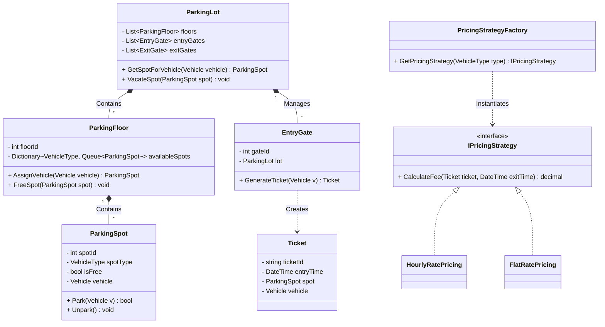

# C# Low-Level Design (LLD) Comprehensive Revision Notes

**Author: Shantanu Rastogi**

This document serves as an advanced revision guide for Object-Oriented Low-Level Design (LLD), synthesizing core architectural principles, design pattern applications, interview execution strategies, and concurrency mechanisms. It references the structured implementations across various systems (Parking Lot, ATM, Movie Ticket Booking, Splitwise, Rate Limiter, and Car Rental).

---

## 1. Core Architectural Principles (SOLID in .NET)

Designing enterprise backend microservices requires strict adherence to SOLID principles to guarantee testability and scalability.

- **Single Responsibility Principle (SRP):** Classes should have one reason to change. Separating domain models (e.g., `Booking`, `Ticket`) from business logic services (`BookingService`) and data access (`BookingRepository`).
- **Open/Closed Principle (OCP):** Systems should be open for extension but closed for modification. Injecting new rate-limiting algorithms (e.g., `SlidingWindowLogRateLimiter`) or payment methods (`UpiPayment`, `CardPayment`) via interfaces without altering the core processor.
- **Liskov Substitution Principle (LSP):** Subtypes must be substitutable for their base types. Iterating over a `List<Vehicle>` and safely calculating fees regardless of whether the underlying instance is a `Car`, `Bike`, or `Truck`[cite: 1].
- **Interface Segregation Principle (ISP):** Avoid forcing classes to implement methods they do not use. Decoupling `IPaymentStrategy` from `IPricingStrategy` so that billing calculation logic does not leak into payment execution logic[cite: 1].
- **Dependency Inversion Principle (DIP):** High-level modules should depend on abstractions. Using constructor injection for `IGroupRepository` or `LockProvider` to allow mocking during unit tests and swapping implementations[cite: 1].

---

## 2. Interview Execution Framework: The 45-Minute Blueprint

To succeed in an LLD interview, follow a strict chronological framework. Never jump straight into code or class diagrams.

1.  **Clarify Requirements (5-7 minutes):** Define the exact scope. Ask about actors, core use cases, edge cases, and out-of-scope features. (See system-specific questions below).
2.  **Define Core Entities & Enums (5 minutes):** Identify the "Nouns". Write down the primary models (e.g., `Vehicle`, `Ticket`, `Show`, `Seat`) and Enums (`SeatType`, `VehicleType`, `BookingStatus`)[cite: 1].
3.  **Establish Class Relationships & Interfaces (10-15 minutes):** Identify the "Verbs". Define your Repositories, Services, and structural connections (1:1, 1:N, M:N).
4.  **Apply Design Patterns (10 minutes):** Propose how the system will extend in the future using Strategies, Factories, or States.
5.  **Address Concurrency & Edge Cases (5-10 minutes):** Explain how your C# implementation handles simultaneous requests (e.g., locking, thread-safe collections).

---

## 3. Deep Dive: System Designs, Interview Clarifications & Detailed UML

### A. Parking Lot System

The Parking Lot system manages spatial allocation, automated ticketing, and dynamic fee calculation[cite: 1].

**1. Interview Requirement Clarification Questions:**

- _Topology:_ Is this a single-level or multi-level parking lot?
- _Pricing:_ Do we charge hourly, flat rate, or per-vehicle type? Are rates dynamic based on capacity?
- _Entry/Exit:_ Are there multiple entry and exit gates? Do we need to handle concurrent gate operations?
- _Allocation:_ Does the system assign the slot at the gate, or does the user find an open slot?

**2. Key Design Patterns & Logic:**

- **Strategy Pattern:** For dynamic pricing (`HourlyRatePricing`, `FlatRatePricing`) based on vehicle type and time[cite: 1].
- **Min-Heap (Priority Queue):** $O(1)$ lookup for the nearest open spot, partitioned by `VehicleType`.

