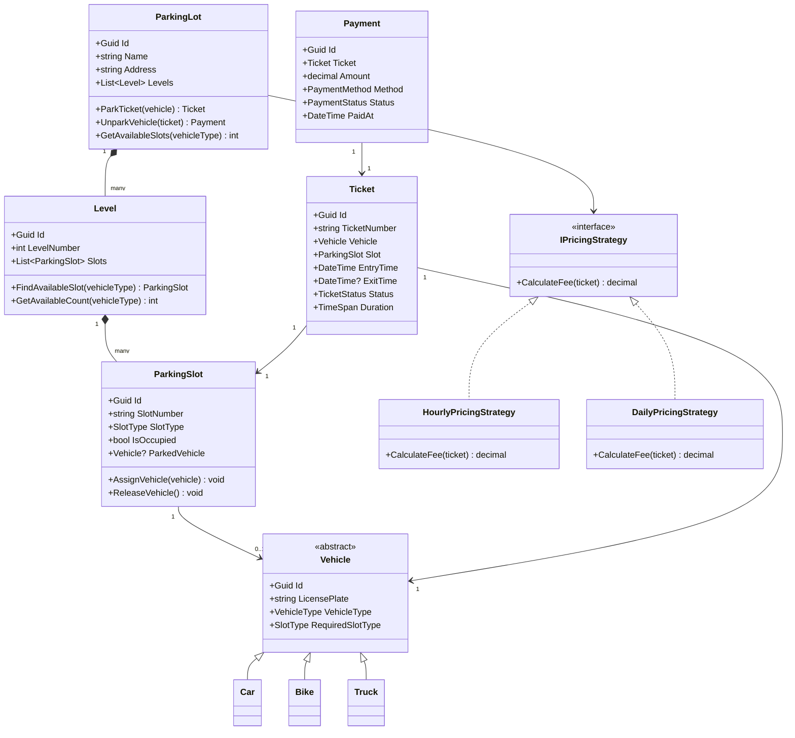

# LLD 01 – Parking Lot System

---

## 1. Interview Approach (Step-by-Step)

**Step 1 – Clarify Requirements (2 min)**
Ask:

- How many levels? What types of vehicles? (bike, car, truck)
- Is payment required? What pricing model? (flat, hourly, daily)
- Do we need reservations or only walk-in?
- Should we track availability in real-time?
- Any concurrency concerns (multiple entries/exits simultaneously)?

**Step 2 – Define Core Entities (3 min)**
Say: "I'll identify the main nouns from requirements — ParkingLot, Level, ParkingSlot, Vehicle, Ticket, Payment."

**Step 3 – Draw Relationships (3 min)**
"A ParkingLot has many Levels. Each Level has many Slots. A Vehicle parks in a Slot and gets a Ticket."

**Step 4 – DB Schema (3 min)**
Walk through each table, primary/foreign keys, and important indexes.

**Step 5 – Design Patterns (2 min)**
Strategy for pricing, Singleton for ParkingLot, Observer for availability, Factory for Vehicles.

**Step 6 – Write Code (10 min)**
Start with interfaces, then concrete classes, then the service/orchestrator.

**Step 7 – SOLID walkthrough (2 min)**
Briefly explain how each principle is applied.

---

## 2. Requirements & Assumptions

**Functional:**

- Multi-level parking lot with configurable slots per level
- Vehicle types: Bike, Car, Truck — each needs different slot sizes
- Issue ticket on entry, calculate fee on exit
- Payment via card or cash
- Real-time slot availability tracking

**Non-Functional:**

- Concurrent entries/exits must not cause race conditions
- Fast availability lookup (O(1))

---

## 3. Core Entities

| Entity             | Responsibility                                 |
| ------------------ | ---------------------------------------------- |
| `ParkingLot`       | Top-level aggregate; manages levels            |
| `Level`            | Groups slots on one floor                      |
| `ParkingSlot`      | Individual space; has type and occupancy state |
| `Vehicle`          | Abstract base; Car/Bike/Truck extend it        |
| `Ticket`           | Record of parking session (entry/exit time)    |
| `Payment`          | Tracks payment for a ticket                    |
| `IPricingStrategy` | Abstraction for fee calculation                |

**Enums:**

```
VehicleType   : Bike, Car, Truck
SlotType      : Small, Medium, Large
PaymentMethod : Cash, Card, Digital
TicketStatus  : Active, Closed
PaymentStatus : Pending, Completed, Failed
```

---

## 4. Class Relationship Diagram



---

## 5. DB Schema

```sql
-- Levels
CREATE TABLE Levels (
    Id          UNIQUEIDENTIFIER PRIMARY KEY DEFAULT NEWID(),
    LotId       UNIQUEIDENTIFIER NOT NULL REFERENCES ParkingLots(Id),
    LevelNumber INT NOT NULL,
    UNIQUE (LotId, LevelNumber)
);

-- Parking Slots
CREATE TABLE ParkingSlots (
    Id          UNIQUEIDENTIFIER PRIMARY KEY DEFAULT NEWID(),
    LevelId     UNIQUEIDENTIFIER NOT NULL REFERENCES Levels(Id),
    SlotNumber  VARCHAR(10) NOT NULL,
    SlotType    VARCHAR(10) NOT NULL,   -- Small | Medium | Large
    IsOccupied  BIT NOT NULL DEFAULT 0,
    INDEX IX_Slots_Available (LevelId, SlotType, IsOccupied)
);

-- Vehicles
CREATE TABLE Vehicles (
    Id           UNIQUEIDENTIFIER PRIMARY KEY DEFAULT NEWID(),
    LicensePlate VARCHAR(20) NOT NULL UNIQUE,
    VehicleType  VARCHAR(10) NOT NULL    -- Bike | Car | Truck
);

-- Tickets
CREATE TABLE Tickets (
    Id           UNIQUEIDENTIFIER PRIMARY KEY DEFAULT NEWID(),
    TicketNumber VARCHAR(20) NOT NULL UNIQUE,
    VehicleId    UNIQUEIDENTIFIER NOT NULL REFERENCES Vehicles(Id),
    SlotId       UNIQUEIDENTIFIER NOT NULL REFERENCES ParkingSlots(Id),
    EntryTime    DATETIME NOT NULL DEFAULT GETUTCDATE(),
    ExitTime     DATETIME NULL,
    Status       VARCHAR(10) NOT NULL DEFAULT 'Active',  -- Active | Closed
    INDEX IX_Tickets_Active (Status, SlotId)
);

-- Payments
CREATE TABLE Payments (
    Id            UNIQUEIDENTIFIER PRIMARY KEY DEFAULT NEWID(),
    TicketId      UNIQUEIDENTIFIER NOT NULL REFERENCES Tickets(Id),
    Amount        DECIMAL(10,2) NOT NULL,
    PaymentMethod VARCHAR(10) NOT NULL,
    Status        VARCHAR(10) NOT NULL,
    PaidAt        DATETIME NULL
);
```

---

## 6. Design Patterns

| Pattern             | Where Used                  | Why                                                               |
| ------------------- | --------------------------- | ----------------------------------------------------------------- |
| **Singleton**       | `ParkingLot`                | Only one lot instance manages global state                        |
| **Strategy**        | `IPricingStrategy`          | Swap pricing models (hourly/daily) without changing core logic    |
| **Factory Method**  | `VehicleFactory`            | Create correct Vehicle subtype from VehicleType enum              |
| **Observer**        | `ISlotAvailabilityObserver` | Notify dashboards/displays when slot count changes                |
| **Template Method** | `PaymentProcessor`          | Define checkout steps; subclasses handle specific payment methods |

---

## 7. SOLID Principles

| Principle                     | Application                                                                                      |
| ----------------------------- | ------------------------------------------------------------------------------------------------ |
| **S** – Single Responsibility | `ParkingSlot` only manages occupancy; `Ticket` only tracks session; `Payment` only handles money |
| **O** – Open/Closed           | Add new `VehicleType` by extending `Vehicle`, no change to `ParkingLot`                          |
| **L** – Liskov Substitution   | `Car`, `Bike`, `Truck` are fully substitutable for `Vehicle`                                     |
| **I** – Interface Segregation | `IPricingStrategy`, `IPaymentProcessor`, `ISlotObserver` are separate, focused interfaces        |
| **D** – Dependency Inversion  | `ParkingLot` depends on `IPricingStrategy` abstraction, not concrete `HourlyPricingStrategy`     |

---

## 8. C# Implementation

```csharp
// ─── Enums ───────────────────────────────────────────────────────────────────
public enum VehicleType  { Bike, Car, Truck }
public enum SlotType     { Small, Medium, Large }
public enum TicketStatus { Active, Closed }
public enum PaymentStatus{ Pending, Completed, Failed }
public enum PaymentMethod{ Cash, Card, Digital }

// ─── Domain Models ───────────────────────────────────────────────────────────
public abstract class Vehicle
{
    public Guid   Id           { get; } = Guid.NewGuid();
    public string LicensePlate { get; init; } = default!;
    public abstract VehicleType VehicleType      { get; }
    public abstract SlotType    RequiredSlotType { get; }
}

public class Bike  : Vehicle { public override VehicleType VehicleType => VehicleType.Bike;  public override SlotType RequiredSlotType => SlotType.Small;  }
public class Car   : Vehicle { public override VehicleType VehicleType => VehicleType.Car;   public override SlotType RequiredSlotType => SlotType.Medium; }
public class Truck : Vehicle { public override VehicleType VehicleType => VehicleType.Truck; public override SlotType RequiredSlotType => SlotType.Large;  }

// ─── Factory ─────────────────────────────────────────────────────────────────
public static class VehicleFactory
{
    public static Vehicle Create(VehicleType type, string plate) => type switch
    {
        VehicleType.Bike  => new Bike  { LicensePlate = plate },
        VehicleType.Car   => new Car   { LicensePlate = plate },
        VehicleType.Truck => new Truck { LicensePlate = plate },
        _                 => throw new ArgumentOutOfRangeException(nameof(type))
    };
}

// ─── Parking Slot ─────────────────────────────────────────────────────────────
public class ParkingSlot
{
    private readonly object _lock = new();

    public Guid       Id           { get; } = Guid.NewGuid();
    public string     SlotNumber   { get; init; } = default!;
    public SlotType   SlotType     { get; init; }
    public bool       IsOccupied   { get; private set; }
    public Vehicle?   ParkedVehicle{ get; private set; }

    public bool CanFit(SlotType requiredType) => SlotType >= requiredType && !IsOccupied;

    public bool TryAssign(Vehicle vehicle)
    {
        lock (_lock)
        {
            if (IsOccupied) return false;
            IsOccupied    = true;
            ParkedVehicle = vehicle;
            return true;
        }
    }

    public Vehicle Release()
    {
        lock (_lock)
        {
            if (!IsOccupied) throw new InvalidOperationException("Slot is already empty.");
            var v         = ParkedVehicle!;
            IsOccupied    = false;
            ParkedVehicle = null;
            return v;
        }
    }
}

// ─── Level ───────────────────────────────────────────────────────────────────
public class Level
{
    public Guid          Id          { get; } = Guid.NewGuid();
    public int           LevelNumber { get; init; }
    private readonly List<ParkingSlot> _slots;

    public Level(int levelNumber, IEnumerable<ParkingSlot> slots)
    {
        LevelNumber = levelNumber;
        _slots = slots.ToList();
    }

    public ParkingSlot? FindAvailableSlot(SlotType required)
        => _slots.FirstOrDefault(s => s.CanFit(required));

    public int GetAvailableCount(SlotType required)
        => _slots.Count(s => s.CanFit(required));
}

// ─── Ticket ──────────────────────────────────────────────────────────────────
public class Ticket
{
    public Guid         Id           { get; } = Guid.NewGuid();
    public string       TicketNumber { get; init; } = default!;
    public Vehicle      Vehicle      { get; init; } = default!;
    public ParkingSlot  Slot         { get; init; } = default!;
    public DateTime     EntryTime    { get; } = DateTime.UtcNow;
    public DateTime?    ExitTime     { get; private set; }
    public TicketStatus Status       { get; private set; } = TicketStatus.Active;

    public TimeSpan Duration => (ExitTime ?? DateTime.UtcNow) - EntryTime;

    public void Close()
    {
        ExitTime = DateTime.UtcNow;
        Status   = TicketStatus.Closed;
    }
}

// ─── Pricing Strategy (Strategy Pattern) ─────────────────────────────────────
public interface IPricingStrategy
{
    decimal CalculateFee(Ticket ticket);
}

public class HourlyPricingStrategy : IPricingStrategy
{
    private readonly decimal _ratePerHour;
    public HourlyPricingStrategy(decimal ratePerHour) => _ratePerHour = ratePerHour;

    public decimal CalculateFee(Ticket ticket)
    {
        var hours = Math.Ceiling(ticket.Duration.TotalHours);
        return (decimal)hours * _ratePerHour;
    }
}

public class DailyPricingStrategy : IPricingStrategy
{
    private readonly decimal _ratePerDay;
    public DailyPricingStrategy(decimal ratePerDay) => _ratePerDay = ratePerDay;

    public decimal CalculateFee(Ticket ticket)
    {
        var days = Math.Ceiling(ticket.Duration.TotalDays);
        return (decimal)days * _ratePerDay;
    }
}

// ─── Observer (Availability Notification) ────────────────────────────────────
public interface ISlotAvailabilityObserver
{
    void OnAvailabilityChanged(SlotType type, int available);
}

public class DisplayBoardObserver : ISlotAvailabilityObserver
{
    public void OnAvailabilityChanged(SlotType type, int available)
        => Console.WriteLine($"[Display] {type} slots available: {available}");
}

// ─── Parking Lot (Singleton) ──────────────────────────────────────────────────
public class ParkingLot
{
    private static ParkingLot? _instance;
    private static readonly object _instanceLock = new();

    public Guid          Id       { get; } = Guid.NewGuid();
    public string        Name     { get; init; } = default!;
    private readonly List<Level>  _levels;
    private readonly IPricingStrategy _pricingStrategy;
    private readonly List<ISlotAvailabilityObserver> _observers = new();

    private ParkingLot(string name, IEnumerable<Level> levels, IPricingStrategy pricing)
    {
        Name             = name;
        _levels          = levels.ToList();
        _pricingStrategy = pricing;
    }

    public static ParkingLot GetInstance(string name, IEnumerable<Level> levels, IPricingStrategy pricing)
    {
        if (_instance is null)
            lock (_instanceLock)
                _instance ??= new ParkingLot(name, levels, pricing);
        return _instance;
    }

    public void Subscribe(ISlotAvailabilityObserver observer) => _observers.Add(observer);

    public Ticket? ParkVehicle(Vehicle vehicle)
    {
        foreach (var level in _levels)
        {
            var slot = level.FindAvailableSlot(vehicle.RequiredSlotType);
            if (slot is not null && slot.TryAssign(vehicle))
            {
                var ticket = new Ticket
                {
                    TicketNumber = $"TKT-{DateTime.UtcNow.Ticks}",
                    Vehicle      = vehicle,
                    Slot         = slot
                };
                NotifyObservers(vehicle.RequiredSlotType);
                return ticket;
            }
        }
        return null; // Lot full
    }

    public Payment UnparkVehicle(Ticket ticket, PaymentMethod method)
    {
        ticket.Close();
        ticket.Slot.Release();

        var fee     = _pricingStrategy.CalculateFee(ticket);
        var payment = new Payment
        {
            Id     = Guid.NewGuid(),
            Ticket = ticket,
            Amount = fee,
            Method = method,
            Status = PaymentStatus.Completed,
            PaidAt = DateTime.UtcNow
        };

        NotifyObservers(ticket.Vehicle.RequiredSlotType);
        return payment;
    }

    public int GetAvailableSlots(SlotType type)
        => _levels.Sum(l => l.GetAvailableCount(type));

    private void NotifyObservers(SlotType type)
    {
        int available = GetAvailableSlots(type);
        foreach (var obs in _observers) obs.OnAvailabilityChanged(type, available);
    }
}

// ─── Payment ──────────────────────────────────────────────────────────────────
public class Payment
{
    public Guid          Id     { get; init; }
    public Ticket        Ticket { get; init; } = default!;
    public decimal       Amount { get; init; }
    public PaymentMethod Method { get; init; }
    public PaymentStatus Status { get; init; }
    public DateTime?     PaidAt { get; init; }
}

// ─── Usage Example ────────────────────────────────────────────────────────────
// var slots = Enumerable.Range(1, 20).Select(i => new ParkingSlot
//     { SlotNumber = $"A{i}", SlotType = i <= 5 ? SlotType.Small : i <= 15 ? SlotType.Medium : SlotType.Large });
// var level1 = new Level(1, slots);
// var lot = ParkingLot.GetInstance("Central Park Lot", new[] { level1 }, new HourlyPricingStrategy(50));
// lot.Subscribe(new DisplayBoardObserver());
// var car = VehicleFactory.Create(VehicleType.Car, "MH01AB1234");
// var ticket = lot.ParkVehicle(car);
// var payment = lot.UnparkVehicle(ticket!, PaymentMethod.Card);
// Console.WriteLine($"Fee: ₹{payment.Amount}");
```

---

## Key Discussion Points for Interview

1. **Concurrency**: Use `lock` on `ParkingSlot.TryAssign()` to prevent two threads assigning the same slot simultaneously. In distributed systems, use optimistic locking with a `RowVersion` column in DB.

2. **Efficient Availability**: Maintain per-level availability counters (increment/decrement) rather than scanning all slots every time — O(1) lookup.

3. **Slot Sizing**: A `Large` slot can accommodate a `Car` if no `Medium` is available (upsizing). Implement this as a fallback in `FindAvailableSlot`.

4. **Real-Time Tracking**: Push availability changes to a SignalR hub or Redis pub/sub for live dashboard updates.

5. **Extensibility**: To add electric vehicle charging slots, simply add `ChargingSlot extends ParkingSlot` — no change to core `ParkingLot` logic.
