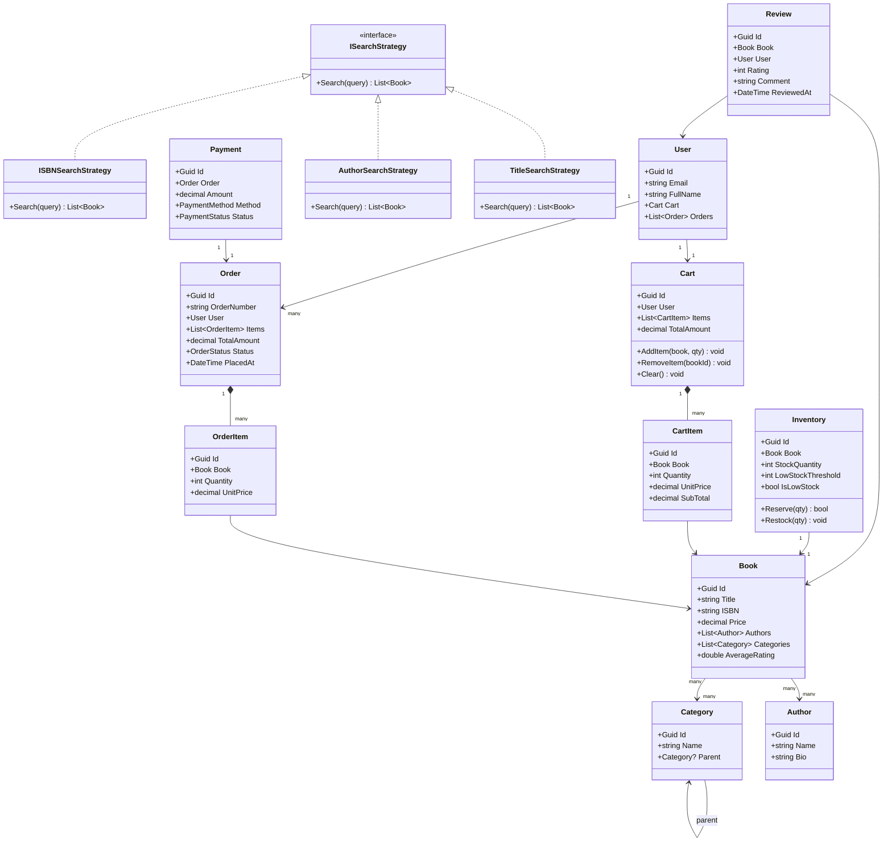

# LLD 02 – Online Bookstore

---

## 1. Interview Approach (Step-by-Step)

**Step 1 – Clarify Requirements (2 min)**

- Do we support physical books, e-books, or both?
- Multi-author books? Multiple categories?
- Is there a shopping cart or direct order?
- Payment gateway integration required?
- Do we need a recommendation engine?

**Step 2 – Define Core Entities**
Book, Author, Category, User, Cart, Order, OrderItem, Inventory, Payment, Review

**Step 3 – Relationships**
"A Book has many Authors and belongs to many Categories. A User has one Cart and many Orders. An Order has many OrderItems. Each Book has an Inventory record."

**Step 4 – Searching Strategy**
Explain full-text search (title, author, ISBN), filtered search (category, price range, rating), and mention using a search index (Elasticsearch/SQL FTS) for production.

**Step 5 – Patterns**
Repository for data access, Builder for complex query construction, Observer for inventory alerts, Strategy for discount calculation.

---

## 2. Requirements & Assumptions

**Functional:**

- Browse/search books by title, author, ISBN, category
- Add to cart, place orders, process payments
- Manage inventory (stock levels, restock alerts)
- Users can leave reviews and ratings
- Order status tracking

**Non-Functional:**

- Search must be fast even with 1M+ books
- Inventory updates must be atomic (no overselling)

---

## 3. Core Entities

| Entity      | Responsibility                    |
| ----------- | --------------------------------- |
| `Book`      | Catalog item with metadata        |
| `Author`    | Book author details               |
| `Category`  | Book classification               |
| `User`      | Registered customer               |
| `Cart`      | Session-level shopping basket     |
| `CartItem`  | Individual item in cart           |
| `Order`     | Confirmed purchase record         |
| `OrderItem` | Line item within an order         |
| `Inventory` | Stock tracking per book           |
| `Payment`   | Payment record for an order       |
| `Review`    | User review and rating for a book |

**Enums:**

```
OrderStatus   : Pending, Confirmed, Shipped, Delivered, Cancelled
PaymentStatus : Pending, Completed, Failed, Refunded
PaymentMethod : Card, UPI, NetBanking, Wallet
```

---

## 4. Class Relationship Diagram



---

## 5. DB Schema

```sql
-- Authors
CREATE TABLE Authors (
    Id   UNIQUEIDENTIFIER PRIMARY KEY DEFAULT NEWID(),
    Name NVARCHAR(200) NOT NULL,
    Bio  NVARCHAR(MAX) NULL
);

-- Categories (self-referencing for hierarchy)
CREATE TABLE Categories (
    Id       UNIQUEIDENTIFIER PRIMARY KEY DEFAULT NEWID(),
    Name     NVARCHAR(100) NOT NULL,
    ParentId UNIQUEIDENTIFIER NULL REFERENCES Categories(Id)
);

-- Books
CREATE TABLE Books (
    Id            UNIQUEIDENTIFIER PRIMARY KEY DEFAULT NEWID(),
    Title         NVARCHAR(500) NOT NULL,
    ISBN          VARCHAR(20)   NOT NULL UNIQUE,
    Price         DECIMAL(10,2) NOT NULL,
    Description   NVARCHAR(MAX) NULL,
    PublishedDate DATE          NULL,
    AverageRating FLOAT         NOT NULL DEFAULT 0,
    INDEX IX_Books_Title (Title),
    INDEX IX_Books_Price (Price)
);

-- Many-to-Many: Books <-> Authors
CREATE TABLE BookAuthors (
    BookId   UNIQUEIDENTIFIER NOT NULL REFERENCES Books(Id),
    AuthorId UNIQUEIDENTIFIER NOT NULL REFERENCES Authors(Id),
    PRIMARY KEY (BookId, AuthorId)
);

-- Many-to-Many: Books <-> Categories
CREATE TABLE BookCategories (
    BookId     UNIQUEIDENTIFIER NOT NULL REFERENCES Books(Id),
    CategoryId UNIQUEIDENTIFIER NOT NULL REFERENCES Categories(Id),
    PRIMARY KEY (BookId, CategoryId)
);

-- Users
CREATE TABLE Users (
    Id       UNIQUEIDENTIFIER PRIMARY KEY DEFAULT NEWID(),
    Email    NVARCHAR(256) NOT NULL UNIQUE,
    FullName NVARCHAR(200) NOT NULL,
    CreatedAt DATETIME NOT NULL DEFAULT GETUTCDATE()
);

-- Carts
CREATE TABLE Carts (
    Id     UNIQUEIDENTIFIER PRIMARY KEY DEFAULT NEWID(),
    UserId UNIQUEIDENTIFIER NOT NULL UNIQUE REFERENCES Users(Id)
);

-- Cart Items
CREATE TABLE CartItems (
    Id        UNIQUEIDENTIFIER PRIMARY KEY DEFAULT NEWID(),
    CartId    UNIQUEIDENTIFIER NOT NULL REFERENCES Carts(Id),
    BookId    UNIQUEIDENTIFIER NOT NULL REFERENCES Books(Id),
    Quantity  INT              NOT NULL CHECK (Quantity > 0),
    UnitPrice DECIMAL(10,2)    NOT NULL,
    UNIQUE (CartId, BookId)
);

-- Orders
CREATE TABLE Orders (
    Id          UNIQUEIDENTIFIER PRIMARY KEY DEFAULT NEWID(),
    OrderNumber VARCHAR(30)      NOT NULL UNIQUE,
    UserId      UNIQUEIDENTIFIER NOT NULL REFERENCES Users(Id),
    TotalAmount DECIMAL(10,2)    NOT NULL,
    Status      VARCHAR(20)      NOT NULL DEFAULT 'Pending',
    PlacedAt    DATETIME         NOT NULL DEFAULT GETUTCDATE(),
    INDEX IX_Orders_User (UserId, Status)
);

-- Order Items
CREATE TABLE OrderItems (
    Id        UNIQUEIDENTIFIER PRIMARY KEY DEFAULT NEWID(),
    OrderId   UNIQUEIDENTIFIER NOT NULL REFERENCES Orders(Id),
    BookId    UNIQUEIDENTIFIER NOT NULL REFERENCES Books(Id),
    Quantity  INT              NOT NULL,
    UnitPrice DECIMAL(10,2)    NOT NULL
);

-- Inventory
CREATE TABLE Inventory (
    Id                UNIQUEIDENTIFIER PRIMARY KEY DEFAULT NEWID(),
    BookId            UNIQUEIDENTIFIER NOT NULL UNIQUE REFERENCES Books(Id),
    StockQuantity     INT NOT NULL DEFAULT 0,
    LowStockThreshold INT NOT NULL DEFAULT 10,
    RowVersion        ROWVERSION   -- Optimistic concurrency
);

-- Payments
CREATE TABLE Payments (
    Id            UNIQUEIDENTIFIER PRIMARY KEY DEFAULT NEWID(),
    OrderId       UNIQUEIDENTIFIER NOT NULL REFERENCES Orders(Id),
    Amount        DECIMAL(10,2)    NOT NULL,
    Method        VARCHAR(20)      NOT NULL,
    Status        VARCHAR(20)      NOT NULL,
    TransactionRef VARCHAR(100)    NULL,
    PaidAt        DATETIME         NULL
);

-- Reviews
CREATE TABLE Reviews (
    Id         UNIQUEIDENTIFIER PRIMARY KEY DEFAULT NEWID(),
    BookId     UNIQUEIDENTIFIER NOT NULL REFERENCES Books(Id),
    UserId     UNIQUEIDENTIFIER NOT NULL REFERENCES Users(Id),
    Rating     TINYINT          NOT NULL CHECK (Rating BETWEEN 1 AND 5),
    Comment    NVARCHAR(MAX)    NULL,
    ReviewedAt DATETIME         NOT NULL DEFAULT GETUTCDATE(),
    UNIQUE (BookId, UserId)   -- One review per user per book
);
```

---

## 6. Design Patterns

| Pattern          | Where                                 | Why                                                                                    |
| ---------------- | ------------------------------------- | -------------------------------------------------------------------------------------- |
| **Repository**   | `IBookRepository`, `IOrderRepository` | Decouple data access from business logic                                               |
| **Strategy**     | `ISearchStrategy`                     | Plug in different search algorithms (title, author, ISBN, full-text)                   |
| **Builder**      | `BookSearchQueryBuilder`              | Compose complex search queries (title + category + price range) fluently               |
| **Observer**     | `IInventoryObserver`                  | Alert admin when stock falls below threshold                                           |
| **Facade**       | `OrderService`                        | Hides complexity of cart validation + inventory reservation + payment + order creation |
| **Unit of Work** | `IUnitOfWork`                         | Wrap cart→order→inventory update in a single transaction                               |

---

## 7. SOLID Principles

| Principle | Application                                                                                                        |
| --------- | ------------------------------------------------------------------------------------------------------------------ |
| **S**     | `Inventory` only manages stock; `OrderService` only orchestrates order flow; `PaymentService` only handles payment |
| **O**     | New payment methods added by implementing `IPaymentProcessor`; no change to `OrderService`                         |
| **L**     | Any `ISearchStrategy` implementation works in `BookSearchService`                                                  |
| **I**     | `IInventoryObserver` separate from `IOrderObserver`; no forced implementations                                     |
| **D**     | `OrderService` depends on `IInventoryRepository` and `IPaymentProcessor` abstractions                              |

---

## 8. C# Implementation

```csharp
// ─── Enums ───────────────────────────────────────────────────────────────────
public enum OrderStatus   { Pending, Confirmed, Shipped, Delivered, Cancelled }
public enum PaymentStatus { Pending, Completed, Failed, Refunded }
public enum PaymentMethod { Card, UPI, NetBanking, Wallet }

// ─── Domain Models ───────────────────────────────────────────────────────────
public class Book
{
    public Guid           Id            { get; init; } = Guid.NewGuid();
    public string         Title         { get; init; } = default!;
    public string         ISBN          { get; init; } = default!;
    public decimal        Price         { get; init; }
    public List<Author>   Authors       { get; init; } = new();
    public List<Category> Categories    { get; init; } = new();
    public double         AverageRating { get; private set; }

    public void UpdateRating(double newAvg) => AverageRating = newAvg;
}

public class Author
{
    public Guid   Id   { get; init; } = Guid.NewGuid();
    public string Name { get; init; } = default!;
    public string Bio  { get; init; } = string.Empty;
}

public class Category
{
    public Guid      Id     { get; init; } = Guid.NewGuid();
    public string    Name   { get; init; } = default!;
    public Category? Parent { get; init; }
}

// ─── Cart ─────────────────────────────────────────────────────────────────────
public class CartItem
{
    public Guid    Id        { get; init; } = Guid.NewGuid();
    public Book    Book      { get; init; } = default!;
    public int     Quantity  { get; set; }
    public decimal UnitPrice { get; init; }
    public decimal SubTotal  => UnitPrice * Quantity;
}

public class Cart
{
    private readonly List<CartItem> _items = new();

    public Guid           Id          { get; } = Guid.NewGuid();
    public Guid           UserId      { get; init; }
    public IReadOnlyList<CartItem> Items => _items.AsReadOnly();
    public decimal        TotalAmount => _items.Sum(i => i.SubTotal);

    public void AddItem(Book book, int quantity)
    {
        var existing = _items.FirstOrDefault(i => i.Book.Id == book.Id);
        if (existing is not null)
            existing.Quantity += quantity;
        else
            _items.Add(new CartItem { Book = book, Quantity = quantity, UnitPrice = book.Price });
    }

    public void RemoveItem(Guid bookId)
        => _items.RemoveAll(i => i.Book.Id == bookId);

    public void Clear() => _items.Clear();
}

// ─── Inventory ───────────────────────────────────────────────────────────────
public class Inventory
{
    private readonly object _lock = new();
    private readonly List<IInventoryObserver> _observers = new();

    public Guid   BookId            { get; init; }
    public int    StockQuantity     { get; private set; }
    public int    LowStockThreshold { get; init; } = 10;
    public bool   IsLowStock        => StockQuantity <= LowStockThreshold;

    public void Subscribe(IInventoryObserver obs) => _observers.Add(obs);

    public bool TryReserve(int qty)
    {
        lock (_lock)
        {
            if (StockQuantity < qty) return false;
            StockQuantity -= qty;
            if (IsLowStock) _observers.ForEach(o => o.OnLowStock(BookId, StockQuantity));
            return true;
        }
    }

    public void Restock(int qty)
    {
        lock (_lock)
        {
            StockQuantity += qty;
            _observers.ForEach(o => o.OnRestocked(BookId, StockQuantity));
        }
    }
}

public interface IInventoryObserver
{
    void OnLowStock(Guid bookId, int remaining);
    void OnRestocked(Guid bookId, int newQty);
}

public class AdminAlertObserver : IInventoryObserver
{
    public void OnLowStock(Guid bookId, int remaining)
        => Console.WriteLine($"[ALERT] Book {bookId} low stock: {remaining}");
    public void OnRestocked(Guid bookId, int newQty)
        => Console.WriteLine($"[INFO] Book {bookId} restocked: {newQty}");
}

// ─── Search Strategy ─────────────────────────────────────────────────────────
public interface ISearchStrategy
{
    IEnumerable<Book> Search(IEnumerable<Book> catalog, string query);
}

public class TitleSearchStrategy : ISearchStrategy
{
    public IEnumerable<Book> Search(IEnumerable<Book> catalog, string query)
        => catalog.Where(b => b.Title.Contains(query, StringComparison.OrdinalIgnoreCase));
}

public class AuthorSearchStrategy : ISearchStrategy
{
    public IEnumerable<Book> Search(IEnumerable<Book> catalog, string query)
        => catalog.Where(b => b.Authors.Any(a => a.Name.Contains(query, StringComparison.OrdinalIgnoreCase)));
}

public class ISBNSearchStrategy : ISearchStrategy
{
    public IEnumerable<Book> Search(IEnumerable<Book> catalog, string query)
        => catalog.Where(b => b.ISBN.Equals(query, StringComparison.OrdinalIgnoreCase));
}

// ─── Search Builder (Builder Pattern) ────────────────────────────────────────
public class BookSearchQuery
{
    public string?    TitleContains  { get; set; }
    public string?    AuthorContains { get; set; }
    public string?    ISBN           { get; set; }
    public Guid?      CategoryId     { get; set; }
    public decimal?   MinPrice       { get; set; }
    public decimal?   MaxPrice       { get; set; }
    public double?    MinRating      { get; set; }
}

public class BookSearchQueryBuilder
{
    private readonly BookSearchQuery _query = new();

    public BookSearchQueryBuilder WithTitle(string title)       { _query.TitleContains  = title;  return this; }
    public BookSearchQueryBuilder WithAuthor(string author)     { _query.AuthorContains = author; return this; }
    public BookSearchQueryBuilder WithISBN(string isbn)         { _query.ISBN           = isbn;   return this; }
    public BookSearchQueryBuilder InCategory(Guid categoryId)   { _query.CategoryId     = categoryId; return this; }
    public BookSearchQueryBuilder PriceBetween(decimal min, decimal max) { _query.MinPrice = min; _query.MaxPrice = max; return this; }
    public BookSearchQueryBuilder MinRating(double rating)      { _query.MinRating      = rating; return this; }
    public BookSearchQuery Build() => _query;
}

// ─── Order ───────────────────────────────────────────────────────────────────
public class OrderItem
{
    public Guid    Id        { get; init; } = Guid.NewGuid();
    public Book    Book      { get; init; } = default!;
    public int     Quantity  { get; init; }
    public decimal UnitPrice { get; init; }
    public decimal SubTotal  => UnitPrice * Quantity;
}

public class Order
{
    private readonly List<OrderItem> _items = new();

    public Guid                    Id          { get; } = Guid.NewGuid();
    public string                  OrderNumber { get; init; } = default!;
    public Guid                    UserId      { get; init; }
    public IReadOnlyList<OrderItem> Items      => _items.AsReadOnly();
    public decimal                 TotalAmount => _items.Sum(i => i.SubTotal);
    public OrderStatus             Status      { get; private set; } = OrderStatus.Pending;
    public DateTime                PlacedAt    { get; } = DateTime.UtcNow;

    public void AddItem(OrderItem item) => _items.Add(item);
    public void UpdateStatus(OrderStatus status) => Status = status;
}

// ─── Order Service (Facade) ───────────────────────────────────────────────────
public interface IInventoryRepository { Inventory GetByBookId(Guid bookId); }
public interface IOrderRepository     { void Save(Order order); }
public interface IPaymentProcessor    { Payment Process(Order order, PaymentMethod method); }

public class OrderService
{
    private readonly IInventoryRepository _inventoryRepo;
    private readonly IOrderRepository     _orderRepo;
    private readonly IPaymentProcessor    _paymentProcessor;

    public OrderService(IInventoryRepository inv, IOrderRepository ord, IPaymentProcessor pay)
    {
        _inventoryRepo    = inv;
        _orderRepo        = ord;
        _paymentProcessor = pay;
    }

    public (Order order, Payment payment) PlaceOrder(Cart cart, PaymentMethod paymentMethod)
    {
        // 1. Validate cart
        if (!cart.Items.Any()) throw new InvalidOperationException("Cart is empty.");

        // 2. Reserve inventory for all items (fail-fast)
        var reservations = new List<(Inventory inv, int qty)>();
        foreach (var item in cart.Items)
        {
            var inv = _inventoryRepo.GetByBookId(item.Book.Id);
            if (!inv.TryReserve(item.Quantity))
                throw new InvalidOperationException($"Insufficient stock for '{item.Book.Title}'.");
            reservations.Add((inv, item.Quantity));
        }

        // 3. Create order
        var order = new Order { OrderNumber = $"ORD-{DateTime.UtcNow.Ticks}", UserId = cart.UserId };
        foreach (var item in cart.Items)
            order.AddItem(new OrderItem { Book = item.Book, Quantity = item.Quantity, UnitPrice = item.UnitPrice });

        // 4. Process payment
        var payment = _paymentProcessor.Process(order, paymentMethod);
        if (payment.Status != PaymentStatus.Completed)
        {
            // Rollback reservations
            foreach (var (inv, qty) in reservations) inv.Restock(qty);
            throw new InvalidOperationException("Payment failed.");
        }

        // 5. Confirm order
        order.UpdateStatus(OrderStatus.Confirmed);
        _orderRepo.Save(order);
        cart.Clear();

        return (order, payment);
    }
}

public class Payment
{
    public Guid          Id     { get; init; } = Guid.NewGuid();
    public Guid          OrderId{ get; init; }
    public decimal       Amount { get; init; }
    public PaymentMethod Method { get; init; }
    public PaymentStatus Status { get; init; }
    public string?       TransactionRef { get; init; }
    public DateTime?     PaidAt { get; init; }
}
```

---

## Key Discussion Points for Interview

1. **Inventory Atomicity**: Use `RowVersion` (optimistic concurrency) or `SELECT FOR UPDATE` to prevent two users buying the last copy simultaneously.

2. **Search at Scale**: For production, index books in Elasticsearch. The `ISearchStrategy` abstraction lets you swap from in-memory to ES-backed search without touching business logic.

3. **Pricing Flexibility**: Use a `IDiscountStrategy` (Strategy pattern) for coupons, seasonal discounts, bulk pricing — injected into `OrderService`.

4. **Cart Persistence**: Cart can be stored in Redis (session-based) or SQL (user-based). The `Cart` domain model is independent of storage.

5. **Event-Driven Fulfillment**: After order is confirmed, publish an `OrderConfirmedEvent` so downstream services (warehouse, email service) react independently.
