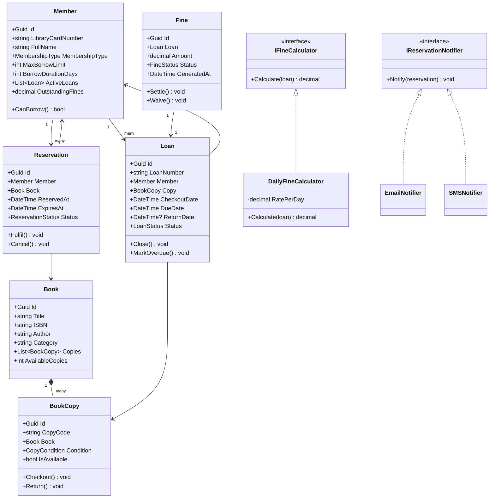

# LLD 03 – Library Management System

---

## 1. Interview Approach (Step-by-Step)

**Step 1 – Clarify Requirements (2 min)**

- Physical library only, or also digital lending (e-books)?
- Multiple copies of the same book?
- What is the max borrow duration? Fixed or per-membership type?
- How are fines calculated? Daily after due date?
- Reservations/holds allowed while book is checked out?

**Step 2 – Define Core Entities**
Book, BookCopy, Member, Loan, Reservation, Fine, Librarian, Catalog

**Step 3 – Relationships**
"A Book has many BookCopies. A Member has many Loans and Reservations. A Loan tracks which BookCopy was borrowed by which Member. A Fine is generated when a Loan is overdue."

**Step 4 – Key Workflows**

- Checkout: Member requests → find available copy → create Loan
- Return: Mark copy available → check if fine → settle fine → check reservations queue
- Overdue: Scheduled job checks Loans past DueDate → generate Fine

**Step 5 – Patterns**
State for Loan lifecycle, Strategy for fine calculation, Observer for reservation notifications, Command for loan operations.

---

## 2. Requirements & Assumptions

**Functional:**

- Members can borrow up to N books simultaneously (N per membership type)
- Fixed borrow period (14 days standard, 30 days premium)
- Fine = ₹5/day after due date
- Members can place holds on checked-out books
- Librarians manage catalog and process checkouts/returns

**Non-Functional:**

- Accurate overdue tracking via scheduled job
- Prevent concurrent double-checkout of same copy

---

## 3. Core Entities

| Entity           | Responsibility                                            |
| ---------------- | --------------------------------------------------------- |
| `Book`           | Catalog metadata (title, ISBN, authors)                   |
| `BookCopy`       | Physical copy with condition and availability state       |
| `Member`         | Library patron with borrowing limits                      |
| `Loan`           | Records borrow/return of a specific copy to a member      |
| `Reservation`    | Hold placed when no copy is available                     |
| `Fine`           | Overdue penalty associated with a loan                    |
| `Librarian`      | Staff user who manages catalog and processes transactions |
| `MembershipType` | Defines borrow limit and period                           |

**Enums:**

```
LoanStatus        : Active, Returned, Overdue, Lost
ReservationStatus : Waiting, Fulfilled, Cancelled, Expired
FineStatus        : Unpaid, Paid, Waived
CopyCondition     : Good, Fair, Damaged
MembershipType    : Standard, Premium, Student
```

---

## 4. Class Relationship Diagram



---

## 5. DB Schema

```sql
-- Books
CREATE TABLE Books (
    Id       UNIQUEIDENTIFIER PRIMARY KEY DEFAULT NEWID(),
    Title    NVARCHAR(500) NOT NULL,
    ISBN     VARCHAR(20)   NOT NULL UNIQUE,
    Author   NVARCHAR(300) NOT NULL,
    Category NVARCHAR(100) NULL,
    INDEX IX_Books_Title  (Title),
    INDEX IX_Books_Author (Author)
);

-- Book Copies
CREATE TABLE BookCopies (
    Id          UNIQUEIDENTIFIER PRIMARY KEY DEFAULT NEWID(),
    BookId      UNIQUEIDENTIFIER NOT NULL REFERENCES Books(Id),
    CopyCode    VARCHAR(30)      NOT NULL UNIQUE,
    Condition   VARCHAR(10)      NOT NULL DEFAULT 'Good',
    IsAvailable BIT              NOT NULL DEFAULT 1,
    INDEX IX_Copies_Available (BookId, IsAvailable)
);

-- Members
CREATE TABLE Members (
    Id                UNIQUEIDENTIFIER PRIMARY KEY DEFAULT NEWID(),
    LibraryCardNumber VARCHAR(20)   NOT NULL UNIQUE,
    FullName          NVARCHAR(200) NOT NULL,
    Email             NVARCHAR(256) NOT NULL UNIQUE,
    MembershipType    VARCHAR(20)   NOT NULL DEFAULT 'Standard',
    IsActive          BIT           NOT NULL DEFAULT 1,
    JoinedAt          DATE          NOT NULL DEFAULT GETUTCDATE()
);

-- Loans
CREATE TABLE Loans (
    Id           UNIQUEIDENTIFIER PRIMARY KEY DEFAULT NEWID(),
    LoanNumber   VARCHAR(30)      NOT NULL UNIQUE,
    MemberId     UNIQUEIDENTIFIER NOT NULL REFERENCES Members(Id),
    CopyId       UNIQUEIDENTIFIER NOT NULL REFERENCES BookCopies(Id),
    CheckoutDate DATE             NOT NULL DEFAULT GETUTCDATE(),
    DueDate      DATE             NOT NULL,
    ReturnDate   DATE             NULL,
    Status       VARCHAR(10)      NOT NULL DEFAULT 'Active',
    INDEX IX_Loans_Member (MemberId, Status),
    INDEX IX_Loans_Due    (DueDate, Status)  -- For overdue job
);

-- Reservations
CREATE TABLE Reservations (
    Id         UNIQUEIDENTIFIER PRIMARY KEY DEFAULT NEWID(),
    MemberId   UNIQUEIDENTIFIER NOT NULL REFERENCES Members(Id),
    BookId     UNIQUEIDENTIFIER NOT NULL REFERENCES Books(Id),
    ReservedAt DATETIME         NOT NULL DEFAULT GETUTCDATE(),
    ExpiresAt  DATETIME         NOT NULL,
    Status     VARCHAR(20)      NOT NULL DEFAULT 'Waiting',
    INDEX IX_Reservations_Book (BookId, Status)
);

-- Fines
CREATE TABLE Fines (
    Id          UNIQUEIDENTIFIER PRIMARY KEY DEFAULT NEWID(),
    LoanId      UNIQUEIDENTIFIER NOT NULL REFERENCES Loans(Id),
    Amount      DECIMAL(8,2)     NOT NULL,
    Status      VARCHAR(10)      NOT NULL DEFAULT 'Unpaid',
    GeneratedAt DATETIME         NOT NULL DEFAULT GETUTCDATE(),
    SettledAt   DATETIME         NULL
);
```

---

## 6. Design Patterns

| Pattern             | Where                                       | Why                                                                                    |
| ------------------- | ------------------------------------------- | -------------------------------------------------------------------------------------- |
| **State**           | `Loan` status (Active → Overdue → Returned) | Encapsulate valid transitions; prevent illegal state changes                           |
| **Strategy**        | `IFineCalculator`                           | Different fine rules (daily flat, tiered, grace period) without changing `LoanService` |
| **Observer**        | `IReservationNotifier`                      | Notify waiting members when a copy becomes available                                   |
| **Command**         | `CheckoutCommand`, `ReturnCommand`          | Encapsulate and log each library transaction; supports undo                            |
| **Template Method** | `LoanProcessor`                             | Define checkout/return skeleton; subclasses handle membership-specific rules           |

---

## 7. SOLID Principles

| Principle | Application                                                                                 |
| --------- | ------------------------------------------------------------------------------------------- |
| **S**     | `Loan` manages loan lifecycle only; `Fine` manages penalty only; `LoanService` orchestrates |
| **O**     | Add new membership type by extending `MembershipPolicy`; no change to `LoanService`         |
| **L**     | `StandardMember`, `PremiumMember` fully substitutable for `Member`                          |
| **I**     | `IFineCalculator` separate from `IReservationNotifier` — no bloated interfaces              |
| **D**     | `LoanService` injects `IFineCalculator` and `IReservationNotifier` — not concrete types     |

---

## 8. C# Implementation

```csharp
// ─── Enums ───────────────────────────────────────────────────────────────────
public enum LoanStatus        { Active, Returned, Overdue, Lost }
public enum ReservationStatus { Waiting, Fulfilled, Cancelled, Expired }
public enum FineStatus        { Unpaid, Paid, Waived }
public enum CopyCondition     { Good, Fair, Damaged }
public enum MembershipType    { Standard, Premium, Student }

// ─── Membership Policy ───────────────────────────────────────────────────────
public class MembershipPolicy
{
    private static readonly Dictionary<MembershipType, (int MaxBooks, int DurationDays)> _policies = new()
    {
        { MembershipType.Standard, (3,  14) },
        { MembershipType.Premium,  (10, 30) },
        { MembershipType.Student,  (5,  21) }
    };

    public static (int maxBooks, int durationDays) Get(MembershipType type)
        => _policies[type];
}

// ─── Book & BookCopy ──────────────────────────────────────────────────────────
public class Book
{
    public Guid         Id       { get; init; } = Guid.NewGuid();
    public string       Title    { get; init; } = default!;
    public string       ISBN     { get; init; } = default!;
    public string       Author   { get; init; } = default!;
    public string       Category { get; init; } = default!;
    private readonly List<BookCopy> _copies = new();
    public IReadOnlyList<BookCopy> Copies => _copies.AsReadOnly();
    public int AvailableCopies => _copies.Count(c => c.IsAvailable);
    public void AddCopy(BookCopy copy) => _copies.Add(copy);
}

public class BookCopy
{
    private readonly object _lock = new();
    public Guid          Id        { get; init; } = Guid.NewGuid();
    public string        CopyCode  { get; init; } = default!;
    public Book          Book      { get; init; } = default!;
    public CopyCondition Condition { get; set; } = CopyCondition.Good;
    public bool          IsAvailable { get; private set; } = true;

    public bool TryCheckout()
    {
        lock (_lock)
        {
            if (!IsAvailable) return false;
            IsAvailable = false;
            return true;
        }
    }

    public void Return() { lock (_lock) { IsAvailable = true; } }
}

// ─── Member ───────────────────────────────────────────────────────────────────
public class Member
{
    public Guid           Id                { get; init; } = Guid.NewGuid();
    public string         LibraryCardNumber { get; init; } = default!;
    public string         FullName          { get; init; } = default!;
    public string         Email             { get; init; } = default!;
    public MembershipType MembershipType    { get; init; }
    public bool           IsActive          { get; private set; } = true;

    public int MaxBorrowLimit   => MembershipPolicy.Get(MembershipType).maxBooks;
    public int BorrowDurationDays => MembershipPolicy.Get(MembershipType).durationDays;

    private readonly List<Loan> _activeLoans = new();
    public IReadOnlyList<Loan> ActiveLoans => _activeLoans.AsReadOnly();

    public bool CanBorrow() => IsActive && _activeLoans.Count < MaxBorrowLimit;

    public void AddLoan(Loan loan) => _activeLoans.Add(loan);
    public void RemoveLoan(Loan loan) => _activeLoans.Remove(loan);
}

// ─── Loan (State Pattern) ─────────────────────────────────────────────────────
public class Loan
{
    public Guid       Id           { get; } = Guid.NewGuid();
    public string     LoanNumber   { get; init; } = default!;
    public Member     Member       { get; init; } = default!;
    public BookCopy   Copy         { get; init; } = default!;
    public DateTime   CheckoutDate { get; } = DateTime.UtcNow.Date;
    public DateTime   DueDate      { get; init; }
    public DateTime?  ReturnDate   { get; private set; }
    public LoanStatus Status       { get; private set; } = LoanStatus.Active;

    public bool IsOverdue => Status == LoanStatus.Active && DateTime.UtcNow.Date > DueDate;
    public int  DaysOverdue => IsOverdue ? (DateTime.UtcNow.Date - DueDate).Days : 0;

    public void MarkReturned()
    {
        if (Status == LoanStatus.Returned) throw new InvalidOperationException("Already returned.");
        ReturnDate = DateTime.UtcNow.Date;
        Status     = LoanStatus.Returned;
    }

    public void MarkOverdue()
    {
        if (Status == LoanStatus.Active) Status = LoanStatus.Overdue;
    }
}

// ─── Fine Calculator (Strategy) ──────────────────────────────────────────────
public interface IFineCalculator
{
    decimal Calculate(Loan loan);
}

public class DailyFineCalculator : IFineCalculator
{
    private readonly decimal _ratePerDay;
    private readonly int     _gracePeriodDays;

    public DailyFineCalculator(decimal ratePerDay = 5m, int gracePeriodDays = 0)
    {
        _ratePerDay      = ratePerDay;
        _gracePeriodDays = gracePeriodDays;
    }

    public decimal Calculate(Loan loan)
    {
        var overdueDays = Math.Max(0, loan.DaysOverdue - _gracePeriodDays);
        return overdueDays * _ratePerDay;
    }
}

// ─── Reservation & Notifier ───────────────────────────────────────────────────
public class Reservation
{
    public Guid              Id        { get; } = Guid.NewGuid();
    public Member            Member    { get; init; } = default!;
    public Book              Book      { get; init; } = default!;
    public DateTime          ReservedAt{ get; } = DateTime.UtcNow;
    public DateTime          ExpiresAt { get; init; }
    public ReservationStatus Status    { get; private set; } = ReservationStatus.Waiting;

    public void Fulfil()  => Status = ReservationStatus.Fulfilled;
    public void Cancel()  => Status = ReservationStatus.Cancelled;
    public void Expire()  => Status = ReservationStatus.Expired;
}

public interface IReservationNotifier
{
    void Notify(Reservation reservation, string message);
}

public class EmailNotifier : IReservationNotifier
{
    public void Notify(Reservation res, string message)
        => Console.WriteLine($"[EMAIL → {res.Member.Email}]: {message}");
}

// ─── Loan Service (Orchestrator) ──────────────────────────────────────────────
public class LoanService
{
    private readonly IFineCalculator       _fineCalc;
    private readonly IReservationNotifier  _notifier;
    private readonly List<Reservation>     _reservations;

    public LoanService(IFineCalculator fineCalc, IReservationNotifier notifier)
    {
        _fineCalc     = fineCalc;
        _notifier     = notifier;
        _reservations = new List<Reservation>();
    }

    public Loan Checkout(Member member, BookCopy copy)
    {
        if (!member.CanBorrow())
            throw new InvalidOperationException("Member cannot borrow: limit reached or account inactive.");

        if (!copy.TryCheckout())
            throw new InvalidOperationException("Copy is not available.");

        var loan = new Loan
        {
            LoanNumber = $"LN-{DateTime.UtcNow.Ticks}",
            Member     = member,
            Copy       = copy,
            DueDate    = DateTime.UtcNow.Date.AddDays(member.BorrowDurationDays)
        };

        member.AddLoan(loan);
        return loan;
    }

    public Fine? Return(Loan loan)
    {
        loan.MarkReturned();
        loan.Copy.Return();
        loan.Member.RemoveLoan(loan);

        Fine? fine = null;
        var amount = _fineCalc.Calculate(loan);
        if (amount > 0)
        {
            fine = new Fine { Loan = loan, Amount = amount };
        }

        // Notify next reservation in queue
        var nextReservation = _reservations
            .Where(r => r.Book.Id == loan.Copy.Book.Id && r.Status == ReservationStatus.Waiting)
            .OrderBy(r => r.ReservedAt)
            .FirstOrDefault();

        if (nextReservation is not null)
        {
            nextReservation.Fulfil();
            _notifier.Notify(nextReservation, $"Your reserved book '{loan.Copy.Book.Title}' is now available!");
        }

        return fine;
    }

    public Reservation PlaceHold(Member member, Book book)
    {
        var reservation = new Reservation
        {
            Member    = member,
            Book      = book,
            ExpiresAt = DateTime.UtcNow.AddDays(7)
        };
        _reservations.Add(reservation);
        return reservation;
    }

    // Called by a scheduled background job
    public IEnumerable<Fine> ProcessOverdueLoans(IEnumerable<Loan> activeLoans)
    {
        var fines = new List<Fine>();
        foreach (var loan in activeLoans.Where(l => l.IsOverdue))
        {
            loan.MarkOverdue();
            var amount = _fineCalc.Calculate(loan);
            if (amount > 0) fines.Add(new Fine { Loan = loan, Amount = amount });
        }
        return fines;
    }
}

// ─── Fine ─────────────────────────────────────────────────────────────────────
public class Fine
{
    public Guid      Id          { get; } = Guid.NewGuid();
    public Loan      Loan        { get; init; } = default!;
    public decimal   Amount      { get; init; }
    public FineStatus Status     { get; private set; } = FineStatus.Unpaid;
    public DateTime  GeneratedAt { get; } = DateTime.UtcNow;
    public DateTime? SettledAt   { get; private set; }

    public void Settle() { Status = FineStatus.Paid;   SettledAt = DateTime.UtcNow; }
    public void Waive()  { Status = FineStatus.Waived; SettledAt = DateTime.UtcNow; }
}
```

---

## Key Discussion Points for Interview

1. **Concurrency on BookCopy**: The `lock` in `TryCheckout()` prevents two members checking out the same copy. In distributed systems use optimistic locking (`RowVersion`) at DB level.

2. **Overdue Job**: A background service (Windows Service / Azure Function timer trigger) runs nightly: `SELECT * FROM Loans WHERE DueDate < TODAY AND Status = 'Active'` → updates to Overdue and inserts/updates Fine records.

3. **Reservation Queue**: Maintained in order of `ReservedAt`. When copy becomes available, notify only the first waiting member. If they don't collect within 48h, the reservation expires and next in queue is notified.

4. **Fine Accumulation**: Fine grows daily while overdue. Implement as `DaysOverdue × RatePerDay`, calculated lazily on return rather than stored per day.

5. **Membership Extension**: To add a new membership type (e.g., Corporate), add an entry to `MembershipPolicy` dictionary — zero change to `LoanService`.
