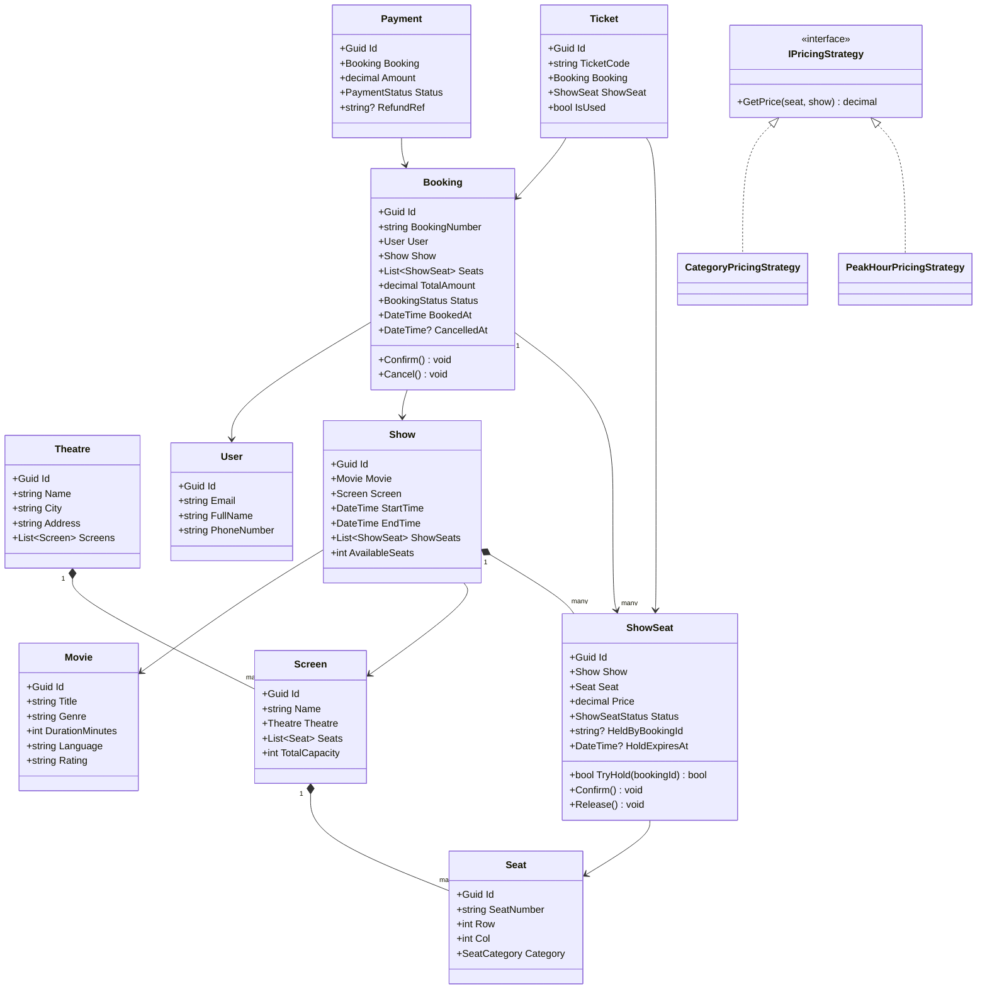

# LLD 04 – Movie Ticket Booking System

---

## 1. Interview Approach (Step-by-Step)

**Step 1 – Clarify Requirements (2 min)**

- Multiple theatres or single theatre?
- Multiple screens per theatre?
- Seat categories (Gold, Silver, Premium)?
- Can users select specific seats or just count?
- Cancellation policy and refunds?
- Concurrency: multiple users booking same seat simultaneously?

**Step 2 – Define Core Entities**
Movie, Theatre, Screen, Show, Seat, Booking, Ticket, Payment, User

**Step 3 – Key Workflows**
Search movie → select show → choose seats (lock temporarily) → confirm booking → payment → issue tickets → cancellation with refund

**Step 4 – Concurrency Challenge (most important)**
"Two users picking the same seat: use temporary seat locking (Redis TTL 10 min) + database-level unique constraint on (ShowId, SeatId, Status=Booked)."

**Step 5 – Patterns**
State for Booking lifecycle, Strategy for pricing, Observer for notifications, Facade for BookingService, Proxy for seat reservation lock.

---

## 2. Requirements & Assumptions

**Functional:**

- Search movies by title, genre, city, date
- View shows for a movie at different theatres
- Select seats, book tickets, make payment
- Cancel booking within allowed window
- Send booking confirmation via email/SMS

**Non-Functional:**

- Handle concurrent seat selection (no double booking)
- Seat reservation hold expires in 10 minutes if payment not completed

---

## 3. Core Entities

| Entity     | Responsibility                                 |
| ---------- | ---------------------------------------------- |
| `Movie`    | Film metadata                                  |
| `Theatre`  | Physical cinema with location                  |
| `Screen`   | Auditorium within a theatre                    |
| `Seat`     | Physical seat in a screen                      |
| `Show`     | Scheduled screening of a movie                 |
| `ShowSeat` | Junction of Show + Seat with pricing and state |
| `Booking`  | Customer's seat selection and payment          |
| `Ticket`   | Per-seat issued ticket                         |
| `User`     | Registered customer                            |
| `Payment`  | Payment record for a booking                   |

**Enums:**

```
SeatCategory    : Silver, Gold, Platinum
ShowSeatStatus  : Available, TemporaryHold, Booked
BookingStatus   : Initiated, Confirmed, Cancelled, Expired
PaymentStatus   : Pending, Completed, Failed, Refunded
```

---

## 4. Class Relationship Diagram



---

## 5. DB Schema

```sql
-- Movies
CREATE TABLE Movies (
    Id              UNIQUEIDENTIFIER PRIMARY KEY DEFAULT NEWID(),
    Title           NVARCHAR(300) NOT NULL,
    Genre           NVARCHAR(100) NULL,
    DurationMinutes INT           NOT NULL,
    Language        NVARCHAR(50)  NOT NULL,
    Rating          VARCHAR(5)    NULL,  -- U, UA, A
    INDEX IX_Movies_Title (Title),
    INDEX IX_Movies_Genre (Genre)
);

-- Theatres
CREATE TABLE Theatres (
    Id      UNIQUEIDENTIFIER PRIMARY KEY DEFAULT NEWID(),
    Name    NVARCHAR(200) NOT NULL,
    City    NVARCHAR(100) NOT NULL,
    Address NVARCHAR(500) NULL,
    INDEX IX_Theatres_City (City)
);

-- Screens
CREATE TABLE Screens (
    Id        UNIQUEIDENTIFIER PRIMARY KEY DEFAULT NEWID(),
    TheatreId UNIQUEIDENTIFIER NOT NULL REFERENCES Theatres(Id),
    Name      NVARCHAR(50)     NOT NULL
);

-- Seats
CREATE TABLE Seats (
    Id         UNIQUEIDENTIFIER PRIMARY KEY DEFAULT NEWID(),
    ScreenId   UNIQUEIDENTIFIER NOT NULL REFERENCES Screens(Id),
    SeatNumber VARCHAR(10)      NOT NULL,
    Row        INT              NOT NULL,
    Col        INT              NOT NULL,
    Category   VARCHAR(20)      NOT NULL,  -- Silver | Gold | Platinum
    UNIQUE (ScreenId, SeatNumber)
);

-- Shows
CREATE TABLE Shows (
    Id        UNIQUEIDENTIFIER PRIMARY KEY DEFAULT NEWID(),
    MovieId   UNIQUEIDENTIFIER NOT NULL REFERENCES Movies(Id),
    ScreenId  UNIQUEIDENTIFIER NOT NULL REFERENCES Screens(Id),
    StartTime DATETIME         NOT NULL,
    EndTime   DATETIME         NOT NULL,
    INDEX IX_Shows_Movie_Time (MovieId, StartTime)
);

-- Show Seats (availability per show)
CREATE TABLE ShowSeats (
    Id              UNIQUEIDENTIFIER PRIMARY KEY DEFAULT NEWID(),
    ShowId          UNIQUEIDENTIFIER NOT NULL REFERENCES Shows(Id),
    SeatId          UNIQUEIDENTIFIER NOT NULL REFERENCES Seats(Id),
    Price           DECIMAL(8,2)     NOT NULL,
    Status          VARCHAR(20)      NOT NULL DEFAULT 'Available',
    HeldByBookingId UNIQUEIDENTIFIER NULL,
    HoldExpiresAt   DATETIME         NULL,
    UNIQUE (ShowId, SeatId),
    INDEX IX_ShowSeats_Status (ShowId, Status)
);

-- Users
CREATE TABLE Users (
    Id          UNIQUEIDENTIFIER PRIMARY KEY DEFAULT NEWID(),
    Email       NVARCHAR(256) NOT NULL UNIQUE,
    FullName    NVARCHAR(200) NOT NULL,
    PhoneNumber VARCHAR(20)   NULL
);

-- Bookings
CREATE TABLE Bookings (
    Id            UNIQUEIDENTIFIER PRIMARY KEY DEFAULT NEWID(),
    BookingNumber VARCHAR(30)      NOT NULL UNIQUE,
    UserId        UNIQUEIDENTIFIER NOT NULL REFERENCES Users(Id),
    ShowId        UNIQUEIDENTIFIER NOT NULL REFERENCES Shows(Id),
    TotalAmount   DECIMAL(10,2)    NOT NULL,
    Status        VARCHAR(20)      NOT NULL DEFAULT 'Initiated',
    BookedAt      DATETIME         NOT NULL DEFAULT GETUTCDATE(),
    CancelledAt   DATETIME         NULL,
    INDEX IX_Bookings_User (UserId)
);

-- Tickets
CREATE TABLE Tickets (
    Id         UNIQUEIDENTIFIER PRIMARY KEY DEFAULT NEWID(),
    TicketCode VARCHAR(30)      NOT NULL UNIQUE,
    BookingId  UNIQUEIDENTIFIER NOT NULL REFERENCES Bookings(Id),
    ShowSeatId UNIQUEIDENTIFIER NOT NULL REFERENCES ShowSeats(Id),
    IsUsed     BIT              NOT NULL DEFAULT 0
);

-- Payments
CREATE TABLE Payments (
    Id            UNIQUEIDENTIFIER PRIMARY KEY DEFAULT NEWID(),
    BookingId     UNIQUEIDENTIFIER NOT NULL REFERENCES Bookings(Id),
    Amount        DECIMAL(10,2)    NOT NULL,
    Method        VARCHAR(20)      NOT NULL,
    Status        VARCHAR(20)      NOT NULL,
    TransactionRef VARCHAR(100)    NULL,
    RefundRef     VARCHAR(100)     NULL,
    PaidAt        DATETIME         NULL
);
```

---

## 6. Design Patterns

| Pattern      | Where                                               | Why                                                           |
| ------------ | --------------------------------------------------- | ------------------------------------------------------------- |
| **State**    | `BookingStatus` (Initiated → Confirmed → Cancelled) | Safe state transitions; prevent invalid operations            |
| **Strategy** | `IPricingStrategy`                                  | Different pricing for category, peak hours, weekend surcharge |
| **Observer** | Booking events → Email/SMS                          | Decouple notification from booking logic                      |
| **Facade**   | `BookingService`                                    | Hides seat locking, payment, ticket issuance complexity       |
| **Proxy**    | `SeatReservationProxy`                              | Adds TTL-based hold on top of `ShowSeat`                      |
| **Factory**  | `TicketFactory`                                     | Generate ticket codes and QR data                             |

---

## 7. SOLID Principles

| Principle | Application                                                                                          |
| --------- | ---------------------------------------------------------------------------------------------------- |
| **S**     | `ShowSeat` manages availability; `Booking` manages order lifecycle; `Ticket` manages issued ticket   |
| **O**     | Add peak-hour pricing via new `IPricingStrategy` impl without touching `BookingService`              |
| **L**     | Any `IPricingStrategy` substitutes in `BookingService`                                               |
| **I**     | `IBookingNotifier` separate from `IPaymentProcessor`                                                 |
| **D**     | `BookingService` depends on `IPaymentProcessor`, `IPricingStrategy`, `IBookingNotifier` abstractions |

---

## 8. C# Implementation

```csharp
// ─── Enums ───────────────────────────────────────────────────────────────────
public enum SeatCategory   { Silver, Gold, Platinum }
public enum ShowSeatStatus { Available, TemporaryHold, Booked }
public enum BookingStatus  { Initiated, Confirmed, Cancelled, Expired }
public enum PaymentStatus  { Pending, Completed, Failed, Refunded }

// ─── Core Models ─────────────────────────────────────────────────────────────
public class Movie
{
    public Guid   Id              { get; init; } = Guid.NewGuid();
    public string Title           { get; init; } = default!;
    public string Genre           { get; init; } = default!;
    public int    DurationMinutes { get; init; }
    public string Language        { get; init; } = default!;
}

public class Seat
{
    public Guid         Id           { get; init; } = Guid.NewGuid();
    public string       SeatNumber   { get; init; } = default!;
    public int          Row          { get; init; }
    public int          Col          { get; init; }
    public SeatCategory Category     { get; init; }
}

// ─── ShowSeat (with concurrency-safe hold) ────────────────────────────────────
public class ShowSeat
{
    private readonly object _lock = new();

    public Guid           Id              { get; init; } = Guid.NewGuid();
    public Guid           ShowId          { get; init; }
    public Seat           Seat            { get; init; } = default!;
    public decimal        Price           { get; init; }
    public ShowSeatStatus Status          { get; private set; } = ShowSeatStatus.Available;
    public Guid?          HeldByBookingId { get; private set; }
    public DateTime?      HoldExpiresAt   { get; private set; }

    public bool TryHold(Guid bookingId, int holdMinutes = 10)
    {
        lock (_lock)
        {
            // Release expired hold
            if (Status == ShowSeatStatus.TemporaryHold && HoldExpiresAt < DateTime.UtcNow)
                Release();

            if (Status != ShowSeatStatus.Available) return false;

            Status          = ShowSeatStatus.TemporaryHold;
            HeldByBookingId = bookingId;
            HoldExpiresAt   = DateTime.UtcNow.AddMinutes(holdMinutes);
            return true;
        }
    }

    public void Confirm()
    {
        lock (_lock)
        {
            if (Status != ShowSeatStatus.TemporaryHold)
                throw new InvalidOperationException("Seat not on hold.");
            Status = ShowSeatStatus.Booked;
        }
    }

    public void Release()
    {
        lock (_lock)
        {
            Status          = ShowSeatStatus.Available;
            HeldByBookingId = null;
            HoldExpiresAt   = null;
        }
    }
}

// ─── Pricing Strategy ────────────────────────────────────────────────────────
public interface IPricingStrategy
{
    decimal GetPrice(ShowSeat showSeat, Show show);
}

public class CategoryPricingStrategy : IPricingStrategy
{
    private static readonly Dictionary<SeatCategory, decimal> _rates = new()
    {
        { SeatCategory.Silver,   150m },
        { SeatCategory.Gold,     250m },
        { SeatCategory.Platinum, 400m }
    };

    public decimal GetPrice(ShowSeat showSeat, Show show)
        => _rates[showSeat.Seat.Category];
}

public class PeakHourPricingStrategy : IPricingStrategy
{
    private readonly IPricingStrategy _base;
    public PeakHourPricingStrategy(IPricingStrategy basePricing) => _base = basePricing;

    public decimal GetPrice(ShowSeat showSeat, Show show)
    {
        var basePrice = _base.GetPrice(showSeat, show);
        // 20% surcharge for shows between 6 PM - 11 PM
        return show.StartTime.Hour >= 18 ? basePrice * 1.2m : basePrice;
    }
}

// ─── Booking & Ticket ─────────────────────────────────────────────────────────
public class Show
{
    public Guid          Id        { get; init; } = Guid.NewGuid();
    public Movie         Movie     { get; init; } = default!;
    public DateTime      StartTime { get; init; }
    public DateTime      EndTime   { get; init; }
    private readonly List<ShowSeat> _seats = new();
    public IReadOnlyList<ShowSeat> ShowSeats => _seats.AsReadOnly();
    public void AddSeat(ShowSeat s) => _seats.Add(s);
    public int AvailableSeats => _seats.Count(s => s.Status == ShowSeatStatus.Available);
}

public class Booking
{
    private readonly List<ShowSeat> _seats = new();

    public Guid          Id            { get; } = Guid.NewGuid();
    public string        BookingNumber { get; init; } = default!;
    public Guid          UserId        { get; init; }
    public Show          Show          { get; init; } = default!;
    public IReadOnlyList<ShowSeat> Seats => _seats.AsReadOnly();
    public decimal       TotalAmount   => _seats.Sum(s => s.Price);
    public BookingStatus Status        { get; private set; } = BookingStatus.Initiated;
    public DateTime      BookedAt      { get; } = DateTime.UtcNow;
    public DateTime?     CancelledAt   { get; private set; }

    public void AddSeat(ShowSeat s) => _seats.Add(s);
    public void Confirm()  => Status = BookingStatus.Confirmed;
    public void Cancel()   { Status = BookingStatus.Cancelled; CancelledAt = DateTime.UtcNow; }
    public void Expire()   => Status = BookingStatus.Expired;
}

public class Ticket
{
    public Guid     Id         { get; } = Guid.NewGuid();
    public string   TicketCode { get; init; } = default!;
    public Guid     BookingId  { get; init; }
    public ShowSeat ShowSeat   { get; init; } = default!;
    public bool     IsUsed     { get; private set; }
    public void MarkUsed() => IsUsed = true;
}

// ─── Booking Service (Facade) ─────────────────────────────────────────────────
public interface IPaymentProcessor
{
    Payment Process(Booking booking, string paymentMethod);
}

public interface IBookingNotifier
{
    void NotifyConfirmed(Booking booking, IEnumerable<Ticket> tickets);
    void NotifyCancelled(Booking booking);
}

public class BookingService
{
    private readonly IPricingStrategy   _pricing;
    private readonly IPaymentProcessor  _payment;
    private readonly IBookingNotifier   _notifier;

    public BookingService(IPricingStrategy pricing, IPaymentProcessor payment, IBookingNotifier notifier)
    {
        _pricing  = pricing;
        _payment  = payment;
        _notifier = notifier;
    }

    public (Booking booking, IEnumerable<Ticket> tickets) BookSeats(
        Guid userId, Show show, IEnumerable<Guid> seatIds, string paymentMethod)
    {
        var booking = new Booking
        {
            BookingNumber = $"BK-{DateTime.UtcNow.Ticks}",
            UserId        = userId,
            Show          = show
        };

        // 1. Hold all requested seats
        var showSeats = show.ShowSeats.Where(ss => seatIds.Contains(ss.Seat.Id)).ToList();
        var heldSeats = new List<ShowSeat>();
        try
        {
            foreach (var seat in showSeats)
            {
                if (!seat.TryHold(booking.Id))
                    throw new InvalidOperationException($"Seat {seat.Seat.SeatNumber} is no longer available.");
                heldSeats.Add(seat);
                booking.AddSeat(seat);
            }

            // 2. Process payment
            var payment = _payment.Process(booking, paymentMethod);
            if (payment.Status != PaymentStatus.Completed)
            {
                foreach (var s in heldSeats) s.Release();
                throw new InvalidOperationException("Payment failed.");
            }

            // 3. Confirm seats and booking
            foreach (var s in heldSeats) s.Confirm();
            booking.Confirm();

            // 4. Generate tickets
            var tickets = heldSeats.Select(s => new Ticket
            {
                TicketCode = $"TK-{Guid.NewGuid():N}".Substring(0, 15).ToUpper(),
                BookingId  = booking.Id,
                ShowSeat   = s
            }).ToList();

            _notifier.NotifyConfirmed(booking, tickets);
            return (booking, tickets);
        }
        catch
        {
            foreach (var s in heldSeats) s.Release();
            throw;
        }
    }

    public void CancelBooking(Booking booking)
    {
        if (booking.Status != BookingStatus.Confirmed)
            throw new InvalidOperationException("Only confirmed bookings can be cancelled.");

        foreach (var seat in booking.Seats) seat.Release();
        booking.Cancel();
        _notifier.NotifyCancelled(booking);
    }
}

public class Payment
{
    public Guid          Id     { get; init; } = Guid.NewGuid();
    public Guid          BookingId { get; init; }
    public decimal       Amount { get; init; }
    public string        Method { get; init; } = default!;
    public PaymentStatus Status { get; init; }
}
```

---

## Key Discussion Points for Interview

1. **Concurrency – The Critical Part**: Seat double-booking is the #1 problem. Solution: 10-minute TTL hold in `ShowSeat.TryHold()`. At DB level: `UPDATE ShowSeats SET Status='Hold' WHERE Id=@id AND Status='Available'` — only one transaction wins. In distributed systems, use Redis distributed lock.

2. **Hold Expiry**: A background job or Redis key expiry releases seats if payment is not completed in 10 minutes. This requires `HoldExpiresAt` in DB.

3. **Seat Layout**: Row/Col on `Seat` allows the UI to render a visual seat map. Adjacent seat selection is done by sorting by `(Row, Col)`.

4. **Pricing Layers**: Use Decorator pattern — `PeakHourPricingStrategy` wraps `CategoryPricingStrategy`, adding surcharge on top. Weekend pricing adds another decorator layer.

5. **Cancellation Refund**: Implement a `RefundPolicy` (Strategy pattern) — full refund if cancelled 24h before show, 50% within 24h, no refund within 1h.
