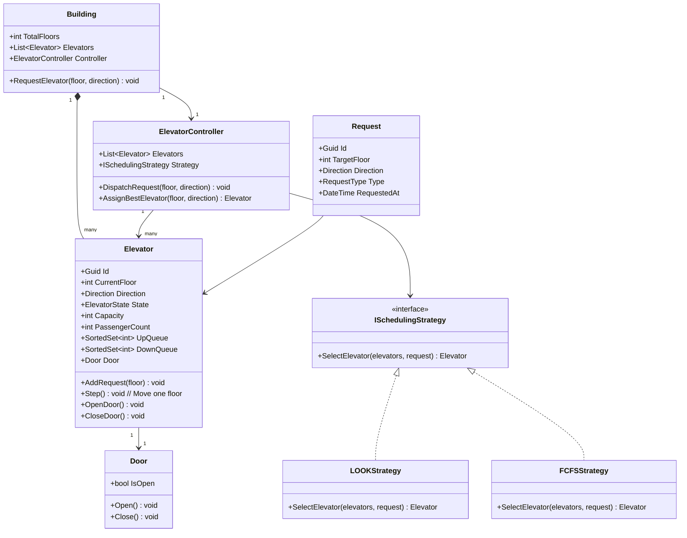

# LLD 05 – Elevator System

---

## 1. Interview Approach (Step-by-Step)

**Step 1 – Clarify Requirements (2 min)**

- How many elevators? How many floors?
- Are there service or freight elevators?
- Direction-based buttons (Up/Down) on floors + floor buttons inside elevator?
- Priority requests (e.g., emergency, accessibility)?
- What scheduling algorithm? (SCAN/LOOK is the standard answer)

**Step 2 – Define Core Entities**
Building, Elevator, ElevatorController, Request (external/internal)

**Step 3 – Scheduling Algorithm (Key Discussion)**
Say: "I'll use the **LOOK algorithm** (a variant of SCAN/Elevator algorithm):

- If moving UP: service all UP requests on the way up, then reverse
- If moving DOWN: service all DOWN requests on the way down, then reverse
- This minimizes average wait time and direction changes"

**Step 4 – Concurrency**
"Multiple elevators → the controller assigns the best elevator for each floor request based on direction, current floor, and load."

**Step 5 – Patterns**
Strategy for scheduling (SCAN, LOOK, FCFS), State for elevator states (Idle/Moving/Stopped), Observer for button panel updates, Command for floor requests.

---

## 2. Requirements & Assumptions

**Functional:**

- External buttons on each floor (Up/Down)
- Internal panel inside elevator (floor selection)
- Multiple elevators managed by a central controller
- Doors open/close at target floor
- Emergency stop support

**Non-Functional:**

- Efficient scheduling to minimize wait and travel time
- Thread-safe request processing

---

## 3. Core Entities

| Entity                | Responsibility                                     |
| --------------------- | -------------------------------------------------- |
| `Building`            | Has floors and elevators                           |
| `Elevator`            | Physical unit with direction, current floor, queue |
| `ElevatorController`  | Assigns requests to best elevator                  |
| `Request`             | Floor request (external or internal)               |
| `Door`                | Manages open/close with safety check               |
| `ISchedulingStrategy` | Algorithm to assign elevator to request            |
| `Button`              | Floor panel or cabin button                        |

**Enums:**

```
ElevatorState : Idle, MovingUp, MovingDown, Stopped, OutOfService
Direction     : Up, Down, None
RequestType   : External, Internal
```

---

## 4. Class Relationship Diagram



---

## 5. DB Schema

> Note: Elevator systems are primarily in-memory; DB is used for audit/analytics.

```sql
-- Elevators (configuration)
CREATE TABLE Elevators (
    Id       UNIQUEIDENTIFIER PRIMARY KEY DEFAULT NEWID(),
    Name     VARCHAR(50)  NOT NULL,
    Capacity INT          NOT NULL DEFAULT 10,
    IsActive BIT          NOT NULL DEFAULT 1
);

-- Elevator Requests (audit log)
CREATE TABLE ElevatorRequests (
    Id           UNIQUEIDENTIFIER PRIMARY KEY DEFAULT NEWID(),
    ElevatorId   UNIQUEIDENTIFIER NOT NULL REFERENCES Elevators(Id),
    SourceFloor  INT              NOT NULL,
    TargetFloor  INT              NOT NULL,
    Direction    VARCHAR(5)       NOT NULL,
    RequestType  VARCHAR(10)      NOT NULL,
    RequestedAt  DATETIME         NOT NULL DEFAULT GETUTCDATE(),
    ServicedAt   DATETIME         NULL
);

-- Elevator State Log (for analytics)
CREATE TABLE ElevatorStateLogs (
    Id         UNIQUEIDENTIFIER PRIMARY KEY DEFAULT NEWID(),
    ElevatorId UNIQUEIDENTIFIER NOT NULL REFERENCES Elevators(Id),
    Floor      INT              NOT NULL,
    State      VARCHAR(20)      NOT NULL,
    LoggedAt   DATETIME         NOT NULL DEFAULT GETUTCDATE()
);
```

---

## 6. Design Patterns

| Pattern       | Where                            | Why                                                                         |
| ------------- | -------------------------------- | --------------------------------------------------------------------------- |
| **Strategy**  | `ISchedulingStrategy`            | Swap LOOK/SCAN/FCFS algorithm independently of elevator logic               |
| **State**     | `ElevatorState` transitions      | Prevent invalid operations (e.g., can't open door while moving)             |
| **Observer**  | Floor button panels → Controller | Notify controller when external button is pressed                           |
| **Command**   | `FloorRequest` objects           | Encapsulate request; supports request queue, logging, undo (emergency stop) |
| **Singleton** | `ElevatorController`             | One controller manages all elevators in the building                        |

---

## 7. SOLID Principles

| Principle | Application                                                                                 |
| --------- | ------------------------------------------------------------------------------------------- |
| **S**     | `Elevator` manages movement; `Door` manages access; `ElevatorController` manages dispatch   |
| **O**     | Add new scheduling algorithm by implementing `ISchedulingStrategy`; no change to controller |
| **L**     | Any `ISchedulingStrategy` can substitute in `ElevatorController`                            |
| **I**     | `ISchedulingStrategy` focused only on elevator selection; door control is separate          |
| **D**     | `ElevatorController` depends on `ISchedulingStrategy` abstraction                           |

---

## 8. C# Implementation

```csharp
// ─── Enums ───────────────────────────────────────────────────────────────────
public enum ElevatorState { Idle, MovingUp, MovingDown, Stopped, OutOfService }
public enum Direction     { Up, Down, None }

// ─── Door ─────────────────────────────────────────────────────────────────────
public class Door
{
    public bool IsOpen { get; private set; }

    public void Open()
    {
        if (!IsOpen) { IsOpen = true; Console.WriteLine("[Door] Opened."); }
    }

    public void Close()
    {
        if (IsOpen) { IsOpen = false; Console.WriteLine("[Door] Closed."); }
    }
}

// ─── Elevator ─────────────────────────────────────────────────────────────────
public class Elevator
{
    public Guid          Id             { get; } = Guid.NewGuid();
    public int           CurrentFloor   { get; private set; } = 1;
    public Direction     Direction      { get; private set; } = Direction.None;
    public ElevatorState State          { get; private set; } = ElevatorState.Idle;
    public int           Capacity       { get; init; } = 10;
    public int           PassengerCount { get; private set; }
    public Door          Door           { get; } = new();

    // LOOK algorithm queues
    private readonly SortedSet<int> _upQueue   = new();
    private readonly SortedSet<int> _downQueue = new(Comparer<int>.Create((a, b) => b.CompareTo(a)));

    public bool HasRequests => _upQueue.Count > 0 || _downQueue.Count > 0;
    public int  TotalRequests => _upQueue.Count + _downQueue.Count;

    public void AddRequest(int floor)
    {
        if (floor > CurrentFloor || Direction == Direction.Up)
            _upQueue.Add(floor);
        else
            _downQueue.Add(floor);
    }

    // One simulation step
    public void Step()
    {
        if (!HasRequests)
        {
            State     = ElevatorState.Idle;
            Direction = Direction.None;
            return;
        }

        if (Direction == Direction.Up || (Direction == Direction.None && _upQueue.Count > 0))
        {
            if (_upQueue.Count > 0)
            {
                State     = ElevatorState.MovingUp;
                Direction = Direction.Up;
                CurrentFloor++;
                Console.WriteLine($"[Elevator {Id:N}] Moving UP → Floor {CurrentFloor}");

                if (_upQueue.Contains(CurrentFloor))
                {
                    _upQueue.Remove(CurrentFloor);
                    ArriveAtFloor();
                }
            }
            else
            {
                Direction = Direction.Down; // Reverse
            }
        }
        else
        {
            if (_downQueue.Count > 0)
            {
                State     = ElevatorState.MovingDown;
                Direction = Direction.Down;
                CurrentFloor--;
                Console.WriteLine($"[Elevator {Id:N}] Moving DOWN → Floor {CurrentFloor}");

                if (_downQueue.Contains(CurrentFloor))
                {
                    _downQueue.Remove(CurrentFloor);
                    ArriveAtFloor();
                }
            }
            else
            {
                Direction = Direction.Up; // Reverse
            }
        }
    }

    private void ArriveAtFloor()
    {
        State = ElevatorState.Stopped;
        Console.WriteLine($"[Elevator] Stopped at Floor {CurrentFloor}. Opening doors.");
        Door.Open();
        // Simulate boarding/alighting delay in real system
        Door.Close();
    }

    public void EmergencyStop()
    {
        _upQueue.Clear();
        _downQueue.Clear();
        State     = ElevatorState.Stopped;
        Direction = Direction.None;
        Door.Open();
        Console.WriteLine("[Elevator] EMERGENCY STOP activated.");
    }

    // Cost estimate for scheduling (lower = better candidate)
    public int EstimateCost(int requestFloor, Direction requestDirection)
    {
        int distance = Math.Abs(CurrentFloor - requestFloor);
        bool samedir = (Direction == Direction.Up   && requestDirection == Direction.Up   && requestFloor >= CurrentFloor) ||
                       (Direction == Direction.Down  && requestDirection == Direction.Down && requestFloor <= CurrentFloor);
        return samedir ? distance : distance + 20; // Penalty for direction change
    }
}

// ─── Scheduling Strategy (Strategy Pattern) ───────────────────────────────────
public interface ISchedulingStrategy
{
    Elevator SelectElevator(IEnumerable<Elevator> elevators, int requestFloor, Direction direction);
}

public class LOOKStrategy : ISchedulingStrategy
{
    public Elevator SelectElevator(IEnumerable<Elevator> elevators, int requestFloor, Direction direction)
    {
        // Pick elevator with lowest estimated cost (direction-aware)
        return elevators
            .Where(e => e.State != ElevatorState.OutOfService)
            .OrderBy(e => e.EstimateCost(requestFloor, direction))
            .First();
    }
}

public class NearestIdleFirstStrategy : ISchedulingStrategy
{
    public Elevator SelectElevator(IEnumerable<Elevator> elevators, int requestFloor, Direction direction)
    {
        var idle = elevators.Where(e => e.State == ElevatorState.Idle)
                            .OrderBy(e => Math.Abs(e.CurrentFloor - requestFloor))
                            .FirstOrDefault();
        return idle ?? new LOOKStrategy().SelectElevator(elevators, requestFloor, direction);
    }
}

// ─── Elevator Controller (Singleton) ─────────────────────────────────────────
public class ElevatorController
{
    private static ElevatorController? _instance;
    private static readonly object     _lock = new();

    private readonly List<Elevator>      _elevators;
    private readonly ISchedulingStrategy _strategy;

    private ElevatorController(IEnumerable<Elevator> elevators, ISchedulingStrategy strategy)
    {
        _elevators = elevators.ToList();
        _strategy  = strategy;
    }

    public static ElevatorController GetInstance(IEnumerable<Elevator> elevators, ISchedulingStrategy strategy)
    {
        if (_instance is null)
            lock (_lock)
                _instance ??= new ElevatorController(elevators, strategy);
        return _instance;
    }

    // External button press on floor
    public void RequestElevator(int floor, Direction direction)
    {
        Console.WriteLine($"[Controller] Request from Floor {floor}, Direction {direction}");
        var elevator = _strategy.SelectElevator(_elevators, floor, direction);
        elevator.AddRequest(floor);
        Console.WriteLine($"[Controller] Assigned Elevator {elevator.Id:N}");
    }

    // Internal button press inside elevator
    public void SelectFloor(Guid elevatorId, int floor)
    {
        var elevator = _elevators.FirstOrDefault(e => e.Id == elevatorId)
            ?? throw new KeyNotFoundException("Elevator not found.");
        elevator.AddRequest(floor);
    }

    // Simulation tick — advance all elevators one step
    public void Tick()
    {
        foreach (var elevator in _elevators.Where(e => e.State != ElevatorState.OutOfService))
            elevator.Step();
    }
}

// ─── Building ─────────────────────────────────────────────────────────────────
public class Building
{
    public int               TotalFloors { get; init; }
    public ElevatorController Controller  { get; }

    public Building(int floors, IEnumerable<Elevator> elevators, ISchedulingStrategy strategy)
    {
        TotalFloors = floors;
        Controller  = ElevatorController.GetInstance(elevators, strategy);
    }

    public void PressFloorButton(int floor, Direction direction)
        => Controller.RequestElevator(floor, direction);
}

// ─── Usage ────────────────────────────────────────────────────────────────────
// var elevators = Enumerable.Range(1, 3).Select(_ => new Elevator { Capacity = 8 });
// var building  = new Building(20, elevators, new LOOKStrategy());
// building.PressFloorButton(5,  Direction.Up);
// building.PressFloorButton(10, Direction.Up);
// building.PressFloorButton(3,  Direction.Down);
// for (int i = 0; i < 20; i++) building.Controller.Tick();
```

---

## Key Discussion Points for Interview

1. **LOOK vs SCAN**: SCAN goes to the extreme floor then reverses. LOOK reverses when there are no more requests in the current direction — more efficient. Mention this distinction explicitly.

2. **Multi-Elevator Dispatch**: The cost function `EstimateCost()` considers both distance and direction alignment. An elevator going UP is a better candidate for an upward request on a higher floor than an idle elevator far away.

3. **Thread Safety**: In real systems, elevator controllers run on dedicated threads. Use `ConcurrentQueue<Request>` and producer-consumer pattern. The `lock` in `Elevator` protects queue operations.

4. **Emergency**: `EmergencyStop()` clears queues and opens doors immediately. This should have the highest priority and bypass all scheduling logic.

5. **Capacity Management**: `PassengerCount` vs `Capacity` check before adding internal requests. An overloaded elevator should not accept more internal presses — show this constraint.
