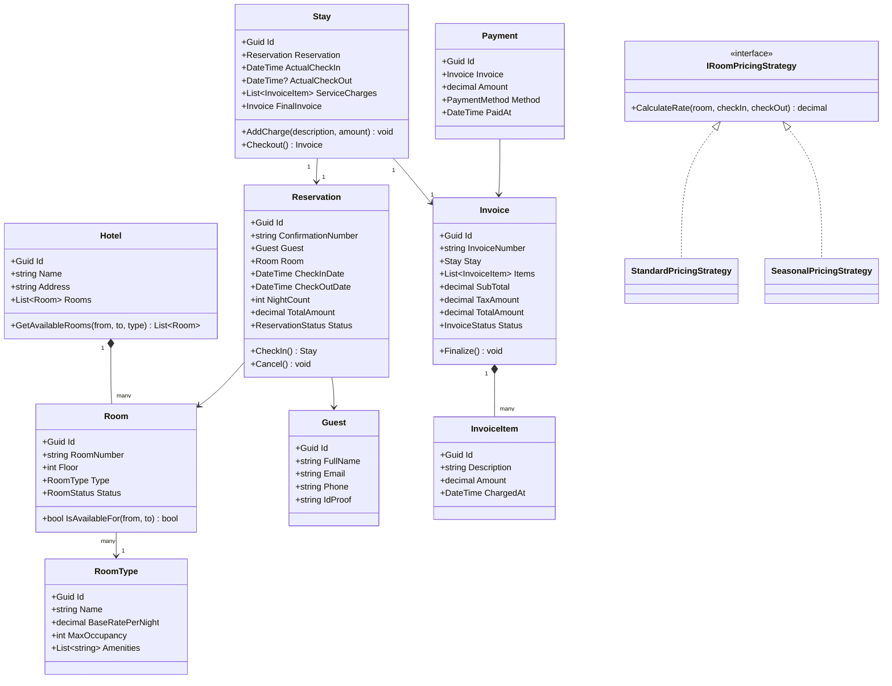

# LLD 06 – Hotel Management System

---

## 1. Interview Approach (Step-by-Step)

**Step 1 – Clarify Requirements (2 min)**

- Single hotel or chain of hotels?
- Room types: Standard, Deluxe, Suite?
- Amenities, housekeeping, in-room services?
- Check-in/check-out time rules?
- Overbooking prevention — hard constraint?
- Payment: at check-in, check-out, or partial?

**Step 2 – Define Core Entities**
Hotel, Room, RoomType, Guest, Reservation, CheckIn, Invoice, Payment, Staff

**Step 3 – Key Workflows**
Search → Check Availability → Reserve → Check-In → Services During Stay → Check-Out → Invoice → Payment

**Step 4 – Overbooking Prevention**
"Use a `RowVersion` (optimistic concurrency) on Room availability, or a DB unique constraint on `(RoomId, CheckInDate, CheckOutDate)` with overlapping dates check."

**Step 5 – Patterns**
State for Reservation lifecycle, Strategy for pricing (standard/weekend/seasonal), Builder for Invoice, Observer for housekeeping alerts.

---

## 2. Requirements & Assumptions

**Functional:**

- Search available rooms by date range, type, capacity
- Create/modify/cancel reservations
- Check-in and check-out management
- Invoice generation with itemized charges
- Housekeeping scheduling

**Non-Functional:**

- No double booking for same room on same dates
- Invoice must be accurate to the penny

---

## 3. Core Entities

| Entity        | Responsibility                                             |
| ------------- | ---------------------------------------------------------- |
| `Hotel`       | Property with rooms and config                             |
| `RoomType`    | Category definition (Standard/Deluxe/Suite) with base rate |
| `Room`        | Physical room with its type and current status             |
| `Guest`       | Registered hotel customer                                  |
| `Reservation` | Advance booking record                                     |
| `Stay`        | Active stay from check-in to check-out                     |
| `Invoice`     | Itemized bill for a stay                                   |
| `InvoiceItem` | Individual charge (room, service, minibar)                 |
| `Payment`     | Payment made against invoice                               |

**Enums:**

```
RoomStatus        : Available, Occupied, Maintenance, Cleaning
ReservationStatus : Confirmed, CheckedIn, CheckedOut, Cancelled, NoShow
InvoiceStatus     : Draft, Finalized, Paid
RoomType          : Standard, Deluxe, Suite, Presidential
PaymentMethod     : Cash, Card, BankTransfer
```

---

## 4. Class Relationship Diagram



---

## 5. DB Schema

```sql
-- Room Types
CREATE TABLE RoomTypes (
    Id              UNIQUEIDENTIFIER PRIMARY KEY DEFAULT NEWID(),
    Name            NVARCHAR(100) NOT NULL UNIQUE,
    BaseRatePerNight DECIMAL(10,2) NOT NULL,
    MaxOccupancy    INT           NOT NULL
);

-- Rooms
CREATE TABLE Rooms (
    Id         UNIQUEIDENTIFIER PRIMARY KEY DEFAULT NEWID(),
    HotelId    UNIQUEIDENTIFIER NOT NULL,
    RoomNumber VARCHAR(10)      NOT NULL UNIQUE,
    Floor      INT              NOT NULL,
    TypeId     UNIQUEIDENTIFIER NOT NULL REFERENCES RoomTypes(Id),
    Status     VARCHAR(20)      NOT NULL DEFAULT 'Available',
    INDEX IX_Rooms_Type_Status (TypeId, Status)
);

-- Guests
CREATE TABLE Guests (
    Id      UNIQUEIDENTIFIER PRIMARY KEY DEFAULT NEWID(),
    FullName NVARCHAR(200) NOT NULL,
    Email   NVARCHAR(256) NOT NULL UNIQUE,
    Phone   VARCHAR(20)   NULL,
    IdProof NVARCHAR(100) NULL
);

-- Reservations
CREATE TABLE Reservations (
    Id                 UNIQUEIDENTIFIER PRIMARY KEY DEFAULT NEWID(),
    ConfirmationNumber VARCHAR(30)      NOT NULL UNIQUE,
    GuestId            UNIQUEIDENTIFIER NOT NULL REFERENCES Guests(Id),
    RoomId             UNIQUEIDENTIFIER NOT NULL REFERENCES Rooms(Id),
    CheckInDate        DATE             NOT NULL,
    CheckOutDate       DATE             NOT NULL,
    TotalAmount        DECIMAL(10,2)    NOT NULL,
    Status             VARCHAR(20)      NOT NULL DEFAULT 'Confirmed',
    CreatedAt          DATETIME         NOT NULL DEFAULT GETUTCDATE(),
    -- Prevent double booking: no two active reservations for same room can overlap
    CONSTRAINT CK_Dates CHECK (CheckOutDate > CheckInDate),
    INDEX IX_Reservations_Room_Dates (RoomId, CheckInDate, CheckOutDate)
);

-- Stays
CREATE TABLE Stays (
    Id              UNIQUEIDENTIFIER PRIMARY KEY DEFAULT NEWID(),
    ReservationId   UNIQUEIDENTIFIER NOT NULL UNIQUE REFERENCES Reservations(Id),
    ActualCheckIn   DATETIME         NOT NULL DEFAULT GETUTCDATE(),
    ActualCheckOut  DATETIME         NULL
);

-- Invoices
CREATE TABLE Invoices (
    Id            UNIQUEIDENTIFIER PRIMARY KEY DEFAULT NEWID(),
    InvoiceNumber VARCHAR(30)      NOT NULL UNIQUE,
    StayId        UNIQUEIDENTIFIER NOT NULL UNIQUE REFERENCES Stays(Id),
    SubTotal      DECIMAL(10,2)    NOT NULL DEFAULT 0,
    TaxAmount     DECIMAL(10,2)    NOT NULL DEFAULT 0,
    TotalAmount   DECIMAL(10,2)    NOT NULL DEFAULT 0,
    Status        VARCHAR(20)      NOT NULL DEFAULT 'Draft'
);

-- Invoice Items
CREATE TABLE InvoiceItems (
    Id          UNIQUEIDENTIFIER PRIMARY KEY DEFAULT NEWID(),
    InvoiceId   UNIQUEIDENTIFIER NOT NULL REFERENCES Invoices(Id),
    Description NVARCHAR(300)    NOT NULL,
    Amount      DECIMAL(10,2)    NOT NULL,
    ChargedAt   DATETIME         NOT NULL DEFAULT GETUTCDATE()
);

-- Payments
CREATE TABLE Payments (
    Id        UNIQUEIDENTIFIER PRIMARY KEY DEFAULT NEWID(),
    InvoiceId UNIQUEIDENTIFIER NOT NULL REFERENCES Invoices(Id),
    Amount    DECIMAL(10,2)    NOT NULL,
    Method    VARCHAR(20)      NOT NULL,
    PaidAt    DATETIME         NOT NULL DEFAULT GETUTCDATE()
);
```

**Overbooking Prevention (DB-Level):**

```sql
-- Unique filtered index to prevent overlapping reservations
-- Check at application level for date overlap before insert:
-- SELECT COUNT(*) FROM Reservations
-- WHERE RoomId = @roomId AND Status NOT IN ('Cancelled','NoShow')
--   AND CheckInDate < @checkOut AND CheckOutDate > @checkIn
-- If count > 0 → throw "Room not available"
```

---

## 6. Design Patterns

| Pattern             | Where                           | Why                                                                              |
| ------------------- | ------------------------------- | -------------------------------------------------------------------------------- |
| **State**           | `ReservationStatus` transitions | Valid: Confirmed→CheckedIn→CheckedOut; Confirmed→Cancelled                       |
| **Strategy**        | `IRoomPricingStrategy`          | Seasonal, weekend, loyalty pricing without changing reservation logic            |
| **Builder**         | `InvoiceBuilder`                | Incrementally add charges (room nights, services, taxes) and build final invoice |
| **Observer**        | `Stay` events → housekeeping    | Notify housekeeping when guest checks out so room can be cleaned                 |
| **Template Method** | `CheckoutProcessor`             | Fixed skeleton: validate → generate invoice → collect payment → release room     |

---

## 7. SOLID Principles

| Principle | Application                                                                                           |
| --------- | ----------------------------------------------------------------------------------------------------- |
| **S**     | `Room` manages availability state; `Invoice` manages billing; `Reservation` manages booking lifecycle |
| **O**     | Add new room type (e.g., Villa) by extending `RoomType`; no change to `ReservationService`            |
| **L**     | `SeasonalPricingStrategy` fully substitutable for `IRoomPricingStrategy`                              |
| **I**     | `IHousekeepingNotifier` separate from `IPaymentProcessor`                                             |
| **D**     | `ReservationService` depends on `IRoomPricingStrategy` and `IPaymentProcessor` abstractions           |

---

## 8. C# Implementation

```csharp
// ─── Enums ───────────────────────────────────────────────────────────────────
public enum RoomStatus        { Available, Occupied, Maintenance, Cleaning }
public enum ReservationStatus { Confirmed, CheckedIn, CheckedOut, Cancelled, NoShow }
public enum InvoiceStatus     { Draft, Finalized, Paid }

// ─── Room Type & Room ─────────────────────────────────────────────────────────
public class RoomType
{
    public Guid     Id               { get; init; } = Guid.NewGuid();
    public string   Name             { get; init; } = default!;
    public decimal  BaseRatePerNight { get; init; }
    public int      MaxOccupancy     { get; init; }
}

public class Room
{
    public Guid       Id         { get; init; } = Guid.NewGuid();
    public string     RoomNumber { get; init; } = default!;
    public int        Floor      { get; init; }
    public RoomType   Type       { get; init; } = default!;
    public RoomStatus Status     { get; private set; } = RoomStatus.Available;

    public bool IsAvailableFor(DateTime from, DateTime to)
        => Status == RoomStatus.Available; // Full check requires querying Reservations table

    public void Occupy()  => Status = RoomStatus.Occupied;
    public void Release() => Status = RoomStatus.Available;
    public void SetCleaning() => Status = RoomStatus.Cleaning;
}

// ─── Guest ────────────────────────────────────────────────────────────────────
public class Guest
{
    public Guid   Id       { get; init; } = Guid.NewGuid();
    public string FullName { get; init; } = default!;
    public string Email    { get; init; } = default!;
    public string Phone    { get; init; } = default!;
    public string IdProof  { get; init; } = default!;
}

// ─── Pricing Strategy ────────────────────────────────────────────────────────
public interface IRoomPricingStrategy
{
    decimal CalculateTotal(Room room, DateTime checkIn, DateTime checkOut);
}

public class StandardPricingStrategy : IRoomPricingStrategy
{
    public decimal CalculateTotal(Room room, DateTime checkIn, DateTime checkOut)
    {
        int nights = (checkOut.Date - checkIn.Date).Days;
        return nights * room.Type.BaseRatePerNight;
    }
}

public class SeasonalPricingStrategy : IRoomPricingStrategy
{
    private readonly IRoomPricingStrategy _base;
    private readonly decimal _peakMultiplier;
    private readonly (int start, int end) _peakMonths;

    public SeasonalPricingStrategy(IRoomPricingStrategy baseStrategy, decimal peakMultiplier = 1.5m, int peakStart = 12, int peakEnd = 2)
    {
        _base          = baseStrategy;
        _peakMultiplier = peakMultiplier;
        _peakMonths    = (peakStart, peakEnd);
    }

    public decimal CalculateTotal(Room room, DateTime checkIn, DateTime checkOut)
    {
        var baseTotal = _base.CalculateTotal(room, checkIn, checkOut);
        bool isPeak   = checkIn.Month >= _peakMonths.start || checkIn.Month <= _peakMonths.end;
        return isPeak ? baseTotal * _peakMultiplier : baseTotal;
    }
}

// ─── Reservation ──────────────────────────────────────────────────────────────
public class Reservation
{
    public Guid              Id                 { get; } = Guid.NewGuid();
    public string            ConfirmationNumber { get; init; } = default!;
    public Guest             Guest              { get; init; } = default!;
    public Room              Room               { get; init; } = default!;
    public DateTime          CheckInDate        { get; init; }
    public DateTime          CheckOutDate       { get; init; }
    public decimal           TotalAmount        { get; init; }
    public ReservationStatus Status             { get; private set; } = ReservationStatus.Confirmed;

    public int NightCount => (CheckOutDate.Date - CheckInDate.Date).Days;

    public Stay CheckIn()
    {
        if (Status != ReservationStatus.Confirmed)
            throw new InvalidOperationException("Reservation is not in Confirmed state.");
        Status = ReservationStatus.CheckedIn;
        Room.Occupy();
        return new Stay { Reservation = this };
    }

    public void Cancel()
    {
        if (Status != ReservationStatus.Confirmed)
            throw new InvalidOperationException("Only confirmed reservations can be cancelled.");
        Status = ReservationStatus.Cancelled;
    }
}

// ─── Stay & Invoice (Builder Pattern) ────────────────────────────────────────
public class InvoiceItem
{
    public Guid    Id          { get; } = Guid.NewGuid();
    public string  Description { get; init; } = default!;
    public decimal Amount      { get; init; }
    public DateTime ChargedAt  { get; } = DateTime.UtcNow;
}

public class Invoice
{
    private readonly List<InvoiceItem> _items = new();
    private const decimal TaxRate = 0.18m; // 18% GST

    public Guid          Id            { get; } = Guid.NewGuid();
    public string        InvoiceNumber { get; init; } = default!;
    public IReadOnlyList<InvoiceItem> Items => _items.AsReadOnly();
    public decimal       SubTotal      => _items.Sum(i => i.Amount);
    public decimal       TaxAmount     => SubTotal * TaxRate;
    public decimal       TotalAmount   => SubTotal + TaxAmount;
    public InvoiceStatus Status        { get; private set; } = InvoiceStatus.Draft;

    public void AddItem(string description, decimal amount)
    {
        if (Status != InvoiceStatus.Draft) throw new InvalidOperationException("Cannot modify finalized invoice.");
        _items.Add(new InvoiceItem { Description = description, Amount = amount });
    }

    public void Finalize()
    {
        if (!_items.Any()) throw new InvalidOperationException("Invoice has no items.");
        Status = InvoiceStatus.Finalized;
    }
}

public class Stay
{
    private readonly List<InvoiceItem> _serviceCharges = new();

    public Guid        Id            { get; } = Guid.NewGuid();
    public Reservation Reservation   { get; init; } = default!;
    public DateTime    ActualCheckIn { get; } = DateTime.UtcNow;
    public DateTime?   ActualCheckOut{ get; private set; }
    public Invoice?    FinalInvoice  { get; private set; }

    public void AddServiceCharge(string description, decimal amount)
        => _serviceCharges.Add(new InvoiceItem { Description = description, Amount = amount });

    public Invoice Checkout(IHousekeepingNotifier notifier)
    {
        ActualCheckOut = DateTime.UtcNow;
        var invoice = new Invoice { InvoiceNumber = $"INV-{DateTime.UtcNow.Ticks}" };

        // Room charge
        invoice.AddItem(
            $"Room {Reservation.Room.RoomNumber} × {Reservation.NightCount} nights",
            Reservation.TotalAmount);

        // Service charges
        foreach (var charge in _serviceCharges)
            invoice.AddItem(charge.Description, charge.Amount);

        invoice.Finalize();
        FinalInvoice = invoice;

        // Update room state and notify housekeeping
        Reservation.Room.SetCleaning();
        notifier.NotifyRoomToClean(Reservation.Room);
        Reservation.Status.GetType(); // would update status via reflection/service in real impl

        return invoice;
    }
}

public interface IHousekeepingNotifier
{
    void NotifyRoomToClean(Room room);
}

public class HousekeepingNotifier : IHousekeepingNotifier
{
    public void NotifyRoomToClean(Room room)
        => Console.WriteLine($"[Housekeeping] Room {room.RoomNumber} needs cleaning.");
}

// ─── Reservation Service ──────────────────────────────────────────────────────
public interface IRoomAvailabilityRepository
{
    bool IsRoomAvailable(Guid roomId, DateTime checkIn, DateTime checkOut);
    IEnumerable<Room> GetAvailableRooms(DateTime checkIn, DateTime checkOut, string? roomTypeName = null);
}

public class ReservationService
{
    private readonly IRoomPricingStrategy         _pricing;
    private readonly IRoomAvailabilityRepository  _rooms;

    public ReservationService(IRoomPricingStrategy pricing, IRoomAvailabilityRepository rooms)
    {
        _pricing = pricing;
        _rooms   = rooms;
    }

    public Reservation Reserve(Guest guest, Room room, DateTime checkIn, DateTime checkOut)
    {
        if (!_rooms.IsRoomAvailable(room.Id, checkIn, checkOut))
            throw new InvalidOperationException("Room not available for selected dates.");

        var total = _pricing.CalculateTotal(room, checkIn, checkOut);
        return new Reservation
        {
            ConfirmationNumber = $"CONF-{DateTime.UtcNow.Ticks}",
            Guest        = guest,
            Room         = room,
            CheckInDate  = checkIn,
            CheckOutDate = checkOut,
            TotalAmount  = total
        };
    }
}
```

---

## Key Discussion Points for Interview

1. **Overbooking Prevention**: Before insert, run: `SELECT COUNT(*) WHERE RoomId=X AND Status NOT IN ('Cancelled','NoShow') AND CheckIn < @out AND CheckOut > @in`. Zero records required. Combine with `RowVersion` optimistic lock or SQL transaction isolation for concurrent requests.

2. **Pricing Flexibility**: Wrap base pricing with Decorator (Seasonal → Weekend → LoyaltyDiscount). Each layer applies its rule without modifying others.

3. **Invoice Accuracy**: Always compute tax server-side, never client-side. Use `decimal` not `double` for all monetary values.

4. **Housekeeping Integration**: Observer pattern — when `Stay.Checkout()` is called, `IHousekeepingNotifier` is triggered. This decouples hotel ops from housekeeping service (can be a separate microservice).

5. **Late Check-Out Fee**: Implement in `Checkout()` — check if `ActualCheckOut` is after the standard checkout time and add a late fee `InvoiceItem`.
