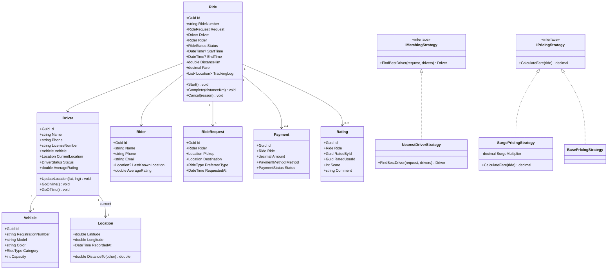

# LLD 07 – Ride-Sharing Service

---

## 1. Interview Approach (Step-by-Step)

**Step 1 – Clarify Requirements (2 min)**

- Real-time GPS location updates?
- Multiple ride types? (Economy, Premium, Pool)
- Driver rating system?
- Surge pricing support?
- In-app payment only or cash too?
- Cancellation policy with penalties?

**Step 2 – Define Core Entities**
Driver, Rider, Ride, Location, RideRequest, Vehicle, Payment, Rating

**Step 3 – Matching Algorithm (Key Discussion)**
"To match rider to driver: find all Available drivers within radius R → score by distance + rating + ride-type match → assign closest highest-rated driver."
Use a spatial index (GeoHash or R-Tree) in production. For LLD: haversine formula or simple Euclidean approximation.

**Step 4 – Real-Time State Management**
Driver state machine: Offline → Available → OnTrip → Offline
Ride state machine: Requested → DriverAssigned → DriverArrived → InProgress → Completed → Cancelled

**Step 5 – Patterns**
State for Ride/Driver lifecycle, Strategy for pricing (base + surge + per-km), Observer for real-time tracking, Command for ride actions, Strategy for matching algorithm.

---

## 2. Requirements & Assumptions

**Functional:**

- Rider requests a ride with pickup and destination
- System matches nearest available driver
- Track ride in real-time (location updates)
- Calculate fare based on distance + duration + surge
- In-app payment after ride completion
- Both parties can rate each other

**Non-Functional:**

- Match within seconds
- Handle concurrent requests from many riders
- Location updates every 5 seconds

---

## 3. Core Entities

| Entity        | Responsibility                                  |
| ------------- | ----------------------------------------------- |
| `Driver`      | Registered driver with vehicle and availability |
| `Rider`       | Registered rider making requests                |
| `Vehicle`     | Driver's registered vehicle details             |
| `Location`    | GPS coordinates (lat, lng) with timestamp       |
| `RideRequest` | Rider's pickup/drop request                     |
| `Ride`        | Active/completed trip record                    |
| `Payment`     | Fare payment for a ride                         |
| `Rating`      | Post-ride mutual rating                         |

**Enums:**

```
DriverStatus  : Offline, Available, OnTrip
RideStatus    : Requested, DriverAssigned, DriverArrived, InProgress, Completed, Cancelled
RideType      : Economy, Premium, Pool
PaymentMethod : InApp, Cash
PaymentStatus : Pending, Completed, Failed
```

---

## 4. Class Relationship Diagram



---

## 5. DB Schema

```sql
-- Vehicles
CREATE TABLE Vehicles (
    Id                 UNIQUEIDENTIFIER PRIMARY KEY DEFAULT NEWID(),
    RegistrationNumber VARCHAR(20)   NOT NULL UNIQUE,
    Model              NVARCHAR(100) NOT NULL,
    Color              NVARCHAR(50)  NULL,
    Category           VARCHAR(20)   NOT NULL,  -- Economy | Premium | Pool
    Capacity           INT           NOT NULL DEFAULT 4
);

-- Drivers
CREATE TABLE Drivers (
    Id              UNIQUEIDENTIFIER PRIMARY KEY DEFAULT NEWID(),
    FullName        NVARCHAR(200) NOT NULL,
    Phone           VARCHAR(20)   NOT NULL UNIQUE,
    Email           NVARCHAR(256) NULL,
    LicenseNumber   VARCHAR(30)   NOT NULL UNIQUE,
    VehicleId       UNIQUEIDENTIFIER NOT NULL REFERENCES Vehicles(Id),
    Status          VARCHAR(20)   NOT NULL DEFAULT 'Offline',
    AverageRating   FLOAT         NOT NULL DEFAULT 5.0,
    CurrentLat      FLOAT         NULL,
    CurrentLng      FLOAT         NULL,
    LocationUpdatedAt DATETIME    NULL,
    INDEX IX_Drivers_Status_Location (Status, CurrentLat, CurrentLng)
);

-- Riders
CREATE TABLE Riders (
    Id            UNIQUEIDENTIFIER PRIMARY KEY DEFAULT NEWID(),
    FullName      NVARCHAR(200) NOT NULL,
    Phone         VARCHAR(20)   NOT NULL UNIQUE,
    Email         NVARCHAR(256) NOT NULL UNIQUE,
    AverageRating FLOAT         NOT NULL DEFAULT 5.0
);

-- Rides
CREATE TABLE Rides (
    Id          UNIQUEIDENTIFIER PRIMARY KEY DEFAULT NEWID(),
    RideNumber  VARCHAR(30)      NOT NULL UNIQUE,
    RiderId     UNIQUEIDENTIFIER NOT NULL REFERENCES Riders(Id),
    DriverId    UNIQUEIDENTIFIER NULL REFERENCES Drivers(Id),
    PickupLat   FLOAT            NOT NULL,
    PickupLng   FLOAT            NOT NULL,
    DestLat     FLOAT            NOT NULL,
    DestLng     FLOAT            NOT NULL,
    RideType    VARCHAR(20)      NOT NULL,
    Status      VARCHAR(30)      NOT NULL DEFAULT 'Requested',
    StartTime   DATETIME         NULL,
    EndTime     DATETIME         NULL,
    DistanceKm  FLOAT            NULL,
    Fare        DECIMAL(8,2)     NULL,
    CancelReason NVARCHAR(300)   NULL,
    RequestedAt DATETIME         NOT NULL DEFAULT GETUTCDATE(),
    INDEX IX_Rides_Status (Status),
    INDEX IX_Rides_Driver (DriverId, Status)
);

-- Ride Tracking (GPS trail)
CREATE TABLE RideTrackingLogs (
    Id        UNIQUEIDENTIFIER PRIMARY KEY DEFAULT NEWID(),
    RideId    UNIQUEIDENTIFIER NOT NULL REFERENCES Rides(Id),
    Latitude  FLOAT            NOT NULL,
    Longitude FLOAT            NOT NULL,
    LoggedAt  DATETIME         NOT NULL DEFAULT GETUTCDATE()
);

-- Payments
CREATE TABLE Payments (
    Id        UNIQUEIDENTIFIER PRIMARY KEY DEFAULT NEWID(),
    RideId    UNIQUEIDENTIFIER NOT NULL REFERENCES Rides(Id),
    Amount    DECIMAL(8,2)     NOT NULL,
    Method    VARCHAR(20)      NOT NULL,
    Status    VARCHAR(20)      NOT NULL,
    PaidAt    DATETIME         NULL
);

-- Ratings
CREATE TABLE Ratings (
    Id          UNIQUEIDENTIFIER PRIMARY KEY DEFAULT NEWID(),
    RideId      UNIQUEIDENTIFIER NOT NULL REFERENCES Rides(Id),
    RatedById   UNIQUEIDENTIFIER NOT NULL,
    RatedUserId UNIQUEIDENTIFIER NOT NULL,
    Score       TINYINT          NOT NULL CHECK (Score BETWEEN 1 AND 5),
    Comment     NVARCHAR(500)    NULL,
    CreatedAt   DATETIME         NOT NULL DEFAULT GETUTCDATE(),
    UNIQUE (RideId, RatedById)
);
```

---

## 6. Design Patterns

| Pattern      | Where                                     | Why                                                                   |
| ------------ | ----------------------------------------- | --------------------------------------------------------------------- |
| **State**    | `Ride.Status`, `Driver.Status`            | Strict lifecycle transitions, prevent invalid ops                     |
| **Strategy** | `IMatchingStrategy`                       | Swap nearest-driver, highest-rated, surge-zone matching               |
| **Strategy** | `IPricingStrategy`                        | Base fare + surge multiplier + pool discount as composable strategies |
| **Observer** | Ride events → Rider/Driver notifications  | Decouple "driver assigned" event from SMS/push notifications          |
| **Command**  | `RequestRideCommand`, `CancelRideCommand` | Encapsulate actions for logging, retry, and undo                      |
| **Proxy**    | `DriverLocationProxy`                     | Cache latest driver location in Redis, fallback to DB                 |

---

## 7. SOLID Principles

| Principle | Application                                                                                              |
| --------- | -------------------------------------------------------------------------------------------------------- |
| **S**     | `Driver` manages availability/location; `Ride` manages trip lifecycle; `Payment` manages fare collection |
| **O**     | Add new ride type (e.g., Bike taxi) by extending `Vehicle.Category`; no change to matching logic         |
| **L**     | Any `IMatchingStrategy` substitutes in `RideService`                                                     |
| **I**     | `IMatchingStrategy`, `IPricingStrategy`, `IRideNotifier` are separate focused interfaces                 |
| **D**     | `RideService` depends on `IMatchingStrategy` and `IPricingStrategy` abstractions                         |

---

## 8. C# Implementation

```csharp
// ─── Enums ───────────────────────────────────────────────────────────────────
public enum DriverStatus  { Offline, Available, OnTrip }
public enum RideStatus    { Requested, DriverAssigned, DriverArrived, InProgress, Completed, Cancelled }
public enum RideType      { Economy, Premium, Pool }
public enum PaymentStatus { Pending, Completed, Failed }

// ─── Location ─────────────────────────────────────────────────────────────────
public class Location
{
    public double   Latitude    { get; init; }
    public double   Longitude   { get; init; }
    public DateTime RecordedAt  { get; init; } = DateTime.UtcNow;

    // Haversine distance in km
    public double DistanceTo(Location other)
    {
        const double R = 6371;
        var lat1 = Latitude   * Math.PI / 180;
        var lat2 = other.Latitude * Math.PI / 180;
        var dLat = (other.Latitude  - Latitude)  * Math.PI / 180;
        var dLon = (other.Longitude - Longitude) * Math.PI / 180;
        var a = Math.Sin(dLat/2)*Math.Sin(dLat/2) +
                Math.Cos(lat1)*Math.Cos(lat2)*Math.Sin(dLon/2)*Math.Sin(dLon/2);
        return R * 2 * Math.Atan2(Math.Sqrt(a), Math.Sqrt(1-a));
    }
}

// ─── Driver ───────────────────────────────────────────────────────────────────
public class Driver
{
    public Guid         Id              { get; init; } = Guid.NewGuid();
    public string       FullName        { get; init; } = default!;
    public string       Phone           { get; init; } = default!;
    public string       LicenseNumber   { get; init; } = default!;
    public Vehicle      Vehicle         { get; init; } = default!;
    public Location?    CurrentLocation { get; private set; }
    public DriverStatus Status          { get; private set; } = DriverStatus.Offline;
    public double       AverageRating   { get; private set; } = 5.0;
    private int         _totalRatings;

    public void UpdateLocation(double lat, double lng)
        => CurrentLocation = new Location { Latitude = lat, Longitude = lng };

    public void GoOnline()  { if (Status == DriverStatus.Offline)   Status = DriverStatus.Available; }
    public void GoOffline() { if (Status == DriverStatus.Available)  Status = DriverStatus.Offline;   }
    public void BeginTrip() { if (Status == DriverStatus.Available)  Status = DriverStatus.OnTrip;    }
    public void EndTrip()   { if (Status == DriverStatus.OnTrip)     Status = DriverStatus.Available; }

    public void AddRating(int score)
    {
        _totalRatings++;
        AverageRating = ((AverageRating * (_totalRatings - 1)) + score) / _totalRatings;
    }
}

public class Vehicle
{
    public Guid     Id                 { get; init; } = Guid.NewGuid();
    public string   RegistrationNumber { get; init; } = default!;
    public string   Model              { get; init; } = default!;
    public string   Color              { get; init; } = default!;
    public RideType Category           { get; init; }
    public int      Capacity           { get; init; } = 4;
}

// ─── Rider ────────────────────────────────────────────────────────────────────
public class Rider
{
    public Guid   Id            { get; init; } = Guid.NewGuid();
    public string FullName      { get; init; } = default!;
    public string Phone         { get; init; } = default!;
    public string Email         { get; init; } = default!;
    public double AverageRating { get; private set; } = 5.0;
    private int   _totalRatings;

    public void AddRating(int score)
    {
        _totalRatings++;
        AverageRating = ((AverageRating * (_totalRatings - 1)) + score) / _totalRatings;
    }
}

// ─── Matching Strategy ───────────────────────────────────────────────────────
public interface IMatchingStrategy
{
    Driver? FindBestDriver(Location pickup, RideType rideType, IEnumerable<Driver> availableDrivers);
}

public class NearestDriverStrategy : IMatchingStrategy
{
    private const double MaxRadiusKm = 5.0;

    public Driver? FindBestDriver(Location pickup, RideType rideType, IEnumerable<Driver> availableDrivers)
    {
        return availableDrivers
            .Where(d => d.Status == DriverStatus.Available &&
                        d.Vehicle.Category == rideType &&
                        d.CurrentLocation != null &&
                        d.CurrentLocation.DistanceTo(pickup) <= MaxRadiusKm)
            .OrderBy(d => d.CurrentLocation!.DistanceTo(pickup))
            .ThenByDescending(d => d.AverageRating)
            .FirstOrDefault();
    }
}

// ─── Pricing Strategy ────────────────────────────────────────────────────────
public interface IPricingStrategy
{
    decimal CalculateFare(double distanceKm, TimeSpan duration, RideType type);
}

public class BasePricingStrategy : IPricingStrategy
{
    private static readonly Dictionary<RideType, (decimal basefare, decimal perKm, decimal perMin)> _rates = new()
    {
        { RideType.Economy, (30m, 10m, 1.5m) },
        { RideType.Premium, (60m, 20m, 2.5m) },
        { RideType.Pool,    (15m, 7m,  1.0m) }
    };

    public decimal CalculateFare(double distanceKm, TimeSpan duration, RideType type)
    {
        var (basefare, perKm, perMin) = _rates[type];
        return basefare + ((decimal)distanceKm * perKm) + ((decimal)duration.TotalMinutes * perMin);
    }
}

public class SurgePricingStrategy : IPricingStrategy
{
    private readonly IPricingStrategy _base;
    private readonly decimal          _surgeMultiplier;

    public SurgePricingStrategy(IPricingStrategy basePricing, decimal surgeMultiplier = 1.5m)
    {
        _base            = basePricing;
        _surgeMultiplier = surgeMultiplier;
    }

    public decimal CalculateFare(double distanceKm, TimeSpan duration, RideType type)
        => _base.CalculateFare(distanceKm, duration, type) * _surgeMultiplier;
}

// ─── Ride ─────────────────────────────────────────────────────────────────────
public class Ride
{
    private readonly List<Location> _trackingLog = new();

    public Guid       Id          { get; } = Guid.NewGuid();
    public string     RideNumber  { get; init; } = default!;
    public Rider      Rider       { get; init; } = default!;
    public Driver?    Driver      { get; private set; }
    public Location   Pickup      { get; init; } = default!;
    public Location   Destination { get; init; } = default!;
    public RideType   RideType    { get; init; }
    public RideStatus Status      { get; private set; } = RideStatus.Requested;
    public DateTime?  StartTime   { get; private set; }
    public DateTime?  EndTime     { get; private set; }
    public double     DistanceKm  { get; private set; }
    public decimal    Fare        { get; private set; }
    public string?    CancelReason{ get; private set; }
    public IReadOnlyList<Location> TrackingLog => _trackingLog.AsReadOnly();

    public void AssignDriver(Driver driver)
    {
        if (Status != RideStatus.Requested) throw new InvalidOperationException("Ride already processed.");
        Driver = driver;
        Status = RideStatus.DriverAssigned;
        driver.BeginTrip();
    }

    public void MarkDriverArrived() { if (Status == RideStatus.DriverAssigned) Status = RideStatus.DriverArrived; }

    public void Start()
    {
        if (Status != RideStatus.DriverArrived) throw new InvalidOperationException("Driver has not arrived.");
        Status    = RideStatus.InProgress;
        StartTime = DateTime.UtcNow;
    }

    public void Complete(double distanceKm, decimal fare)
    {
        if (Status != RideStatus.InProgress) throw new InvalidOperationException("Ride is not in progress.");
        Status     = RideStatus.Completed;
        EndTime    = DateTime.UtcNow;
        DistanceKm = distanceKm;
        Fare       = fare;
        Driver?.EndTrip();
    }

    public void Cancel(string reason)
    {
        if (Status is RideStatus.Completed or RideStatus.Cancelled)
            throw new InvalidOperationException("Cannot cancel completed or already cancelled ride.");
        CancelReason = reason;
        Status       = RideStatus.Cancelled;
        Driver?.EndTrip();
    }

    public void AddTrackingPoint(Location loc) => _trackingLog.Add(loc);
}

// ─── Ride Service ─────────────────────────────────────────────────────────────
public interface IRideNotifier
{
    void OnDriverAssigned(Ride ride);
    void OnRideCompleted(Ride ride);
    void OnRideCancelled(Ride ride);
}

public class RideService
{
    private readonly IMatchingStrategy _matchingStrategy;
    private readonly IPricingStrategy  _pricingStrategy;
    private readonly IRideNotifier     _notifier;
    private readonly List<Driver>      _drivers;

    public RideService(IMatchingStrategy matching, IPricingStrategy pricing, IRideNotifier notifier, IEnumerable<Driver> drivers)
    {
        _matchingStrategy = matching;
        _pricingStrategy  = pricing;
        _notifier         = notifier;
        _drivers          = drivers.ToList();
    }

    public Ride RequestRide(Rider rider, Location pickup, Location destination, RideType type)
    {
        var ride = new Ride
        {
            RideNumber  = $"RD-{DateTime.UtcNow.Ticks}",
            Rider       = rider,
            Pickup      = pickup,
            Destination = destination,
            RideType    = type
        };

        var driver = _matchingStrategy.FindBestDriver(pickup, type, _drivers);
        if (driver is null) throw new InvalidOperationException("No drivers available nearby.");

        ride.AssignDriver(driver);
        _notifier.OnDriverAssigned(ride);
        return ride;
    }

    public Payment CompleteRide(Ride ride)
    {
        var duration   = DateTime.UtcNow - (ride.StartTime ?? DateTime.UtcNow);
        var distanceKm = ride.Pickup.DistanceTo(ride.Destination);
        var fare       = _pricingStrategy.CalculateFare(distanceKm, duration, ride.RideType);

        ride.Complete(distanceKm, fare);
        _notifier.OnRideCompleted(ride);

        return new Payment
        {
            RideId = ride.Id,
            Amount = fare,
            Status = PaymentStatus.Pending
        };
    }
}

public class Payment
{
    public Guid          Id     { get; init; } = Guid.NewGuid();
    public Guid          RideId { get; init; }
    public decimal       Amount { get; init; }
    public string        Method { get; init; } = "InApp";
    public PaymentStatus Status { get; init; }
}
```

---

## Key Discussion Points for Interview

1. **Matching at Scale**: In production, driver locations are stored in Redis with GeoSearch (`GEORADIUS` command). For LLD, the `DistanceTo()` Haversine formula demonstrates the algorithm clearly.

2. **Surge Pricing**: Triggered when demand > available drivers in an area. Implement as a `SurgePricingStrategy` decorator wrapping base pricing. The multiplier is determined by demand/supply ratio in real-time.

3. **Concurrent Requests**: Two riders can't be matched to the same driver simultaneously. Use Redis atomic operations: `SET driver:{id}:status OnTrip NX` (NX = only if not exists). First one wins; second gets a different driver.

4. **Driver Location Updates**: Poll every 5 seconds from driver app. Store in Redis (fast read for matching). Write to DB asynchronously for audit. Use `RideTrackingLogs` for the complete trip GPS trail.

5. **Rating Impact**: After ride completion, both parties rate each other. Running average is updated using incremental formula: `newAvg = (oldAvg * (n-1) + newScore) / n`. This avoids recalculating from all historical ratings.
