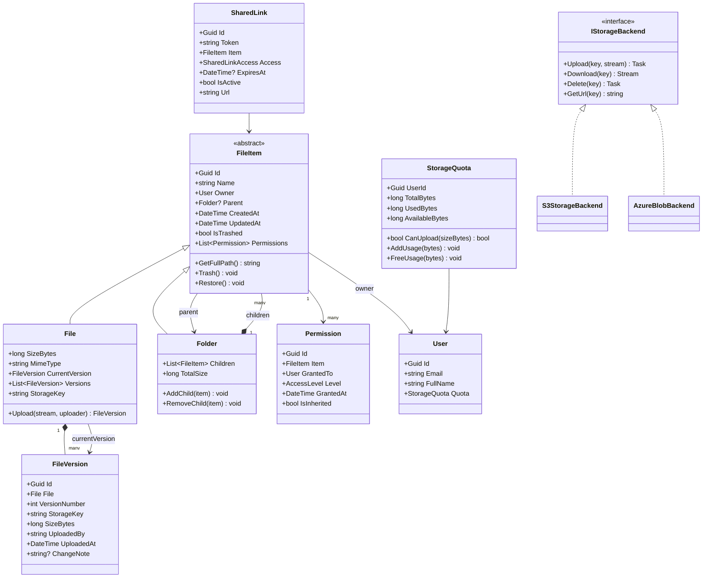

# LLD 08 – File Storage System (e.g., Google Drive)

---

## 1. Interview Approach (Step-by-Step)

**Step 1 – Clarify Requirements (2 min)**

- Individual storage quotas per user?
- File versioning (keep last N versions)?
- Sharing: read-only, edit, or comment permissions?
- Folders/directory hierarchy?
- Soft delete with trash and permanent deletion?
- Real-time collaboration on files?

**Step 2 – Define Core Entities**
User, File, Folder, FileVersion, Permission, SharedLink, StorageQuota

**Step 3 – Key Design Decisions**

- File metadata in RDBMS (fast queries, permissions, hierarchy)
- File content in Object Storage (S3/Azure Blob) — never store binary in DB
- Versioning: new `FileVersion` row per upload, `File.CurrentVersionId` pointer
- Sharing: `Permission` table with `UserId + FileId + AccessLevel`

**Step 4 – Security Model**
"Every file access checks permission chain: own file → direct share → inherited from parent folder. Principle of least privilege."

**Step 5 – Patterns**
Composite for folder hierarchy, Decorator for permissions/encryption, Strategy for storage backends, Observer for quota updates.

---

## 2. Requirements & Assumptions

**Functional:**

- Upload, download, rename, move, delete files
- Folder hierarchy (files inside folders)
- File versioning (keep last 10 versions)
- Share files/folders with specific users (view/edit)
- Generate shareable links
- Storage quota per user (default 15 GB)

**Non-Functional:**

- Files stored in object storage, not DB
- Metadata queries must be fast
- Permissions checked on every operation

---

## 3. Core Entities

| Entity         | Responsibility                                          |
| -------------- | ------------------------------------------------------- |
| `User`         | Account with storage quota                              |
| `FileItem`     | Metadata for a file (abstract base for File and Folder) |
| `File`         | Actual file metadata with current version pointer       |
| `Folder`       | Container that holds files and subfolders (Composite)   |
| `FileVersion`  | One version of a file's content                         |
| `Permission`   | Access grant (user + item + level)                      |
| `SharedLink`   | Public/restricted shareable URL                         |
| `StorageQuota` | Track used/total storage per user                       |

**Enums:**

```
AccessLevel      : View, Comment, Edit, Owner
FileItemType     : File, Folder
SharedLinkAccess : Anyone, OnlyWithLink, Restricted
```

---

## 4. Class Relationship Diagram



---

## 5. DB Schema

```sql
-- Users
CREATE TABLE Users (
    Id       UNIQUEIDENTIFIER PRIMARY KEY DEFAULT NEWID(),
    Email    NVARCHAR(256) NOT NULL UNIQUE,
    FullName NVARCHAR(200) NOT NULL
);

-- Storage Quotas
CREATE TABLE StorageQuotas (
    UserId       UNIQUEIDENTIFIER PRIMARY KEY REFERENCES Users(Id),
    TotalBytes   BIGINT NOT NULL DEFAULT 16106127360,  -- 15 GB
    UsedBytes    BIGINT NOT NULL DEFAULT 0
);

-- File Items (Files + Folders — single-table inheritance)
CREATE TABLE FileItems (
    Id          UNIQUEIDENTIFIER PRIMARY KEY DEFAULT NEWID(),
    ParentId    UNIQUEIDENTIFIER NULL REFERENCES FileItems(Id),
    OwnerId     UNIQUEIDENTIFIER NOT NULL REFERENCES Users(Id),
    Name        NVARCHAR(500)    NOT NULL,
    ItemType    VARCHAR(10)      NOT NULL,  -- File | Folder
    MimeType    NVARCHAR(200)    NULL,      -- NULL for folders
    SizeBytes   BIGINT           NULL,      -- NULL for folders
    StorageKey  NVARCHAR(1000)   NULL,      -- S3/Blob key, NULL for folders
    CurrentVersionId UNIQUEIDENTIFIER NULL, -- FK set after first version insert
    IsTrashed   BIT              NOT NULL DEFAULT 0,
    CreatedAt   DATETIME         NOT NULL DEFAULT GETUTCDATE(),
    UpdatedAt   DATETIME         NOT NULL DEFAULT GETUTCDATE(),
    INDEX IX_FileItems_Parent  (ParentId, IsTrashed),
    INDEX IX_FileItems_Owner   (OwnerId, IsTrashed),
    INDEX IX_FileItems_Name    (Name)
);

-- File Versions
CREATE TABLE FileVersions (
    Id            UNIQUEIDENTIFIER PRIMARY KEY DEFAULT NEWID(),
    FileId        UNIQUEIDENTIFIER NOT NULL REFERENCES FileItems(Id),
    VersionNumber INT              NOT NULL,
    StorageKey    NVARCHAR(1000)   NOT NULL,
    SizeBytes     BIGINT           NOT NULL,
    UploadedBy    UNIQUEIDENTIFIER NOT NULL REFERENCES Users(Id),
    UploadedAt    DATETIME         NOT NULL DEFAULT GETUTCDATE(),
    ChangeNote    NVARCHAR(500)    NULL,
    UNIQUE (FileId, VersionNumber)
);

-- Permissions
CREATE TABLE Permissions (
    Id          UNIQUEIDENTIFIER PRIMARY KEY DEFAULT NEWID(),
    ItemId      UNIQUEIDENTIFIER NOT NULL REFERENCES FileItems(Id),
    GrantedToId UNIQUEIDENTIFIER NOT NULL REFERENCES Users(Id),
    AccessLevel VARCHAR(10)      NOT NULL,  -- View | Comment | Edit | Owner
    GrantedAt   DATETIME         NOT NULL DEFAULT GETUTCDATE(),
    IsInherited BIT              NOT NULL DEFAULT 0,
    UNIQUE (ItemId, GrantedToId)
);

-- Shared Links
CREATE TABLE SharedLinks (
    Id        UNIQUEIDENTIFIER PRIMARY KEY DEFAULT NEWID(),
    Token     VARCHAR(64)      NOT NULL UNIQUE,
    ItemId    UNIQUEIDENTIFIER NOT NULL REFERENCES FileItems(Id),
    Access    VARCHAR(20)      NOT NULL DEFAULT 'OnlyWithLink',
    ExpiresAt DATETIME         NULL,
    IsActive  BIT              NOT NULL DEFAULT 1,
    CreatedAt DATETIME         NOT NULL DEFAULT GETUTCDATE()
);
```

---

## 6. Design Patterns

| Pattern                     | Where                                             | Why                                                           |
| --------------------------- | ------------------------------------------------- | ------------------------------------------------------------- |
| **Composite**               | `FileItem → File / Folder`                        | Treat files and folders uniformly; traverse tree recursively  |
| **Strategy**                | `IStorageBackend`                                 | Swap S3, Azure Blob, local disk without changing upload logic |
| **Decorator**               | `EncryptedStorageBackend` wraps `IStorageBackend` | Add encryption transparently; storage backend unaware         |
| **Observer**                | Upload events → quota update                      | Decouple quota tracking from upload logic                     |
| **Chain of Responsibility** | Permission checks                                 | Walk up folder hierarchy until permission found               |
| **Proxy**                   | `CachedStorageBackend`                            | Cache frequently downloaded files in memory/CDN               |

---

## 7. SOLID Principles

| Principle | Application                                                                                  |
| --------- | -------------------------------------------------------------------------------------------- |
| **S**     | `File` manages metadata; `FileVersion` manages version content; `StorageQuota` manages usage |
| **O**     | Add Azure Blob support by implementing `IStorageBackend`; no change to `FileService`         |
| **L**     | `Folder` and `File` both extend `FileItem` and are fully substitutable                       |
| **I**     | `IStorageBackend` for storage, `IPermissionChecker` for auth — separate interfaces           |
| **D**     | `FileService` depends on `IStorageBackend` and `IPermissionChecker` abstractions             |

---

## 8. C# Implementation

```csharp
// ─── Enums ───────────────────────────────────────────────────────────────────
public enum AccessLevel      { View, Comment, Edit, Owner }
public enum SharedLinkAccess { Anyone, OnlyWithLink, Restricted }

// ─── Storage Backend (Strategy + Decorator) ───────────────────────────────────
public interface IStorageBackend
{
    Task UploadAsync(string key, Stream content);
    Task<Stream> DownloadAsync(string key);
    Task DeleteAsync(string key);
    string GetUrl(string key, TimeSpan? expiry = null);
}

public class S3StorageBackend : IStorageBackend
{
    private readonly string _bucket;
    public S3StorageBackend(string bucket) => _bucket = bucket;

    public Task UploadAsync(string key, Stream content)
    {
        Console.WriteLine($"[S3] Uploading to s3://{_bucket}/{key}");
        return Task.CompletedTask;
    }

    public Task<Stream> DownloadAsync(string key)
    {
        Console.WriteLine($"[S3] Downloading from s3://{_bucket}/{key}");
        return Task.FromResult<Stream>(new MemoryStream());
    }

    public Task DeleteAsync(string key) { Console.WriteLine($"[S3] Deleting {key}"); return Task.CompletedTask; }
    public string GetUrl(string key, TimeSpan? expiry = null) => $"https://s3.amazonaws.com/{_bucket}/{key}";
}

// Decorator: adds AES-256 encryption
public class EncryptedStorageBackend : IStorageBackend
{
    private readonly IStorageBackend _inner;
    public EncryptedStorageBackend(IStorageBackend inner) => _inner = inner;

    public async Task UploadAsync(string key, Stream content)
    {
        var encrypted = Encrypt(content);        // AES-256 encrypt before upload
        await _inner.UploadAsync(key, encrypted);
    }

    public async Task<Stream> DownloadAsync(string key)
    {
        var encrypted = await _inner.DownloadAsync(key);
        return Decrypt(encrypted);
    }

    public Task DeleteAsync(string key) => _inner.DeleteAsync(key);
    public string GetUrl(string key, TimeSpan? expiry = null) => _inner.GetUrl(key, expiry);

    private Stream Encrypt(Stream input) => input; // Placeholder — real impl uses AES
    private Stream Decrypt(Stream input) => input;
}

// ─── Storage Quota ────────────────────────────────────────────────────────────
public class StorageQuota
{
    private readonly object _lock = new();
    public Guid UserId        { get; init; }
    public long TotalBytes    { get; init; } = 15L * 1024 * 1024 * 1024; // 15 GB
    public long UsedBytes     { get; private set; }
    public long AvailableBytes => TotalBytes - UsedBytes;

    public bool CanUpload(long sizeBytes) { lock (_lock) return AvailableBytes >= sizeBytes; }
    public void AddUsage(long bytes)  { lock (_lock) UsedBytes += bytes; }
    public void FreeUsage(long bytes) { lock (_lock) UsedBytes = Math.Max(0, UsedBytes - bytes); }
}

// ─── Domain Models ───────────────────────────────────────────────────────────
public abstract class FileItem
{
    public Guid      Id        { get; } = Guid.NewGuid();
    public string    Name      { get; set; } = default!;
    public Guid      OwnerId   { get; init; }
    public Folder?   Parent    { get; set; }
    public bool      IsTrashed { get; private set; }
    public DateTime  CreatedAt { get; } = DateTime.UtcNow;
    public DateTime  UpdatedAt { get; protected set; } = DateTime.UtcNow;

    public string GetFullPath()
    {
        var parts = new Stack<string>();
        FileItem? current = this;
        while (current is not null)
        {
            parts.Push(current.Name);
            current = current.Parent;
        }
        return "/" + string.Join("/", parts);
    }

    public void Trash()   => IsTrashed = true;
    public void Restore() => IsTrashed = false;
}

public class FileVersion
{
    public Guid     Id            { get; } = Guid.NewGuid();
    public Guid     FileId        { get; init; }
    public int      VersionNumber { get; init; }
    public string   StorageKey    { get; init; } = default!;
    public long     SizeBytes     { get; init; }
    public Guid     UploadedBy    { get; init; }
    public DateTime UploadedAt    { get; } = DateTime.UtcNow;
    public string?  ChangeNote    { get; init; }
}

public class File : FileItem
{
    private readonly List<FileVersion> _versions = new();
    private const int MaxVersions = 10;

    public string       MimeType       { get; init; } = default!;
    public long         SizeBytes      { get; private set; }
    public FileVersion? CurrentVersion { get; private set; }
    public IReadOnlyList<FileVersion> Versions => _versions.AsReadOnly();

    public FileVersion AddVersion(string storageKey, long sizeBytes, Guid uploadedBy, string? note = null)
    {
        var version = new FileVersion
        {
            FileId        = Id,
            VersionNumber = _versions.Count + 1,
            StorageKey    = storageKey,
            SizeBytes     = sizeBytes,
            UploadedBy    = uploadedBy,
            ChangeNote    = note
        };

        _versions.Add(version);
        if (_versions.Count > MaxVersions) _versions.RemoveAt(0); // Prune oldest

        CurrentVersion = version;
        SizeBytes      = sizeBytes;
        UpdatedAt      = DateTime.UtcNow;
        return version;
    }
}

public class Folder : FileItem
{
    private readonly List<FileItem> _children = new();
    public IReadOnlyList<FileItem> Children => _children.AsReadOnly();

    public long TotalSize => _children.Sum(c => c is File f ? f.SizeBytes : (c is Folder sub ? sub.TotalSize : 0));

    public void AddChild(FileItem item)
    {
        item.Parent = this;
        _children.Add(item);
    }

    public void RemoveChild(FileItem item)
    {
        _children.Remove(item);
        item.Parent = null;
    }
}

// ─── Permission Checker (Chain of Responsibility) ────────────────────────────
public class Permission
{
    public Guid        Id          { get; } = Guid.NewGuid();
    public Guid        ItemId      { get; init; }
    public Guid        GrantedToId { get; init; }
    public AccessLevel Level       { get; init; }
    public bool        IsInherited { get; init; }
}

public interface IPermissionChecker
{
    bool HasAccess(Guid userId, FileItem item, AccessLevel required);
}

public class PermissionChecker : IPermissionChecker
{
    private readonly Dictionary<Guid, List<Permission>> _permissions;

    public PermissionChecker(IEnumerable<Permission> permissions)
        => _permissions = permissions.GroupBy(p => p.ItemId).ToDictionary(g => g.Key, g => g.ToList());

    public bool HasAccess(Guid userId, FileItem item, AccessLevel required)
    {
        // Owner always has access
        if (item.OwnerId == userId) return true;

        // Walk up the hierarchy: check item then parent folders
        FileItem? current = item;
        while (current is not null)
        {
            if (_permissions.TryGetValue(current.Id, out var perms))
            {
                var perm = perms.FirstOrDefault(p => p.GrantedToId == userId);
                if (perm is not null && perm.Level >= required) return true;
            }
            current = current.Parent;
        }
        return false;
    }
}

// ─── File Service ─────────────────────────────────────────────────────────────
public class FileService
{
    private readonly IStorageBackend   _storage;
    private readonly IPermissionChecker _permissions;
    private readonly Dictionary<Guid, StorageQuota> _quotas;

    public FileService(IStorageBackend storage, IPermissionChecker permissions, IEnumerable<StorageQuota> quotas)
    {
        _storage     = storage;
        _permissions = permissions;
        _quotas      = quotas.ToDictionary(q => q.UserId);
    }

    public async Task<FileVersion> UploadAsync(File file, Stream content, long sizeBytes, Guid uploaderId)
    {
        if (!_permissions.HasAccess(uploaderId, file, AccessLevel.Edit))
            throw new UnauthorizedAccessException("No edit permission on this file.");

        var quota = _quotas[uploaderId];
        if (!quota.CanUpload(sizeBytes))
            throw new InvalidOperationException("Storage quota exceeded.");

        var storageKey = $"{uploaderId}/{file.Id}/{Guid.NewGuid():N}";
        await _storage.UploadAsync(storageKey, content);

        var version = file.AddVersion(storageKey, sizeBytes, uploaderId);
        quota.AddUsage(sizeBytes);
        return version;
    }

    public async Task<Stream> DownloadAsync(File file, Guid userId)
    {
        if (!_permissions.HasAccess(userId, file, AccessLevel.View))
            throw new UnauthorizedAccessException("No view permission on this file.");

        if (file.CurrentVersion is null) throw new InvalidOperationException("File has no versions.");
        return await _storage.DownloadAsync(file.CurrentVersion.StorageKey);
    }

    public async Task DeleteAsync(FileItem item, Guid userId)
    {
        if (!_permissions.HasAccess(userId, item, AccessLevel.Edit))
            throw new UnauthorizedAccessException("No delete permission.");

        item.Trash();

        // If permanently deleting a file, also remove from storage
        if (item is File f && f.CurrentVersion is not null)
        {
            await _storage.DeleteAsync(f.CurrentVersion.StorageKey);
            _quotas[item.OwnerId].FreeUsage(f.SizeBytes);
        }
    }

    public SharedLink CreateShareableLink(FileItem item, Guid ownerId, SharedLinkAccess access, TimeSpan? expiry = null)
    {
        if (!_permissions.HasAccess(ownerId, item, AccessLevel.Edit))
            throw new UnauthorizedAccessException("Only editors can share this item.");

        return new SharedLink
        {
            Token     = Convert.ToBase64String(Guid.NewGuid().ToByteArray()).Replace("=","").Replace("+","").Replace("/",""),
            ItemId    = item.Id,
            Access    = access,
            ExpiresAt = expiry.HasValue ? DateTime.UtcNow.Add(expiry.Value) : null
        };
    }
}

public class SharedLink
{
    public Guid             Id        { get; } = Guid.NewGuid();
    public string           Token     { get; init; } = default!;
    public Guid             ItemId    { get; init; }
    public SharedLinkAccess Access    { get; init; }
    public DateTime?        ExpiresAt { get; init; }
    public bool             IsActive  { get; private set; } = true;
    public bool IsExpired => ExpiresAt.HasValue && DateTime.UtcNow > ExpiresAt.Value;
    public void Revoke()  => IsActive = false;
}
```

---

## Key Discussion Points for Interview

1. **Binary in Object Storage**: Never store file content in a relational DB. Store only the S3/Blob `StorageKey` in the `FileVersions` table. The DB holds metadata; the blob store holds bytes.

2. **Versioning**: Keep max N (e.g., 10) versions. Deleting a version frees storage only if the binary is deleted from S3. Use soft-delete for versions so users can restore.

3. **Permission Hierarchy**: The Chain of Responsibility walks up the folder tree. Inheriting permissions from a parent folder is a common pattern — represent it with `IsInherited=true` for display purposes.

4. **Storage Quota**: Updated atomically using a lock or DB `UPDATE UsedBytes += @size WHERE UsedBytes + @size <= TotalBytes` — single statement prevents race conditions.

5. **Large File Uploads**: Use multipart upload (S3 Multipart or Azure block blobs). The `FileService` initiates the upload, returns a presigned URL, and the client uploads directly to object storage (bypassing your API servers). Final call confirms the upload and updates metadata.
