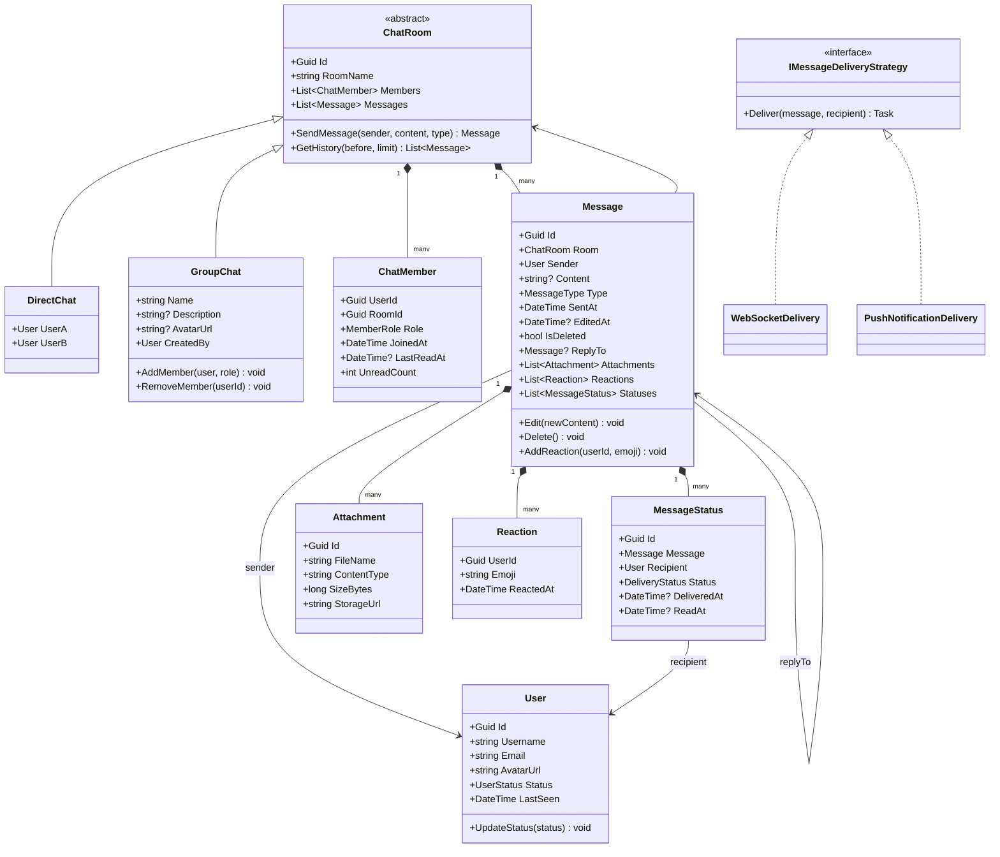

# LLD 09 – Chat Application

---

## 1. Interview Approach (Step-by-Step)

**Step 1 – Clarify Requirements (2 min)**

- 1-on-1 only, or group chats too?
- Message types: text, images, files, reactions?
- Read receipts and delivery status?
- Message history persistence?
- Online presence/typing indicators?
- End-to-end encryption?

**Step 2 – Define Core Entities**
User, ChatRoom (DirectChat/GroupChat), Message, MessageStatus, Attachment, Notification

**Step 3 – Real-Time Delivery**
"WebSocket connection per user. When User A sends a message: persist to DB → publish to pub/sub (Redis) → all subscribers on target room push to connected WebSocket clients."

**Step 4 – Message Status Flow**
Sent → Delivered (recipient's device received) → Read (recipient opened)

**Step 5 – Patterns**
Observer for real-time push, Composite for chat room hierarchy, Strategy for message delivery (push, WebSocket, SMS fallback), Command for message actions (send, delete, react).

---

## 2. Requirements & Assumptions

**Functional:**

- 1-on-1 and group chat
- Text, image, and file messages
- Message read receipts
- Online/offline presence
- Typing indicators
- Push notifications for offline users

**Non-Functional:**

- Real-time delivery via WebSocket
- Message history persisted in DB
- Handle high concurrent connections

---

## 3. Core Entities

| Entity          | Responsibility                          |
| --------------- | --------------------------------------- |
| `User`          | Registered user with online status      |
| `ChatRoom`      | Base class for DirectChat and GroupChat |
| `DirectChat`    | 1-on-1 conversation between two users   |
| `GroupChat`     | Multi-user chat room                    |
| `ChatMember`    | User's membership in a room             |
| `Message`       | Individual message in a room            |
| `MessageStatus` | Delivery/read state per recipient       |
| `Attachment`    | Media/file linked to a message          |
| `Reaction`      | Emoji reaction to a message             |

**Enums:**

```
UserStatus      : Online, Offline, Away, DoNotDisturb
MessageType     : Text, Image, File, Audio, System
DeliveryStatus  : Sent, Delivered, Read
MemberRole      : Member, Admin, Owner
```

---

## 4. Class Relationship Diagram



---

## 5. DB Schema

```sql
-- Users
CREATE TABLE Users (
    Id        UNIQUEIDENTIFIER PRIMARY KEY DEFAULT NEWID(),
    Username  NVARCHAR(100) NOT NULL UNIQUE,
    Email     NVARCHAR(256) NOT NULL UNIQUE,
    AvatarUrl NVARCHAR(500) NULL,
    Status    VARCHAR(20)   NOT NULL DEFAULT 'Offline',
    LastSeen  DATETIME      NULL,
    CreatedAt DATETIME      NOT NULL DEFAULT GETUTCDATE()
);

-- Chat Rooms
CREATE TABLE ChatRooms (
    Id          UNIQUEIDENTIFIER PRIMARY KEY DEFAULT NEWID(),
    RoomType    VARCHAR(10)      NOT NULL,  -- Direct | Group
    Name        NVARCHAR(200)    NULL,      -- Group name (NULL for Direct)
    Description NVARCHAR(500)    NULL,
    CreatedById UNIQUEIDENTIFIER NULL REFERENCES Users(Id),
    CreatedAt   DATETIME         NOT NULL DEFAULT GETUTCDATE()
);

-- Chat Members
CREATE TABLE ChatMembers (
    Id          UNIQUEIDENTIFIER PRIMARY KEY DEFAULT NEWID(),
    RoomId      UNIQUEIDENTIFIER NOT NULL REFERENCES ChatRooms(Id),
    UserId      UNIQUEIDENTIFIER NOT NULL REFERENCES Users(Id),
    Role        VARCHAR(10)      NOT NULL DEFAULT 'Member',
    JoinedAt    DATETIME         NOT NULL DEFAULT GETUTCDATE(),
    LastReadAt  DATETIME         NULL,
    UNIQUE (RoomId, UserId),
    INDEX IX_ChatMembers_User (UserId, RoomId)
);

-- Messages (optimized for time-ordered retrieval)
CREATE TABLE Messages (
    Id        UNIQUEIDENTIFIER PRIMARY KEY DEFAULT NEWID(),
    RoomId    UNIQUEIDENTIFIER NOT NULL REFERENCES ChatRooms(Id),
    SenderId  UNIQUEIDENTIFIER NOT NULL REFERENCES Users(Id),
    Content   NVARCHAR(MAX)    NULL,
    Type      VARCHAR(10)      NOT NULL DEFAULT 'Text',
    ReplyToId UNIQUEIDENTIFIER NULL REFERENCES Messages(Id),
    SentAt    DATETIME         NOT NULL DEFAULT GETUTCDATE(),
    EditedAt  DATETIME         NULL,
    IsDeleted BIT              NOT NULL DEFAULT 0,
    INDEX IX_Messages_Room_Time (RoomId, SentAt DESC)  -- Paginated history
);

-- Attachments
CREATE TABLE Attachments (
    Id          UNIQUEIDENTIFIER PRIMARY KEY DEFAULT NEWID(),
    MessageId   UNIQUEIDENTIFIER NOT NULL REFERENCES Messages(Id),
    FileName    NVARCHAR(300)    NOT NULL,
    ContentType NVARCHAR(100)    NOT NULL,
    SizeBytes   BIGINT           NOT NULL,
    StorageUrl  NVARCHAR(1000)   NOT NULL
);

-- Message Statuses (read receipts)
CREATE TABLE MessageStatuses (
    Id          UNIQUEIDENTIFIER PRIMARY KEY DEFAULT NEWID(),
    MessageId   UNIQUEIDENTIFIER NOT NULL REFERENCES Messages(Id),
    RecipientId UNIQUEIDENTIFIER NOT NULL REFERENCES Users(Id),
    Status      VARCHAR(10)      NOT NULL DEFAULT 'Sent',
    DeliveredAt DATETIME         NULL,
    ReadAt      DATETIME         NULL,
    UNIQUE (MessageId, RecipientId),
    INDEX IX_MsgStatus_Recipient (RecipientId, Status)
);

-- Reactions
CREATE TABLE Reactions (
    Id        UNIQUEIDENTIFIER PRIMARY KEY DEFAULT NEWID(),
    MessageId UNIQUEIDENTIFIER NOT NULL REFERENCES Messages(Id),
    UserId    UNIQUEIDENTIFIER NOT NULL REFERENCES Users(Id),
    Emoji     NVARCHAR(10)     NOT NULL,
    ReactedAt DATETIME         NOT NULL DEFAULT GETUTCDATE(),
    UNIQUE (MessageId, UserId, Emoji)
);
```

---

## 6. Design Patterns

| Pattern        | Where                                        | Why                                                                   |
| -------------- | -------------------------------------------- | --------------------------------------------------------------------- |
| **Observer**   | `IMessageDeliveryStrategy` → WebSocket/Push  | Decouple message persistence from delivery mechanism                  |
| **Strategy**   | `IMessageDeliveryStrategy`                   | Deliver via WebSocket for online users, Push Notification for offline |
| **Composite**  | `ChatRoom → DirectChat/GroupChat`            | Uniform interface for sending/receiving regardless of room type       |
| **Command**    | `SendMessageCommand`, `DeleteMessageCommand` | Encapsulate actions; supports undo (soft-delete), audit log           |
| **Mediator**   | `ChatServer` / SignalR Hub                   | Centralize routing of messages between users and rooms                |
| **Repository** | `IMessageRepository`, `IRoomRepository`      | Abstract data access; swap SQL for Cassandra without service changes  |

---

## 7. SOLID Principles

| Principle | Application                                                                                      |
| --------- | ------------------------------------------------------------------------------------------------ |
| **S**     | `Message` manages content; `MessageStatus` manages delivery state; `ChatRoom` manages membership |
| **O**     | Add video message type by extending `MessageType` enum and implementing attachment handling      |
| **L**     | `DirectChat` and `GroupChat` both extend `ChatRoom` and work with all room-level operations      |
| **I**     | `IMessageDeliveryStrategy` separate from `INotificationService`                                  |
| **D**     | `ChatService` depends on `IMessageRepository` and `IMessageDeliveryStrategy` abstractions        |

---

## 8. C# Implementation

```csharp
// ─── Enums ───────────────────────────────────────────────────────────────────
public enum UserStatus     { Online, Offline, Away, DoNotDisturb }
public enum MessageType    { Text, Image, File, Audio, System }
public enum DeliveryStatus { Sent, Delivered, Read }
public enum MemberRole     { Member, Admin, Owner }

// ─── User ─────────────────────────────────────────────────────────────────────
public class User
{
    public Guid       Id        { get; init; } = Guid.NewGuid();
    public string     Username  { get; init; } = default!;
    public string     Email     { get; init; } = default!;
    public UserStatus Status    { get; private set; } = UserStatus.Offline;
    public DateTime   LastSeen  { get; private set; }

    public void Connect()    { Status = UserStatus.Online;  LastSeen = DateTime.UtcNow; }
    public void Disconnect() { Status = UserStatus.Offline; LastSeen = DateTime.UtcNow; }
}

// ─── Message & Status ────────────────────────────────────────────────────────
public class Reaction
{
    public Guid     UserId    { get; init; }
    public string   Emoji     { get; init; } = default!;
    public DateTime ReactedAt { get; } = DateTime.UtcNow;
}

public class Attachment
{
    public Guid   Id          { get; } = Guid.NewGuid();
    public string FileName    { get; init; } = default!;
    public string ContentType { get; init; } = default!;
    public long   SizeBytes   { get; init; }
    public string StorageUrl  { get; init; } = default!;
}

public class MessageStatus
{
    public Guid           Id          { get; } = Guid.NewGuid();
    public Guid           MessageId   { get; init; }
    public Guid           RecipientId { get; init; }
    public DeliveryStatus Status      { get; private set; } = DeliveryStatus.Sent;
    public DateTime?      DeliveredAt { get; private set; }
    public DateTime?      ReadAt      { get; private set; }

    public void MarkDelivered() { if (Status == DeliveryStatus.Sent)      { Status = DeliveryStatus.Delivered; DeliveredAt = DateTime.UtcNow; } }
    public void MarkRead()      { if (Status != DeliveryStatus.Read)       { Status = DeliveryStatus.Read;      ReadAt      = DateTime.UtcNow; } }
}

public class Message
{
    private readonly List<Attachment>   _attachments = new();
    private readonly List<Reaction>     _reactions   = new();
    private readonly List<MessageStatus> _statuses   = new();

    public Guid      Id          { get; } = Guid.NewGuid();
    public Guid      RoomId      { get; init; }
    public User      Sender      { get; init; } = default!;
    public string?   Content     { get; private set; }
    public MessageType Type      { get; init; } = MessageType.Text;
    public Guid?     ReplyToId   { get; init; }
    public DateTime  SentAt      { get; } = DateTime.UtcNow;
    public DateTime? EditedAt    { get; private set; }
    public bool      IsDeleted   { get; private set; }

    public IReadOnlyList<Attachment>    Attachments => _attachments.AsReadOnly();
    public IReadOnlyList<Reaction>      Reactions   => _reactions.AsReadOnly();
    public IReadOnlyList<MessageStatus> Statuses    => _statuses.AsReadOnly();

    public void AddAttachment(Attachment a) => _attachments.Add(a);

    public void AddReaction(Guid userId, string emoji)
    {
        // One reaction per emoji per user
        _reactions.RemoveAll(r => r.UserId == userId && r.Emoji == emoji);
        _reactions.Add(new Reaction { UserId = userId, Emoji = emoji });
    }

    public void RemoveReaction(Guid userId, string emoji)
        => _reactions.RemoveAll(r => r.UserId == userId && r.Emoji == emoji);

    public void AddStatusFor(Guid recipientId)
        => _statuses.Add(new MessageStatus { MessageId = Id, RecipientId = recipientId });

    public void Edit(string newContent)
    {
        if (IsDeleted) throw new InvalidOperationException("Cannot edit deleted message.");
        Content  = newContent;
        EditedAt = DateTime.UtcNow;
    }

    public void Delete() => IsDeleted = true;
}

// ─── Chat Room ────────────────────────────────────────────────────────────────
public class ChatMember
{
    public Guid      UserId     { get; init; }
    public Guid      RoomId     { get; init; }
    public MemberRole Role      { get; set; }
    public DateTime  JoinedAt   { get; } = DateTime.UtcNow;
    public DateTime? LastReadAt { get; private set; }
    public void MarkRead() => LastReadAt = DateTime.UtcNow;
}

public abstract class ChatRoom
{
    private readonly List<ChatMember> _members  = new();
    private readonly List<Message>    _messages = new();

    public Guid     Id       { get; } = Guid.NewGuid();
    public string?  RoomName { get; protected set; }
    public IReadOnlyList<ChatMember> Members  => _members.AsReadOnly();
    public IReadOnlyList<Message>    Messages => _messages.AsReadOnly();

    protected void AddMemberInternal(ChatMember m) => _members.Add(m);
    protected void RemoveMemberInternal(Guid userId) => _members.RemoveAll(m => m.UserId == userId);

    public Message SendMessage(User sender, string? content, MessageType type = MessageType.Text)
    {
        if (!_members.Any(m => m.UserId == sender.Id))
            throw new UnauthorizedAccessException("User is not a member of this room.");

        var msg = new Message { RoomId = Id, Sender = sender, Content = content, Type = type };
        // Add delivery status for all recipients (except sender)
        foreach (var m in _members.Where(m => m.UserId != sender.Id))
            msg.AddStatusFor(m.UserId);

        _messages.Add(msg);
        return msg;
    }

    public IEnumerable<Message> GetHistory(DateTime before, int limit = 50)
        => _messages.Where(m => m.SentAt < before && !m.IsDeleted)
                    .OrderByDescending(m => m.SentAt)
                    .Take(limit)
                    .Reverse();
}

public class DirectChat : ChatRoom
{
    public User UserA { get; }
    public User UserB { get; }

    public DirectChat(User a, User b)
    {
        UserA = a;
        UserB = b;
        AddMemberInternal(new ChatMember { UserId = a.Id, RoomId = Id, Role = MemberRole.Member });
        AddMemberInternal(new ChatMember { UserId = b.Id, RoomId = Id, Role = MemberRole.Member });
    }
}

public class GroupChat : ChatRoom
{
    public string  Name      { get; private set; }
    public User    CreatedBy { get; }

    public GroupChat(string name, User creator)
    {
        Name      = name;
        RoomName  = name;
        CreatedBy = creator;
        AddMemberInternal(new ChatMember { UserId = creator.Id, RoomId = Id, Role = MemberRole.Owner });
    }

    public void AddMember(User user, MemberRole role = MemberRole.Member)
    {
        if (Members.Any(m => m.UserId == user.Id)) return; // Already member
        AddMemberInternal(new ChatMember { UserId = user.Id, RoomId = Id, Role = role });
    }

    public void RemoveMember(Guid userId) => RemoveMemberInternal(userId);
    public void Rename(string newName)    { Name = newName; RoomName = newName; }
}

// ─── Delivery Strategy ───────────────────────────────────────────────────────
public interface IMessageDeliveryStrategy
{
    Task DeliverAsync(Message message, Guid recipientId);
}

public class WebSocketDelivery : IMessageDeliveryStrategy
{
    private readonly Dictionary<Guid, IClientConnection> _connections;

    public WebSocketDelivery(IEnumerable<(Guid userId, IClientConnection conn)> connections)
        => _connections = connections.ToDictionary(c => c.userId, c => c.conn);

    public async Task DeliverAsync(Message message, Guid recipientId)
    {
        if (_connections.TryGetValue(recipientId, out var conn))
        {
            await conn.SendAsync(message);
            message.Statuses.FirstOrDefault(s => s.RecipientId == recipientId)?.MarkDelivered();
        }
    }
}

public interface IClientConnection { Task SendAsync(Message message); }

public class PushNotificationDelivery : IMessageDeliveryStrategy
{
    public async Task DeliverAsync(Message message, Guid recipientId)
    {
        Console.WriteLine($"[Push] Sending notification to user {recipientId}: {message.Content?.Substring(0, Math.Min(50, message.Content.Length ?? 0))}...");
        await Task.CompletedTask;
    }
}

// ─── Chat Service (Mediator) ──────────────────────────────────────────────────
public class ChatService
{
    private readonly IMessageDeliveryStrategy _webSocketDelivery;
    private readonly IMessageDeliveryStrategy _pushDelivery;
    private readonly Dictionary<Guid, User>   _users;

    public ChatService(
        IMessageDeliveryStrategy wsDelivery,
        IMessageDeliveryStrategy pushDelivery,
        IEnumerable<User> users)
    {
        _webSocketDelivery = wsDelivery;
        _pushDelivery      = pushDelivery;
        _users             = users.ToDictionary(u => u.Id);
    }

    public async Task<Message> SendAsync(ChatRoom room, User sender, string content)
    {
        var message = room.SendMessage(sender, content);
        await DeliverToAllMembersAsync(message, room);
        return message;
    }

    private async Task DeliverToAllMembersAsync(Message message, ChatRoom room)
    {
        var recipients = room.Members
            .Where(m => m.UserId != message.Sender.Id)
            .Select(m => m.UserId);

        foreach (var recipientId in recipients)
        {
            if (_users.TryGetValue(recipientId, out var user) && user.Status == UserStatus.Online)
                await _webSocketDelivery.DeliverAsync(message, recipientId);
            else
                await _pushDelivery.DeliverAsync(message, recipientId);
        }
    }
}
```

---

## Key Discussion Points for Interview

1. **Real-Time Architecture**: WebSocket per user. On message send: persist → publish to Redis pub/sub channel `room:{roomId}` → all servers subscribed to that channel push to connected WebSocket clients. Handles multi-server scenarios.

2. **Message Ordering**: Use `SentAt` timestamp. For exact ordering in distributed systems, use a **Lamport timestamp** or sequence number per room.

3. **Unread Count**: `ChatMember.LastReadAt` tracks when user last read the room. `Unread count = Messages WHERE RoomId=X AND SentAt > LastReadAt`. Updated when user opens the room.

4. **Typing Indicators**: These are ephemeral — never persisted. Sent via WebSocket: `{type: "typing", roomId: X, userId: Y}`. TTL of ~3 seconds on client side.

5. **E2E Encryption**: Keys exchanged via Signal Protocol. Messages encrypted on device; server stores ciphertext only. Even the server cannot read message content. Mention this as a discussion point, not full implementation in LLD.
