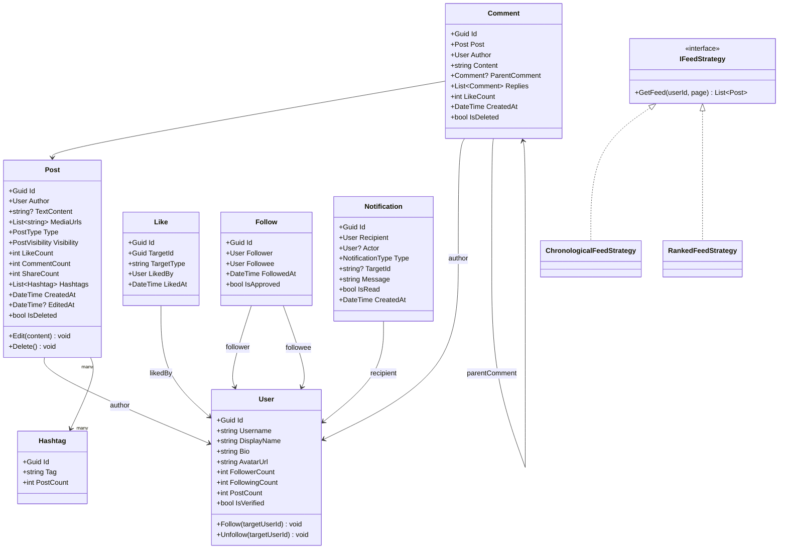

# LLD 10 – Social Media Platform

---

## 1. Interview Approach (Step-by-Step)

**Step 1 – Clarify Requirements (2 min)**

- Twitter-like (follow) or Facebook-like (mutual friends)?
- Post types: text, photo, video?
- Public posts or privacy settings (Friends, Only Me)?
- News feed algorithm: chronological or ranked?
- Notifications: likes, comments, follows?

**Step 2 – Define Core Entities**
User, Post, Comment, Like, Follow, Friendship, Notification, Hashtag, Feed

**Step 3 – News Feed Strategy (Key Design Decision)**
Two approaches — discuss both:

- **Pull (Fan-out on Read)**: Generate feed at read time by querying followees' posts. Simple but slow for users with many followees.
- **Push (Fan-out on Write)**: On post creation, write to each follower's feed. Fast reads but expensive for celebrities with millions of followers.
- **Hybrid**: Push for regular users, Pull for celebrity accounts (> 1M followers).

**Step 4 – Scalability Patterns**
Denormalize like counts, comment counts. Cache post feeds in Redis. Use separate read/write models (CQRS).

**Step 5 – Patterns**
Observer for notifications, Strategy for feed algorithm, Decorator for post visibility, Command for post actions.

---

## 2. Requirements & Assumptions

**Functional:**

- User profiles with bio, avatar
- Follow/unfollow users (asymmetric)
- Create/edit/delete posts (text + images)
- Like/unlike posts and comments
- Nested comments (1 level of replies)
- News feed (posts from followed users)
- Hashtag search
- Notifications for interactions

**Non-Functional:**

- Feed loads in < 500ms
- Support millions of users and posts
- Scale write-heavy (likes, views) separately from reads

---

## 3. Core Entities

| Entity         | Responsibility                                           |
| -------------- | -------------------------------------------------------- |
| `User`         | Profile, credentials, follower/following counts          |
| `Post`         | User-created content with privacy and media              |
| `Comment`      | Comment on a post, optionally a reply to another comment |
| `Like`         | Like on a post or comment                                |
| `Follow`       | Asymmetric follow relationship                           |
| `Hashtag`      | Trending topic tag                                       |
| `Notification` | Event notification for a user                            |
| `UserFeed`     | Cached ordered list of post IDs for a user's feed        |

**Enums:**

```
PostVisibility   : Public, Followers, OnlyMe
NotificationType : Like, Comment, Follow, Mention, Share
PostType         : Text, Photo, Video
```

---

## 4. Class Relationship Diagram



---

## 5. DB Schema

```sql
-- Users
CREATE TABLE Users (
    Id             UNIQUEIDENTIFIER PRIMARY KEY DEFAULT NEWID(),
    Username       NVARCHAR(50)  NOT NULL UNIQUE,
    DisplayName    NVARCHAR(100) NOT NULL,
    Email          NVARCHAR(256) NOT NULL UNIQUE,
    Bio            NVARCHAR(300) NULL,
    AvatarUrl      NVARCHAR(500) NULL,
    FollowerCount  INT           NOT NULL DEFAULT 0,
    FollowingCount INT           NOT NULL DEFAULT 0,
    PostCount      INT           NOT NULL DEFAULT 0,
    IsVerified     BIT           NOT NULL DEFAULT 0,
    CreatedAt      DATETIME      NOT NULL DEFAULT GETUTCDATE()
);

-- Posts
CREATE TABLE Posts (
    Id          UNIQUEIDENTIFIER PRIMARY KEY DEFAULT NEWID(),
    AuthorId    UNIQUEIDENTIFIER NOT NULL REFERENCES Users(Id),
    TextContent NVARCHAR(MAX)    NULL,
    PostType    VARCHAR(10)      NOT NULL DEFAULT 'Text',
    Visibility  VARCHAR(20)      NOT NULL DEFAULT 'Public',
    LikeCount   INT              NOT NULL DEFAULT 0,
    CommentCount INT             NOT NULL DEFAULT 0,
    ShareCount  INT              NOT NULL DEFAULT 0,
    IsDeleted   BIT              NOT NULL DEFAULT 0,
    CreatedAt   DATETIME         NOT NULL DEFAULT GETUTCDATE(),
    EditedAt    DATETIME         NULL,
    INDEX IX_Posts_Author (AuthorId, CreatedAt DESC),
    INDEX IX_Posts_Public (Visibility, IsDeleted, CreatedAt DESC)
);

-- Post Media
CREATE TABLE PostMedia (
    Id       UNIQUEIDENTIFIER PRIMARY KEY DEFAULT NEWID(),
    PostId   UNIQUEIDENTIFIER NOT NULL REFERENCES Posts(Id),
    Url      NVARCHAR(1000)   NOT NULL,
    MediaType VARCHAR(10)     NOT NULL,
    SortOrder INT             NOT NULL DEFAULT 0
);

-- Hashtags
CREATE TABLE Hashtags (
    Id        UNIQUEIDENTIFIER PRIMARY KEY DEFAULT NEWID(),
    Tag       NVARCHAR(100) NOT NULL UNIQUE,
    PostCount INT           NOT NULL DEFAULT 0
);

-- Post Hashtags (Many-to-Many)
CREATE TABLE PostHashtags (
    PostId    UNIQUEIDENTIFIER NOT NULL REFERENCES Posts(Id),
    HashtagId UNIQUEIDENTIFIER NOT NULL REFERENCES Hashtags(Id),
    PRIMARY KEY (PostId, HashtagId)
);

-- Comments
CREATE TABLE Comments (
    Id              UNIQUEIDENTIFIER PRIMARY KEY DEFAULT NEWID(),
    PostId          UNIQUEIDENTIFIER NOT NULL REFERENCES Posts(Id),
    AuthorId        UNIQUEIDENTIFIER NOT NULL REFERENCES Users(Id),
    Content         NVARCHAR(1000)   NOT NULL,
    ParentCommentId UNIQUEIDENTIFIER NULL REFERENCES Comments(Id),
    LikeCount       INT              NOT NULL DEFAULT 0,
    IsDeleted       BIT              NOT NULL DEFAULT 0,
    CreatedAt       DATETIME         NOT NULL DEFAULT GETUTCDATE(),
    INDEX IX_Comments_Post    (PostId, ParentCommentId, CreatedAt),
    INDEX IX_Comments_Author  (AuthorId)
);

-- Likes (polymorphic: post or comment)
CREATE TABLE Likes (
    Id         UNIQUEIDENTIFIER PRIMARY KEY DEFAULT NEWID(),
    TargetId   UNIQUEIDENTIFIER NOT NULL,
    TargetType VARCHAR(10)      NOT NULL,  -- Post | Comment
    LikedById  UNIQUEIDENTIFIER NOT NULL REFERENCES Users(Id),
    LikedAt    DATETIME         NOT NULL DEFAULT GETUTCDATE(),
    UNIQUE (TargetId, TargetType, LikedById)
);

-- Follows
CREATE TABLE Follows (
    Id         UNIQUEIDENTIFIER PRIMARY KEY DEFAULT NEWID(),
    FollowerId UNIQUEIDENTIFIER NOT NULL REFERENCES Users(Id),
    FolloweeId UNIQUEIDENTIFIER NOT NULL REFERENCES Users(Id),
    FollowedAt DATETIME         NOT NULL DEFAULT GETUTCDATE(),
    IsApproved BIT              NOT NULL DEFAULT 1,
    UNIQUE (FollowerId, FolloweeId),
    INDEX IX_Follows_Followee (FolloweeId)
);

-- Notifications
CREATE TABLE Notifications (
    Id         UNIQUEIDENTIFIER PRIMARY KEY DEFAULT NEWID(),
    RecipientId UNIQUEIDENTIFIER NOT NULL REFERENCES Users(Id),
    ActorId    UNIQUEIDENTIFIER NULL REFERENCES Users(Id),
    Type       VARCHAR(20)      NOT NULL,
    TargetId   UNIQUEIDENTIFIER NULL,
    Message    NVARCHAR(300)    NOT NULL,
    IsRead     BIT              NOT NULL DEFAULT 0,
    CreatedAt  DATETIME         NOT NULL DEFAULT GETUTCDATE(),
    INDEX IX_Notif_Recipient (RecipientId, IsRead, CreatedAt DESC)
);

-- User Feed Cache (denormalized for fast reads)
CREATE TABLE UserFeeds (
    UserId    UNIQUEIDENTIFIER NOT NULL,
    PostId    UNIQUEIDENTIFIER NOT NULL,
    Score     FLOAT            NOT NULL DEFAULT 0,  -- For ranked feed
    AddedAt   DATETIME         NOT NULL DEFAULT GETUTCDATE(),
    PRIMARY KEY (UserId, PostId),
    INDEX IX_Feed_User (UserId, Score DESC)
);
```

---

## 6. Design Patterns

| Pattern       | Where                                      | Why                                                              |
| ------------- | ------------------------------------------ | ---------------------------------------------------------------- |
| **Observer**  | Post events → Notification service         | Decouple post creation from notification generation              |
| **Strategy**  | `IFeedStrategy`                            | Swap chronological/ranked/personalized feed without changing API |
| **CQRS**      | `PostCommandService` vs `PostQueryService` | Separate high-write (likes) from high-read (feed) paths          |
| **Decorator** | `PostVisibilityFilter`                     | Filter posts by visibility without changing post query logic     |
| **Flyweight** | `Hashtag` objects                          | Share single Hashtag instance across millions of posts           |
| **Fanout**    | Feed generation                            | On write: push post ID to each follower's feed list in Redis     |

---

## 7. SOLID Principles

| Principle | Application                                                                      |
| --------- | -------------------------------------------------------------------------------- |
| **S**     | `Post` manages content; `Like` manages engagement; `Follow` manages social graph |
| **O**     | Add new post type (Story, Reel) by extending `PostType`; feed logic unchanged    |
| **L**     | Any `IFeedStrategy` substitutes in `FeedService`                                 |
| **I**     | `IFeedStrategy`, `INotificationService`, `IHashtagService` are separate          |
| **D**     | `PostService` depends on `INotificationService`, `IFeedService` abstractions     |

---

## 8. C# Implementation

```csharp
// ─── Enums ───────────────────────────────────────────────────────────────────
public enum PostVisibility   { Public, Followers, OnlyMe }
public enum NotificationType { Like, Comment, Follow, Mention, Share }
public enum PostType         { Text, Photo, Video }

// ─── Core Models ─────────────────────────────────────────────────────────────
public class Hashtag
{
    public Guid   Id        { get; init; } = Guid.NewGuid();
    public string Tag       { get; init; } = default!;  // Stored lowercase
    public int    PostCount { get; private set; }
    public void Increment() => PostCount++;
    public void Decrement() => PostCount = Math.Max(0, PostCount - 1);
}

public class Post
{
    private readonly List<string>  _mediaUrls = new();
    private readonly List<Hashtag> _hashtags  = new();

    public Guid           Id           { get; } = Guid.NewGuid();
    public Guid           AuthorId     { get; init; }
    public string?        TextContent  { get; private set; }
    public PostType       Type         { get; init; }
    public PostVisibility Visibility   { get; init; }
    public int            LikeCount    { get; private set; }
    public int            CommentCount { get; private set; }
    public int            ShareCount   { get; private set; }
    public DateTime       CreatedAt    { get; } = DateTime.UtcNow;
    public DateTime?      EditedAt     { get; private set; }
    public bool           IsDeleted    { get; private set; }

    public IReadOnlyList<string>  MediaUrls => _mediaUrls.AsReadOnly();
    public IReadOnlyList<Hashtag> Hashtags  => _hashtags.AsReadOnly();

    public void AddMedia(string url)     => _mediaUrls.Add(url);
    public void AddHashtag(Hashtag tag)  => _hashtags.Add(tag);

    public void Edit(string newContent)
    {
        if (IsDeleted) throw new InvalidOperationException("Cannot edit deleted post.");
        TextContent = newContent;
        EditedAt    = DateTime.UtcNow;
    }

    public void Delete()         => IsDeleted = true;
    public void IncrementLikes() => LikeCount++;
    public void DecrementLikes() => LikeCount = Math.Max(0, LikeCount - 1);
    public void IncrementComments() => CommentCount++;
}

public class Follow
{
    public Guid     Id         { get; } = Guid.NewGuid();
    public Guid     FollowerId { get; init; }
    public Guid     FolloweeId { get; init; }
    public DateTime FollowedAt { get; } = DateTime.UtcNow;
    public bool     IsApproved { get; private set; } = true;
    public void Approve() => IsApproved = true;
}

public class Notification
{
    public Guid             Id          { get; } = Guid.NewGuid();
    public Guid             RecipientId { get; init; }
    public Guid?            ActorId     { get; init; }
    public NotificationType Type        { get; init; }
    public Guid?            TargetId    { get; init; }
    public string           Message     { get; init; } = default!;
    public bool             IsRead      { get; private set; }
    public DateTime         CreatedAt   { get; } = DateTime.UtcNow;
    public void MarkRead() => IsRead = true;
}

// ─── Feed Strategy ────────────────────────────────────────────────────────────
public interface IFeedStrategy
{
    IEnumerable<Post> GetFeed(Guid userId, IEnumerable<Post> candidatePosts, int page, int pageSize = 20);
}

public class ChronologicalFeedStrategy : IFeedStrategy
{
    public IEnumerable<Post> GetFeed(Guid userId, IEnumerable<Post> candidates, int page, int pageSize = 20)
        => candidates.OrderByDescending(p => p.CreatedAt)
                     .Skip(page * pageSize)
                     .Take(pageSize);
}

public class RankedFeedStrategy : IFeedStrategy
{
    public IEnumerable<Post> GetFeed(Guid userId, IEnumerable<Post> candidates, int page, int pageSize = 20)
    {
        // Score = likes * 1 + comments * 2 + recency decay
        var now = DateTime.UtcNow;
        return candidates
            .Select(p => new
            {
                Post  = p,
                Score = p.LikeCount * 1.0 + p.CommentCount * 2.0 +
                        (1.0 / (1.0 + (now - p.CreatedAt).TotalHours)) * 100
            })
            .OrderByDescending(x => x.Score)
            .Skip(page * pageSize)
            .Take(pageSize)
            .Select(x => x.Post);
    }
}

// ─── Notification Service ─────────────────────────────────────────────────────
public interface INotificationService
{
    void Notify(Guid recipientId, Guid? actorId, NotificationType type, Guid? targetId, string message);
}

public class NotificationService : INotificationService
{
    private readonly List<Notification> _notifications = new();

    public void Notify(Guid recipientId, Guid? actorId, NotificationType type, Guid? targetId, string message)
    {
        var n = new Notification
        {
            RecipientId = recipientId,
            ActorId     = actorId,
            Type        = type,
            TargetId    = targetId,
            Message     = message
        };
        _notifications.Add(n);
        Console.WriteLine($"[Notification → {recipientId}]: {message}");
    }

    public IEnumerable<Notification> GetUnread(Guid userId)
        => _notifications.Where(n => n.RecipientId == userId && !n.IsRead)
                         .OrderByDescending(n => n.CreatedAt);
}

// ─── Post Service ─────────────────────────────────────────────────────────────
public interface IFollowRepository
{
    IEnumerable<Guid> GetFollowerIds(Guid userId);
    IEnumerable<Guid> GetFollowingIds(Guid userId);
    bool IsFollowing(Guid followerId, Guid followeeId);
}

public interface IFeedRepository
{
    void PushToFollowerFeeds(Post post, IEnumerable<Guid> followerIds);
    IEnumerable<Post> GetUserFeed(Guid userId, int page, int pageSize);
}

public class PostService
{
    private readonly INotificationService _notifications;
    private readonly IFollowRepository    _follows;
    private readonly IFeedRepository      _feeds;

    public PostService(INotificationService notif, IFollowRepository follows, IFeedRepository feeds)
    {
        _notifications = notif;
        _follows       = follows;
        _feeds         = feeds;
    }

    public Post CreatePost(Guid authorId, string content, PostVisibility visibility = PostVisibility.Public)
    {
        var post = new Post { AuthorId = authorId, Type = PostType.Text, Visibility = visibility };
        post.Edit(content); // Uses Edit to set content

        // Fan-out to follower feeds (push model)
        var followerIds = _follows.GetFollowerIds(authorId);
        _feeds.PushToFollowerFeeds(post, followerIds);

        return post;
    }

    public void LikePost(Post post, Guid likerId)
    {
        post.IncrementLikes();
        if (post.AuthorId != likerId)
            _notifications.Notify(post.AuthorId, likerId, NotificationType.Like, post.Id, "liked your post.");
    }

    public void Follow(Guid followerId, Guid followeeId)
    {
        var follow = new Follow { FollowerId = followerId, FolloweeId = followeeId };
        _notifications.Notify(followeeId, followerId, NotificationType.Follow, null, "started following you.");
    }
}
```

---

## Key Discussion Points for Interview

1. **Fan-out Strategy**: For users with < 1M followers, use fan-out on write (push to feed at post time). For celebrities with > 1M followers, use fan-out on read (pull their posts at feed-load time). Hybrid approach.

2. **Like Count Scalability**: Direct `UPDATE Posts SET LikeCount += 1` at scale causes contention. Use a counter cache in Redis (`INCR post:{id}:likes`), sync to DB every 60 seconds.

3. **Feed Pagination**: Use cursor-based pagination (`WHERE CreatedAt < @lastSeen`) instead of `OFFSET`-based, which is O(n) on large tables.

4. **Privacy Filtering**: Always apply visibility filter server-side: `Public` = all, `Followers` = only followers of author, `OnlyMe` = only author. Never trust client to filter.

5. **Hashtag Trending**: Aggregate `PostHashtags` table over last 24h, sorted by `PostCount DESC`. Cache result in Redis with 1-minute TTL.
