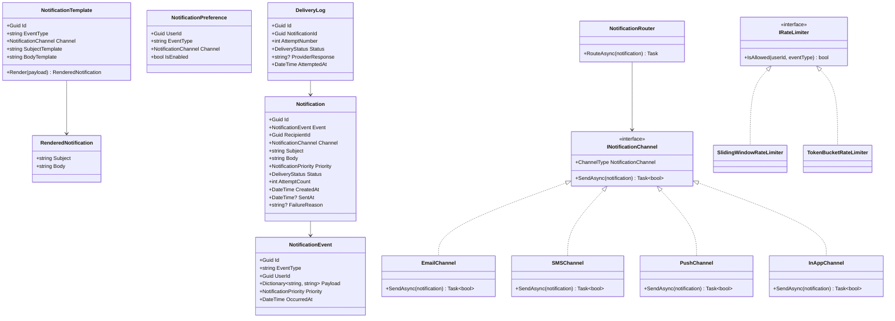

# LLD 11 – Notification System

---

## 1. Interview Approach (Step-by-Step)

**Step 1 – Clarify Requirements (2 min)**

- Channel types: Email, SMS, Push, In-App, Slack/Webhook?
- Template-based notifications or free-form?
- User preferences per channel (opt-in/out per notification type)?
- Retry on failure? At-least-once or exactly-once delivery?
- Rate limiting to prevent spam?
- Priority levels (critical vs marketing)?

**Step 2 – Define Core Entities**
Notification, NotificationTemplate, NotificationEvent, NotificationPreference, Channel, DeliveryLog

**Step 3 – Architecture Flow**
"Event is published → NotificationService receives it → resolves recipients → checks user preferences → renders template → routes to appropriate channel handler → logs delivery attempt → retry on failure."

**Step 4 – Reliable Delivery**
"Use a message queue (RabbitMQ/SQS). On send failure: retry with exponential backoff, max 3 attempts. Dead-letter queue for permanently failed notifications."

**Step 5 – Patterns**
Strategy for channel handlers, Observer for event-driven dispatch, Chain of Responsibility for preference/rate-limit checks, Template Method for notification processing, Builder for notification construction.

---

## 2. Requirements & Assumptions

**Functional:**

- Send notifications via Email, SMS, Push, In-App
- User can opt out of specific notification types per channel
- Template-based messages with variable substitution
- Retry on delivery failure (max 3 attempts)
- Rate limiting (max N notifications per user per hour)
- Delivery status tracking

**Non-Functional:**

- High throughput (millions of notifications/day)
- Resilient to channel failures
- At-least-once delivery guarantee

---

## 3. Core Entities

| Entity                   | Responsibility                                |
| ------------------------ | --------------------------------------------- |
| `NotificationEvent`      | Trigger event from upstream service           |
| `Notification`           | Rendered notification ready for delivery      |
| `NotificationTemplate`   | Parameterized message template per event type |
| `NotificationPreference` | User opt-in/out settings per type and channel |
| `DeliveryLog`            | Attempt record per notification per channel   |
| `INotificationChannel`   | Abstraction for each delivery channel         |
| `RateLimiter`            | Enforce per-user send limits                  |

**Enums:**

```
NotificationChannel : Email, SMS, PushNotification, InApp, Webhook
DeliveryStatus      : Pending, Sent, Failed, Retrying, Skipped
NotificationPriority: Low, Normal, High, Critical
```

---

## 4. Class Relationship Diagram



---

## 5. DB Schema

```sql
-- Notification Templates
CREATE TABLE NotificationTemplates (
    Id              UNIQUEIDENTIFIER PRIMARY KEY DEFAULT NEWID(),
    EventType       NVARCHAR(100) NOT NULL,
    Channel         VARCHAR(20)   NOT NULL,
    SubjectTemplate NVARCHAR(500) NULL,
    BodyTemplate    NVARCHAR(MAX) NOT NULL,
    IsActive        BIT           NOT NULL DEFAULT 1,
    UNIQUE (EventType, Channel)
);

-- Notification Preferences
CREATE TABLE NotificationPreferences (
    UserId    UNIQUEIDENTIFIER NOT NULL,
    EventType NVARCHAR(100)    NOT NULL,
    Channel   VARCHAR(20)      NOT NULL,
    IsEnabled BIT              NOT NULL DEFAULT 1,
    PRIMARY KEY (UserId, EventType, Channel)
);

-- Notifications (outbox)
CREATE TABLE Notifications (
    Id            UNIQUEIDENTIFIER PRIMARY KEY DEFAULT NEWID(),
    RecipientId   UNIQUEIDENTIFIER NOT NULL,
    EventType     NVARCHAR(100)    NOT NULL,
    Channel       VARCHAR(20)      NOT NULL,
    Subject       NVARCHAR(500)    NULL,
    Body          NVARCHAR(MAX)    NOT NULL,
    Priority      VARCHAR(10)      NOT NULL DEFAULT 'Normal',
    Status        VARCHAR(20)      NOT NULL DEFAULT 'Pending',
    AttemptCount  INT              NOT NULL DEFAULT 0,
    ScheduledAt   DATETIME         NOT NULL DEFAULT GETUTCDATE(),
    SentAt        DATETIME         NULL,
    FailureReason NVARCHAR(500)    NULL,
    CreatedAt     DATETIME         NOT NULL DEFAULT GETUTCDATE(),
    INDEX IX_Notif_Status     (Status, ScheduledAt),
    INDEX IX_Notif_Recipient  (RecipientId, Status, CreatedAt DESC)
);

-- Delivery Logs
CREATE TABLE DeliveryLogs (
    Id               UNIQUEIDENTIFIER PRIMARY KEY DEFAULT NEWID(),
    NotificationId   UNIQUEIDENTIFIER NOT NULL REFERENCES Notifications(Id),
    AttemptNumber    INT              NOT NULL,
    Status           VARCHAR(20)      NOT NULL,
    ProviderResponse NVARCHAR(1000)   NULL,
    AttemptedAt      DATETIME         NOT NULL DEFAULT GETUTCDATE()
);

-- User Device Tokens (for Push)
CREATE TABLE DeviceTokens (
    Id        UNIQUEIDENTIFIER PRIMARY KEY DEFAULT NEWID(),
    UserId    UNIQUEIDENTIFIER NOT NULL,
    Token     NVARCHAR(500)    NOT NULL,
    Platform  VARCHAR(10)      NOT NULL,  -- iOS | Android | Web
    IsActive  BIT              NOT NULL DEFAULT 1,
    CreatedAt DATETIME         NOT NULL DEFAULT GETUTCDATE(),
    UNIQUE (UserId, Token)
);
```

---

## 6. Design Patterns

| Pattern                     | Where                                                        | Why                                                                   |
| --------------------------- | ------------------------------------------------------------ | --------------------------------------------------------------------- |
| **Strategy**                | `INotificationChannel`                                       | Swap email/SMS/push providers independently                           |
| **Observer**                | Events → NotificationService                                 | Decouple event producers (OrderService, etc.) from notification logic |
| **Chain of Responsibility** | Preference check → Rate limit check → Template render → Send | Each handler passes to next or short-circuits                         |
| **Template Method**         | `NotificationProcessor.Process()`                            | Fixed pipeline skeleton; subclasses override channel-specific steps   |
| **Builder**                 | `NotificationBuilder`                                        | Fluent construction of complex notification objects                   |
| **Retry (Resilience)**      | `DeliveryService`                                            | Exponential backoff retry with dead-letter for permanent failures     |

---

## 7. SOLID Principles

| Principle | Application                                                                                |
| --------- | ------------------------------------------------------------------------------------------ |
| **S**     | `NotificationTemplate` renders only; `DeliveryLog` tracks only; `IRateLimiter` limits only |
| **O**     | Add Slack channel by implementing `INotificationChannel`; no change to router or processor |
| **L**     | Any `INotificationChannel` (Email, SMS, Push) substitutable in `NotificationRouter`        |
| **I**     | `INotificationChannel`, `IRateLimiter`, `ITemplateRenderer` are small, focused interfaces  |
| **D**     | `NotificationService` depends on abstractions, not concrete `EmailChannel` or `SmsChannel` |

---

## 8. C# Implementation

```csharp
// ─── Enums ───────────────────────────────────────────────────────────────────
public enum NotificationChannel  { Email, SMS, PushNotification, InApp, Webhook }
public enum DeliveryStatus       { Pending, Sent, Failed, Retrying, Skipped }
public enum NotificationPriority { Low, Normal, High, Critical }

// ─── Template & Rendering ─────────────────────────────────────────────────────
public class NotificationTemplate
{
    public Guid                 Id              { get; init; } = Guid.NewGuid();
    public string               EventType       { get; init; } = default!;
    public NotificationChannel  Channel         { get; init; }
    public string?              SubjectTemplate { get; init; }
    public string               BodyTemplate    { get; init; } = default!;

    public (string? subject, string body) Render(Dictionary<string, string> payload)
    {
        var subject = SubjectTemplate;
        var body    = BodyTemplate;
        foreach (var (key, value) in payload)
        {
            subject = subject?.Replace($"{{{{{key}}}}}", value);
            body    = body.Replace($"{{{{{key}}}}}", value);
        }
        return (subject, body);
    }
}

// ─── Notification ─────────────────────────────────────────────────────────────
public class Notification
{
    public Guid                 Id            { get; } = Guid.NewGuid();
    public Guid                 RecipientId   { get; init; }
    public string               EventType     { get; init; } = default!;
    public NotificationChannel  Channel       { get; init; }
    public string?              Subject       { get; init; }
    public string               Body          { get; init; } = default!;
    public NotificationPriority Priority      { get; init; } = NotificationPriority.Normal;
    public DeliveryStatus       Status        { get; private set; } = DeliveryStatus.Pending;
    public int                  AttemptCount  { get; private set; }
    public DateTime             CreatedAt     { get; } = DateTime.UtcNow;
    public DateTime?            SentAt        { get; private set; }
    public string?              FailureReason { get; private set; }

    public void MarkSent()   { Status = DeliveryStatus.Sent;   SentAt = DateTime.UtcNow; }
    public void MarkFailed(string reason)
    {
        AttemptCount++;
        FailureReason = reason;
        Status = AttemptCount >= 3 ? DeliveryStatus.Failed : DeliveryStatus.Retrying;
    }
    public void MarkSkipped() => Status = DeliveryStatus.Skipped;
}

// ─── Notification Preference ──────────────────────────────────────────────────
public class NotificationPreference
{
    public Guid               UserId    { get; init; }
    public string             EventType { get; init; } = default!;
    public NotificationChannel Channel  { get; init; }
    public bool               IsEnabled { get; set; } = true;
}

// ─── Rate Limiter (Strategy) ──────────────────────────────────────────────────
public interface IRateLimiter
{
    bool IsAllowed(Guid userId, string eventType);
}

public class SlidingWindowRateLimiter : IRateLimiter
{
    private readonly int _maxPerHour;
    private readonly Dictionary<string, Queue<DateTime>> _windows = new();

    public SlidingWindowRateLimiter(int maxPerHour = 10) => _maxPerHour = maxPerHour;

    public bool IsAllowed(Guid userId, string eventType)
    {
        var key = $"{userId}:{eventType}";
        if (!_windows.ContainsKey(key)) _windows[key] = new Queue<DateTime>();

        var window = _windows[key];
        var cutoff = DateTime.UtcNow.AddHours(-1);

        // Remove old entries
        while (window.Count > 0 && window.Peek() < cutoff) window.Dequeue();

        if (window.Count >= _maxPerHour) return false;

        window.Enqueue(DateTime.UtcNow);
        return true;
    }
}

// ─── Channel Implementations (Strategy) ──────────────────────────────────────
public interface INotificationChannel
{
    NotificationChannel ChannelType { get; }
    Task<bool> SendAsync(Notification notification);
}

public class EmailChannel : INotificationChannel
{
    public NotificationChannel ChannelType => NotificationChannel.Email;

    public async Task<bool> SendAsync(Notification notification)
    {
        // Integration with SendGrid/SES here
        Console.WriteLine($"[EMAIL → {notification.RecipientId}] Subject: {notification.Subject}");
        await Task.CompletedTask;
        return true;
    }
}

public class SmsChannel : INotificationChannel
{
    public NotificationChannel ChannelType => NotificationChannel.SMS;

    public async Task<bool> SendAsync(Notification notification)
    {
        // Integration with Twilio/AWS SNS here
        Console.WriteLine($"[SMS → {notification.RecipientId}]: {notification.Body}");
        await Task.CompletedTask;
        return true;
    }
}

public class PushChannel : INotificationChannel
{
    public NotificationChannel ChannelType => NotificationChannel.PushNotification;

    public async Task<bool> SendAsync(Notification notification)
    {
        // Integration with FCM/APNs here
        Console.WriteLine($"[PUSH → {notification.RecipientId}]: {notification.Body}");
        await Task.CompletedTask;
        return true;
    }
}

public class InAppChannel : INotificationChannel
{
    private readonly List<Notification> _inbox = new();
    public NotificationChannel ChannelType => NotificationChannel.InApp;

    public Task<bool> SendAsync(Notification notification)
    {
        _inbox.Add(notification);
        notification.MarkSent();
        return Task.FromResult(true);
    }

    public IEnumerable<Notification> GetInbox(Guid userId)
        => _inbox.Where(n => n.RecipientId == userId).OrderByDescending(n => n.CreatedAt);
}

// ─── Delivery Log ─────────────────────────────────────────────────────────────
public class DeliveryLog
{
    public Guid          Id               { get; } = Guid.NewGuid();
    public Guid          NotificationId   { get; init; }
    public int           AttemptNumber    { get; init; }
    public DeliveryStatus Status          { get; init; }
    public string?       ProviderResponse { get; init; }
    public DateTime      AttemptedAt      { get; } = DateTime.UtcNow;
}

// ─── Notification Service (Orchestrator with Retry) ───────────────────────────
public class NotificationService
{
    private readonly Dictionary<NotificationChannel, INotificationChannel>     _channels;
    private readonly Dictionary<string, List<NotificationTemplate>>            _templates;
    private readonly Dictionary<(Guid userId, string eventType, NotificationChannel), bool> _preferences;
    private readonly IRateLimiter          _rateLimiter;
    private readonly List<DeliveryLog>     _deliveryLogs = new();

    public NotificationService(
        IEnumerable<INotificationChannel>    channels,
        IEnumerable<NotificationTemplate>    templates,
        IEnumerable<NotificationPreference>  preferences,
        IRateLimiter rateLimiter)
    {
        _channels     = channels.ToDictionary(c => c.ChannelType);
        _templates    = templates.GroupBy(t => t.EventType).ToDictionary(g => g.Key, g => g.ToList());
        _preferences  = preferences.ToDictionary(p => (p.UserId, p.EventType, p.Channel), p => p.IsEnabled);
        _rateLimiter  = rateLimiter;
    }

    public async Task ProcessEventAsync(Guid userId, string eventType, Dictionary<string, string> payload,
        IEnumerable<NotificationChannel> channels, NotificationPriority priority = NotificationPriority.Normal)
    {
        foreach (var channel in channels)
        {
            // 1. Check user preference
            var prefKey = (userId, eventType, channel);
            if (_preferences.TryGetValue(prefKey, out var enabled) && !enabled) continue;

            // 2. Rate limit check
            if (priority < NotificationPriority.High && !_rateLimiter.IsAllowed(userId, eventType))
            {
                Console.WriteLine($"[RateLimit] Skipping {channel} notification for user {userId}");
                continue;
            }

            // 3. Render template
            if (!_templates.TryGetValue(eventType, out var channelTemplates)) continue;
            var template = channelTemplates.FirstOrDefault(t => t.Channel == channel);
            if (template is null) continue;

            var (subject, body) = template.Render(payload);

            // 4. Create notification
            var notification = new Notification
            {
                RecipientId = userId,
                EventType   = eventType,
                Channel     = channel,
                Subject     = subject,
                Body        = body,
                Priority    = priority
            };

            // 5. Deliver with retry
            await DeliverWithRetryAsync(notification);
        }
    }

    private async Task DeliverWithRetryAsync(Notification notification)
    {
        const int maxAttempts = 3;

        for (int attempt = 1; attempt <= maxAttempts; attempt++)
        {
            if (!_channels.TryGetValue(notification.Channel, out var channel)) break;

            try
            {
                var success = await channel.SendAsync(notification);
                if (success)
                {
                    notification.MarkSent();
                    _deliveryLogs.Add(new DeliveryLog
                    {
                        NotificationId   = notification.Id,
                        AttemptNumber    = attempt,
                        Status           = DeliveryStatus.Sent,
                        ProviderResponse = "OK"
                    });
                    return;
                }
            }
            catch (Exception ex)
            {
                notification.MarkFailed(ex.Message);
                _deliveryLogs.Add(new DeliveryLog
                {
                    NotificationId   = notification.Id,
                    AttemptNumber    = attempt,
                    Status           = DeliveryStatus.Failed,
                    ProviderResponse = ex.Message
                });

                if (attempt < maxAttempts)
                {
                    // Exponential backoff: 2^attempt seconds
                    var delay = TimeSpan.FromSeconds(Math.Pow(2, attempt));
                    Console.WriteLine($"[Retry] Attempt {attempt} failed. Retrying in {delay.TotalSeconds}s...");
                    await Task.Delay(delay);
                }
            }
        }

        Console.WriteLine($"[DeadLetter] Notification {notification.Id} permanently failed after {maxAttempts} attempts.");
    }
}
```

---

## Key Discussion Points for Interview

1. **Message Queue Integration**: In production, `ProcessEventAsync` is triggered by consuming from a queue (SQS, RabbitMQ). This decouples event producers from the notification system and enables async processing.

2. **Retry & Dead-Letter**: Exponential backoff (2s, 4s, 8s) before marking permanently failed. Dead-letter queue for manual investigation. Never silently swallow failures.

3. **Rate Limiting**: `SlidingWindowRateLimiter` uses a per-user per-event rolling 1-hour window. Critical notifications (`Priority.Critical`) bypass rate limits — this is the key design choice.

4. **Template Engine**: The `{{variable}}` substitution shown is simplified. Production uses Handlebars, Razor, or Liquid templates for complex layouts (HTML emails, rich push notifications).

5. **User Preferences**: Granular control: a user can disable email for "marketing" events but keep email enabled for "security" events. The preference key is `(userId, eventType, channel)`.

6. **Idempotency**: Use an `IdempotencyKey` (event ID + user ID + channel) to prevent duplicate deliveries if the event is processed twice from the queue.
