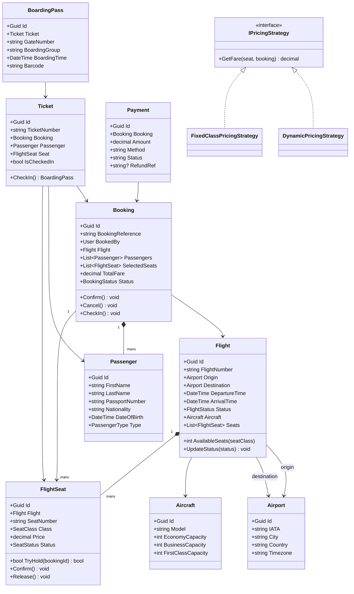

# LLD 12 – Airline Reservation System

---

## 1. Interview Approach (Step-by-Step)

**Step 1 – Clarify Requirements (2 min)**

- Domestic only or international?
- Seat class types: Economy, Business, First?
- Multi-city bookings or just point-to-point?
- Cancellation and refund policies?
- Baggage allowance tracking?
- Overbooking policy (airlines commonly overbook by 10%)?

**Step 2 – Define Core Entities**
Airline, Airport, Flight, FlightSeat, Passenger, Booking, Ticket, Payment, BoardingPass

**Step 3 – Key Workflows**
Search → Select Flight → Select Seats → Add Passengers → Payment → Confirm → Issue Tickets → Check-In → Boarding Pass

**Step 4 – Seat Concurrency**
"Same as Movie Ticket Booking — temporary hold (10 min TTL) + DB optimistic concurrency. Two passengers cannot book the same seat simultaneously."

**Step 5 – Patterns**
State for Booking/Flight lifecycle, Strategy for pricing (dynamic fares), Builder for Booking, Observer for flight status changes, Decorator for ancillary services (meals, extra baggage).

---

## 2. Requirements & Assumptions

**Functional:**

- Search flights by origin, destination, date, class
- Select seats, add passenger details, make payment
- Cancel booking with refund based on policy
- Check-in online and generate boarding pass
- Flight status tracking (On Time, Delayed, Cancelled)

**Non-Functional:**

- Seat selection concurrency-safe
- Flight search must handle millions of records efficiently
- Booking confirmation within 10 seconds

---

## 3. Core Entities

| Entity         | Responsibility                                  |
| -------------- | ----------------------------------------------- |
| `Airport`      | IATA code, city, timezone                       |
| `Airline`      | Carrier details                                 |
| `Aircraft`     | Plane model with seat configuration             |
| `Flight`       | Scheduled service between two airports          |
| `FlightSeat`   | Per-flight seat availability and pricing        |
| `Passenger`    | Person traveling (may differ from booking user) |
| `Booking`      | Reservation record with one or more passengers  |
| `Ticket`       | Issued ticket per passenger                     |
| `Payment`      | Fare payment                                    |
| `BoardingPass` | Generated at check-in                           |

**Enums:**

```
SeatClass       : Economy, Business, First
SeatStatus      : Available, TemporaryHold, Booked
FlightStatus    : Scheduled, Delayed, Boarding, Departed, Arrived, Cancelled
BookingStatus   : Initiated, Confirmed, Cancelled, CheckedIn
PassengerType   : Adult, Child, Infant
```

---

## 4. Class Relationship Diagram



---

## 5. DB Schema

```sql
-- Airports
CREATE TABLE Airports (
    Id       UNIQUEIDENTIFIER PRIMARY KEY DEFAULT NEWID(),
    IATA     CHAR(3)        NOT NULL UNIQUE,
    City     NVARCHAR(100)  NOT NULL,
    Country  NVARCHAR(100)  NOT NULL,
    Timezone NVARCHAR(50)   NOT NULL
);

-- Aircraft
CREATE TABLE Aircraft (
    Id               UNIQUEIDENTIFIER PRIMARY KEY DEFAULT NEWID(),
    Model            NVARCHAR(100) NOT NULL,
    EconomyCapacity  INT           NOT NULL,
    BusinessCapacity INT           NOT NULL,
    FirstCapacity    INT           NOT NULL DEFAULT 0
);

-- Flights
CREATE TABLE Flights (
    Id            UNIQUEIDENTIFIER PRIMARY KEY DEFAULT NEWID(),
    FlightNumber  VARCHAR(10)      NOT NULL,
    OriginId      UNIQUEIDENTIFIER NOT NULL REFERENCES Airports(Id),
    DestinationId UNIQUEIDENTIFIER NOT NULL REFERENCES Airports(Id),
    AircraftId    UNIQUEIDENTIFIER NOT NULL REFERENCES Aircraft(Id),
    DepartureTime DATETIME         NOT NULL,
    ArrivalTime   DATETIME         NOT NULL,
    Status        VARCHAR(20)      NOT NULL DEFAULT 'Scheduled',
    INDEX IX_Flights_Route_Date (OriginId, DestinationId, DepartureTime)
);

-- Flight Seats
CREATE TABLE FlightSeats (
    Id              UNIQUEIDENTIFIER PRIMARY KEY DEFAULT NEWID(),
    FlightId        UNIQUEIDENTIFIER NOT NULL REFERENCES Flights(Id),
    SeatNumber      VARCHAR(5)       NOT NULL,
    Class           VARCHAR(10)      NOT NULL,
    Price           DECIMAL(10,2)    NOT NULL,
    Status          VARCHAR(20)      NOT NULL DEFAULT 'Available',
    HeldByBookingId UNIQUEIDENTIFIER NULL,
    HoldExpiresAt   DATETIME         NULL,
    UNIQUE (FlightId, SeatNumber),
    INDEX IX_Seats_Status (FlightId, Class, Status)
);

-- Passengers
CREATE TABLE Passengers (
    Id             UNIQUEIDENTIFIER PRIMARY KEY DEFAULT NEWID(),
    FirstName      NVARCHAR(100) NOT NULL,
    LastName       NVARCHAR(100) NOT NULL,
    PassportNumber VARCHAR(20)   NULL,
    Nationality    VARCHAR(50)   NULL,
    DateOfBirth    DATE          NULL,
    Type           VARCHAR(10)   NOT NULL DEFAULT 'Adult'
);

-- Users (bookers)
CREATE TABLE Users (
    Id    UNIQUEIDENTIFIER PRIMARY KEY DEFAULT NEWID(),
    Email NVARCHAR(256) NOT NULL UNIQUE,
    Name  NVARCHAR(200) NOT NULL
);

-- Bookings
CREATE TABLE Bookings (
    Id               UNIQUEIDENTIFIER PRIMARY KEY DEFAULT NEWID(),
    BookingReference VARCHAR(10)      NOT NULL UNIQUE,
    UserId           UNIQUEIDENTIFIER NOT NULL REFERENCES Users(Id),
    FlightId         UNIQUEIDENTIFIER NOT NULL REFERENCES Flights(Id),
    TotalFare        DECIMAL(10,2)    NOT NULL,
    Status           VARCHAR(20)      NOT NULL DEFAULT 'Initiated',
    CreatedAt        DATETIME         NOT NULL DEFAULT GETUTCDATE(),
    CancelledAt      DATETIME         NULL,
    INDEX IX_Bookings_User   (UserId),
    INDEX IX_Bookings_Flight (FlightId, Status)
);

-- Booking Passengers (junction)
CREATE TABLE BookingPassengers (
    BookingId   UNIQUEIDENTIFIER NOT NULL REFERENCES Bookings(Id),
    PassengerId UNIQUEIDENTIFIER NOT NULL REFERENCES Passengers(Id),
    SeatId      UNIQUEIDENTIFIER NULL REFERENCES FlightSeats(Id),
    PRIMARY KEY (BookingId, PassengerId)
);

-- Tickets
CREATE TABLE Tickets (
    Id           UNIQUEIDENTIFIER PRIMARY KEY DEFAULT NEWID(),
    TicketNumber VARCHAR(20)      NOT NULL UNIQUE,
    BookingId    UNIQUEIDENTIFIER NOT NULL REFERENCES Bookings(Id),
    PassengerId  UNIQUEIDENTIFIER NOT NULL REFERENCES Passengers(Id),
    SeatId       UNIQUEIDENTIFIER NOT NULL REFERENCES FlightSeats(Id),
    IsCheckedIn  BIT              NOT NULL DEFAULT 0
);

-- Boarding Passes
CREATE TABLE BoardingPasses (
    Id           UNIQUEIDENTIFIER PRIMARY KEY DEFAULT NEWID(),
    TicketId     UNIQUEIDENTIFIER NOT NULL UNIQUE REFERENCES Tickets(Id),
    GateNumber   VARCHAR(10)      NOT NULL,
    BoardingGroup VARCHAR(5)      NOT NULL,
    BoardingTime DATETIME         NOT NULL,
    Barcode      VARCHAR(100)     NOT NULL UNIQUE,
    IssuedAt     DATETIME         NOT NULL DEFAULT GETUTCDATE()
);

-- Payments
CREATE TABLE Payments (
    Id        UNIQUEIDENTIFIER PRIMARY KEY DEFAULT NEWID(),
    BookingId UNIQUEIDENTIFIER NOT NULL REFERENCES Bookings(Id),
    Amount    DECIMAL(10,2)    NOT NULL,
    Method    VARCHAR(20)      NOT NULL,
    Status    VARCHAR(20)      NOT NULL,
    RefundRef VARCHAR(100)     NULL,
    PaidAt    DATETIME         NULL
);
```

---

## 6. Design Patterns

| Pattern       | Where                              | Why                                                               |
| ------------- | ---------------------------------- | ----------------------------------------------------------------- |
| **State**     | `Flight.Status`, `Booking.Status`  | Safe transitions; prevent invalid operations on cancelled flights |
| **Strategy**  | `IPricingStrategy`                 | Dynamic pricing (early-bird cheaper, last-minute expensive)       |
| **Observer**  | Flight status changes → passengers | Notify all booked passengers on delay/cancellation                |
| **Builder**   | `BookingBuilder`                   | Fluent API to add flights, passengers, seats before confirming    |
| **Decorator** | `AncillaryServiceDecorator`        | Add meals, extra baggage, lounge access to base fare              |
| **Facade**    | `BookingService`                   | Hides seat holding, payment, ticket generation complexity         |

---

## 7. SOLID Principles

| Principle | Application                                                                                    |
| --------- | ---------------------------------------------------------------------------------------------- |
| **S**     | `Ticket` manages check-in; `BoardingPass` manages gate info; `FlightSeat` manages availability |
| **O**     | Add new ancillary service (insurance) via Decorator; no change to core booking                 |
| **L**     | `DynamicPricingStrategy` substitutes for `IPricingStrategy`                                    |
| **I**     | `IPricingStrategy`, `IFlightNotifier`, `IPaymentProcessor` are separate interfaces             |
| **D**     | `BookingService` depends on abstractions                                                       |

---

## 8. C# Implementation

```csharp
// ─── Enums ───────────────────────────────────────────────────────────────────
public enum SeatClass     { Economy, Business, First }
public enum SeatStatus    { Available, TemporaryHold, Booked }
public enum FlightStatus  { Scheduled, Delayed, Boarding, Departed, Arrived, Cancelled }
public enum BookingStatus { Initiated, Confirmed, Cancelled, CheckedIn }

// ─── Core Models ─────────────────────────────────────────────────────────────
public class Airport
{
    public Guid   Id       { get; init; } = Guid.NewGuid();
    public string IATA     { get; init; } = default!;
    public string City     { get; init; } = default!;
    public string Country  { get; init; } = default!;
    public string Timezone { get; init; } = default!;
}

public class FlightSeat
{
    private readonly object _lock = new();
    public Guid       Id              { get; init; } = Guid.NewGuid();
    public Guid       FlightId        { get; init; }
    public string     SeatNumber      { get; init; } = default!;
    public SeatClass  Class           { get; init; }
    public decimal    Price           { get; init; }
    public SeatStatus Status          { get; private set; } = SeatStatus.Available;
    public Guid?      HeldByBookingId { get; private set; }
    public DateTime?  HoldExpiresAt   { get; private set; }

    public bool TryHold(Guid bookingId, int holdMinutes = 10)
    {
        lock (_lock)
        {
            if (Status == SeatStatus.TemporaryHold && HoldExpiresAt < DateTime.UtcNow) Release();
            if (Status != SeatStatus.Available) return false;
            Status = SeatStatus.TemporaryHold;
            HeldByBookingId = bookingId;
            HoldExpiresAt   = DateTime.UtcNow.AddMinutes(holdMinutes);
            return true;
        }
    }
    public void Confirm() { lock (_lock) { Status = SeatStatus.Booked; } }
    public void Release() { lock (_lock) { Status = SeatStatus.Available; HeldByBookingId = null; HoldExpiresAt = null; } }
}

public class Passenger
{
    public Guid   Id             { get; init; } = Guid.NewGuid();
    public string FirstName      { get; init; } = default!;
    public string LastName       { get; init; } = default!;
    public string FullName       => $"{FirstName} {LastName}";
    public string PassportNumber { get; init; } = default!;
    public DateTime DateOfBirth  { get; init; }
}

// ─── Dynamic Pricing Strategy ─────────────────────────────────────────────────
public interface IPricingStrategy
{
    decimal GetFare(FlightSeat seat, DateTime departureTime);
}

public class DynamicPricingStrategy : IPricingStrategy
{
    public decimal GetFare(FlightSeat seat, DateTime departureTime)
    {
        var daysUntilFlight = (departureTime - DateTime.UtcNow).TotalDays;
        // Early bird discount: more than 30 days = 20% off; less than 7 days = 30% surcharge
        var multiplier = daysUntilFlight > 30 ? 0.8m : daysUntilFlight < 7 ? 1.3m : 1.0m;
        return Math.Round(seat.Price * multiplier, 2);
    }
}

// ─── Flight ───────────────────────────────────────────────────────────────────
public class Flight
{
    private readonly List<FlightSeat>      _seats     = new();
    private readonly List<IFlightObserver> _observers = new();

    public Guid         Id           { get; init; } = Guid.NewGuid();
    public string       FlightNumber { get; init; } = default!;
    public Airport      Origin       { get; init; } = default!;
    public Airport      Destination  { get; init; } = default!;
    public DateTime     DepartureTime{ get; init; }
    public DateTime     ArrivalTime  { get; init; }
    public FlightStatus Status       { get; private set; } = FlightStatus.Scheduled;

    public IReadOnlyList<FlightSeat> Seats => _seats.AsReadOnly();
    public void AddSeat(FlightSeat s) => _seats.Add(s);
    public int AvailableSeats(SeatClass @class) => _seats.Count(s => s.Class == @class && s.Status == SeatStatus.Available);

    public void Subscribe(IFlightObserver obs) => _observers.Add(obs);

    public void UpdateStatus(FlightStatus newStatus)
    {
        Status = newStatus;
        _observers.ForEach(o => o.OnFlightStatusChanged(this, newStatus));
    }
}

public interface IFlightObserver
{
    void OnFlightStatusChanged(Flight flight, FlightStatus newStatus);
}

// ─── Booking ──────────────────────────────────────────────────────────────────
public class Booking
{
    private readonly List<(Passenger passenger, FlightSeat seat)> _assignments = new();

    public Guid          Id               { get; } = Guid.NewGuid();
    public string        BookingReference { get; init; } = default!;
    public Guid          UserId           { get; init; }
    public Flight        Flight           { get; init; } = default!;
    public BookingStatus Status           { get; private set; } = BookingStatus.Initiated;
    public decimal       TotalFare        => _assignments.Sum(a => a.seat.Price);
    public DateTime      CreatedAt        { get; } = DateTime.UtcNow;

    public IReadOnlyList<(Passenger, FlightSeat)> Assignments => _assignments.AsReadOnly();

    public void AddAssignment(Passenger passenger, FlightSeat seat) => _assignments.Add((passenger, seat));
    public void Confirm()  => Status = BookingStatus.Confirmed;
    public void Cancel()   { Status = BookingStatus.Cancelled; foreach (var (_, s) in _assignments) s.Release(); }
    public void CheckIn()  => Status = BookingStatus.CheckedIn;
}

// ─── Ticket & Boarding Pass ────────────────────────────────────────────────────
public class Ticket
{
    public Guid      Id           { get; } = Guid.NewGuid();
    public string    TicketNumber { get; init; } = default!;
    public Guid      BookingId    { get; init; }
    public Passenger Passenger    { get; init; } = default!;
    public FlightSeat Seat        { get; init; } = default!;
    public bool      IsCheckedIn  { get; private set; }

    public BoardingPass CheckIn(string gate, string boardingGroup, DateTime boardingTime)
    {
        if (IsCheckedIn) throw new InvalidOperationException("Already checked in.");
        IsCheckedIn = true;
        return new BoardingPass
        {
            TicketId      = Id,
            Ticket        = this,
            GateNumber    = gate,
            BoardingGroup = boardingGroup,
            BoardingTime  = boardingTime,
            Barcode       = $"BP-{Guid.NewGuid():N}".ToUpper()
        };
    }
}

public class BoardingPass
{
    public Guid     Id            { get; } = Guid.NewGuid();
    public Guid     TicketId      { get; init; }
    public Ticket   Ticket        { get; init; } = default!;
    public string   GateNumber    { get; init; } = default!;
    public string   BoardingGroup { get; init; } = default!;
    public DateTime BoardingTime  { get; init; }
    public string   Barcode       { get; init; } = default!;
    public DateTime IssuedAt      { get; } = DateTime.UtcNow;
}

// ─── Booking Service (Facade) ─────────────────────────────────────────────────
public class BookingService
{
    private readonly IPricingStrategy  _pricing;
    private readonly IPaymentProcessor _payment;

    public BookingService(IPricingStrategy pricing, IPaymentProcessor payment)
    {
        _pricing = pricing;
        _payment = payment;
    }

    public (Booking, IEnumerable<Ticket>) Book(
        Guid userId, Flight flight,
        IEnumerable<(Passenger passenger, FlightSeat seat)> assignments,
        string paymentMethod)
    {
        var booking = new Booking
        {
            BookingReference = GenerateRef(),
            UserId           = userId,
            Flight           = flight
        };

        var heldSeats = new List<FlightSeat>();
        try
        {
            foreach (var (passenger, seat) in assignments)
            {
                if (!seat.TryHold(booking.Id))
                    throw new InvalidOperationException($"Seat {seat.SeatNumber} is not available.");
                booking.AddAssignment(passenger, seat);
                heldSeats.Add(seat);
            }

            // Process payment
            var payment = _payment.Process(booking.Id, booking.TotalFare, paymentMethod);
            if (!payment) throw new InvalidOperationException("Payment failed.");

            // Confirm
            foreach (var seat in heldSeats) seat.Confirm();
            booking.Confirm();

            var tickets = booking.Assignments.Select(a => new Ticket
            {
                TicketNumber = $"TK-{Guid.NewGuid():N}".Substring(0, 14).ToUpper(),
                BookingId    = booking.Id,
                Passenger    = a.Item1,
                Seat         = a.Item2
            }).ToList();

            return (booking, tickets);
        }
        catch
        {
            foreach (var seat in heldSeats) seat.Release();
            throw;
        }
    }

    private static string GenerateRef()
    {
        const string chars = "ABCDEFGHIJKLMNOPQRSTUVWXYZ0123456789";
        var random = new Random();
        return new string(Enumerable.Repeat(chars, 6).Select(s => s[random.Next(s.Length)]).ToArray());
    }
}

public interface IPaymentProcessor
{
    bool Process(Guid bookingId, decimal amount, string method);
}
```

---

## Key Discussion Points for Interview

1. **Dynamic Fare Calculation**: Airlines use revenue management algorithms. Fares increase as occupancy rises and departure approaches. In LLD, the `DynamicPricingStrategy` captures this idea.

2. **Flight Cancellation Cascade**: When a flight is cancelled, all bookings must be notified. Observer pattern: `Flight.UpdateStatus(Cancelled)` triggers `IFlightObserver.OnFlightStatusChanged()` for all passenger notification services.

3. **Refund Policy**: Implement as `IRefundPolicy` (Strategy): full refund if cancelled 48h+ before departure, 50% within 48h, no refund within 4h (except Cancelled flights = always full refund).

4. **Overbooking**: Airlines intentionally overbook. Implement by allowing total bookings = 110% of capacity. If flight is full at check-in, offer voluntary bumping with compensation.

5. **Booking Reference**: 6-character alphanumeric (like PNR) — unique per booking. Essential for check-in and customer service lookup.
