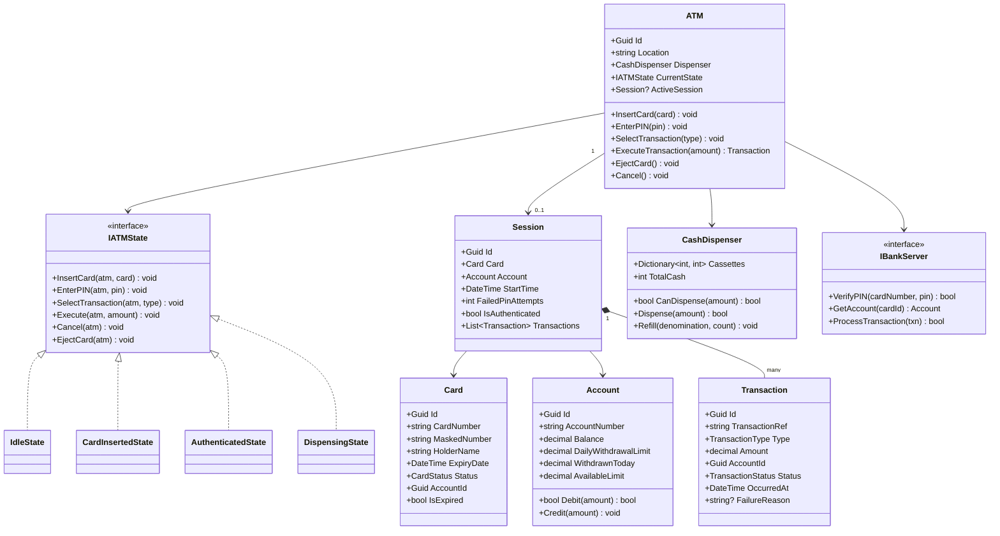

# LLD 13 – ATM System

---

## 1. Interview Approach (Step-by-Step)

**Step 1 – Clarify Requirements (2 min)**

- Single ATM or a network of ATMs?
- Transaction types: cash withdrawal, deposit, balance inquiry, mini statement, fund transfer?
- PIN-based auth or card + PIN?
- Daily withdrawal limits?
- Multi-currency support?

**Step 2 – Define Core Entities**
ATM, Card, Account, BankServer, Transaction, CashDispenser, CardReader, Display, Receipt

**Step 3 – State Machine (Key Design)**
"An ATM is a state machine. States: Idle → CardInserted → PINEntered → TransactionSelected → Processing → Dispensing → Ejecting. Each state restricts what operations are valid."

**Step 4 – Security Considerations**
"PIN is never stored in plain text — only hashed (bcrypt/SHA-256 + salt). All transactions are logged for audit. Lockout after 3 wrong PIN attempts. Session timeout after 30 seconds of inactivity."

**Step 5 – Patterns**
State for ATM lifecycle, Strategy for transaction types, Command for transaction actions (undo/log), Template Method for transaction processing skeleton.

---

## 2. Requirements & Assumptions

**Functional:**

- Card insertion and PIN authentication
- Withdrawal (with denomination selection), balance inquiry, mini statement, fund transfer
- Receipt printing
- Card block after 3 failed PIN attempts
- Daily and per-transaction withdrawal limits

**Non-Functional:**

- No race conditions on account balance updates
- All transactions audited
- Session secured (timeout, card ejection)

---

## 3. Core Entities

| Entity          | Responsibility                                                   |
| --------------- | ---------------------------------------------------------------- |
| `ATM`           | Physical machine; manages hardware peripherals and session state |
| `ATMState`      | Current state of the ATM machine                                 |
| `Card`          | Bank card with account link                                      |
| `Account`       | Bank account with balance                                        |
| `BankServer`    | Backend bank system (PIN verification, transactions)             |
| `CashDispenser` | Manages cash cassettes and dispensing                            |
| `Transaction`   | Atomic financial operation record                                |
| `Session`       | Active ATM session for one card                                  |

**Enums:**

```
ATMStateType      : Idle, CardInserted, Authenticated, TransactionSelected, Dispensing, Error
TransactionType   : Withdrawal, Deposit, BalanceInquiry, MiniStatement, FundTransfer
TransactionStatus : Success, Failed, Cancelled
CardStatus        : Active, Blocked, Expired
```

---

## 4. Class Relationship Diagram



---

## 5. DB Schema

```sql
-- Accounts
CREATE TABLE Accounts (
    Id                   UNIQUEIDENTIFIER PRIMARY KEY DEFAULT NEWID(),
    AccountNumber        VARCHAR(20)   NOT NULL UNIQUE,
    HolderName           NVARCHAR(200) NOT NULL,
    Balance              DECIMAL(14,2) NOT NULL DEFAULT 0,
    DailyWithdrawalLimit DECIMAL(10,2) NOT NULL DEFAULT 25000,
    WithdrawnToday       DECIMAL(10,2) NOT NULL DEFAULT 0,
    WithdrawalResetDate  DATE          NOT NULL DEFAULT GETUTCDATE(),
    RowVersion           ROWVERSION    -- Optimistic concurrency
);

-- Cards
CREATE TABLE Cards (
    Id          UNIQUEIDENTIFIER PRIMARY KEY DEFAULT NEWID(),
    AccountId   UNIQUEIDENTIFIER NOT NULL REFERENCES Accounts(Id),
    CardNumber  VARCHAR(20)      NOT NULL UNIQUE,
    HolderName  NVARCHAR(200)    NOT NULL,
    ExpiryDate  DATE             NOT NULL,
    PINHash     NVARCHAR(200)    NOT NULL,  -- bcrypt hash, NEVER plain text
    Status      VARCHAR(10)      NOT NULL DEFAULT 'Active',
    FailedAttempts INT           NOT NULL DEFAULT 0
);

-- ATMs
CREATE TABLE ATMs (
    Id       UNIQUEIDENTIFIER PRIMARY KEY DEFAULT NEWID(),
    Location NVARCHAR(300) NOT NULL,
    IsOnline BIT           NOT NULL DEFAULT 1
);

-- Sessions
CREATE TABLE ATMSessions (
    Id            UNIQUEIDENTIFIER PRIMARY KEY DEFAULT NEWID(),
    ATMId         UNIQUEIDENTIFIER NOT NULL REFERENCES ATMs(Id),
    CardId        UNIQUEIDENTIFIER NOT NULL REFERENCES Cards(Id),
    StartTime     DATETIME         NOT NULL DEFAULT GETUTCDATE(),
    EndTime       DATETIME         NULL,
    IsAuthenticated BIT            NOT NULL DEFAULT 0
);

-- Transactions (immutable audit log)
CREATE TABLE Transactions (
    Id             UNIQUEIDENTIFIER PRIMARY KEY DEFAULT NEWID(),
    TransactionRef VARCHAR(30)      NOT NULL UNIQUE,
    SessionId      UNIQUEIDENTIFIER NOT NULL REFERENCES ATMSessions(Id),
    AccountId      UNIQUEIDENTIFIER NOT NULL REFERENCES Accounts(Id),
    Type           VARCHAR(20)      NOT NULL,
    Amount         DECIMAL(12,2)    NOT NULL,
    BalanceAfter   DECIMAL(12,2)    NOT NULL,
    Status         VARCHAR(20)      NOT NULL,
    OccurredAt     DATETIME         NOT NULL DEFAULT GETUTCDATE(),
    FailureReason  NVARCHAR(300)    NULL,
    INDEX IX_Txn_Account_Date (AccountId, OccurredAt DESC)
);
```

---

## 6. Design Patterns

| Pattern             | Where                                        | Why                                                                            |
| ------------------- | -------------------------------------------- | ------------------------------------------------------------------------------ |
| **State**           | `IATMState` with concrete states             | ATM operations are only valid in certain states — prevents invalid transitions |
| **Strategy**        | `ITransactionHandler`                        | Each transaction type (withdraw, deposit, transfer) has its own handler        |
| **Command**         | `WithdrawalCommand`, `BalanceInquiryCommand` | Encapsulate transactions; supports logging, audit, and retry                   |
| **Template Method** | `TransactionProcessor.Execute()`             | Fixed skeleton: validate → check limit → execute → log → receipt               |
| **Proxy**           | `BankServerProxy`                            | Caches account info; adds retry logic for network calls to bank                |
| **Null Object**     | Idle ATM state                               | Gracefully ignores invalid operations in idle state                            |

---

## 7. SOLID Principles

| Principle | Application                                                                                       |
| --------- | ------------------------------------------------------------------------------------------------- |
| **S**     | `CashDispenser` manages cash only; `Account` manages balance only; `Card` manages card state      |
| **O**     | Add new transaction type (mobile number link) by adding `ITransactionHandler` impl                |
| **L**     | All `IATMState` implementations handle the same interface; ATM doesn't know which state is active |
| **I**     | `ICardReader`, `ICashDispenser`, `IReceiptPrinter` are separate hardware abstractions             |
| **D**     | `ATM` depends on `IBankServer` abstraction — not a specific bank's implementation                 |

---

## 8. C# Implementation

```csharp
// ─── Enums ───────────────────────────────────────────────────────────────────
public enum ATMStateType      { Idle, CardInserted, Authenticated, Dispensing, Error }
public enum TransactionType   { Withdrawal, Deposit, BalanceInquiry, MiniStatement, FundTransfer }
public enum TransactionStatus { Success, Failed, Cancelled }
public enum CardStatus        { Active, Blocked, Expired }

// ─── Account ──────────────────────────────────────────────────────────────────
public class Account
{
    private readonly object _lock = new();

    public Guid    Id                   { get; init; } = Guid.NewGuid();
    public string  AccountNumber        { get; init; } = default!;
    public decimal Balance              { get; private set; }
    public decimal DailyWithdrawalLimit { get; init; } = 25000m;
    public decimal WithdrawnToday       { get; private set; }
    public decimal AvailableLimit       => DailyWithdrawalLimit - WithdrawnToday;

    public bool Debit(decimal amount)
    {
        lock (_lock)
        {
            if (amount <= 0) throw new ArgumentException("Amount must be positive.");
            if (amount > Balance)      return false; // Insufficient funds
            if (amount > AvailableLimit) return false; // Daily limit exceeded
            Balance        -= amount;
            WithdrawnToday += amount;
            return true;
        }
    }

    public void Credit(decimal amount)
    {
        lock (_lock)
        {
            if (amount <= 0) throw new ArgumentException("Amount must be positive.");
            Balance += amount;
        }
    }

    public void ResetDailyLimit() => WithdrawnToday = 0;
}

// ─── Card ─────────────────────────────────────────────────────────────────────
public class Card
{
    public Guid       Id           { get; init; } = Guid.NewGuid();
    public string     CardNumber   { get; init; } = default!;
    public string     MaskedNumber => $"**** **** **** {CardNumber[^4..]}";
    public string     HolderName   { get; init; } = default!;
    public DateTime   ExpiryDate   { get; init; }
    public string     PINHash      { get; init; } = default!; // bcrypt hash
    public CardStatus Status       { get; private set; } = CardStatus.Active;
    public int        FailedAttempts { get; private set; }
    public Guid       AccountId    { get; init; }

    public bool IsExpired => DateTime.UtcNow.Date > ExpiryDate.Date;
    public bool IsBlocked => Status == CardStatus.Blocked;

    public bool VerifyPIN(string enteredPin)
    {
        // Real impl uses BCrypt.Verify(enteredPin, PINHash)
        var isCorrect = enteredPin == PINHash; // Simplified for demo
        if (!isCorrect)
        {
            FailedAttempts++;
            if (FailedAttempts >= 3) Block();
        }
        else
        {
            FailedAttempts = 0;
        }
        return isCorrect;
    }

    public void Block()    => Status = CardStatus.Blocked;
    public void Unblock()  { Status = CardStatus.Active; FailedAttempts = 0; }
}

// ─── ATM State Machine ────────────────────────────────────────────────────────
public interface IATMState
{
    void InsertCard(ATMContext atm, Card card);
    void EnterPIN(ATMContext atm, string pin);
    void SelectTransaction(ATMContext atm, TransactionType type);
    void Execute(ATMContext atm, decimal amount);
    void Cancel(ATMContext atm);
    void EjectCard(ATMContext atm);
}

// Context passed around to avoid circular deps
public class ATMContext
{
    public Card?           InsertedCard   { get; set; }
    public Account?        ActiveAccount  { get; set; }
    public TransactionType SelectedType   { get; set; }
    public bool            IsAuthenticated { get; set; }
    public IATMState       State          { get; set; } = new IdleState();
    public CashDispenser   Dispenser      { get; init; } = default!;
    public IBankServer     BankServer     { get; init; } = default!;
    public List<Transaction> SessionTxns { get; } = new();

    public void TransitionTo(IATMState newState) => State = newState;
}

public class IdleState : IATMState
{
    public void InsertCard(ATMContext atm, Card card)
    {
        if (card.IsExpired || card.IsBlocked)
        {
            Console.WriteLine("[ATM] Card cannot be used.");
            return;
        }
        atm.InsertedCard = card;
        atm.TransitionTo(new CardInsertedState());
        Console.WriteLine("[ATM] Card accepted. Please enter your PIN.");
    }
    public void EnterPIN(ATMContext atm, string pin)     => Console.WriteLine("[ATM] Please insert card first.");
    public void SelectTransaction(ATMContext atm, TransactionType type) => Console.WriteLine("[ATM] Please insert card first.");
    public void Execute(ATMContext atm, decimal amount)  => Console.WriteLine("[ATM] Please insert card first.");
    public void Cancel(ATMContext atm)                   => Console.WriteLine("[ATM] No active session.");
    public void EjectCard(ATMContext atm)                => Console.WriteLine("[ATM] No card inserted.");
}

public class CardInsertedState : IATMState
{
    public void InsertCard(ATMContext atm, Card card)    => Console.WriteLine("[ATM] Card already inserted.");
    public void EnterPIN(ATMContext atm, string pin)
    {
        if (atm.InsertedCard!.VerifyPIN(pin))
        {
            atm.IsAuthenticated = true;
            atm.ActiveAccount   = atm.BankServer.GetAccount(atm.InsertedCard.AccountId);
            atm.TransitionTo(new AuthenticatedState());
            Console.WriteLine("[ATM] PIN correct. Select transaction.");
        }
        else if (atm.InsertedCard.IsBlocked)
        {
            Console.WriteLine("[ATM] Card blocked after 3 failed attempts.");
            EjectCard(atm);
        }
        else
        {
            Console.WriteLine($"[ATM] Incorrect PIN. {3 - atm.InsertedCard.FailedAttempts} attempts remaining.");
        }
    }
    public void SelectTransaction(ATMContext atm, TransactionType t) => Console.WriteLine("[ATM] Please enter PIN first.");
    public void Execute(ATMContext atm, decimal a)   => Console.WriteLine("[ATM] Please enter PIN first.");
    public void Cancel(ATMContext atm)               => EjectCard(atm);
    public void EjectCard(ATMContext atm)
    {
        atm.InsertedCard = null;
        atm.TransitionTo(new IdleState());
        Console.WriteLine("[ATM] Card ejected.");
    }
}

public class AuthenticatedState : IATMState
{
    public void InsertCard(ATMContext atm, Card card)    => Console.WriteLine("[ATM] Session active.");
    public void EnterPIN(ATMContext atm, string pin)     => Console.WriteLine("[ATM] Already authenticated.");
    public void SelectTransaction(ATMContext atm, TransactionType type)
    {
        atm.SelectedType = type;
        Console.WriteLine($"[ATM] Transaction selected: {type}");
    }
    public void Execute(ATMContext atm, decimal amount)
    {
        var txn = new Transaction
        {
            TransactionRef = $"TXN-{DateTime.UtcNow.Ticks}",
            Type           = atm.SelectedType,
            AccountId      = atm.ActiveAccount!.Id,
            Amount         = amount
        };

        var success = atm.SelectedType switch
        {
            TransactionType.Withdrawal    => ProcessWithdrawal(atm, amount, txn),
            TransactionType.BalanceInquiry => ProcessBalanceInquiry(atm, txn),
            TransactionType.Deposit        => ProcessDeposit(atm, amount, txn),
            _                             => false
        };

        txn.Status = success ? TransactionStatus.Success : TransactionStatus.Failed;
        atm.SessionTxns.Add(txn);
    }
    public void Cancel(ATMContext atm)   => EjectCard(atm);
    public void EjectCard(ATMContext atm)
    {
        atm.InsertedCard    = null;
        atm.ActiveAccount   = null;
        atm.IsAuthenticated = false;
        atm.TransitionTo(new IdleState());
        Console.WriteLine("[ATM] Session ended. Card ejected. Goodbye!");
    }

    private bool ProcessWithdrawal(ATMContext atm, decimal amount, Transaction txn)
    {
        if (!atm.Dispenser.CanDispense(amount)) { txn.FailureReason = "ATM insufficient cash."; return false; }
        if (!atm.ActiveAccount!.Debit(amount))  { txn.FailureReason = "Insufficient funds or daily limit."; return false; }
        atm.Dispenser.Dispense(amount);
        txn.BalanceAfter = atm.ActiveAccount.Balance;
        Console.WriteLine($"[ATM] Dispensing ₹{amount}. New balance: ₹{txn.BalanceAfter}");
        return true;
    }

    private bool ProcessBalanceInquiry(ATMContext atm, Transaction txn)
    {
        txn.BalanceAfter = atm.ActiveAccount!.Balance;
        Console.WriteLine($"[ATM] Available balance: ₹{atm.ActiveAccount.Balance}");
        return true;
    }

    private bool ProcessDeposit(ATMContext atm, decimal amount, Transaction txn)
    {
        atm.ActiveAccount!.Credit(amount);
        txn.BalanceAfter = atm.ActiveAccount.Balance;
        Console.WriteLine($"[ATM] ₹{amount} deposited. New balance: ₹{txn.BalanceAfter}");
        return true;
    }
}

// ─── Cash Dispenser ───────────────────────────────────────────────────────────
public class CashDispenser
{
    // Cassettes: denomination → count
    private readonly SortedDictionary<int, int> _cassettes = new(Comparer<int>.Create((a, b) => b.CompareTo(a)));

    public int TotalCash => _cassettes.Sum(kv => kv.Key * kv.Value);

    public void Refill(int denomination, int count) => _cassettes[denomination] = (_cassettes.GetValueOrDefault(denomination)) + count;

    public bool CanDispense(decimal amount)
    {
        return Simulate((int)amount, new SortedDictionary<int, int>(_cassettes, Comparer<int>.Create((a, b) => b.CompareTo(a))));
    }

    public bool Dispense(decimal amount)
    {
        // Greedy algorithm: largest denomination first
        int remaining = (int)amount;
        foreach (var (denom, count) in _cassettes.ToList())
        {
            int use = Math.Min(count, remaining / denom);
            _cassettes[denom] -= use;
            remaining         -= use * denom;
        }
        return remaining == 0;
    }

    private bool Simulate(int amount, SortedDictionary<int, int> cassettes)
    {
        foreach (var (denom, count) in cassettes.ToList())
        {
            int use = Math.Min(count, amount / denom);
            amount -= use * denom;
        }
        return amount == 0;
    }
}

// ─── Transaction & Bank Server ────────────────────────────────────────────────
public class Transaction
{
    public Guid             Id             { get; } = Guid.NewGuid();
    public string           TransactionRef { get; init; } = default!;
    public TransactionType  Type           { get; init; }
    public decimal          Amount         { get; init; }
    public Guid             AccountId      { get; init; }
    public TransactionStatus Status        { get; set; } = TransactionStatus.Failed;
    public decimal          BalanceAfter   { get; set; }
    public string?          FailureReason  { get; set; }
    public DateTime         OccurredAt     { get; } = DateTime.UtcNow;
}

public interface IBankServer
{
    Account GetAccount(Guid accountId);
    bool VerifyPIN(string cardNumber, string pin);
}
```

---

## Key Discussion Points for Interview

1. **State Machine is Central**: Emphasize that ATM is a classic state machine. Draw the state diagram: Idle → CardInserted → Authenticated → [Withdraw/Balance/Deposit] → Idle. Each state only handles valid operations; others are gracefully rejected.

2. **PIN Security**: PIN is hashed with bcrypt (salted). The ATM sends the entered PIN to BankServer which hashes and compares. ATM never stores PINs. After 3 failures, card is blocked at both ATM and BankServer.

3. **Concurrency on Account**: Two ATMs could try to debit the same account simultaneously. The `lock` in `Account.Debit()` handles this locally. At bank-server level, use `UPDATE Accounts SET Balance -= @amount WHERE Id = @id AND Balance >= @amount` — single atomic DB statement.

4. **Cash Dispenser – Greedy Algorithm**: Use largest denomination first (₹2000 → ₹500 → ₹200 → ₹100). Simulate before dispensing to ensure exact amount is possible.

5. **Session Timeout**: Not shown in code but critical: a background timer resets the ATM to Idle state and ejects the card after 30 seconds of inactivity in any state other than Idle.
