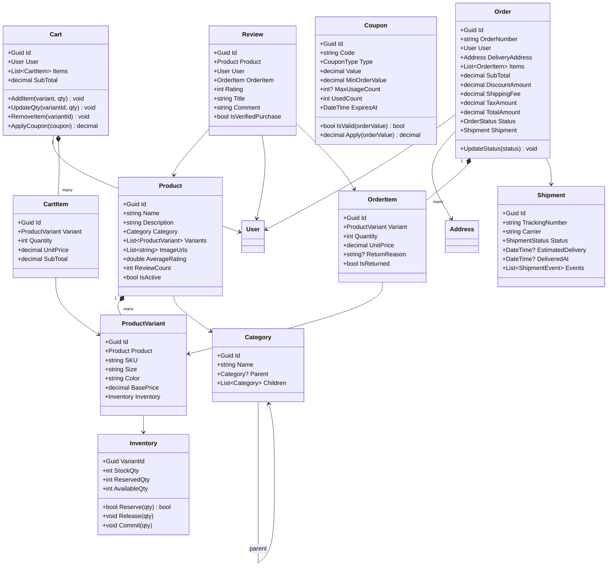

# LLD 14 – E-commerce Website

---

## 1. Interview Approach (Step-by-Step)

**Step 1 – Clarify Requirements (2 min)**

- Single seller (like a brand site) or multi-vendor marketplace?
- Product variants (size, color)?
- Coupon/discount support?
- Multiple delivery addresses per order?
- Return/refund workflow?
- Reviews and ratings?

**Step 2 – Define Core Entities**
User, Product, Category, ProductVariant, Inventory, Cart, CartItem, Order, OrderItem, Payment, Shipment, Address, Review, Coupon

**Step 3 – Key Workflows**
Browse → Product Detail → Add to Cart → Apply Coupon → Checkout (select address, payment) → Order Placed → Shipped → Delivered → Return/Review

**Step 4 – Inventory & Concurrency**
"Reserve inventory when order is placed, not when added to cart. If payment fails, release reservation. Use `RowVersion` for optimistic concurrency."

**Step 5 – Patterns**
Strategy for discount calculation, Builder for order creation, Observer for order status changes, Decorator for pricing (coupon + tax + shipping), State for order lifecycle.

---

## 2. Requirements & Assumptions

**Functional:**

- Product catalog with categories, variants, images
- Search and filter products
- Cart with persistent storage (logged-in users)
- Checkout: address selection, coupon, payment
- Order management with status tracking
- Shipment tracking
- Product reviews after purchase

**Non-Functional:**

- No overselling — atomic inventory reservation
- Order confirmation within 5 seconds
- Product search must be fast

---

## 3. Core Entities

| Entity           | Responsibility                           |
| ---------------- | ---------------------------------------- |
| `Product`        | Catalog item with variants and images    |
| `ProductVariant` | Specific SKU (size L, Blue = unique SKU) |
| `Category`       | Hierarchical product classification      |
| `Inventory`      | Stock per variant                        |
| `User`           | Customer account                         |
| `Address`        | Delivery address linked to user          |
| `Cart`           | Pre-checkout item basket                 |
| `Order`          | Confirmed purchase                       |
| `OrderItem`      | Line item in an order                    |
| `Shipment`       | Delivery tracking                        |
| `Coupon`         | Discount code                            |
| `Payment`        | Transaction record                       |
| `Review`         | Post-purchase product review             |

**Enums:**

```
OrderStatus    : Pending, Confirmed, Processing, Shipped, Delivered, Cancelled, Returned
ShipmentStatus : NotShipped, InTransit, OutForDelivery, Delivered, Returned
PaymentStatus  : Pending, Completed, Failed, Refunded
CouponType     : FixedAmount, Percentage, FreeShipping
```

---

## 4. Class Relationship Diagram



---

## 5. DB Schema

```sql
-- Categories (self-referencing)
CREATE TABLE Categories (
    Id       UNIQUEIDENTIFIER PRIMARY KEY DEFAULT NEWID(),
    Name     NVARCHAR(100) NOT NULL,
    ParentId UNIQUEIDENTIFIER NULL REFERENCES Categories(Id),
    IsActive BIT NOT NULL DEFAULT 1
);

-- Products
CREATE TABLE Products (
    Id            UNIQUEIDENTIFIER PRIMARY KEY DEFAULT NEWID(),
    Name          NVARCHAR(300) NOT NULL,
    Description   NVARCHAR(MAX) NULL,
    CategoryId    UNIQUEIDENTIFIER NOT NULL REFERENCES Categories(Id),
    AverageRating FLOAT         NOT NULL DEFAULT 0,
    ReviewCount   INT           NOT NULL DEFAULT 0,
    IsActive      BIT           NOT NULL DEFAULT 1,
    CreatedAt     DATETIME      NOT NULL DEFAULT GETUTCDATE(),
    INDEX IX_Products_Category (CategoryId, IsActive)
);

-- Product Variants (SKUs)
CREATE TABLE ProductVariants (
    Id        UNIQUEIDENTIFIER PRIMARY KEY DEFAULT NEWID(),
    ProductId UNIQUEIDENTIFIER NOT NULL REFERENCES Products(Id),
    SKU       VARCHAR(50)      NOT NULL UNIQUE,
    Size      NVARCHAR(20)     NULL,
    Color     NVARCHAR(50)     NULL,
    BasePrice DECIMAL(10,2)    NOT NULL,
    IsActive  BIT              NOT NULL DEFAULT 1
);

-- Inventory
CREATE TABLE Inventory (
    VariantId   UNIQUEIDENTIFIER PRIMARY KEY REFERENCES ProductVariants(Id),
    StockQty    INT NOT NULL DEFAULT 0,
    ReservedQty INT NOT NULL DEFAULT 0,
    RowVersion  ROWVERSION      -- Optimistic concurrency
);

-- Users
CREATE TABLE Users (
    Id       UNIQUEIDENTIFIER PRIMARY KEY DEFAULT NEWID(),
    Email    NVARCHAR(256) NOT NULL UNIQUE,
    FullName NVARCHAR(200) NOT NULL,
    Phone    VARCHAR(20)   NULL
);

-- Addresses
CREATE TABLE Addresses (
    Id        UNIQUEIDENTIFIER PRIMARY KEY DEFAULT NEWID(),
    UserId    UNIQUEIDENTIFIER NOT NULL REFERENCES Users(Id),
    Label     NVARCHAR(50)     NOT NULL,   -- Home, Work, etc.
    Line1     NVARCHAR(300)    NOT NULL,
    City      NVARCHAR(100)    NOT NULL,
    State     NVARCHAR(100)    NOT NULL,
    PinCode   VARCHAR(10)      NOT NULL,
    Country   NVARCHAR(50)     NOT NULL DEFAULT 'India',
    IsDefault BIT              NOT NULL DEFAULT 0
);

-- Carts
CREATE TABLE Carts (
    Id     UNIQUEIDENTIFIER PRIMARY KEY DEFAULT NEWID(),
    UserId UNIQUEIDENTIFIER NOT NULL UNIQUE REFERENCES Users(Id)
);

-- Cart Items
CREATE TABLE CartItems (
    Id        UNIQUEIDENTIFIER PRIMARY KEY DEFAULT NEWID(),
    CartId    UNIQUEIDENTIFIER NOT NULL REFERENCES Carts(Id),
    VariantId UNIQUEIDENTIFIER NOT NULL REFERENCES ProductVariants(Id),
    Quantity  INT              NOT NULL CHECK (Quantity > 0),
    UnitPrice DECIMAL(10,2)    NOT NULL,
    UNIQUE (CartId, VariantId)
);

-- Coupons
CREATE TABLE Coupons (
    Id            UNIQUEIDENTIFIER PRIMARY KEY DEFAULT NEWID(),
    Code          VARCHAR(30)   NOT NULL UNIQUE,
    Type          VARCHAR(20)   NOT NULL,
    Value         DECIMAL(10,2) NOT NULL,
    MinOrderValue DECIMAL(10,2) NOT NULL DEFAULT 0,
    MaxUsageCount INT           NULL,
    UsedCount     INT           NOT NULL DEFAULT 0,
    ExpiresAt     DATETIME      NOT NULL,
    IsActive      BIT           NOT NULL DEFAULT 1
);

-- Orders
CREATE TABLE Orders (
    Id             UNIQUEIDENTIFIER PRIMARY KEY DEFAULT NEWID(),
    OrderNumber    VARCHAR(30)      NOT NULL UNIQUE,
    UserId         UNIQUEIDENTIFIER NOT NULL REFERENCES Users(Id),
    AddressId      UNIQUEIDENTIFIER NOT NULL REFERENCES Addresses(Id),
    CouponId       UNIQUEIDENTIFIER NULL REFERENCES Coupons(Id),
    SubTotal       DECIMAL(10,2)    NOT NULL,
    DiscountAmount DECIMAL(10,2)    NOT NULL DEFAULT 0,
    ShippingFee    DECIMAL(10,2)    NOT NULL DEFAULT 0,
    TaxAmount      DECIMAL(10,2)    NOT NULL DEFAULT 0,
    TotalAmount    DECIMAL(10,2)    NOT NULL,
    Status         VARCHAR(20)      NOT NULL DEFAULT 'Pending',
    PlacedAt       DATETIME         NOT NULL DEFAULT GETUTCDATE(),
    INDEX IX_Orders_User   (UserId, Status),
    INDEX IX_Orders_Status (Status, PlacedAt)
);

-- Order Items
CREATE TABLE OrderItems (
    Id        UNIQUEIDENTIFIER PRIMARY KEY DEFAULT NEWID(),
    OrderId   UNIQUEIDENTIFIER NOT NULL REFERENCES Orders(Id),
    VariantId UNIQUEIDENTIFIER NOT NULL REFERENCES ProductVariants(Id),
    Quantity  INT              NOT NULL,
    UnitPrice DECIMAL(10,2)    NOT NULL,
    IsReturned BIT             NOT NULL DEFAULT 0,
    ReturnReason NVARCHAR(300) NULL
);

-- Payments
CREATE TABLE Payments (
    Id        UNIQUEIDENTIFIER PRIMARY KEY DEFAULT NEWID(),
    OrderId   UNIQUEIDENTIFIER NOT NULL REFERENCES Orders(Id),
    Amount    DECIMAL(10,2)    NOT NULL,
    Method    VARCHAR(20)      NOT NULL,
    Status    VARCHAR(20)      NOT NULL,
    GatewayRef VARCHAR(100)    NULL,
    PaidAt    DATETIME         NULL,
    RefundedAt DATETIME        NULL
);

-- Shipments
CREATE TABLE Shipments (
    Id               UNIQUEIDENTIFIER PRIMARY KEY DEFAULT NEWID(),
    OrderId          UNIQUEIDENTIFIER NOT NULL UNIQUE REFERENCES Orders(Id),
    TrackingNumber   VARCHAR(50)      NOT NULL,
    Carrier          NVARCHAR(100)    NOT NULL,
    Status           VARCHAR(30)      NOT NULL DEFAULT 'NotShipped',
    EstimatedDelivery DATE            NULL,
    DeliveredAt      DATETIME         NULL
);

-- Reviews
CREATE TABLE Reviews (
    Id              UNIQUEIDENTIFIER PRIMARY KEY DEFAULT NEWID(),
    ProductId       UNIQUEIDENTIFIER NOT NULL REFERENCES Products(Id),
    UserId          UNIQUEIDENTIFIER NOT NULL REFERENCES Users(Id),
    OrderItemId     UNIQUEIDENTIFIER NOT NULL REFERENCES OrderItems(Id),
    Rating          TINYINT          NOT NULL CHECK (Rating BETWEEN 1 AND 5),
    Title           NVARCHAR(200)    NULL,
    Comment         NVARCHAR(MAX)    NULL,
    IsVerifiedPurchase BIT           NOT NULL DEFAULT 1,
    CreatedAt       DATETIME         NOT NULL DEFAULT GETUTCDATE(),
    UNIQUE (ProductId, UserId)  -- One review per product per user
);
```

---

## 6. Design Patterns

| Pattern        | Where                                            | Why                                                                           |
| -------------- | ------------------------------------------------ | ----------------------------------------------------------------------------- |
| **State**      | `Order.Status` lifecycle                         | Prevent invalid transitions (e.g., cannot ship a cancelled order)             |
| **Strategy**   | `IDiscountStrategy`                              | Coupon types (fixed, percentage, free shipping) as interchangeable strategies |
| **Decorator**  | `PriceCalculator`                                | Compose base price + coupon discount + tax + shipping fee                     |
| **Observer**   | Order status changes → Notifications + Inventory | Notify user of status changes; trigger shipment creation                      |
| **Builder**    | `OrderBuilder`                                   | Construct order from cart, address, coupon, and shipping method               |
| **Repository** | `IProductRepository`, `IOrderRepository`         | Abstract data access for clean domain layer                                   |

---

## 7. SOLID Principles

| Principle | Application                                                                                  |
| --------- | -------------------------------------------------------------------------------------------- |
| **S**     | `Inventory` only tracks stock; `Coupon` only calculates discount; `Shipment` tracks delivery |
| **O**     | Add new discount type by implementing `IDiscountStrategy`; `CheckoutService` unchanged       |
| **L**     | Any `IDiscountStrategy` substitutes in `CheckoutService`                                     |
| **I**     | `IInventoryRepository`, `ICouponValidator`, `IShipmentService` are focused interfaces        |
| **D**     | `CheckoutService` depends on `IInventoryRepository`, `IPaymentGateway`, `IDiscountStrategy`  |

---

## 8. C# Implementation

```csharp
// ─── Enums ───────────────────────────────────────────────────────────────────
public enum OrderStatus    { Pending, Confirmed, Processing, Shipped, Delivered, Cancelled, Returned }
public enum ShipmentStatus { NotShipped, InTransit, OutForDelivery, Delivered, Returned }
public enum CouponType     { FixedAmount, Percentage, FreeShipping }

// ─── Inventory ────────────────────────────────────────────────────────────────
public class Inventory
{
    private readonly object _lock = new();
    public Guid VariantId   { get; init; }
    public int  StockQty    { get; private set; }
    public int  ReservedQty { get; private set; }
    public int  AvailableQty => StockQty - ReservedQty;

    public bool TryReserve(int qty)
    {
        lock (_lock)
        {
            if (AvailableQty < qty) return false;
            ReservedQty += qty;
            return true;
        }
    }
    public void Release(int qty) { lock (_lock) { ReservedQty = Math.Max(0, ReservedQty - qty); } }
    public void Commit(int qty)  { lock (_lock) { StockQty -= qty; ReservedQty -= qty; } }
    public void Restock(int qty) { lock (_lock) { StockQty += qty; } }
}

// ─── Coupon (Strategy Pattern) ────────────────────────────────────────────────
public interface IDiscountStrategy
{
    decimal Apply(decimal orderValue, decimal shippingFee);
}

public class FixedAmountDiscount : IDiscountStrategy
{
    private readonly decimal _amount;
    public FixedAmountDiscount(decimal amount) => _amount = amount;
    public decimal Apply(decimal orderValue, decimal shippingFee) => Math.Min(_amount, orderValue);
}

public class PercentageDiscount : IDiscountStrategy
{
    private readonly decimal _pct;
    private readonly decimal _maxCap;
    public PercentageDiscount(decimal pct, decimal maxCap = 1000m) { _pct = pct; _maxCap = maxCap; }
    public decimal Apply(decimal orderValue, decimal shippingFee)
        => Math.Min(Math.Round(orderValue * _pct / 100, 2), _maxCap);
}

public class FreeShippingDiscount : IDiscountStrategy
{
    public decimal Apply(decimal orderValue, decimal shippingFee) => shippingFee;
}

public class Coupon
{
    public Guid    Id            { get; init; } = Guid.NewGuid();
    public string  Code          { get; init; } = default!;
    public decimal MinOrderValue { get; init; }
    public int?    MaxUsageCount { get; init; }
    public int     UsedCount     { get; private set; }
    public DateTime ExpiresAt    { get; init; }
    public IDiscountStrategy Strategy { get; init; } = default!;

    public bool IsValid(decimal orderValue)
        => DateTime.UtcNow < ExpiresAt &&
           orderValue >= MinOrderValue &&
           (MaxUsageCount is null || UsedCount < MaxUsageCount);

    public decimal Apply(decimal orderValue, decimal shippingFee)
    {
        UsedCount++;
        return Strategy.Apply(orderValue, shippingFee);
    }
}

// ─── Order ────────────────────────────────────────────────────────────────────
public class OrderItem
{
    public Guid    Id           { get; init; } = Guid.NewGuid();
    public Guid    VariantId    { get; init; }
    public string  VariantSKU   { get; init; } = default!;
    public string  ProductName  { get; init; } = default!;
    public int     Quantity     { get; init; }
    public decimal UnitPrice    { get; init; }
    public decimal SubTotal     => UnitPrice * Quantity;
    public bool    IsReturned   { get; private set; }
    public string? ReturnReason { get; private set; }
    public void MarkReturned(string reason) { IsReturned = true; ReturnReason = reason; }
}

public class Order
{
    private readonly List<OrderItem> _items = new();

    public Guid       Id             { get; } = Guid.NewGuid();
    public string     OrderNumber    { get; init; } = default!;
    public Guid       UserId         { get; init; }
    public Guid       AddressId      { get; init; }
    public IReadOnlyList<OrderItem> Items => _items.AsReadOnly();
    public decimal    SubTotal       => _items.Sum(i => i.SubTotal);
    public decimal    DiscountAmount { get; private set; }
    public decimal    ShippingFee    { get; private set; }
    public decimal    TaxAmount      { get; private set; }
    public decimal    TotalAmount    => SubTotal - DiscountAmount + ShippingFee + TaxAmount;
    public OrderStatus Status        { get; private set; } = OrderStatus.Pending;
    public DateTime   PlacedAt       { get; } = DateTime.UtcNow;

    public void AddItem(OrderItem item) => _items.Add(item);
    public void SetCharges(decimal discount, decimal shipping, decimal tax)
    {
        DiscountAmount = discount;
        ShippingFee    = shipping;
        TaxAmount      = tax;
    }

    public void UpdateStatus(OrderStatus newStatus)
    {
        // Validate transition
        bool valid = (Status, newStatus) switch
        {
            (OrderStatus.Pending,    OrderStatus.Confirmed)  => true,
            (OrderStatus.Confirmed,  OrderStatus.Processing) => true,
            (OrderStatus.Processing, OrderStatus.Shipped)    => true,
            (OrderStatus.Shipped,    OrderStatus.Delivered)  => true,
            (OrderStatus.Delivered,  OrderStatus.Returned)   => true,
            (OrderStatus.Pending,    OrderStatus.Cancelled)  => true,
            (OrderStatus.Confirmed,  OrderStatus.Cancelled)  => true,
            _ => false
        };
        if (!valid) throw new InvalidOperationException($"Invalid status transition: {Status} → {newStatus}");
        Status = newStatus;
    }
}

// ─── Checkout Service (Facade) ────────────────────────────────────────────────
public interface IInventoryRepository { Inventory GetByVariantId(Guid variantId); }
public interface IPaymentGateway      { (bool success, string? transactionId) Charge(decimal amount, string method, string orderId); }
public interface IOrderRepository     { void Save(Order order); }

public class CheckoutService
{
    private readonly IInventoryRepository _inventory;
    private readonly IPaymentGateway      _payment;
    private readonly IOrderRepository     _orders;
    private const    decimal TaxRate     = 0.18m;
    private const    decimal ShippingFee = 49m;
    private const    decimal FreeShipThreshold = 499m;

    public CheckoutService(IInventoryRepository inv, IPaymentGateway pay, IOrderRepository orders)
    {
        _inventory = inv;
        _payment   = pay;
        _orders    = orders;
    }

    public Order Checkout(
        Guid userId, Guid addressId,
        IEnumerable<CartItem> cartItems,
        string paymentMethod,
        Coupon? coupon = null)
    {
        var order = new Order { OrderNumber = $"ORD-{DateTime.UtcNow.Ticks}", UserId = userId, AddressId = addressId };

        // 1. Add items and reserve inventory
        var reserved = new List<(Inventory inv, int qty)>();
        try
        {
            foreach (var item in cartItems)
            {
                var inv = _inventory.GetByVariantId(item.Variant.Id);
                if (!inv.TryReserve(item.Quantity))
                    throw new InvalidOperationException($"'{item.Variant.SKU}' out of stock.");

                reserved.Add((inv, item.Quantity));
                order.AddItem(new OrderItem
                {
                    VariantId   = item.Variant.Id,
                    VariantSKU  = item.Variant.SKU,
                    ProductName = item.Variant.Product?.Name ?? "Product",
                    Quantity    = item.Quantity,
                    UnitPrice   = item.UnitPrice
                });
            }

            // 2. Calculate charges
            var shipping  = order.SubTotal >= FreeShipThreshold ? 0m : ShippingFee;
            var discount  = coupon?.IsValid(order.SubTotal) == true ? coupon.Apply(order.SubTotal, shipping) : 0m;
            var taxable   = order.SubTotal - discount + shipping;
            var tax       = Math.Round(taxable * TaxRate, 2);
            order.SetCharges(discount, shipping, tax);

            // 3. Process payment
            var (success, txnId) = _payment.Charge(order.TotalAmount, paymentMethod, order.OrderNumber);
            if (!success)
            {
                foreach (var (inv, qty) in reserved) inv.Release(qty);
                throw new InvalidOperationException("Payment failed.");
            }

            // 4. Commit inventory reservation
            foreach (var (inv, qty) in reserved) inv.Commit(qty);

            // 5. Confirm order
            order.UpdateStatus(OrderStatus.Confirmed);
            _orders.Save(order);
            return order;
        }
        catch
        {
            foreach (var (inv, qty) in reserved) inv.Release(qty);
            throw;
        }
    }
}
```

---

## Key Discussion Points for Interview

1. **Inventory Reserve vs Commit**: Reserve on checkout (reduces `AvailableQty`), commit on payment success (reduces `StockQty`). On failure, release reservation. This prevents overselling while payment is in flight.

2. **Price Snapshot**: Store `UnitPrice` in `OrderItem` at order time — never recalculate from current product price. Product price changes should not affect existing orders.

3. **Coupon Atomicity**: Increment `UsedCount` only after payment succeeds. If two users use the same single-use coupon simultaneously, the second one fails at the DB level with a `CHECK` constraint.

4. **Order State Machine**: Enforce valid transitions in `UpdateStatus()`. An order should never go from Delivered back to Shipped. This prevents bugs in downstream systems.

5. **Return Flow**: When `OrderItem.MarkReturned()` is called, trigger refund via `IPaymentGateway.Refund()` and increase `Inventory.StockQty`. Update `Order.Status` to Returned.
