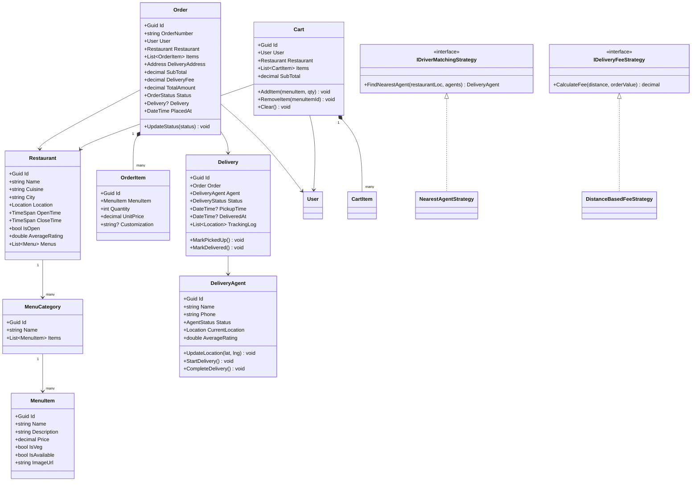

# LLD 15 – Food Delivery System

---

## 1. Interview Approach (Step-by-Step)

**Step 1 – Clarify Requirements (2 min)**

- Multi-restaurant platform (like Swiggy/Zomato) or single restaurant chain?
- Real-time order tracking with GPS?
- Scheduled deliveries or only ASAP?
- Multiple addresses per user?
- Driver assignment — nearest first or zone-based?

**Step 2 – Define Core Entities**
User, Restaurant, MenuItem, Menu, Cart, Order, OrderItem, DeliveryAgent, Delivery, Payment, Review

**Step 3 – Key Workflows**
Browse restaurants → View menu → Add to cart → Checkout → Order placed → Restaurant accepts → Preparation → Driver assigned → Pickup → Delivery → Rating

**Step 4 – Driver Assignment Algorithm**
"Find available drivers near restaurant's location (within 3 km radius, sorted by proximity and rating). Assign nearest available driver."

**Step 5 – Patterns**
State for Order lifecycle, Strategy for delivery routing, Observer for real-time order status updates, Command for order actions.

---

## 2. Requirements & Assumptions

**Functional:**

- Browse restaurants by city/cuisine
- View menus with categories and items
- Cart scoped to one restaurant at a time
- Real-time order status tracking
- Driver GPS tracking during delivery
- Post-delivery rating for restaurant and driver

**Non-Functional:**

- Driver assignment within 30 seconds
- Order status push updates via WebSocket
- Handle concurrent orders

---

## 3. Core Entities

| Entity          | Responsibility                                |
| --------------- | --------------------------------------------- |
| `Restaurant`    | Venue with location, hours, cuisine           |
| `Menu`          | Collection of menu categories                 |
| `MenuCategory`  | Groups menu items (Starters, Mains, Desserts) |
| `MenuItem`      | Individual food item with price               |
| `User`          | Customer placing orders                       |
| `DeliveryAgent` | Person who delivers orders                    |
| `Cart`          | Pre-order item basket (per restaurant)        |
| `Order`         | Placed order with items and delivery info     |
| `Delivery`      | Delivery assignment and tracking              |
| `Payment`       | Payment record                                |
| `Review`        | Post-delivery rating                          |

**Enums:**

```
OrderStatus    : Placed, Accepted, Preparing, ReadyForPickup, PickedUp, OnTheWay, Delivered, Cancelled
DeliveryStatus : Unassigned, Assigned, PickedUp, Delivered, Failed
AgentStatus    : Offline, Available, OnDelivery
PaymentMethod  : Cash, Card, UPI, Wallet
```

---

## 4. Class Relationship Diagram



---

## 5. DB Schema

```sql
-- Restaurants
CREATE TABLE Restaurants (
    Id            UNIQUEIDENTIFIER PRIMARY KEY DEFAULT NEWID(),
    Name          NVARCHAR(200) NOT NULL,
    Cuisine       NVARCHAR(100) NULL,
    City          NVARCHAR(100) NOT NULL,
    AddressLine   NVARCHAR(500) NULL,
    Latitude      FLOAT         NULL,
    Longitude     FLOAT         NULL,
    AverageRating FLOAT         NOT NULL DEFAULT 0,
    IsActive      BIT           NOT NULL DEFAULT 1,
    OpenTime      TIME          NOT NULL,
    CloseTime     TIME          NOT NULL,
    INDEX IX_Rest_City (City, IsActive)
);

-- Menu Categories
CREATE TABLE MenuCategories (
    Id           UNIQUEIDENTIFIER PRIMARY KEY DEFAULT NEWID(),
    RestaurantId UNIQUEIDENTIFIER NOT NULL REFERENCES Restaurants(Id),
    Name         NVARCHAR(100) NOT NULL,
    SortOrder    INT           NOT NULL DEFAULT 0
);

-- Menu Items
CREATE TABLE MenuItems (
    Id         UNIQUEIDENTIFIER PRIMARY KEY DEFAULT NEWID(),
    CategoryId UNIQUEIDENTIFIER NOT NULL REFERENCES MenuCategories(Id),
    Name       NVARCHAR(200) NOT NULL,
    Description NVARCHAR(500) NULL,
    Price      DECIMAL(8,2)  NOT NULL,
    IsVeg      BIT           NOT NULL DEFAULT 0,
    IsAvailable BIT          NOT NULL DEFAULT 1,
    ImageUrl   NVARCHAR(500) NULL
);

-- Users
CREATE TABLE Users (
    Id    UNIQUEIDENTIFIER PRIMARY KEY DEFAULT NEWID(),
    Email NVARCHAR(256) NOT NULL UNIQUE,
    Name  NVARCHAR(200) NOT NULL,
    Phone VARCHAR(20)   NOT NULL
);

-- Addresses
CREATE TABLE Addresses (
    Id        UNIQUEIDENTIFIER PRIMARY KEY DEFAULT NEWID(),
    UserId    UNIQUEIDENTIFIER NOT NULL REFERENCES Users(Id),
    Label     NVARCHAR(50)     NOT NULL,
    Line1     NVARCHAR(300)    NOT NULL,
    City      NVARCHAR(100)    NOT NULL,
    PinCode   VARCHAR(10)      NOT NULL,
    Latitude  FLOAT            NULL,
    Longitude FLOAT            NULL,
    IsDefault BIT              NOT NULL DEFAULT 0
);

-- Delivery Agents
CREATE TABLE DeliveryAgents (
    Id            UNIQUEIDENTIFIER PRIMARY KEY DEFAULT NEWID(),
    Name          NVARCHAR(200) NOT NULL,
    Phone         VARCHAR(20)   NOT NULL UNIQUE,
    Status        VARCHAR(20)   NOT NULL DEFAULT 'Offline',
    AverageRating FLOAT         NOT NULL DEFAULT 5.0,
    CurrentLat    FLOAT         NULL,
    CurrentLng    FLOAT         NULL,
    LocationUpdatedAt DATETIME  NULL,
    INDEX IX_Agents_Status (Status, CurrentLat, CurrentLng)
);

-- Orders
CREATE TABLE Orders (
    Id           UNIQUEIDENTIFIER PRIMARY KEY DEFAULT NEWID(),
    OrderNumber  VARCHAR(30)      NOT NULL UNIQUE,
    UserId       UNIQUEIDENTIFIER NOT NULL REFERENCES Users(Id),
    RestaurantId UNIQUEIDENTIFIER NOT NULL REFERENCES Restaurants(Id),
    AddressId    UNIQUEIDENTIFIER NOT NULL REFERENCES Addresses(Id),
    SubTotal     DECIMAL(10,2)    NOT NULL,
    DeliveryFee  DECIMAL(6,2)     NOT NULL,
    TotalAmount  DECIMAL(10,2)    NOT NULL,
    Status       VARCHAR(30)      NOT NULL DEFAULT 'Placed',
    PlacedAt     DATETIME         NOT NULL DEFAULT GETUTCDATE(),
    INDEX IX_Orders_User   (UserId, PlacedAt DESC),
    INDEX IX_Orders_Rest   (RestaurantId, Status)
);

-- Order Items
CREATE TABLE OrderItems (
    Id           UNIQUEIDENTIFIER PRIMARY KEY DEFAULT NEWID(),
    OrderId      UNIQUEIDENTIFIER NOT NULL REFERENCES Orders(Id),
    MenuItemId   UNIQUEIDENTIFIER NOT NULL REFERENCES MenuItems(Id),
    Quantity     INT              NOT NULL,
    UnitPrice    DECIMAL(8,2)     NOT NULL,
    Customization NVARCHAR(300)   NULL
);

-- Deliveries
CREATE TABLE Deliveries (
    Id          UNIQUEIDENTIFIER PRIMARY KEY DEFAULT NEWID(),
    OrderId     UNIQUEIDENTIFIER NOT NULL UNIQUE REFERENCES Orders(Id),
    AgentId     UNIQUEIDENTIFIER NULL REFERENCES DeliveryAgents(Id),
    Status      VARCHAR(20)      NOT NULL DEFAULT 'Unassigned',
    PickupTime  DATETIME         NULL,
    DeliveredAt DATETIME         NULL
);

-- Payments
CREATE TABLE Payments (
    Id        UNIQUEIDENTIFIER PRIMARY KEY DEFAULT NEWID(),
    OrderId   UNIQUEIDENTIFIER NOT NULL REFERENCES Orders(Id),
    Amount    DECIMAL(10,2)    NOT NULL,
    Method    VARCHAR(20)      NOT NULL,
    Status    VARCHAR(20)      NOT NULL,
    PaidAt    DATETIME         NULL
);

-- Reviews
CREATE TABLE Reviews (
    Id           UNIQUEIDENTIFIER PRIMARY KEY DEFAULT NEWID(),
    OrderId      UNIQUEIDENTIFIER NOT NULL UNIQUE REFERENCES Orders(Id),
    UserId       UNIQUEIDENTIFIER NOT NULL REFERENCES Users(Id),
    RestaurantId UNIQUEIDENTIFIER NOT NULL REFERENCES Restaurants(Id),
    AgentId      UNIQUEIDENTIFIER NULL REFERENCES DeliveryAgents(Id),
    FoodRating   TINYINT          NOT NULL CHECK (FoodRating BETWEEN 1 AND 5),
    DeliveryRating TINYINT        NULL CHECK (DeliveryRating BETWEEN 1 AND 5),
    Comment      NVARCHAR(MAX)    NULL,
    CreatedAt    DATETIME         NOT NULL DEFAULT GETUTCDATE()
);
```

---

## 6. Design Patterns

| Pattern                     | Where                                                | Why                                                                |
| --------------------------- | ---------------------------------------------------- | ------------------------------------------------------------------ |
| **State**                   | `Order.Status` (Placed → Accepted → Preparing → ...) | Restrict valid operations per state; prevent illegal jumps         |
| **Strategy**                | `IDriverMatchingStrategy`                            | Swap nearest-first, zone-based, or load-balanced assignment        |
| **Strategy**                | `IDeliveryFeeStrategy`                               | Distance-based, flat-rate, or free-above-threshold fee calculation |
| **Observer**                | Order status changes → user push notification        | Decouple order processing from notification delivery               |
| **Command**                 | `AcceptOrderCommand`, `CancelOrderCommand`           | Encapsulate restaurant/driver actions; supports undo, audit log    |
| **Chain of Responsibility** | `Order.UpdateStatus()` validation                    | Each status handler validates and passes to next or rejects        |

---

## 7. SOLID Principles

| Principle | Application                                                                                     |
| --------- | ----------------------------------------------------------------------------------------------- |
| **S**     | `Delivery` manages agent tracking; `Order` manages customer order; `MenuItem` manages food item |
| **O**     | Add surge pricing by implementing `IDeliveryFeeStrategy`; no change to `OrderService`           |
| **L**     | Any `IDriverMatchingStrategy` substitutes in `OrderAssignmentService`                           |
| **I**     | `IDriverMatchingStrategy`, `IDeliveryFeeStrategy`, `IOrderNotifier` are separate                |
| **D**     | `OrderService` depends on `IDriverMatchingStrategy` and `IDeliveryFeeStrategy` abstractions     |

---

## 8. C# Implementation

```csharp
// ─── Enums ───────────────────────────────────────────────────────────────────
public enum OrderStatus    { Placed, Accepted, Preparing, ReadyForPickup, PickedUp, OnTheWay, Delivered, Cancelled }
public enum DeliveryStatus { Unassigned, Assigned, PickedUp, Delivered, Failed }
public enum AgentStatus    { Offline, Available, OnDelivery }

// ─── Location & Agent ─────────────────────────────────────────────────────────
public record Location(double Latitude, double Longitude)
{
    public double DistanceTo(Location other)
    {
        const double R = 6371;
        var dLat = (other.Latitude  - Latitude)  * Math.PI / 180;
        var dLon = (other.Longitude - Longitude) * Math.PI / 180;
        var a = Math.Sin(dLat/2)*Math.Sin(dLat/2) +
                Math.Cos(Latitude*Math.PI/180)*Math.Cos(other.Latitude*Math.PI/180)*
                Math.Sin(dLon/2)*Math.Sin(dLon/2);
        return R * 2 * Math.Atan2(Math.Sqrt(a), Math.Sqrt(1-a));
    }
}

public class DeliveryAgent
{
    public Guid        Id              { get; init; } = Guid.NewGuid();
    public string      Name            { get; init; } = default!;
    public string      Phone           { get; init; } = default!;
    public AgentStatus Status          { get; private set; } = AgentStatus.Offline;
    public Location?   CurrentLocation { get; private set; }
    public double      AverageRating   { get; private set; } = 5.0;
    private int        _totalRatings;

    public void UpdateLocation(double lat, double lng) => CurrentLocation = new Location(lat, lng);
    public void GoOnline()        { if (Status == AgentStatus.Offline)    Status = AgentStatus.Available;  }
    public void GoOffline()       { if (Status == AgentStatus.Available)  Status = AgentStatus.Offline;    }
    public void StartDelivery()   { if (Status == AgentStatus.Available)  Status = AgentStatus.OnDelivery; }
    public void CompleteDelivery(){ if (Status == AgentStatus.OnDelivery) Status = AgentStatus.Available;  }

    public void AddRating(int score)
    {
        _totalRatings++;
        AverageRating = ((AverageRating * (_totalRatings - 1)) + score) / _totalRatings;
    }
}

// ─── Cart ─────────────────────────────────────────────────────────────────────
public class CartItem
{
    public Guid    MenuItemId { get; init; }
    public string  ItemName   { get; init; } = default!;
    public int     Quantity   { get; set; }
    public decimal UnitPrice  { get; init; }
    public decimal SubTotal   => UnitPrice * Quantity;
}

public class Cart
{
    private readonly List<CartItem> _items = new();
    public Guid   UserId       { get; init; }
    public Guid   RestaurantId { get; init; }
    public IReadOnlyList<CartItem> Items => _items.AsReadOnly();
    public decimal SubTotal => _items.Sum(i => i.SubTotal);

    public void AddItem(Guid menuItemId, string name, decimal price, int qty = 1)
    {
        var existing = _items.FirstOrDefault(i => i.MenuItemId == menuItemId);
        if (existing is not null) existing.Quantity += qty;
        else _items.Add(new CartItem { MenuItemId = menuItemId, ItemName = name, UnitPrice = price, Quantity = qty });
    }
    public void RemoveItem(Guid menuItemId) => _items.RemoveAll(i => i.MenuItemId == menuItemId);
    public void Clear() => _items.Clear();
}

// ─── Order ────────────────────────────────────────────────────────────────────
public class OrderItem
{
    public Guid    Id            { get; init; } = Guid.NewGuid();
    public Guid    MenuItemId    { get; init; }
    public string  ItemName      { get; init; } = default!;
    public int     Quantity      { get; init; }
    public decimal UnitPrice     { get; init; }
    public string? Customization { get; init; }
    public decimal SubTotal      => UnitPrice * Quantity;
}

public class Order
{
    private readonly List<OrderItem>   _items    = new();
    private readonly List<IOrderObserver> _observers = new();

    public Guid        Id            { get; } = Guid.NewGuid();
    public string      OrderNumber   { get; init; } = default!;
    public Guid        UserId        { get; init; }
    public Guid        RestaurantId  { get; init; }
    public Guid        AddressId     { get; init; }
    public decimal     SubTotal      => _items.Sum(i => i.SubTotal);
    public decimal     DeliveryFee   { get; init; }
    public decimal     TotalAmount   => SubTotal + DeliveryFee;
    public OrderStatus Status        { get; private set; } = OrderStatus.Placed;
    public Delivery?   Delivery      { get; private set; }
    public DateTime    PlacedAt      { get; } = DateTime.UtcNow;

    public IReadOnlyList<OrderItem> Items => _items.AsReadOnly();
    public void AddItem(OrderItem item) => _items.Add(item);
    public void Subscribe(IOrderObserver obs) => _observers.Add(obs);
    public void AssignDelivery(Delivery d) => Delivery = d;

    private static readonly Dictionary<OrderStatus, HashSet<OrderStatus>> _validTransitions = new()
    {
        { OrderStatus.Placed,         new() { OrderStatus.Accepted,   OrderStatus.Cancelled } },
        { OrderStatus.Accepted,       new() { OrderStatus.Preparing,  OrderStatus.Cancelled } },
        { OrderStatus.Preparing,      new() { OrderStatus.ReadyForPickup } },
        { OrderStatus.ReadyForPickup, new() { OrderStatus.PickedUp   } },
        { OrderStatus.PickedUp,       new() { OrderStatus.OnTheWay   } },
        { OrderStatus.OnTheWay,       new() { OrderStatus.Delivered  } },
        { OrderStatus.Delivered,      new() { } },
        { OrderStatus.Cancelled,      new() { } }
    };

    public void UpdateStatus(OrderStatus newStatus)
    {
        if (!_validTransitions.TryGetValue(Status, out var valid) || !valid.Contains(newStatus))
            throw new InvalidOperationException($"Invalid transition: {Status} → {newStatus}");

        Status = newStatus;
        _observers.ForEach(o => o.OnStatusChanged(this, newStatus));
    }
}

public interface IOrderObserver { void OnStatusChanged(Order order, OrderStatus newStatus); }

// ─── Delivery ─────────────────────────────────────────────────────────────────
public class Delivery
{
    private readonly List<Location> _trackingLog = new();
    public Guid           Id          { get; } = Guid.NewGuid();
    public Guid           OrderId     { get; init; }
    public DeliveryAgent  Agent       { get; init; } = default!;
    public DeliveryStatus Status      { get; private set; } = DeliveryStatus.Assigned;
    public DateTime?      PickupTime  { get; private set; }
    public DateTime?      DeliveredAt { get; private set; }
    public IReadOnlyList<Location> TrackingLog => _trackingLog.AsReadOnly();

    public void AddTrackingPoint(Location loc) => _trackingLog.Add(loc);

    public void MarkPickedUp()
    {
        Status     = DeliveryStatus.PickedUp;
        PickupTime = DateTime.UtcNow;
        Agent.StartDelivery();
    }

    public void MarkDelivered()
    {
        Status      = DeliveryStatus.Delivered;
        DeliveredAt = DateTime.UtcNow;
        Agent.CompleteDelivery();
    }
}

// ─── Driver Matching Strategy ─────────────────────────────────────────────────
public interface IDriverMatchingStrategy
{
    DeliveryAgent? FindNearestAgent(Location restaurantLocation, IEnumerable<DeliveryAgent> agents);
}

public class NearestAgentStrategy : IDriverMatchingStrategy
{
    private const double MaxRadiusKm = 5.0;

    public DeliveryAgent? FindNearestAgent(Location restaurantLoc, IEnumerable<DeliveryAgent> agents)
        => agents
            .Where(a => a.Status == AgentStatus.Available && a.CurrentLocation is not null)
            .Where(a => a.CurrentLocation!.DistanceTo(restaurantLoc) <= MaxRadiusKm)
            .OrderBy(a => a.CurrentLocation!.DistanceTo(restaurantLoc))
            .ThenByDescending(a => a.AverageRating)
            .FirstOrDefault();
}

// ─── Delivery Fee Strategy ────────────────────────────────────────────────────
public interface IDeliveryFeeStrategy
{
    decimal CalculateFee(double distanceKm, decimal orderValue);
}

public class DistanceBasedFeeStrategy : IDeliveryFeeStrategy
{
    private const decimal FreeDeliveryThreshold = 299m;
    private const decimal BaseRate              = 30m;
    private const decimal PerKmRate             = 5m;

    public decimal CalculateFee(double distanceKm, decimal orderValue)
    {
        if (orderValue >= FreeDeliveryThreshold) return 0m;
        return BaseRate + ((decimal)distanceKm * PerKmRate);
    }
}

// ─── Order Service ────────────────────────────────────────────────────────────
public class OrderService
{
    private readonly IDriverMatchingStrategy _matching;
    private readonly IDeliveryFeeStrategy    _deliveryFee;
    private readonly List<DeliveryAgent>     _agents;

    public OrderService(IDriverMatchingStrategy matching, IDeliveryFeeStrategy fee, IEnumerable<DeliveryAgent> agents)
    {
        _matching   = matching;
        _deliveryFee = fee;
        _agents     = agents.ToList();
    }

    public Order PlaceOrder(Guid userId, Guid restaurantId, Guid addressId, Cart cart, Location restaurantLocation, Location deliveryLocation)
    {
        if (!cart.Items.Any()) throw new InvalidOperationException("Cart is empty.");

        var distanceKm  = restaurantLocation.DistanceTo(deliveryLocation);
        var deliveryFee = _deliveryFee.CalculateFee(distanceKm, cart.SubTotal);

        var order = new Order
        {
            OrderNumber  = $"FD-{DateTime.UtcNow.Ticks}",
            UserId       = userId,
            RestaurantId = restaurantId,
            AddressId    = addressId,
            DeliveryFee  = deliveryFee
        };

        foreach (var item in cart.Items)
            order.AddItem(new OrderItem { MenuItemId = item.MenuItemId, ItemName = item.ItemName, Quantity = item.Quantity, UnitPrice = item.UnitPrice });

        return order;
    }

    public Delivery AssignDriver(Order order, Location restaurantLocation)
    {
        var agent = _matching.FindNearestAgent(restaurantLocation, _agents)
            ?? throw new InvalidOperationException("No available delivery agents nearby.");

        var delivery = new Delivery { OrderId = order.Id, Agent = agent };
        order.AssignDelivery(delivery);
        order.UpdateStatus(OrderStatus.Accepted);

        Console.WriteLine($"[Driver Assigned] Agent {agent.Name} assigned to order {order.OrderNumber}");
        return delivery;
    }
}
```

---

## Key Discussion Points for Interview

1. **Order State Machine**: The `_validTransitions` dictionary enforces the strict lifecycle. Each transition triggers observer notifications so the customer's app gets real-time push updates.

2. **Driver Assignment**: Same as ride-sharing — GeoSearch in Redis (`GEORADIUS`) in production. Assign atomically with a Redis lock to prevent two orders going to the same driver simultaneously.

3. **Cart Scoped to Restaurant**: A user cannot add items from two restaurants in one cart (enforced by `Cart.RestaurantId`). If they try, prompt to clear the existing cart — this is the Swiggy/Zomato behavior.

4. **Delivery Fee Calculation**: Based on distance between restaurant and delivery address. Haversine formula gives accurate km. Free delivery above a threshold encourages larger orders.

5. **Restaurant Acceptance Timeout**: If the restaurant doesn't accept within 3 minutes, auto-cancel and notify user. Implement with a background job checking `Status = 'Placed' AND PlacedAt < NOW - 3 MIN`.
