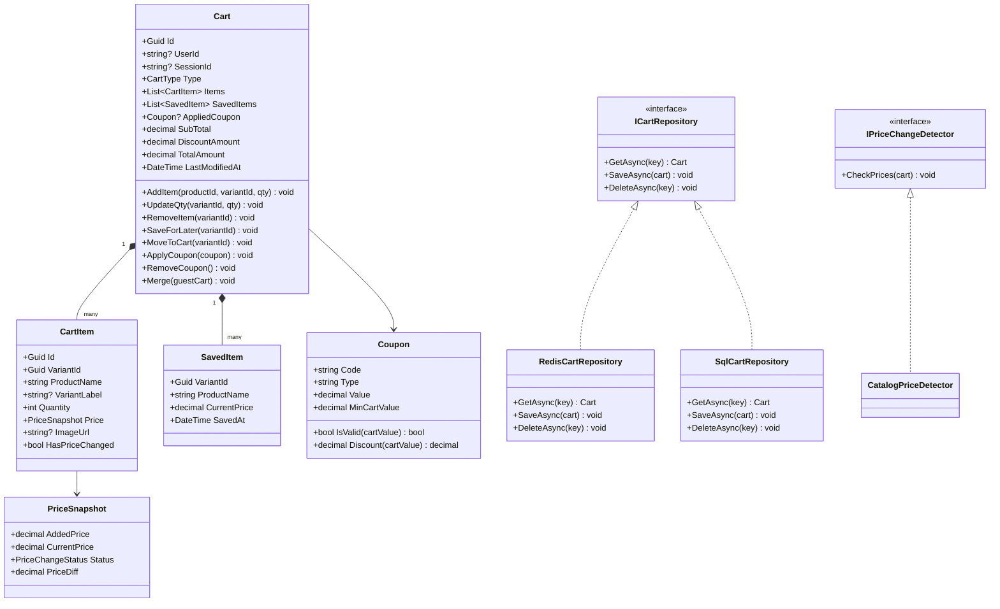

# LLD 16 – Shopping Cart System

---

## 1. Interview Approach (Step-by-Step)

**Step 1 – Clarify Requirements (2 min)**

- Guest cart (session-based) or only logged-in users?
- Should guest cart merge with user cart on login?
- Quantity limits per item (stock-based)?
- Save-for-later functionality?
- Price displayed from catalog — what if price changes while item is in cart?
- Coupon application at cart level?

**Step 2 – Define Core Entities**
Cart, CartItem, Product, User, Session, PriceSnapshot

**Step 3 – Key Design Decisions**

- Cart stored in Redis (fast, TTL-based expiry for guest carts)
- Persist to DB for logged-in users (survived session loss)
- Price stored as snapshot at time of adding — show "price has changed" warning if current price differs
- Stock check on checkout, not on add-to-cart

**Step 4 – Guest → User Cart Merge**
"On login: load guest cart from Redis → merge items into user's persisted cart (add quantities for same items, keep max of existing price snapshots) → delete guest cart."

**Step 5 – Patterns**
Repository for cart persistence (Redis + DB), Strategy for price validation, Observer for price change alerts, Memento for save-for-later (snapshot of cart state).

---

## 2. Requirements & Assumptions

**Functional:**

- Add/update/remove items in cart
- Quantity validation against available stock
- Price snapshot with change detection
- Apply coupon codes
- Save item for later (move to wishlist)
- Guest cart merges on login
- Cart expires after 30 days of inactivity (guest: 24h)

**Non-Functional:**

- Cart operations must be < 100ms
- Cart stored in Redis for speed; synced to DB for persistence
- Thread-safe updates per user

---

## 3. Core Entities

| Entity                 | Responsibility                                           |
| ---------------------- | -------------------------------------------------------- |
| `Cart`                 | Container for items; linked to user or guest session     |
| `CartItem`             | Individual product variant in the cart                   |
| `PriceSnapshot`        | Price at time of adding + current price for comparison   |
| `SavedItem`            | Items moved to "save for later" / wishlist               |
| `Coupon`               | Discount applicable to cart total                        |
| `ICartRepository`      | Abstraction to load/save cart from Redis or DB           |
| `IPriceChangeDetector` | Checks if any item's current price differs from snapshot |

**Enums:**

```
CartType          : UserCart, GuestCart
PriceChangeStatus : NoChange, Increased, Decreased
```

---

## 4. Class Relationship Diagram



---

## 5. DB Schema

```sql
-- Carts (persisted for logged-in users)
CREATE TABLE Carts (
    Id             UNIQUEIDENTIFIER PRIMARY KEY DEFAULT NEWID(),
    UserId         UNIQUEIDENTIFIER NULL UNIQUE,   -- NULL for guest carts (stored in Redis only)
    SessionId      VARCHAR(128)     NULL,
    CartType       VARCHAR(10)      NOT NULL DEFAULT 'UserCart',
    CouponCode     VARCHAR(30)      NULL,
    CreatedAt      DATETIME         NOT NULL DEFAULT GETUTCDATE(),
    LastModifiedAt DATETIME         NOT NULL DEFAULT GETUTCDATE()
);

-- Cart Items
CREATE TABLE CartItems (
    Id           UNIQUEIDENTIFIER PRIMARY KEY DEFAULT NEWID(),
    CartId       UNIQUEIDENTIFIER NOT NULL REFERENCES Carts(Id),
    VariantId    UNIQUEIDENTIFIER NOT NULL,
    ProductName  NVARCHAR(300)    NOT NULL,
    VariantLabel NVARCHAR(100)    NULL,   -- e.g., "Size: L, Color: Blue"
    Quantity     INT              NOT NULL CHECK (Quantity > 0),
    AddedPrice   DECIMAL(10,2)    NOT NULL,   -- Price when item was added
    ImageUrl     NVARCHAR(500)    NULL,
    AddedAt      DATETIME         NOT NULL DEFAULT GETUTCDATE(),
    UNIQUE (CartId, VariantId)
);

-- Saved Items (Save for Later / Wishlist)
CREATE TABLE SavedItems (
    Id          UNIQUEIDENTIFIER PRIMARY KEY DEFAULT NEWID(),
    CartId      UNIQUEIDENTIFIER NOT NULL REFERENCES Carts(Id),
    VariantId   UNIQUEIDENTIFIER NOT NULL,
    ProductName NVARCHAR(300)    NOT NULL,
    SavedAt     DATETIME         NOT NULL DEFAULT GETUTCDATE(),
    UNIQUE (CartId, VariantId)
);
```

> **Note on Redis Schema** (for guest carts and fast reads):
>
> ```
> Key: cart:guest:{sessionId}   → JSON serialized Cart (TTL: 24 hours)
> Key: cart:user:{userId}       → JSON serialized Cart (TTL: 30 days)
> ```

---

## 6. Design Patterns

| Pattern         | Where                        | Why                                                                          |
| --------------- | ---------------------------- | ---------------------------------------------------------------------------- |
| **Repository**  | `ICartRepository`            | Swap Redis (guest, speed) and SQL (persistence) transparently                |
| **Strategy**    | `ICouponStrategy`            | Different discount types (flat, %, free shipping)                            |
| **Observer**    | `IPriceChangeDetector`       | Alert user when cart item price changes before checkout                      |
| **Memento**     | `SavedItem` (Save for Later) | Preserve item state outside the active cart without deleting                 |
| **Facade**      | `CartService`                | Hide complexity of Redis + DB coordination, price checks, coupon application |
| **Null Object** | Empty `Cart`                 | Return empty cart instead of null when no cart exists yet                    |

---

## 7. SOLID Principles

| Principle | Application                                                                                 |
| --------- | ------------------------------------------------------------------------------------------- |
| **S**     | `Cart` manages item collection; `PriceSnapshot` compares prices; `Coupon` handles discounts |
| **O**     | Add new discount type by implementing `ICouponStrategy`; `CartService` unchanged            |
| **L**     | `RedisCartRepository` and `SqlCartRepository` both substitutable for `ICartRepository`      |
| **I**     | `ICartRepository`, `IPriceChangeDetector`, `ICouponStrategy` are focused, small interfaces  |
| **D**     | `CartService` depends on `ICartRepository` and `IPriceChangeDetector` abstractions          |

---

## 8. C# Implementation

```csharp
// ─── Enums ───────────────────────────────────────────────────────────────────
public enum CartType          { UserCart, GuestCart }
public enum PriceChangeStatus { NoChange, Increased, Decreased }

// ─── Price Snapshot ───────────────────────────────────────────────────────────
public class PriceSnapshot
{
    public decimal            AddedPrice   { get; init; }
    public decimal            CurrentPrice { get; set; }
    public PriceChangeStatus  Status       => CurrentPrice > AddedPrice ? PriceChangeStatus.Increased
                                           : CurrentPrice < AddedPrice ? PriceChangeStatus.Decreased
                                           : PriceChangeStatus.NoChange;
    public decimal            PriceDiff    => CurrentPrice - AddedPrice;
}

// ─── Cart Item ────────────────────────────────────────────────────────────────
public class CartItem
{
    public Guid          Id           { get; } = Guid.NewGuid();
    public Guid          VariantId    { get; init; }
    public string        ProductName  { get; init; } = default!;
    public string?       VariantLabel { get; init; }
    public int           Quantity     { get; set; }
    public PriceSnapshot Price        { get; init; } = default!;
    public string?       ImageUrl     { get; init; }
    public DateTime      AddedAt      { get; } = DateTime.UtcNow;

    public decimal SubTotal       => Price.CurrentPrice * Quantity;
    public bool    HasPriceChanged => Price.Status != PriceChangeStatus.NoChange;
}

// ─── Saved Item ────────────────────────────────────────────────────────────────
public class SavedItem
{
    public Guid     VariantId    { get; init; }
    public string   ProductName  { get; init; } = default!;
    public decimal  CurrentPrice { get; set; }
    public DateTime SavedAt      { get; } = DateTime.UtcNow;
}

// ─── Coupon (Strategy Pattern) ────────────────────────────────────────────────
public interface ICouponStrategy
{
    decimal Discount(decimal cartValue, decimal shippingFee);
}

public class PercentageCouponStrategy : ICouponStrategy
{
    private readonly decimal _pct;
    private readonly decimal _maxDiscount;
    public PercentageCouponStrategy(decimal pct, decimal maxDiscount = 500m) { _pct = pct; _maxDiscount = maxDiscount; }
    public decimal Discount(decimal cartValue, decimal shippingFee)
        => Math.Min(Math.Round(cartValue * _pct / 100, 2), _maxDiscount);
}

public class FixedCouponStrategy : ICouponStrategy
{
    private readonly decimal _amount;
    public FixedCouponStrategy(decimal amount) => _amount = amount;
    public decimal Discount(decimal cartValue, decimal shippingFee) => Math.Min(_amount, cartValue);
}

public class FreeShippingCouponStrategy : ICouponStrategy
{
    public decimal Discount(decimal cartValue, decimal shippingFee) => shippingFee;
}

public class Coupon
{
    public string           Code          { get; init; } = default!;
    public decimal          MinCartValue  { get; init; }
    public DateTime         ExpiresAt     { get; init; }
    public ICouponStrategy  Strategy      { get; init; } = default!;

    public bool IsValid(decimal cartValue)
        => DateTime.UtcNow < ExpiresAt && cartValue >= MinCartValue;

    public decimal GetDiscount(decimal cartValue, decimal shippingFee)
        => IsValid(cartValue) ? Strategy.Discount(cartValue, shippingFee) : 0m;
}

// ─── Cart ─────────────────────────────────────────────────────────────────────
public class Cart
{
    private readonly List<CartItem> _items     = new();
    private readonly List<SavedItem> _savedItems = new();

    public Guid     Id             { get; } = Guid.NewGuid();
    public Guid?    UserId         { get; init; }
    public string?  SessionId      { get; init; }
    public CartType Type           { get; init; }
    public Coupon?  AppliedCoupon  { get; private set; }
    public DateTime LastModifiedAt { get; private set; } = DateTime.UtcNow;

    public IReadOnlyList<CartItem>  Items      => _items.AsReadOnly();
    public IReadOnlyList<SavedItem> SavedItems => _savedItems.AsReadOnly();

    public decimal SubTotal        => _items.Sum(i => i.SubTotal);
    public decimal DiscountAmount  => AppliedCoupon?.GetDiscount(SubTotal, 0m) ?? 0m;
    public decimal TotalAmount     => SubTotal - DiscountAmount;

    public void AddItem(CartItem item)
    {
        var existing = _items.FirstOrDefault(i => i.VariantId == item.VariantId);
        if (existing is not null)
            existing.Quantity += item.Quantity;
        else
            _items.Add(item);
        Touch();
    }

    public void UpdateQty(Guid variantId, int qty)
    {
        if (qty <= 0) { RemoveItem(variantId); return; }
        var item = _items.FirstOrDefault(i => i.VariantId == variantId);
        if (item is not null) { item.Quantity = qty; Touch(); }
    }

    public void RemoveItem(Guid variantId)
    {
        _items.RemoveAll(i => i.VariantId == variantId);
        Touch();
    }

    public void SaveForLater(Guid variantId)
    {
        var item = _items.FirstOrDefault(i => i.VariantId == variantId);
        if (item is null) return;
        _savedItems.Add(new SavedItem { VariantId = item.VariantId, ProductName = item.ProductName, CurrentPrice = item.Price.CurrentPrice });
        RemoveItem(variantId);
    }

    public void MoveToCart(Guid variantId)
    {
        var saved = _savedItems.FirstOrDefault(s => s.VariantId == variantId);
        if (saved is null) return;
        _savedItems.RemoveAll(s => s.VariantId == variantId);
        AddItem(new CartItem
        {
            VariantId   = saved.VariantId,
            ProductName = saved.ProductName,
            Quantity    = 1,
            Price       = new PriceSnapshot { AddedPrice = saved.CurrentPrice, CurrentPrice = saved.CurrentPrice }
        });
    }

    public void ApplyCoupon(Coupon coupon)
    {
        if (!coupon.IsValid(SubTotal)) throw new InvalidOperationException("Coupon is not valid for this cart.");
        AppliedCoupon = coupon;
        Touch();
    }

    public void RemoveCoupon() { AppliedCoupon = null; Touch(); }

    // Merge guest cart into this (user) cart on login
    public void Merge(Cart guestCart)
    {
        foreach (var guestItem in guestCart.Items)
        {
            var mine = _items.FirstOrDefault(i => i.VariantId == guestItem.VariantId);
            if (mine is not null)
                mine.Quantity += guestItem.Quantity; // Sum quantities
            else
                _items.Add(guestItem);
        }
        Touch();
    }

    private void Touch() => LastModifiedAt = DateTime.UtcNow;
}

// ─── Price Change Detector ────────────────────────────────────────────────────
public interface IPriceChangeDetector
{
    Task CheckAndUpdatePricesAsync(Cart cart);
}

public interface IProductCatalog
{
    Task<decimal> GetCurrentPriceAsync(Guid variantId);
}

public class CatalogPriceDetector : IPriceChangeDetector
{
    private readonly IProductCatalog _catalog;
    public CatalogPriceDetector(IProductCatalog catalog) => _catalog = catalog;

    public async Task CheckAndUpdatePricesAsync(Cart cart)
    {
        foreach (var item in cart.Items)
        {
            var currentPrice = await _catalog.GetCurrentPriceAsync(item.VariantId);
            item.Price.CurrentPrice = currentPrice;
            if (item.HasPriceChanged)
                Console.WriteLine($"[PriceAlert] '{item.ProductName}' price changed from ₹{item.Price.AddedPrice} to ₹{currentPrice} ({item.Price.Status})");
        }
    }
}

// ─── Cart Repository ──────────────────────────────────────────────────────────
public interface ICartRepository
{
    Task<Cart?> GetAsync(string key);
    Task SaveAsync(string key, Cart cart, TimeSpan? ttl = null);
    Task DeleteAsync(string key);
}

public class InMemoryCartRepository : ICartRepository
{
    private readonly Dictionary<string, Cart> _store = new();

    public Task<Cart?> GetAsync(string key)
        => Task.FromResult(_store.TryGetValue(key, out var cart) ? cart : null);

    public Task SaveAsync(string key, Cart cart, TimeSpan? ttl = null)
    {
        _store[key] = cart;
        return Task.CompletedTask;
    }

    public Task DeleteAsync(string key) { _store.Remove(key); return Task.CompletedTask; }
}

// ─── Cart Service (Facade) ────────────────────────────────────────────────────
public class CartService
{
    private readonly ICartRepository     _repository;
    private readonly IPriceChangeDetector _priceDetector;
    private readonly IProductCatalog      _catalog;

    public CartService(ICartRepository repo, IPriceChangeDetector detector, IProductCatalog catalog)
    {
        _repository    = repo;
        _priceDetector = detector;
        _catalog       = catalog;
    }

    private static string CartKey(Guid? userId, string? sessionId)
        => userId.HasValue ? $"cart:user:{userId}" : $"cart:guest:{sessionId}";

    public async Task<Cart> GetOrCreateCartAsync(Guid? userId, string? sessionId)
    {
        var key  = CartKey(userId, sessionId);
        var cart = await _repository.GetAsync(key);
        if (cart is null)
        {
            cart = new Cart
            {
                UserId    = userId,
                SessionId = sessionId,
                Type      = userId.HasValue ? CartType.UserCart : CartType.GuestCart
            };
            await SaveAsync(cart);
        }

        // Refresh prices on load
        await _priceDetector.CheckAndUpdatePricesAsync(cart);
        return cart;
    }

    public async Task AddItemAsync(Cart cart, Guid variantId, string productName, string? variantLabel, int qty = 1)
    {
        var currentPrice = await _catalog.GetCurrentPriceAsync(variantId);
        cart.AddItem(new CartItem
        {
            VariantId    = variantId,
            ProductName  = productName,
            VariantLabel = variantLabel,
            Quantity     = qty,
            Price        = new PriceSnapshot { AddedPrice = currentPrice, CurrentPrice = currentPrice }
        });
        await SaveAsync(cart);
    }

    public async Task MergeGuestCartAsync(Guid userId, string sessionId)
    {
        var guestCart = await _repository.GetAsync(CartKey(null, sessionId));
        if (guestCart is null) return;

        var userCart = await GetOrCreateCartAsync(userId, null);
        userCart.Merge(guestCart);
        await SaveAsync(userCart);
        await _repository.DeleteAsync(CartKey(null, sessionId));
        Console.WriteLine($"[Cart] Guest cart merged into user {userId}'s cart.");
    }

    private Task SaveAsync(Cart cart)
    {
        var key = CartKey(cart.UserId, cart.SessionId);
        var ttl = cart.Type == CartType.GuestCart ? TimeSpan.FromHours(24) : TimeSpan.FromDays(30);
        return _repository.SaveAsync(key, cart, ttl);
    }
}
```

---

## Key Discussion Points for Interview

1. **Redis + DB Dual Storage**: Redis for sub-millisecond cart access. DB as the persistent fallback (survives Redis flush). On load: try Redis first, on miss → load from DB, cache in Redis.

2. **Price Snapshot**: Store the price when item was added. On checkout, show a warning if current price differs. Recalculate total using current price. The user must acknowledge before completing checkout.

3. **Cart Merge on Login**: The merge logic is critical: same variant → add quantities; different variants → copy over. Use current price for the merged item (not the guest's snapshot price).

4. **Stock Check Timing**: Don't validate stock on add-to-cart (too frequent, causes false negatives). Validate during checkout when the final quantity and variant are confirmed.

5. **Idempotency**: `AddItem` is idempotent — calling it twice with the same variant adds quantities. `UpdateQty(variantId, 0)` triggers removal. `RemoveItem` is always safe to call even if item doesn't exist.

---

## Summary Comparison: All 16 Systems

| System           | Key Pattern                                                 | Central Challenge                   |
| ---------------- | ----------------------------------------------------------- | ----------------------------------- |
| Parking Lot      | Strategy (pricing), Observer (availability)                 | Thread-safe slot assignment         |
| Online Bookstore | Repository, Strategy (search), Builder (query)              | Inventory atomicity                 |
| Library          | State (loan), Strategy (fine), Observer (reservation)       | Overdue tracking                    |
| Movie Ticket     | State (booking), Strategy (pricing), Proxy (seat lock)      | Concurrent seat selection           |
| Elevator         | State (ATM), Strategy (LOOK algorithm)                      | Efficient multi-elevator scheduling |
| Hotel            | State (reservation), Strategy (pricing), Builder (invoice)  | Overbooking prevention              |
| Ride-Sharing     | State (ride), Strategy (matching + pricing)                 | Real-time driver matching           |
| File Storage     | Composite (folder), Strategy (backend), Decorator (encrypt) | Permission hierarchy                |
| Chat             | Observer, Strategy (delivery), Mediator                     | Real-time WebSocket delivery        |
| Social Media     | Observer, Strategy (feed), CQRS                             | Fan-out at scale                    |
| Notification     | Strategy (channel), Chain of Responsibility, Retry          | At-least-once reliable delivery     |
| Airline          | State (booking), Strategy (pricing), Observer (flight)      | Seat concurrency, dynamic fares     |
| ATM              | State machine (core), Strategy (transaction), Command       | PIN security, cash dispensing       |
| E-commerce       | State (order), Strategy (discount), Decorator (pricing)     | Inventory reserve → commit          |
| Food Delivery    | State (order), Strategy (driver + fee)                      | Driver assignment, order lifecycle  |
| Shopping Cart    | Repository, Strategy (coupon), Observer (price change)      | Guest cart merge, price snapshots   |
