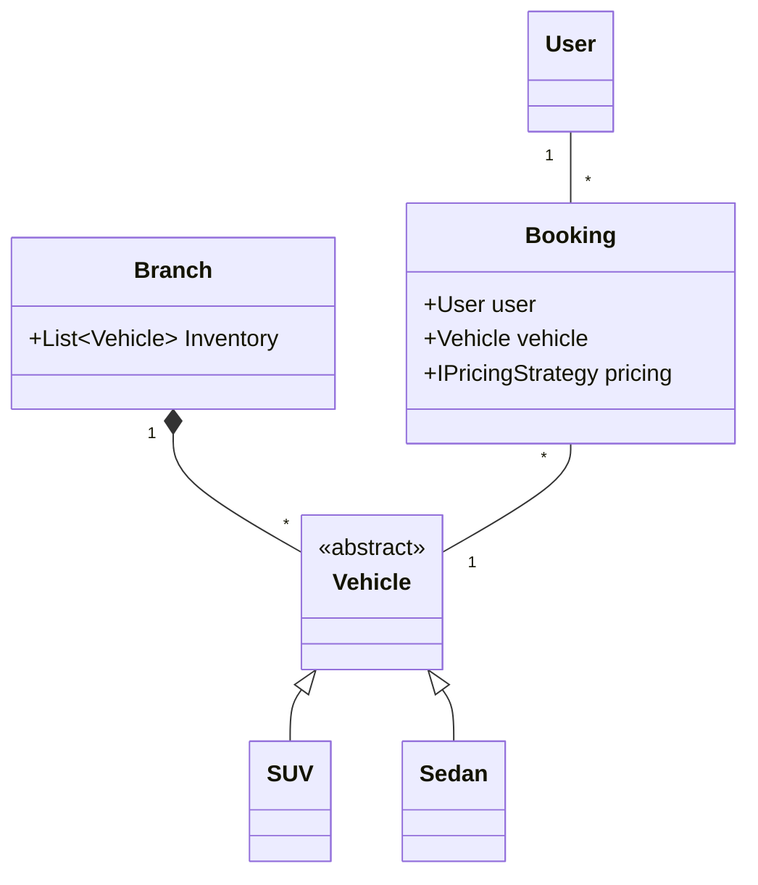
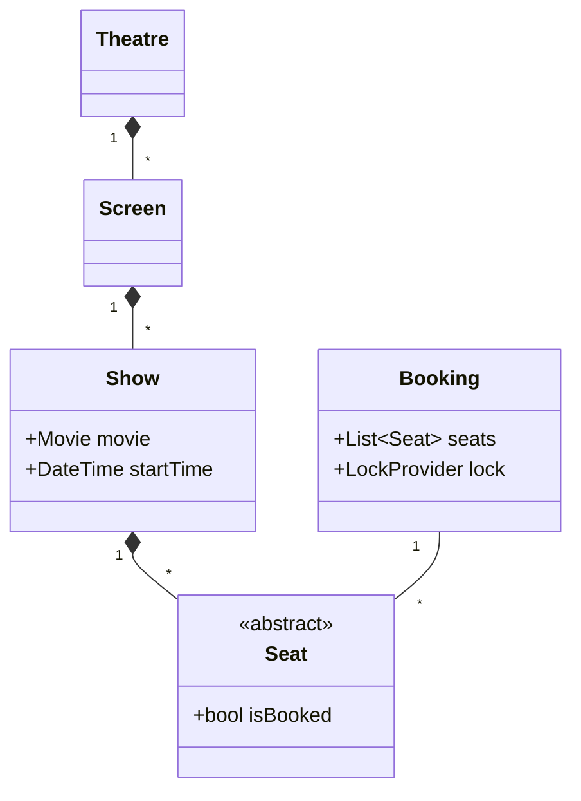
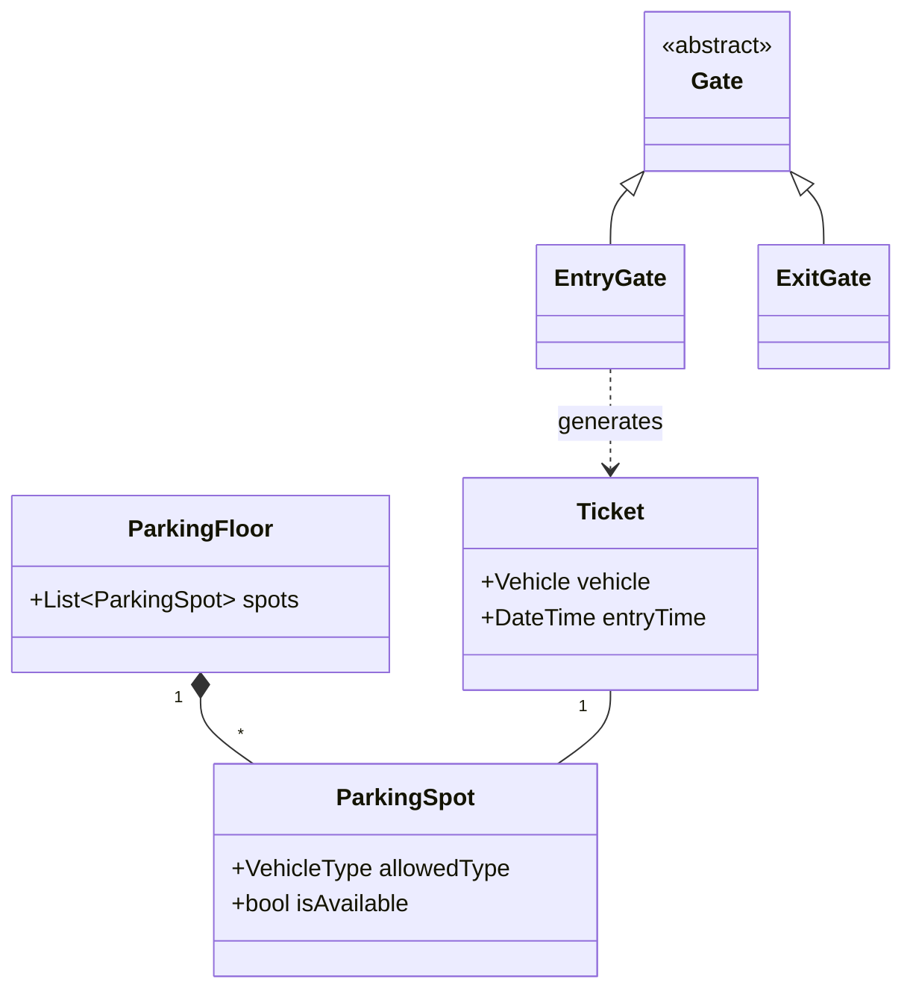
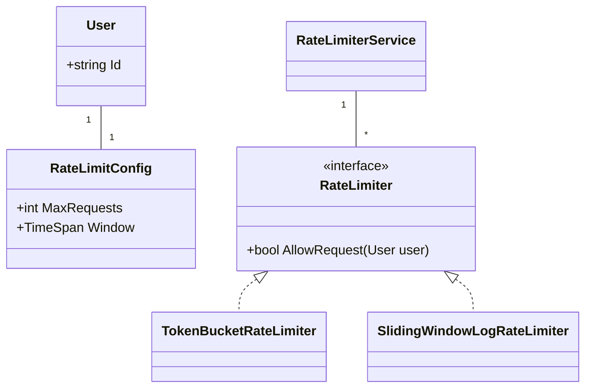
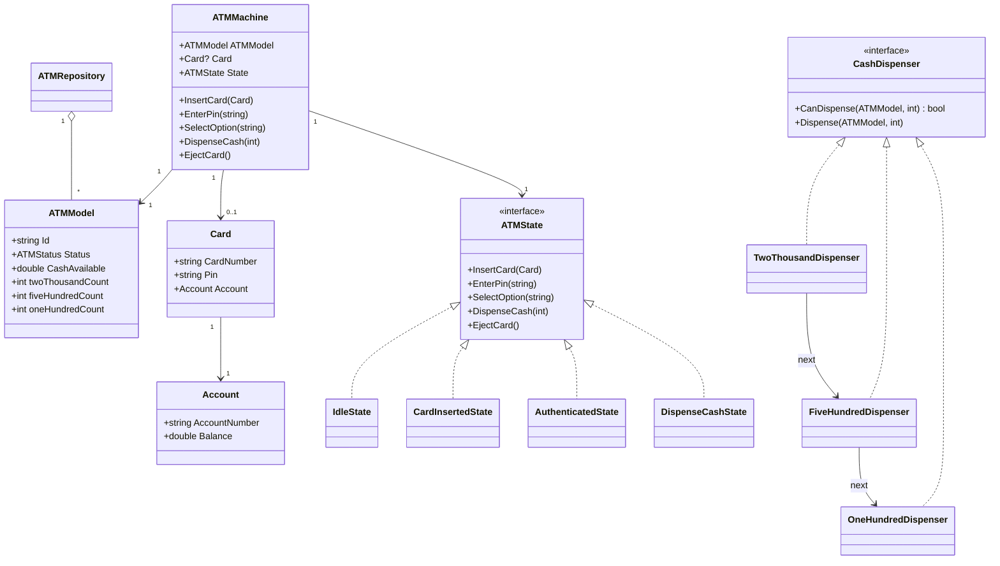

# C# Low-Level Design (LLD) Revision Notes

Here are the comprehensive revision notes for the Low-Level Design (LLD) practice folders to help structure your C# object-oriented design patterns and entity relationships for your upcoming senior engineering interviews.

## 1. Car Rental System

This system models a distributed vehicle rental platform involving inventory management, branch-level tracking, and dynamic pricing.

- **Core Entities:** `User`, `Branch`, `Vehicle` (derived: `SUV`, `Sedan`), `Booking`.
- **Design Patterns:**
  - **Strategy Pattern:** Extensively used to decouple business logic. Includes `IBookingStrategy` (`CheapestBookingStrategy`, `LeastBookedStartegy`), `IPricingStrategy` (`DistanceBasedPricingStrategy`, `TimeBasedPricingStrategy`), and `IPaymentStrategy` (`CashPaymentStrategy`, `CreditCardPaymentStategy`).
  - **Factory Pattern:** `VehicleFactory` isolates the instantiation logic for different vehicle types.
  - **Repository Pattern:** `BookingRepository` and `BranchRepository` abstract the data access layer, critical for backend C# microservices.

**UML Entity Relationship:**

## 2. Movie Ticket Booking System

This architecture handles seat reservations, theatre layouts, and crucially, concurrency control to prevent double-booking.

- **Core Entities:** `Theatre`, `Screen`, `Show`, `Seat` (derived: `RegularSeat`, `ReclinerSeat`), `Movie`, `Booking`.
- **Design Patterns:**
  - **Strategy Pattern (Concurrency):** The `LockProvider` interface (implemented by `InMemoryLockProvider`) allows the system to switch between in-memory thread locking and distributed locking mechanisms (like Redis) during concurrent booking attempts.
  - **Factory Pattern:** `PaymentStrategyFactory` dynamically resolves the payment method (Card vs. UPI) at runtime.

**UML Entity Relationship:**

## 3. Parking Lot

A classic state-based LLD problem managing spatial capacity, multiple access points, and time-based calculations.

- **Core Entities:** `ParkingFloor`, `ParkingSpot`, `Gate` (derived: `EntryGate`, `ExitGate`), `Vehicle` (derived: `Bike`, `Car`, `Truck`), `Ticket`.
- **Design Patterns:**
  - **Factory Pattern:** Multiple factories (`VehicleFactory`, `PricingStrategyFactory`, `PaymentStrategyFactory`) are utilized to keep object creation clean and maintain Open-Closed Principle compliance.
  - **Strategy Pattern:** `PricingStrategy` determines the calculation logic (`FlatRatePricing` vs. `HourlyRatePricing`) based on the ticket duration and vehicle type.

**UML Entity Relationship:**

## 4. Rate Limiter

Highly relevant for API gateway and distributed system design, this folder models different algorithms for throttling incoming requests.

- **Core Entities:** `User`, `RateLimitConfig`.
- **Design Patterns:**
  - **Strategy Pattern:** The core algorithm interface (`RateLimiter`) is implemented by `FixedWindowRateLimiter`, `SlidingWindowLogRateLimiter`, and `TokenBucketRateLimiter`. This allows the `RateLimiterService` to swap algorithms per client or API route.
  - **Factory Pattern:** `RateLimiterFactory` instantiates the correct algorithm based on system configuration or user tier.

**UML Entity Relationship:**

## 5. Logger Framework

A modular enterprise logging library mimicking standard .NET logging structures.

- **Core Entities:** `LogMessage`, `LogHandlerConfiguration`.
- **Design Patterns:**
  - **Chain of Responsibility Pattern:** The `handlers` directory (`InfoHandler`, `WarnHandler`, `ErrorHandler` deriving from `LogHandler`) processes log streams sequentially. Each handler decides whether to process the `LogMessage` or pass it down the chain based on severity.
  - **Strategy Pattern:** Determines output formatting (`JsonFormatter`, `PlainTextFormatter`) and destination targets (`ConsoleAppender`, `FileAppender`).

## 6. Snakes and Ladders

A simulation emphasizing object interactions, generic factories, and game loop state management.

- **Core Entities:** `Game`, `Board`, `Cell`, `Dice`, `Player`, `Obstacle` (derived: `Snake`, `Ladder`).
- **Design Patterns:**
  - **Factory Pattern:** `ObstacleFactory` parses the `ObstacleType` enum to generate either a `Snake` or `Ladder` object dynamically during board initialization.

## 7. LFUCache

Models a Least Frequently Used caching mechanism. While the specific classes aren't deeply nested in the directory structure, LFU cache implementation in C# typically requires combining a Hash Map (`Dictionary` in C#) for $O(1)$ lookups with a Doubly Linked List (or multiple lists bucketed by frequency) to maintain eviction order.

## 8. ATM System

This system models an ATM withdrawal workflow with state-dependent operations, account validation, ATM cash tracking, and denomination-aware cash dispensing.

- **Core Entities:** `ATMMachine`, `ATMModel`, `Card`, `Account`, `ATMRepository`, and `CashDispenser` implementations.
- **Design Patterns:**
  - **State Pattern:** `ATMState` defines the ATM operations, while `IdleState`, `CardInsertedState`, `AuthenticatedState`, and `DispenseCashState` control which operations are valid at each stage of a transaction. State transitions are applied by `ATMMachine.SetState`.
  - **Chain of Responsibility Pattern:** `CashDispenserChainBuilder` creates a denomination chain consisting of `TwoThousandDispenser`, `FiveHundredDispenser`, and `OneHundredDispenser`. Each dispenser handles the notes it can provide and forwards the remainder to the next dispenser.
  - **Factory Pattern:** `ATMStateFactory` reconstructs the appropriate state object from the persisted `ATMStatus` value.
  - **Repository Pattern:** `ATMRepository` stores and retrieves `ATMModel` instances by ATM identifier and updates their status.
- **Withdrawal Flow:** A card is inserted, the PIN is verified, a withdrawal option is selected, and the requested amount is validated against ATM cash, account balance, and available note denominations. On success, both ATM cash and account balance are updated before the card is ejected.

**UML Entity Relationship:**

