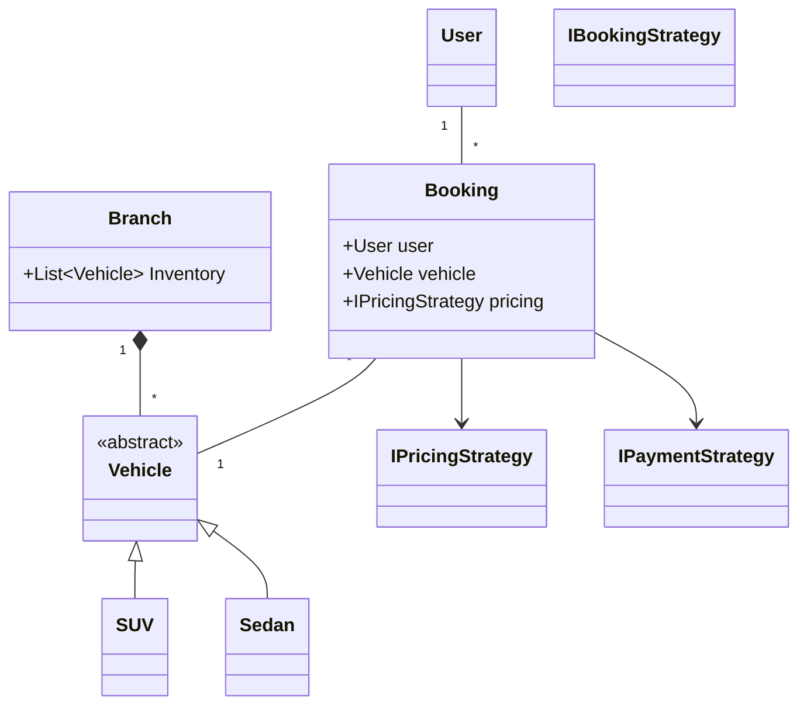
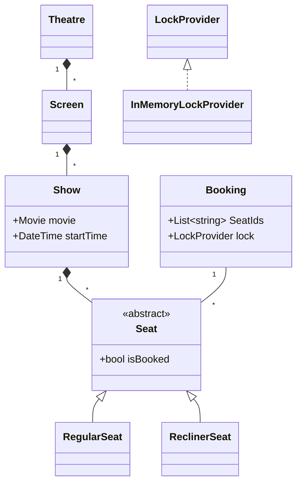
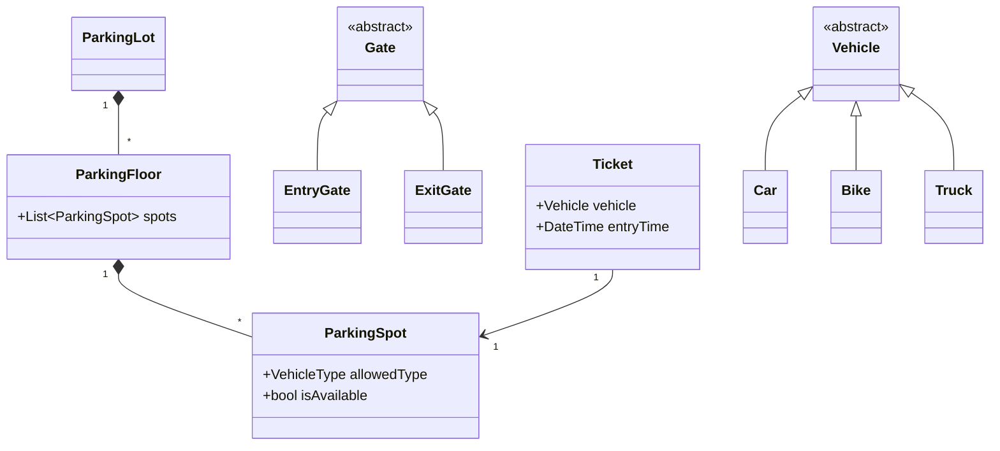
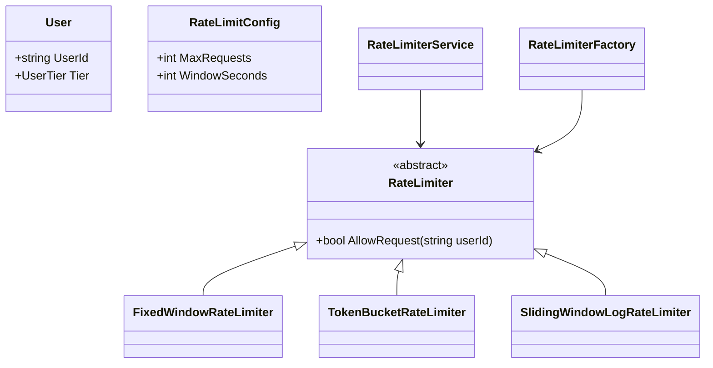
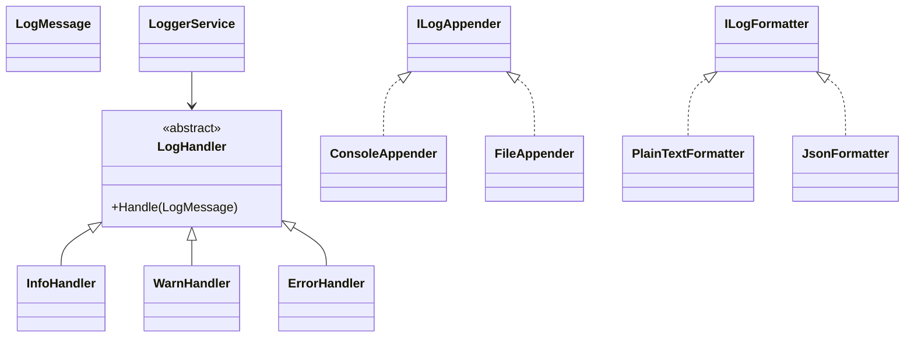
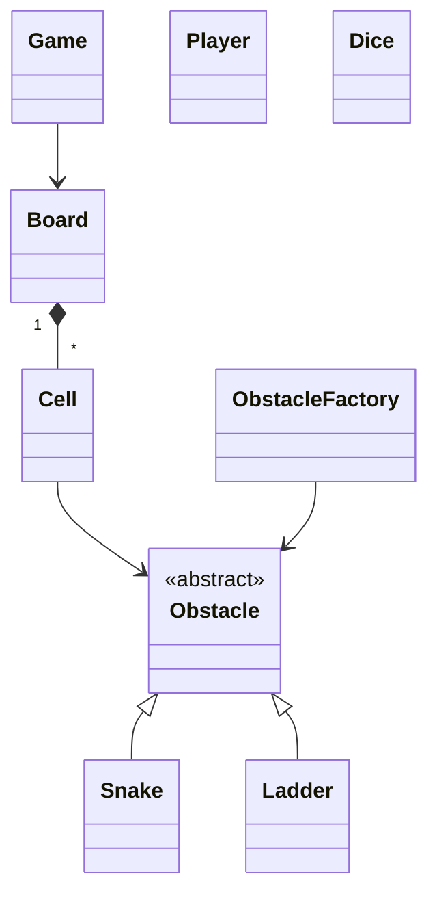
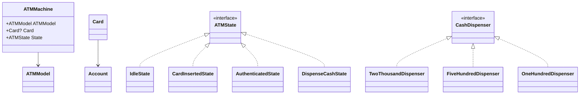
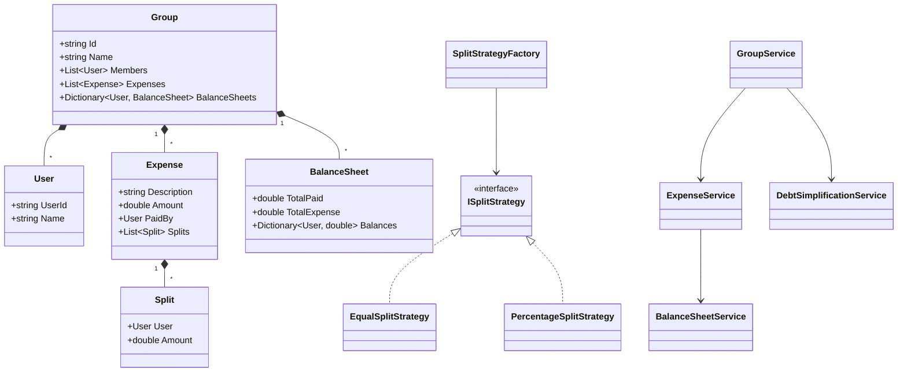

# C# Low-Level Design (LLD) Revision Notes

This repository is a collection of interview-style C# design problems. Each folder models an LLD problem around a real-world domain, and the shared pattern is to separate domain entities, strategies, repositories, and service flows so the design stays extensible and easy to explain in interviews.

## High-level interview themes across the repo

- Strategy Pattern: plug in pricing, payment, rate-limit, or split algorithms without changing the core workflow.
- Factory Pattern: centralize creation of vehicles, payment modes, split logic, or state objects.
- Repository Pattern: abstract storage behind a clean interface so the core business layer stays decoupled.
- State Pattern: manage transitions like idle -> card inserted -> authenticated -> cash dispensed.
- Chain of Responsibility: pass a request down handlers that either resolve it or forward it.
- Service Layer: keep orchestration logic separate from model/data concerns, especially in Splitwise and booking systems.

## 1. Car Rental System

This models a vehicle booking platform with branch inventory, price calculation, and payment handling.

- Core entities: `User`, `Branch`, `Vehicle`, `Booking`, `PaymentProcessor`.
- Design patterns:
  - Strategy Pattern: `IBookingStrategy`, `IPricingStrategy`, and `IPaymentStrategy` allow alternative booking selection, pricing logic, and payment modes.
  - Factory Pattern: `VehicleFactory` selects the correct concrete vehicle type and initialization parameters.
  - Repository Pattern: `BranchRepository` and `BookingRepository` insulate domain logic from storage.
  - Service Pattern: `BookingService` orchestrates branch search, vehicle selection, pricing, and payment.
- Interview focus:
  - Choosing the best vehicle from multiple branches.
  - Balancing business rules with strategy objects rather than hardcoding them in `Program`.
  - Supporting multiple pricing formulas and payment flows.

**UML Entity Relationship:**

## 2. Movie Ticket Booking System

This system models theatre seat selection, bookings, payment confirmation, and contention control during concurrent requests.

- Core entities: `Theatre`, `Screen`, `Show`, `Seat`, `Booking`, `Movie`.
- Design patterns:
  - Locking strategy: `LockProvider` allows an in-memory lock implementation to guard seat access under concurrency.
  - Payment strategy: `CardPayment` and `UpiPayment` plug into a common interface.
  - Repository Pattern: `MovieRepository`, `ShowRepository`, `BookingRepository`, and `TheatreRepository` centralize read/write operations.
- Interview focus:
  - Preventing double booking with thread-safe seat locking.
  - Supporting multiple seat types (`RegularSeat`, `ReclinerSeat`).
  - Maintaining clear booking lifecycle states from creation to confirmation.

**UML Entity Relationship:**

## 3. Parking Lot

This is a classic low-level design problem for resource allocation, ticket generation, pricing, and payments.

- Core entities: `ParkingLot`, `ParkingFloor`, `ParkingSpot`, `Vehicle`, `Gate`, `Ticket`.
- Design patterns:
  - Factory Pattern: `VehicleFactory`, `PricingStrategyFactory`, and `PaymentStrategyFactory` isolate object creation.
  - Strategy Pattern: `IPricingStrategy` decides how parking fees are charged (`FlatRatePricing`, `HourlyRatePricing`).
  - Payment abstraction: `IPaymentStrategy` allows UPI, card, or cash processing without coupling the gate logic to concrete payments.
- Interview focus:
  - Mapping vehicle type to valid spot type.
  - Managing entry and exit gates as separate responsibilities.
  - Calculating fees based on duration and chosen policy.

**UML Entity Relationship:**

## 4. Rate Limiter

This models API request throttling based on a user tier or request profile.

- Core entities: `User`, `RateLimitConfig`, `RateLimiter`, `RateLimiterService`.
- Design patterns:
  - Abstract algorithm: `RateLimiter` is the base for `FixedWindowRateLimiter`, `SlidingWindowLogRateLimiter`, and `TokenBucketRateLimiter`.
  - Factory Pattern: `RateLimiterFactory` chooses the limiter implementation based on `RateLimitType` and config.
- Interview focus:
  - Different throttling algorithms trade off simplicity vs. fairness.
  - Config-driven user policies such as free vs. premium tiers.
  - The `RateLimiterService` acts as a policy switchboard that hides algorithm complexity from callers.

**UML Entity Relationship:**

## 5. Logger Framework

This is a modular logging utility that follows enterprise patterns for log routing and formatting.

- Core entities: `LogMessage`, `LogHandlerConfiguration`, `LoggerService`.
- Design patterns:
  - Chain of Responsibility: `InfoHandler`, `WarnHandler`, `ErrorHandler`, and `LogHandler` form a severity pipeline.
  - Strategy Pattern: `ILogFormatter` and `ILogAppender` let the system change output format and target destination independently.
- Interview focus:
  - Clean separation between handling, formatting, and transport.
  - Severity-based dispatch policy.
  - Extensibility for new log targets like databases, Kafka, or cloud logging.

**UML Entity Relationship:**

## 6. Snakes and Ladders

A simple board-game simulation that focuses on object composition, game flow, and obstacle generation.

- Core entities: `Game`, `Board`, `Cell`, `Dice`, `Player`, `Obstacle`.
- Design patterns:
  - Factory Pattern: `ObstacleFactory` creates `Snake` or `Ladder` objects depending on the domain enum.
- Interview focus:
  - Board object modeling.
  - Encapsulating movement and obstacle interaction rules.
  - Keeping the game loop clean and predictable.

**UML Entity Relationship:**

## 7. LFU Cache

This folder implements a Least Frequently Used cache, one of the most common data-structure interview problems.

- Core entities: `Node`, `DoublyLinkedList`, `LFUCache`.
- Design patterns:
  - Data-structure-driven design: a HashMap gives $O(1)$ key lookup; frequency buckets keep eviction decisions efficient.
- Interview focus:
  - Minimal frequency tracking.
  - Eviction of the least recently used entry within the least-frequently-used bucket.
  - Correct handling of update and insertion cases while preserving $O(1)$ average complexity.

**Key idea:**

- Use a dictionary for `key -> node` lookup.
- Use a frequency map for `freq -> doubly linked list` buckets.
- Keep `minFreq` to know which bucket to evict from when the cache is full.

## 8. ATM System

This models the full ATM withdrawal flow with state transitions, cash tracking, and note dispensing.

- Core entities: `ATMMachine`, `ATMModel`, `Card`, `Account`, `ATMRepository`, `CashDispenser`.
- Design patterns:
  - State Pattern: `ATMState` and concrete states such as `IdleState`, `CardInsertedState`, `AuthenticatedState`, and `DispenseCashState` govern legal actions at each stage.
  - Chain of Responsibility: `TwoThousandDispenser`, `FiveHundredDispenser`, and `OneHundredDispenser` form a note-dispense chain.
  - Repository Pattern: `ATMRepository` stores and retrieves ATM state.
- Interview focus:
  - State transitions in a workflow-driven system.
  - Validating account and note denomination constraints before cash out.
  - Combining domain validity checks with mechanical note dispensing.

**UML Entity Relationship:**

## 9. Splitwise Expense Sharing System

This is the most relevant “shared expenses” problem in the repo. It revolves around tracking who paid, how much each person owes, and how to settle the net balances with minimal transactions.

- Core entities: `User`, `Group`, `Expense`, `Split`, `BalanceSheet`.
- Design patterns:
  - Strategy Pattern: `EqualSplitStrategy` and `PercentageSplitStrategy` encapsulate split rules behind `ISplitStrategy`.
  - Factory Pattern: `SplitStrategyFactory` chooses the implementation by `SplitType`.
  - Repository Pattern: `IGroupRepository` and `InMemoryGroupRepository` keep persistence concerns away from the service logic.
  - Service Layer Pattern: `GroupService`, `ExpenseService`, and `BalanceSheetService` coordinate domain operations.
- Interview focus:
  - Modeling fairness and debt resolution rather than simple arithmetic.
  - Using per-user aggregate sheets to compute net balances.
  - Simplifying many payments into a minimal set of transfers.

**Behavioral flow:**

- `Group` stores members and their balance sheets.
- `ExpenseService` computes splits based on selected strategy.
- `BalanceSheetService` updates payer and participant balances.
- `DebtSimplificationService` resolves the net balances to reduce redundant money movement.

**UML Entity Relationship:**

## 10. Common LLD interview checklist

When answering these in interviews, use the following structure:

1. State the core entities and their responsibilities.
2. Explain the key relationships and cardinality between entities.
3. Identify the design patterns used and why they matter.
4. Walk through the primary workflow end-to-end.
5. Show the important edge cases (concurrency, invalid inputs, invalid states, capacity overflow, negative balances).
6. Highlight how your design remains extensible and testable.

## Final takeaway

The repository is a strong practice set for learning how to translate business workflows into clean, extensible object-oriented systems. The strongest recurring ideas are:

- separate behavior from data
- choose composition over hardcoded logic
- use interfaces to support multiple strategies
- isolate persistence behind repository boundaries
- model transitions and edge cases explicitly

This is exactly the kind of design reasoning senior engineers are expected to demonstrate in LLD and system-design discussions.
